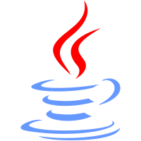

**记录一下我感兴趣的......**

  

<!-- @import "[TOC]" {cmd="toc" depthFrom=1 depthTo=6 orderedList=false} -->

<!-- code_chunk_output -->

- [Java](#java)
  - [Java核心基础](#java核心基础)
  - [JVM](#jvm)
- [工具](#工具)
  - [IDEA](#idea)
  - [DataGrip](#datagrip)
  - [Typora](#typora)
  - [Visual Studio](#visual-studio)
  - [Xshell](#xshell)
  - [Postman](#postman)
  - [Sourcetree](#sourcetree)
- [数据库](#数据库)
  - [MySQL](#mysql)
  - [Redis](#redis)
- [计算机网络](#计算机网络)
- [操作系统](#操作系统)
- [数据结构](#数据结构)

<!-- /code_chunk_output -->

## Java

### Java核心基础

> 基础编程

- [编程入门](docs/Java/JavaBase/01_编程入门/编程入门.md) 
- [Java语言概述](docs/Java/JavaBase/02_Java语言概述/Java语言概述.md) 
-  [Java基本语法](docs/Java/JavaBase/03_Java基本语法/Java基本语法.md) 
- [数组](docs/Java/JavaBase/04_数组/数组.md) 
- [面向对象编程](docs/Java/JavaBase/05_面向对象编程/面向对象编程.md) 
- [异常处理](docs/Java/JavaBase/06_异常处理/异常处理.md) 

> 高级编程

- [多线程](docs/Java/JavaBase/07-多线程/多线程.md) 
-  [Java常用类](docs/Java/JavaBase/08-Java常用类/Java常用类.md) 
-  [枚举类与注解](docs/Java/JavaBase/09-枚举类与注解/枚举类与注解.md) 
- Java集合
- [泛型](docs/Java/JavaBase/11_泛型/泛型.md) 
- IO流
- 网络编程
- Java反射机制
- Java8新特性
- Java9&10&11新特性

### JVM

> 内存与垃圾回收篇

- JVM与Java体系结构
- 类加载子系统
- 运行时数据区概述及线程
- 程序计数器
- 虚拟机栈
- 本地方法接口
- 本地方法栈
- 堆
- 方法区
- 对象实例化内存布局与访问定位
- 直接内存
- 执行引擎
- StringTable
- 垃圾回收概述
- 垃圾回收相关算法
- 垃圾回收相关概念
- 垃圾回收器

>字节码与类的加载篇

- 知识一
- 知识二
- 知识三

>性能监控与调优篇

- 知识一
- 知识二
- 知识三

## 工具

### IDEA

- 安装与卸载
- 基础项目创建
- Module的使用
- 常用快捷键
- 修改及自定义模板
- 添加Tomcat
- 关联数据库
- Maven配置
- [Debug](docs/Tools/IDEA/Debug/Debug.md) 
- 版本控制集成

### DataGrip

- 知识一
- 知识二
- 知识三

### Typora

- 知识一
- 知识二
- 知识三

### Visual Studio

- 知识一
- 知识二
- 知识三

### Xshell

- 知识一
- 知识二
- 知识三

### Postman

- 知识一
- 知识二
- 知识三

### Sourcetree

- 知识一
- 知识二
- 知识三

## 数据库

### MySQL

- 知识一
- 知识二
- 知识三

### Redis

- 知识一
- 知识二
- 知识三

## 计算机网络

- 知识一
- 知识二
- 知识三

## 操作系统

- 知识一
- 知识二
- 知识三

## 数据结构

- 知识一

- 知识二

- 知识三

  ​	

## 待办

- [ ] 从数组认识排序