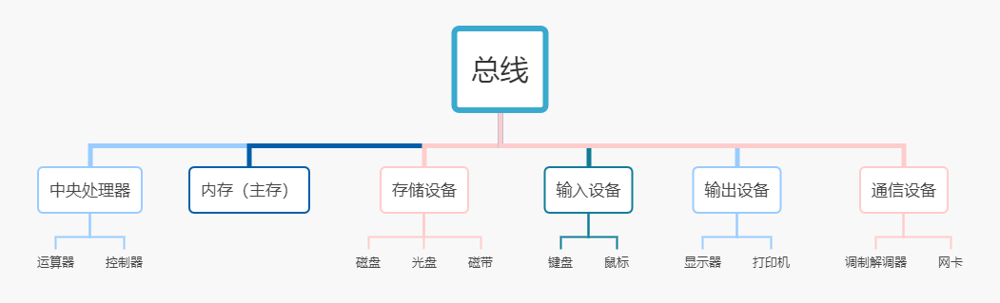
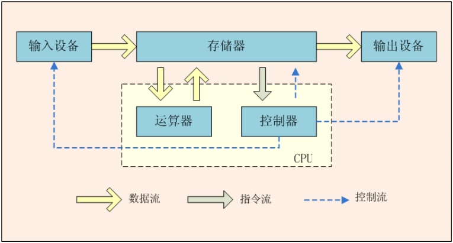

<!-- @import "[TOC]" {cmd="toc" depthFrom=1 depthTo=6 orderedList=false} -->

<!-- code_chunk_output -->

- [编程入门](#编程入门)
  - [1_概述](#1_概述)
  - [2_计算机硬件介绍](#2_计算机硬件介绍)
    - [冯诺依曼体系](#冯诺依曼体系)
    - [中央处理器](#中央处理器)
    - [存储设备](#存储设备)
    - [内存](#内存)
    - [输入和输出设备](#输入和输出设备)
    - [通信设备](#通信设备)
  - [3_计算机发展史上的鼻祖](#3_计算机发展史上的鼻祖)
  - [4_操作系统](#4_操作系统)
  - [5_万维网](#5_万维网)

<!-- /code_chunk_output -->

# 编程入门

## 1_概述

计算机包括硬件（hardware）和软件（software）两部分。硬件包括计算机中可以 看得见的物理部分。而软件提供看不见的指令。这些指令控制硬件并且使得 硬件完成特定的任务。

## 2_计算机硬件介绍

在个人计算机上，总线搭建在主板上，主板是一个连接计算机各个部分的电路板。

 

### 冯诺依曼体系

**冯·诺依曼体系结构**是现代计算机的基础，现在大多计算机仍是冯·诺依曼计算机的组织结构，只是作了一些改进而已，并没有从根本上突破冯体系结构的束缚。冯·诺依曼也因此被人们称为“计算机之父”。

1946年2月14日，第一台计算机ENIAC诞生，人类进入计算机时代，后来，美籍匈牙利数学家：冯.诺依曼提出了计算机“存储程序”的计算机设计理念，即将计算机指令进行编码后存储在计算机的存储器中，需要的时候可以顺序地执行程序代码，从而控制计算机运行，这就是冯.诺依曼计算机体系的开端。

> 冯.诺依曼结构的灵魂

早期的计算机是由各种门电路（用以实现基本逻辑运算和复合逻辑运算的单元电路称为门电路。常用的门电路在逻辑功能上有与门、或门、非门、与非门、或非门、与或非门、异或门等几种）组成的，这些门电路通过组装出一个固定的电路板，来执行一个特定的程序，一旦需要修改程序功能，就要重新组装电路板，所以**早期的计算机程序是硬件化的**！

祖师爷的出现将最初的硬件化程序变为可编程、可存储编码，放在存储器中，随意使用。

早期的计算机设计中，程序和数据是俩个截然不同的概念，数据放在存储器中，而**程序作为控制器的一部分**，这样的计算机计算效率低，灵活性较差。冯.诺依曼结构中，将程序和数据一样看待，**将程序编码为数据，然后与数据一同存放在存储器中**，这样计算机就可以调用存储器中的程序来处理数据了。意味着，无论什么程序，最终都是会转换为数据的形式存储在存储器中，要执行相应的程序只需要从存储器中依次取出指令、执行，冯.诺依曼结构的灵魂所在正是这里：减少了硬件的连接，**这种设计思想导致了硬件和软件的分离，即硬件设计和程序设计可以分开执行！这就催生了程序员这个职业的诞生！**

概括的来讲，冯.诺依曼结构消除了原始计算机体系中，只能依靠硬件控制程序的状况（程序作为控制器的一部分，作为硬件存在），将程序编码存储在存储器中，实现了可编程的计算机功能，实现了硬件设计和程序设计的分离，大大促进了计算机的发展。

灵魂就是将程序从硬件实现转换为软件实现（存储程序控制原理）！

计算机的基本工作原理就是：存储程序控制原理！

> 核心设计思想

程序、数据的最终形态都是二进制编码，程序和数据都是以二进制方式存储在存储器中的，二进制编码也是计算机能够所识别和执行的编码。（可执行二进制文件：.bin文件）

程序、数据和指令序列，都是事先存在主（内）存储器中，以便于计算机在工作时能够高速地从存储器中提取指令并加以分析和执行。

确定了计算机的五个基本组成部分：运算器、控制器、存储器、输入设备、输出设备

1. 输入数据和程序的输入设备

2. 记忆程序和数据的存储器

3. 完成数据加工处理的运算器

4. 控制程序执行的控制器

5. 输出处理结果的输出设备

 

### 中央处理器

### 存储设备

### 内存

### 输入和输出设备

### 通信设备

## 3_计算机发展史上的鼻祖

## 4_操作系统

## 5_万维网

