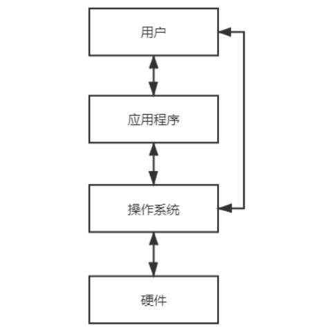
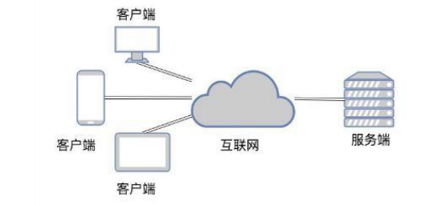

# 编程入门

## 1_概述

计算机包括硬件（hardware）和软件（software）两部分。硬件包括计算机中可以 看得见的物理部分。而软件提供看不见的指令。这些指令控制硬件并且使得 硬件完成特定的任务。

## 2_计算机硬件介绍

在个人计算机上，总线搭建在主板上，主板是一个连接计算机各个部分的电路板。

 

### 冯诺依曼体系

**冯·诺依曼体系结构**是现代计算机的基础，现在大多计算机仍是冯·诺依曼计算机的组织结构，只是作了一些改进而已，并没有从根本上突破冯体系结构的束缚。冯·诺依曼也因此被人们称为“计算机之父”。

1946年2月14日，第一台计算机ENIAC诞生，人类进入计算机时代，后来，美籍匈牙利数学家：冯.诺依曼提出了计算机“存储程序”的计算机设计理念，即将计算机指令进行编码后存储在计算机的存储器中，需要的时候可以顺序地执行程序代码，从而控制计算机运行，这就是冯.诺依曼计算机体系的开端。

> 冯.诺依曼结构的灵魂

早期的计算机是由各种门电路（用以实现基本逻辑运算和复合逻辑运算的单元电路称为门电路。常用的门电路在逻辑功能上有与门、或门、非门、与非门、或非门、与或非门、异或门等几种）组成的，这些门电路通过组装出一个固定的电路板，来执行一个特定的程序，一旦需要修改程序功能，就要重新组装电路板，所以**早期的计算机程序是硬件化的**！

祖师爷的出现将最初的硬件化程序变为可编程、可存储编码，放在存储器中，随意使用。

早期的计算机设计中，程序和数据是俩个截然不同的概念，数据放在存储器中，而**程序作为控制器的一部分**，这样的计算机计算效率低，灵活性较差。冯.诺依曼结构中，将程序和数据一样看待，**将程序编码为数据，然后与数据一同存放在存储器中**，这样计算机就可以调用存储器中的程序来处理数据了。意味着，无论什么程序，最终都是会转换为数据的形式存储在存储器中，要执行相应的程序只需要从存储器中依次取出指令、执行，冯.诺依曼结构的灵魂所在正是这里：减少了硬件的连接，**这种设计思想导致了硬件和软件的分离，即硬件设计和程序设计可以分开执行！这就催生了程序员这个职业的诞生！**

概括的来讲，冯.诺依曼结构消除了原始计算机体系中，只能依靠硬件控制程序的状况（程序作为控制器的一部分，作为硬件存在），将程序编码存储在存储器中，实现了可编程的计算机功能，实现了硬件设计和程序设计的分离，大大促进了计算机的发展。

灵魂就是将程序从硬件实现转换为软件实现（存储程序控制原理）！

计算机的基本工作原理就是：==存储程序控制原理==

> 核心设计思想

程序、数据的最终形态都是二进制编码，程序和数据都是以二进制方式存储在存储器中的，二进制编码也是计算机能够所识别和执行的编码。（可执行二进制文件：.bin文件）

程序、数据和指令序列，都是事先存在主（内）存储器中，以便于计算机在工作时能够高速地从存储器中提取指令并加以分析和执行。

确定了计算机的五个基本组成部分：运算器、控制器、存储器、输入设备、输出设备

1. 输入数据和程序的输入设备：把需要的程序和数据送至计算机中。
2. 记忆程序和数据的存储器：必须具有长期记忆程序、数据、中间结果及最终运算结果的能力。
3. 完成数据加工处理的运算器：能够完成各种算术、逻辑运算和数据传送等数据加工处理的能力。
4. 控制程序执行的控制器：能够根据需要控制程序走向，并能根据指令控制机器的各部件协调操作。
5. 输出处理结果的输出设备：能够按照要求将处理结果输出给用户。

拿做饭举例：你和你的领导是一个做饭团队，买家可以给你食材，你俩进行加工做出来饭给买家。你的领导向买家沟通好做什么之后，翻译好一个个指令指挥控制你，而你的作用就是埋头干，处理数据就是处理菜品，你的领导就是控制器，你就是运算器。送菜师傅把原材料送到厨房就是输入设备，你炒好菜让传菜员送到餐桌上，传菜员就是输出设备。冰箱中存放着送菜师傅送来的大量蔬菜，就是磁盘，你要炒菜之前需要将这个菜的相关材料从冰箱取出放在案板上，就是放入内存。如何让炒菜这件事变的更快？加内存顶用吗？如果炒很多菜，案板时常放置不下，那么加内存毫无问题。其实真正的瓶颈是磁盘，将机械换为固态。

扩展：我们手机里只有 SD 卡（Secure Digital Memory Card）这样类似硬盘功能的存储卡插槽，并没有内存插槽、CPU 插槽这些东西。没错，因为手机尺寸的原因，手机制造商们选择把 CPU、内存、网络通信，乃至摄像头芯片，都封装到一个芯片，然后再嵌入到手机主板上。这种方式叫**SoC**，也就是 System on a Chip（系统芯片）。

 

### IT定律之计算机行业发展规律

>摩尔定律（Reverse Moore's Law）

摩尔定律是由英特尔(Intel）)创始人之一戈登摩尔(Gordon Moore )提出来的。其内容为:当价格不变时，集成电路上可容纳的元器件的激目，约每隔18-24个月便会增加一倍,性能也将提升一倍。换言之，每一美元所能买到的电脑性能，将每隔18-24个月翻一倍以上。

>安迪-比尔定律（Andy and Bil's Law）

安迪-比尔定律（Andy and Bil's Law)描述了硬件产商和软件产商之间的关系。即比尔要拿走安迪所给的(（What Andy gives, il takes away) 。
个人电脑T业整个的生态链是这样的:以微软为首的软件开发商吃掉硬件提升带来的全部好处，迫使用户更新机器让惠普和戴尔等公司收益，而这些整机生产再向英特尔这样的半导体厂订货购买新的芯片、同时向Seagate等外设厂购买新的外设。在这中间，各家的利润先后得到相应的提升，股票也随着增长。各个硬件半导体和外设公司再将利润投入研发，按照摩尔定理制定的速度，提升硬件性能，为微软下一步更新软件、吃掉硬件性能做准备。当然，微软和其它软件开发商在吃掉大部分硬件提升好处的同时，或多或少地会给用户带来—些新东西。

>反摩尔定律（Reverse Moore's Law）

反摩尔定律：Google的前CEO埃里克施密特提出的:如果你反过来看摩尔定律，一个T公司如果今天和18个月前卖掉同样多的、同样的产品，它的营业额就覆降一半。界把它称为反摩尔定律。反摩尔定律对于所有的T公司来讲，都是非常可怕的，因为一个T公司花了同样的劳动，却只得到以前一半的收入。反摩尔定律逼着所有的硬件设备公司必须赶上摩尔定律所规定的更新速度，而所有的硬件和设备生产厂活得都是非常辛苦的。

### 中央处理器（运算器+控制器）

中央处理器（Central Processing Unit，CPU）是计算机的大脑。它从内存中获取指令，然 后执行这些指令。

包括：控制单元（Control Unit）和算术/逻辑单元（Arithmetic Logic Unit，ALU）

- 控制单元：用于控制和协调其他组件的动作
- 算术/逻辑单元：用于完成数值运算(+、-、*、/)和逻辑运算(比较)

每台计算机都有一个内部时钟，该时钟以固定速度发射电子脉冲。时钟速度越快，在给定的时间段内执行的指令就越多。速度的计量单位是赫兹(Hz)，1Hz相当于每秒1个脉冲。随着CPU速度不断提高，目前以千兆赫(GHz)来表述。

例如工作使用笔记本处理器为：`Inter(R) Core(TM) i7-10510U CPU @ 1.80gHz 2.30gHz` U表示低电压，主频较低、变压器较小 、轻薄，开发建议使用HQ标压。上述两个Hz参数，第一个频率是处理器的标准频率，第二个是实际工作频率。CPU会根据当前的任务量自动调整CPU主频，从而重任务时发挥最大的性能，轻任务时发挥最大节能优势。

最初一个CPU只有一个核(core)。核是处理器中实现指令读取和执行的部分。一个多核 CPU是一个具有两个或者更多独立核的组件。可提高CPU的处理能力。

> 运算器

首先计算机要有运算处理数据的能力，所以需要一个处理单元来完成各种算数运算和逻辑运算，这就是算术逻辑单元（Arithmetic Logic Unit，ALU）。ALU的主要功能就是在控制信号的作用下，完成加、减、乘、除等算术运算以及与、或、非、异或等逻辑运算以及移位、补位等运算。

运算器的主要部件就是ALU，运算器的处理对象是数据，所以数据的长度以及数据的表示方法，对运算器的影响很大。大多数通用计算机是以16、32、64位数据作为运算器一次处理数据的长度。能够对一个数据的所有位同时处理运算器称为并行运算器，一次只能对数据的一个位处理的运算器称为串行运算器。

运算器与其他部分的关系：

计算机运算时，运算器的操作对象和操作种类由控制器决定。运算器操作的数据从内存中读取，处理的结果再写入内存（或者暂时存放在内部寄存器中），而且运算器对内存数据的读写是由控制器来进行的。

> 控制器

控制器又称为控制单元（Control Unit），是计算机的神经中枢和指挥中心，只有在控制器的控制下，整个计算机才能够有条不紊地工作、自动执行程序。

控制器的工作流程为：从内存中取指令、翻译指令、分析指令，然后根据指令的内存向有关部件发送控制命令，控制相关部件执行指令所包含的操作。

控制器和运算器共同组成中央处理器（Central Processing Unit），CPU是一块超大规模集成电路，是计算机运算核心和控制核心，CPU的主要功能是解释计算机指令以及处理数据。

### 存储设备（内部存储器+外部存储器）

> 位（bit）和字节（byte）

在讨论内存前，先清楚数据是如何存储在计算机中的。计算机就是一系列的电路开关。每个开关存在两种状态：关(off)和开(on)。如果电路 是开的，它的值是1。如果电路是关的，它的值是0。

- 一个0或者一个1存储为一个比特(bit)，是计算机中最小的存储单位。
- 计算机中是最基本的存储单元是字节(byte) 。每个字节由8个比特构成。

计算机的存储能力是以字节和多字节来衡量的：其中 `GB MB KB B`具有1024换算关系。

存储器的主要功能是存储程序和各种数据，并且能够在计算机运行过程高速、自动地完成程序或者数据的存储，存储器是有记忆的设备，而且**采用两种稳定状态的物理器件来记录存储信息，所以计算机中的程序和数据都要转换为二进制代码才可以存储和操作。**

存储器可以分为内部存储器（内存）和外部存储器，俩者在计算机系统中各有用处，下面大概介绍一下俩种存储器的特点：

> 内部存储器（也叫RAM）:  **一个程序和它的数据在被CPU执行前必须移到计算机的内存中**

内部存储器称为内存或者主存，是用来存放欲执行的程序和数据。一个计算机具有的RAM越多，它的运行速度越快，但是此规律是有限制的。内存与CPU一样，也构建在表面嵌有数百万晶体管的硅半导 体芯片上。但内存芯片更简单、更低速、更便宜。

在计算机内部，程序和数据都是以二进制代码的形式存储的，它们均以字节为单位（8位）存储在存储器中，一个字节占用一个存储单元，并且每个存储单元都有唯一的地址号。使用这个地址确定 字节的位置，以便于存储和获取数据。

这里以字节（8位）为存储单元，就与上面运算器的操作数据的大小联系起来了，16、32、64都是8的倍数。

`CPU` 可以直接使用指令对内部存储器按照地址进行读写俩种操作

- **读：**将内存中某个存储单元的内容读出，送入`CPU`的某个寄存器中；
- **写：**在控制器的控制下，将`CPU`中某寄存器内容传到某个存储单元中。

要注意，内存中的数据和地址码都是二进制数，但是俩者是不同的，一个地址可以指向一个存储单元，地址是存储单元的位置，数据是存储单元的内容，数据可以是操作码、可以是`CPU`要处理的数据、也可以是数据的地址，地址码的长度由内存单元的个数确定。

内存的存取速度会直接影响计算机的运算速度，由于`CPU`是高速器件，但是`CPU`的速度是受制于内存的存取速度的，所以为了解决`CPU`和内存速度不匹配的问题，在`CPU`和内存直接设置了一种高速缓冲存储器`Cache`。`Cache`是计算机中的一个高速小容量存储器，其中存放的是`CPU`近期要执行的指令和数据，其存取速度可以和`CPU`的速度匹配，一般采用静态`RAM`充当`Cache`。

内存按工作方式的不同又可以分为俩部分：

- **RAM**：随机存储器，可以被 CPU 随机读取，一般存放 CPU 将要执行的程序、数据，断电丢失数据
- **ROM**：只读存储器，只能被 CPU 读，不能轻易被 CPU 写，用来存放永久性的程序和数据，比如：系统引导程序、监控程序等。具有掉电非易失性。

> 外部存储器

外部存储器主要来存放”暂时“用不着的程序和数据，可以和内存交换数据。

一般是磁盘、光盘、U盘、硬盘等。

### 输入和输出设备

所有的计算机程序都可以抽象为输入设备读取信息，通过CPU来执行存储在存储器中的程序，结果通过输出设备反馈给用户。

- 常见的输入设备：键盘、鼠标
- 常见的输出设备：显示器、打印机

显示器屏幕分辨率：是指显示设备水平和垂直方向上显示的像素(px)数。分辨率可以手工设置。分辨率越高，图像越锐化、越清晰。仅仅看显示器屏幕分辨率是不准确的，例如屏幕尺寸不一的显示器屏幕分辨率还一致，那么小屏幕的就更牛逼一些，用像素密度`ppi`更加合适：不算水平和竖直方向像素，而是ppi = 开方算斜线/屏幕尺寸。

与LCD、LED也有关系，两者发光原理不同，LCD是发白光源，用彩光去挡就发出不同的光，较费电；LED是自发光源。

### 通信设备

计算机可以通过通信设备进行联网

- 拨号调制解调器：使用的是电话线，传输速度可达56 000bps(bps:每秒比特)
- DSL（数字用户线）：使用的也是电话线，但传输速度叫上面的快20倍
- 电缆调制解调器：利用有线电视电缆进行数据传输，通常速度比DSL快。
- 网络接口卡（NIC）：将计算机接入局域网（LAN）的设备。局域网通常用于大学、 商业组织和政府组织。速度甚至可达1000Mbps
- 无线网络：在家庭、商业和学校中极其常见。计算机可通过无线适配器连接到局域网或 internet上。

## 3_计算机发展史上的鼻祖

- 阿兰·图灵(Alan Turing)

  图灵是当之无愧的计算机科 学和人工智能之父。图灵论文中的“用有限的指令和有限的存储空间可算尽一切可算之物” 理论让当时所有的科学家震惊

  美国计算机学会（ACM）的年度“图灵奖”，自从1966年设立以来， 一直是世界计算机科学领域的最高荣誉，相当于计算机科学界的诺贝尔 奖。至今，中国人只有姚期智院士获该奖项。

- 冯·诺依曼(John von Neumann)

  20世纪最重要的数学家之一，在现代计算机、博弈论、核武器 和生化武器等诸多领域内有杰出建树的最伟大的科学全才之一， 被后人称为“计算机之父”和“博弈论之父”。

  计算机基本工作原理是存储程序和程序控制，它是由世界著名 数学家冯·诺依曼提出的。最简单的来说，冯诺依曼理论的要点 是：数字计算机的数制采用二进制；计算机应该按照程序顺序 执行。

计算机的基本概念属于图灵。冯·诺依曼的基本作用是使世界认识了由图灵引入的计算机基本概念……，也就是将计算机概念体系化了。

## 4_操作系统

操作系统(Operating System)是运行在计算机上的最重要的程序，它可以管理和控制计算机的活动。

 

操作系统的主要任务：

- 控制和监视系统的活动
- 分配和调配系统资源
- 调度操作

## 5_万维网

万维网（World Wide Web，www，环球信息网）常简称为`Web`，发明者蒂姆·伯纳 斯·李。分为 `Web`客户端和`Web`服务器程序。 `WWW`可以让`Web`客户端（常用浏览器）访问浏览Web服务器上的页面。 是一个由许多互相链接的超文本组成的系统，通过互联网访问。在这个系统中，每个有用的事物，称为一样"资源"；并且由一个全局"统一资源标识符"（URI）标识；这些资源通过超文本传输协议（Hypertext Transfer Protocol）传送给用户，而后者通过点击链接来获得资源。

> B/S架构和C/S架构

- B/S架构：Browser Server，浏览器/服务器模式，B/S就是C/S的一个子集
- C/S架构：Client Server，客户端/服务器模式

> URI和URL

- URI

  URI 在于I(Identifier)是统一资源标示符，可以唯一标识一个资源。统一资源标志符URI就是在某一规则下能把一个资源独一无二地标识出来。例如身份证号。

- URL

  URL在于Locater，一般来说（URL）统一资源定位符，可以提供找到该资源的路径，但URL又是URI，所以URL又是URI的子集。

> 万维网<因特网<互联网

 

万维网是无数个网络站点和网页的集合，它们在一起构成了因特网Internet最主要的部分（因特网也包括电子邮件、Usenet以及新闻组）。它实际上是多媒体的集合，是由超级链接连接而成的。我们通常通过网络浏览器上网观看的， 就是万维网的内容。