<!-- @import "[TOC]" {cmd="toc" depthFrom=1 depthTo=6 orderedList=false} -->

<!-- code_chunk_output -->

- [Java语言概述](#java语言概述)
  - [01_Java基础阶段目录](#01_java基础阶段目录)
  - [02_Java后续学习大纲](#02_java后续学习大纲)
  - [03_Java主要应用场景](#03_java主要应用场景)
  - [04_软件开发介绍](#04_软件开发介绍)
    - [软件开发](#软件开发)
    - [人机交互方式](#人机交互方式)
  - [05_计算机编程语言介绍](#05_计算机编程语言介绍)
    - [什么是编程](#什么是编程)
    - [什么是编程语言](#什么是编程语言)
    - [什么是计算机语言](#什么是计算机语言)
    - [计算机编程语言分代](#计算机编程语言分代)
    - [初识Java语言](#初识java语言)
  - [06_Java语言基本概述](#06_java语言基本概述)
    - [Java简史](#java简史)
    - [Java技术平台](#java技术平台)
  - [07_Java语言的特点](#07_java语言的特点)
    - [Java语言的诞生](#java语言的诞生)
    - [Java语言主要特性](#java语言主要特性)
  - [08_JVM与垃圾回收机制](#08_jvm与垃圾回收机制)
    - [核心机制-Java虚拟机](#核心机制-java虚拟机)
    - [核心机制-垃圾回收](#核心机制-垃圾回收)
  - [09_JDK&JRE&JVM 的关系](#09_jdkjrejvm-的关系)
  - [10_Java环境搭建](#10_java环境搭建)
    - [下载并安装JDK](#下载并安装jdk)
    - [设置环境变量](#设置环境变量)
    - [多JDK版本](#多jdk版本)
  - [11_HelloWorld](#11_helloworld)
    - [类语法元素](#类语法元素)
    - [main方法语法元素](#main方法语法元素)
    - [System.out.println](#systemoutprintln)
    - [字符串](#字符串)
    - [初识Java程序](#初识java程序)
    - [总结第一个程序](#总结第一个程序)
  - [12_注释（Comment）](#12_注释comment)
  - [13_Java API的文档](#13_java-api的文档)

<!-- /code_chunk_output -->


# Java语言概述

## 01_Java基础阶段目录

- 第一阶段：Java基础编程
  - 编程入门
  - Java语言概述
  - Java基本语法
  - 数组
  - 面向对象编程

- 第二阶段：Java高级编程
  - 异常处理
  - 多线程
  - Java常用类
  - 枚举&注解
  - Java集合
  - 泛型
  - IO流
  - 网络编程
  - Java反射机制
  - Java8新特性
  - Java9&10&11新特性

- 第三阶段：Java技术拓展
  - Java版数据结构
  - 常用算法
  - 常用设计模式
  - JVM

## 02_Java后续学习大纲

- 第一阶段：JavaSE
  - Java基础
  - Java8新特性
  - 数据库MySQL与SQL语言
  - JDBC
- 第二阶段：JavaWeb
  - HTML基础与CSS
  - JavaScript DOM 与 jQuery
  - XML 与Tomcat
  - HTTP协议
  - 服务器端组件Servlet
  - JSP
  - EL表达式
  - JSTL
  - 会话控制Cookie和Session
  - 服务器端组件Filter
  - 服务器端组件Listener
  - 国际化
  - 异步数据传输框架Ajax
  - 文件的上传下载
- 第三阶段：JavaEE框架
  - 系统整体分层解耦框架Spring
  - 轻量级Web框架SpringMVC
  - 轻量级持久层框架MyBatis
  - 服务器操作系统Linux
  - 命令解析器Shell
  - 内存数据库Redis
  - 项目架构、Jar包管理工具Maven
- 第四阶段：JavaEE高级
  - SVN/IDEA开发工具
  - 分布式版本管理工具Git与GitHub
  - MySQL高级
  - MyCat实现MySQL的分布式、分库分表、读写分离
  - Nginx反向代理、负载均衡、动静分离
  - JVM内存模型、参数调优
  - JUC线程高级
  - 分布式架构注册中心Zookeeper
  - 虚拟化应用容器Docker
  - 全文检索引擎ElasticSearch
  - 消息队列RabbitMQ
  - 前端VUE/ES6
- 第五阶段：Hadoop生态体系
  - 大数据存储框架Hadoop
  - 分布式管理服务框架Zookeeper
  - Hadoop高可用HA
  - 数据仓库Hive
  - 数据查询框架impala+kudu+clouderManager
  - 日志采集传输框架flume/idea
  - 分布式发布-订阅消息系统Kafka+监控器KafkaManager+KafkaMonitor
  - 分布式关系型数据库Hbase+Hbase二级索引创建工具Phoenix
  - 任务调度框架Oozie
  - 任务调度框架Azkaban
  - 数据查询框架Kylin+druid
  - 大数据图形化工具Hue
- 第六阶段：Spark/Flink生态体系
  - 全文检索+日志搜集+数据可视化ELK
  - 多范式编程语言Scala
  - SparkCore/Spark SQL/Spark Streaming/Spark mlib
  - Spark内核和优化
  - Python
  - 大数据框架Flink
  - 项目实战

## 03_Java主要应用场景

**Java基础是学习JavaEE、大数据、Android开发 的基石！**

- Android App
- 网站后台
- 系统后台
- 大数据
- 桌面工具

## 04_软件开发介绍

### 软件开发

软件，即一系列按照特定顺序组织的计算机数据和指令的集合。有**系统软件**和**应用软件**之分。我们大部分的程序员在做的都是应用软件，系统软件开发难度较大，也非常来之不易，例如华为鸿蒙操作系统，难上加难，要预判好几年之后用户的习惯。

系统软件：`windows` `mac` `Linux`  `Unix` `Android`  `ios`

应用软件：`office` `WeChat`

**应用程序 = 算法 + 数据结构**

### 人机交互方式

图形化界面(**G**raphical **U**ser **I**nterface GUI)这种方式简单直观，使用者易于接受，容易上手操作。

命令行方式(**C**ommand **L**ine **I**nterface CLI)：需要有一个控制台，输入特定的指令，让计算机完成一些操作。较为麻烦，需要记录住一些命令。

- 常用的DOS命令
  - dir : 列出当前目录下的文件以及文件夹
  - md : 创建目录
  - rd : 删除目录
  - cd : 进入指定目录
  - cd.. : 退回到上一级目录
  - cd\: 退回到根目录
  - del : 删除文件
  - exit : 退出 dos 命令行
- 常用快捷键
  - ← →：移动光标
  - ↑ ↓：调阅历史操作命令
  - Delete和Backspace：删除字符

## 05_计算机编程语言介绍

### 什么是编程

- 编程就是让计算机按照自己的意思去工作

### 什么是编程语言

- 编程语言就是一种计算机能理解的语言

### 什么是计算机语言

语言：是人与人之间用于沟通的一种方式。例如：中国人与中国人用普通话沟通。而中国人要和英国人交流，就要学习英语。

计算机语言：人与计算机交流的方式。

- 如果人要与计算机交流，那么就要学习计算机语言
- 计算机语言有很多种。如：C ,C++ ,Java ,PHP , Kotlin，Python，Scala等。

### 计算机编程语言分代

> 第一代语言：机器语言

机器语言。指令以二进制代码形式存在。

000110110101011011010

> 第二代语言：汇编语言

汇编语言。使用助记符表示一条机器指令。

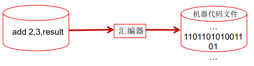 

> 第三代语言：高级语言

高级语言

- C、Pascal（主要用于编程教学）、Fortran（公式翻译，广泛用于科学和数学应用）面向过程的语言
- C++面向过程/面向对象
- Java跨平台的纯面向对象的语言
- .NET跨语言的平台
-  Python、Scala…

### 初识Java语言

社区活跃

在计算机语言趋势排行榜https://www.tiobe.com/tiobe-index/常年位列榜首或前三

凡是涉及和操作系统做交互基本上都会使用C或C++进行开发，执行效率高但是开发效率低。`C` < `Java` < `Python`

## 06_Java语言基本概述

- 是SUN(**S**tanford **U**niversity **N**etwork，斯坦福大学网络公司 ) 1995年推出的一 门高级编程语言。
- 是一种面向Internet的编程语言。Java一开始富有吸引力是因为Java程序可以 在Web浏览器中运行。这些Java程序被称为Java小程序（applet）。applet使 用现代的图形用户界面与Web用户进行交互。 applet内嵌在HTML代码中。
- 随着Java技术在web方面的不断成熟，已经成为Web应用程序的首选开发语言。
- 后台开发：**Java、PHP、Python、Go、Node.js**

### Java简史

1991年 `Green`项目，开发语言最初命名为`Oak` (橡树)

1994年，开发组意识到`Oak` 非常适合于互联网

1996年，发布JDK 1.0，约 8.3万个网页应用`Java`技术来制作

1997年，发布JDK 1.1，`JavaOne`会议召开，创当时全球同类会议规模之最

1998年，发布JDK 1.2，同年发布企业平台`J2EE`

1999年，Java分成`J2SE`、`J2EE`和`J2ME`，`JSP/Servlet`技术诞生

 **2004年，发布里程碑式版本：JDK 1.5，为突出此版本的重要性，更名为JDK 5.0**

2005年，J2SE -> JavaSE，J2EE -> JavaEE，J2ME -> JavaME

2009年，`Oracle`公司收购`SUN`，交易价格74亿美元

2011年，发布JDK 7.0

**2014年，发布JDK 8.0，是继JDK 5.0以来变化最大的版本**

2017年，发布JDK 9.0，最大限度实现模块化

2018年3月，发布JDK 10.0，版本号也称为18.3

2018年9月，发布JDK 11.0，版本号也称为18.9。在`Java8`版本后的最大版本

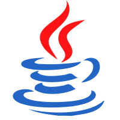 

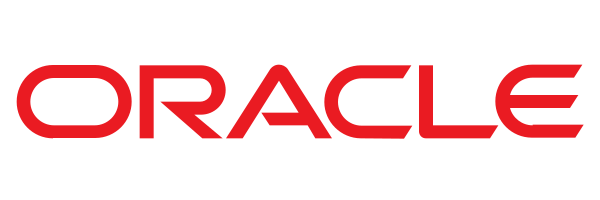 

### Java技术平台

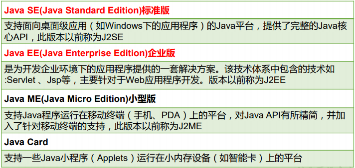 

现在已经基本没有桌面级应用和小型版了，`Java SE`和`Java EE`本来是并列关系，现在前者是基础，后者是企业级。从Java的应用领域来分，Java语言的应用方向主要表现在以下几个方面：

- **企业级应用：**主要指复杂的大企业的软件系统、各种类型的网站。Java的安全机制以及 它的跨平台的优势，使它在分布式系统领域开发中有广泛应用。应用领域包括金融、电 信、交通、电子商务等。
- **Android平台应用：**Android应用程序使用Java语言编写。Android开发水平的高低很大程度上取决于Java语言核心能力是否扎实
- **大数据平台开发：**各类框架有Hadoop，spark，storm，flink等，就这类技术生态圈来讲，还有各种中间件如flume，kafka，sqoop等等 ，这些框架以及工具大多数是用Java编写而成，但提供诸如Java，scala，Python，R等各种语言API供编程。
- 移动领域应用：主要表现在消费和嵌入式领域，是指在各种小型设备上的应用，包括手 机、PDA、机顶盒、汽车通信设备等。

## 07_Java语言的特点

### Java语言的诞生

`Java`之父`James Gosling`团队在开发`”Green”`项目时，发现`C`缺少垃圾回收系统，还有可移植的安 全性、分布程序设计和多线程功能。最后，他们想要一种易于移植到各种设备上的平台。

`Java`确实是从`C`语言和`C++`语言继承了许多成份，甚至可以将`Java`看成是类`C`语言发展和衍生的产物。比如`Java`语言的变量声明，操作符形式，参数传递，流程控制等方面和`C`语言、`C++`语言完全相同。但同时，`Java`是一个纯粹的面向对象的程序设计语言，它继承了`C++`语言 面向对象技术的核心。`Java`舍弃了`C`语言中容易引起错误的指针（以引用取代）、运算符重载（operator overloading）、多重继承 （以接口取代）等特性，增加了垃圾回收器功能用于回收不再被引用 的对象所占据的内存空间。`JDK1.5`又引入了泛型编程（Generic Programming）、类型安全的枚举、不定长参数和自动装/拆箱。

### Java语言主要特性

- **Java语言是易学的。**Java语言的语法与C语言和C++语言很接近，使得大多数程序员 很容易学习和使用Java。
- **Java语言是强制面向对象的。**Java语言提供类、接口和继承等原语，为了简单起见， 只支持类之间的单继承，但支持接口之间的多继承，并支持类与接口之间的实现机制 （关键字为implements）。
- **Java语言是分布式的。**Java语言支持Internet应用的开发，在基本的Java应用编 程接口中有一个网络应用编程接口（java net），它提供了用于网络应用编程的类库，包括URL、URLConnection、Socket、ServerSocket等。Java的RMI（远程 方法激活）机制也是开发分布式应用的重要手段。
- **Java语言是健壮的。**Java的强类型机制、异常处理、垃圾的自动收集等是Java程序健壮性的重要保证。对指针的丢弃是Java的明智选择。
- **Java语言是安全的。**Java通常被用在网络环境中，为此，Java提供了一个安全机 制以防恶意代码的攻击。如：安全防范机制（类ClassLoader），如分配不同的 名字空间以防替代本地的同名类、字节代码检查。
- **Java语言是体系结构中立的。**Java程序（后缀为java的文件）在Java平台上被 编译为体系结构中立的字节码格式（后缀为class的文件），然后可以在实现这个 Java平台的任何系统中运行。
- **Java语言是解释型的。**如前所述，Java程序在Java平台上被编译为字节码格式， 然后可以在实现这个Java平台的任何系统的解释器中运行。
- **Java是性能略高的。**与那些解释型的高级脚本语言相比，Java的性能还是较优的。
- **Java语言是原生支持多线程的。**在Java语言中，线程是一种特殊的对象，它必须 由Thread类或其子（孙）类来创建。 C++ 语言没有内置的多线程机制，因此必须调用操作系统的多线程功能来进行多线程程序设计，而 Java 语言却提供了多线程支持

> 特点

1. 简单易学；

2. 面向对象（两大基本概念：类、对象；三大特性：封装，继承，多态）；

3. 平台无关性（ Java 虚拟机实现平台无关性）：通过Java语言编写的应用程序在不同的系统平台上都可以运行。“Write once , Run Anywhere”。原理：只要在需要运行 Java 应用程序的操作系统上，先安装一个Java虚拟机 (JVM Java Virtual Machine) 即可。由JVM来负责Java程序在该系统中的运行。

4. 可靠性；

5. 安全性；

6. 支持多线程（ C++ 语言没有内置的多线程机制，因此必须调用操作系统的多线程功能来进行多线程程序设计，而 Java 语言却提供了多线程支持）；

7. 支持网络编程并且很方便（ Java 语言诞生本身就是为简化网络编程设计的，因此 Java 语言不仅支持网络编程而且很方便）；

8. 编译与解释并存；

   高级编程语言按照程序的执行方式分为编译型和解释型两种。简单来说，编译型语言是指编译器针对特定的操作系统将源代码一次性翻译成可被该平台执行的机器码；解释型语言是指解释器对源程序逐行解释成特定平台的机器码并立即执行。比如，你想阅读一本英文名著，你可以找一个英文翻译人员帮助你阅读， 有两种选择方式，你可以先等翻译人员将全本的英文名著（也就是源码）都翻译成汉语，再去阅读，也可以让翻译人员翻译一段，你在旁边阅读一段，慢慢把书读完。

   Java 语言既具有编译型语言的特征，也具有解释型语言的特征，因为 Java 程序要经过先编译，后解释两个步骤，由 Java 编写的程序需要先经过编译步骤，生成字节码（*.class 文件），这种字节码必须由 Java 解释器来解释执行。因此，我们可以认为 Java 语言编译与解释并存。

## 08_JVM与垃圾回收机制

Java语言的特点：跨平台性

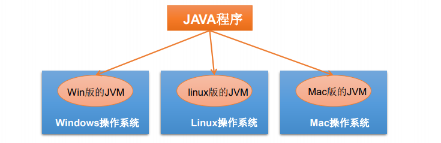 

因为有了`JVM`，同一个`Java `程序在三个不同的操作系统中都可以执行。这 样就实现了`Java `程序的跨平台性。就像是海王罗志祥编了一段舞蹈，需要在上海、西安、非洲三个地方开舞会，需要在海上、陆地上、沙漠上分别搭建不同的舞台，不同的地点就像是不同的操作系统，根据不同的地点搭建的舞台就像是不同的JVM，而演示的都是同一套舞蹈。

### 核心机制-Java虚拟机

`JVM(Java Virtual Machine)`是一个虚拟的计算机，具有指令集并使用不同的存储区域。负责执行指令，管理数据、内存、寄存器。

对于不同的平台，有不同的虚拟机。

只有某平台提供了对应的`Java`虚拟机，`Java`程序才可在此平台运行

Java虚拟机机制屏蔽了底层运行平台的差别，实现了“一次编译，到处运行”

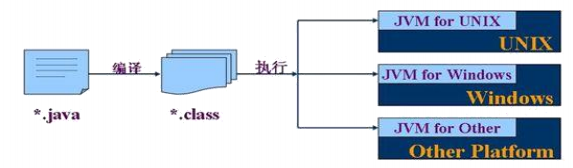 

递进关系：

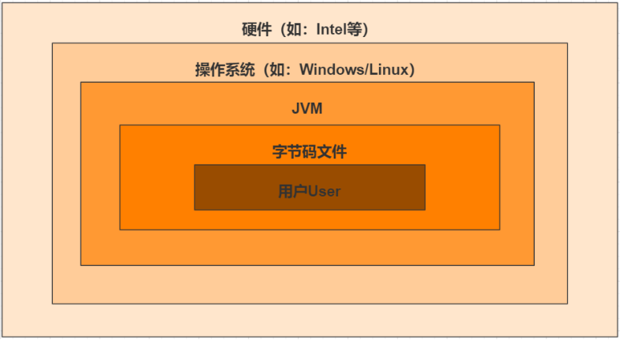 

Java 虚拟机（JVM）是运行 Java 字节码的虚拟机。JVM 有针对不同系统的特定实现（Windows，Linux，macOS），目的是使用相同的字节码，它们都会给出相同的结果。字节码和不同系统的 JVM 实现是 Java 语言“一次编译，随处可以运行”的关键所在。

### 核心机制-垃圾回收

- 不再使用的内存空间应回收——垃圾回收。
  - 在C/C++等语言中，由程序员负责回收无用内存。
  - `Java` 语言消除了程序员回收无用内存空间的责任：它提供一种系统级线程跟踪存储空 间的分配情况。并在JVM空闲时，检查并释放那些可被释放的存储空间。
- 垃圾回收在`Java`程序运行过程中自动进行，程序员无法精确控制和干预。
- `Java`程序还会出现内存泄漏和内存溢出问题吗？答案是肯定会的。

## 09_JDK&JRE&JVM 的关系

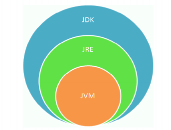 

- JDK = JRE + 开发工具集（例如Javac编译工具等）
- JRE = JVM + Java SE标准类库

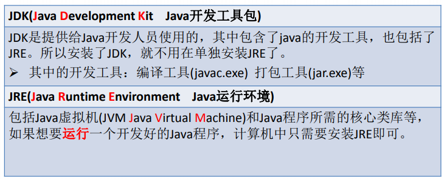 

**简单而言，使用`JDK`的开发工具完成的java程序，交给`JRE`去运行。**

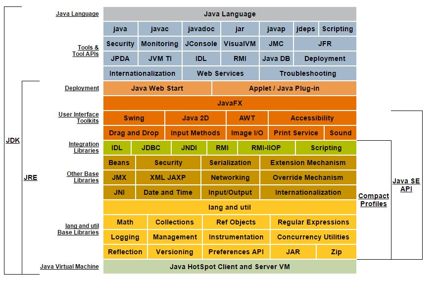 

## 10_Java环境搭建

`JDK`是`Java`编译和运行的环境.，玩游戏相当于是 `JRE`, 只是 `Java` 运行的环境，`JDK`相当于是游戏＋游戏编辑器。

### 下载并安装JDK

- 首先需要下载`Java`开发工具包JDK，下载地址：http://www.oracle.com/technetwork/java/javase/downloads/index.html
  - 现在安装`JDK`已经要一`Oracle`账号了：2696671285@qq.com  密码：Oracle123或者1772885836@qq.com  密码：OracleTest1234
- 进行安装，本机为`Windows`环境64位，所以安装了64位版本

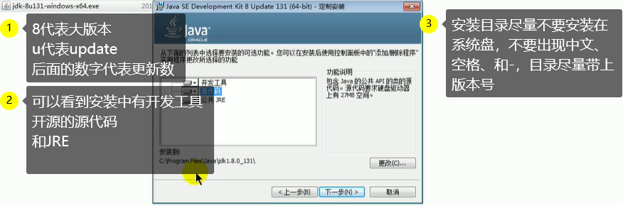 

安装完成后，可以看到JDK安装目录下有以下目录：

1. bin目录中存放开发工具，例如编译javac.exe、解释运行java.exe、生成一个以网页形式存在的文档的javadoc.exe
2. db是Java实现的一个数据库
3. include存放C语言编写的头文件，比如jni.h就是Java Native Interface
4. jre就是Java运行时环境
5. lib存放一些列Jar包
6. src.zip存放Java开源的代码

### 设置环境变量

- 我的电脑-属性-高级系统设置-环境变量-系统变量中新建/编辑变量：JAVA_HOME与PATH
  - 变量名的大小写无所谓
  - 变量名若已存在则点击"编辑"，不存在则点击"新建"
  - 系统变量也就是为整个系统创建环境变量，如果该电脑是多用户，可以只为某用户创建环境变量
  - 因为使用的为1.5版本以上的JDK，所以不用配置CLASSPATH环境变量，这里就略去。
  - PATH变量值还可以配置成为%JAVA_HOME%\bin，软件工程师就应该这样，能不重复就不重复。
    - Windows上的%是用来确定环境变量名字的，不用%的话，就是普通的字符串，用两个%包起来，就代表是通过环境变量的名字，引用境变量的值。包起来就就类似这样：%环境变量名字%。
    - 对应的，Linux上用的是`$`，简化语法使用`$`环境变量的名字就可以。为了更明确环境变量名字的开始和结束，完整语法是${环境变量的名字}
- 变量名：JAVA_HOME
- 变量值：JDK安装路径D:\Environment\Java\jdk1.8.0_251
- 变量名：PATH：**window操作系统执行命令时，所要搜寻的路径。目的是希望JDK的bin目录路径下的命令可以在任何文件路径下执行**
- 变量值：D:\Environment\Java\JDK\jdk1.8.0_251\bin

- 测试JDK是否安装成功
  - Windows+R键入cmd（command）进入命令提示符界面
  - 输入java出现java命令使用的方式
  - 输入java -version命令出现Java版本号命令
  - 输入javac出现javac命令的使用方式 
  - 输入javac -version命令出现javac版本号

###  多JDK版本

首先电脑上是允许安装多个不同的`JDK`版本的，但是只能使用一个版本。例如现在基本使用的都是`JDK8`版本，我想切为下一个稳定的`JDK11`版本，取决于环境变量中配置的是哪个版本。 

## 11_HelloWorld

1、新建并**编写**`HelloWorld.txt`文件，写入如下代码，并将文件后缀名改为`.java`

```java
public class HelloWorld{
    public static void main(String[] args){		// static的意思就是静态的,这个方法是这个类的所有实例共享的
        System.out.println("Hello World!");
    }
}
```

2、使用`javac HelloWorld.java`**编译**，发现文件夹中多了`HelloWorld.class`字节码文件

3、使用`java HelloWorld`**运行**，打印出`Hello World!`

过程如下：

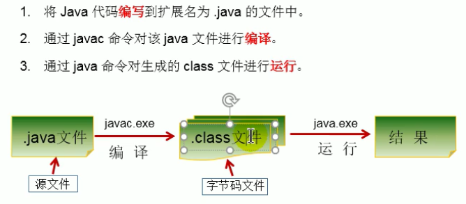 

### 类语法元素

```java
public class HelloWorld{
    
}
```

- public class是类修饰符
- HelloWorld是类名，要与文件名一致。一个java文件中，可以允许声明多个类，但是只能有一个public申明的类，所以文件名必须和public声明的那个类相同。
- 大括号内是类的内容

### main方法语法元素

```java
public static void main(String[] args){
    
}
```

- public static void是方法修饰符
- 小括号内是方法的参数parameter
- String[] args是方法参数
- 大括号是方法的内容，又称方法体method body
- main方法最为特殊的一点是，它是Java程序的入口，就好像游戏的开始按键

### System.out.println

```java
System.out.println();
```

- System.out.println是Java平台提供的类库的内容。可以将内容输出，在案例中就是命令行command line
- 小括号里的内容还是参数列表
- 没有参数的情况下，System.out.printIn会输出一行空行，也就是类似于我们敲下一个回车。

### 字符串

```java
"Hello world!"
```

- 在Java里，双引号引起来的内容叫做一个字符串。
- 字符串不是语法内容，可以写任意字符。

### 初识Java程序

初识class

- Java语言中的一等公民，Java程序就是一个个的类组成的
- 类由修饰符，类名和类的内容组成
- 类名必须与保存类源文件的文件名相同

初识main方法

- Main方法是Java程序执行的入口。
- 方法由方法修饰符，方法名，参数列表和方法体等组成。

### 总结第一个程序

1. Java源文件以“java”为扩展名。源文件的基本组成部分是类（class），如 本例中的HelloWorld类。
2. Java应用程序的执行入口是main()方法。它有固定的书写格式：public static void main(String[] args) {...}
3. Java语言严格区分大小写。
4. Java方法由一条条语句构成，每个语句以“;”结束。
5. 大括号都是成对出现的，缺一不可。
6. 一个源文件中最多只能有一个public类。其它类的个数不限，如果源文件包含 一个public类，则文件名必须按该类名命名。编译后有几个类就会有几个字节码文件。

## 12_注释（Comment）

用于注解说明解释程序的文字就是注释。提高了代码的阅读性；调试程序的重要方法。注释是一个程序员必须要具有的良好编程习惯。将自己的思想通过注释先整理出来，再用代码去体现。

Java中的注释类型：

- 单行注释：对于单行和多行注释，被注释的文字，不会被JVM（Java虚拟机）解释执行。

  ```java
  // 注释文字
  ```

- 多行注释：对于单行和多行注释，被注释的文字，不会被JVM（Java虚拟机）解释执行。

  ```java
  /* 注释文字 */
  ```

- 文档注释 (Java特有)：一般用在类、方法、变量上面，用来描述其作用。注释后，鼠标放在类和变量上面会自动显示出我们注释的内容。

  注释内容可以被JDK提供的工具 javadoc 所解析，生成一套以网页文件形式体现的该程序的说明文档。使用：`javadoc -d myHello -author -encoding utf-8 HelloWorld.java`

  ```java
  /**
  @author 指定java程序的作者
  @version 指定源文件的版本
  */
  ```

## 13_Java API的文档

1. API （Application Programming Interface,应用程序编程接口）是 Java 提供的基本编程接口。习惯上将语言提供的类库都称为API
2. API文档：针对于提供的类库如何使用给的一个说明书，类似于《新华字典》
3. Java语言提供了大量的基础类，因此 Oracle 也为这些基础类提供了相应的 API文档，用于告诉开发者如何使用这些类，以及这些类里包含的方法。
4. 下载API：https://www.oracle.com/java/technologies/javase-downloads.html

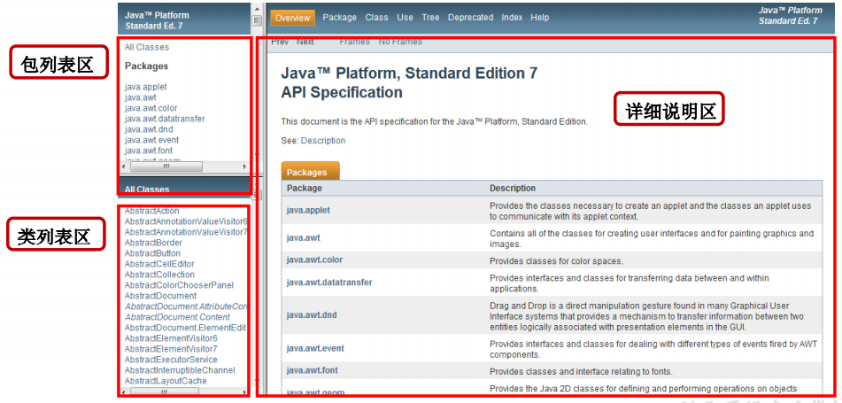 