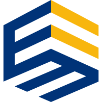

# Java语言概述

## 01_Java基础阶段目录

- 第一阶段：Java基础编程
  - 编程入门
  - Java语言概述
  - Java基本语法
  - 数组
  - 面向对象编程

- 第二阶段：Java高级编程
  - 异常处理
  - 多线程
  - Java常用类
  - 枚举&注解
  - Java集合
  - 泛型
  - IO流
  - 网络编程
  - Java反射机制
  - Java8新特性
  - Java9&10&11新特性

- 第三阶段：Java技术拓展
  - Java版数据结构
  - 常用算法
  - 常用设计模式
  - JVM

## 02_Java后续学习大纲

- 第一阶段：JavaSE
  - Java基础
  - Java8新特性
  - 数据库MySQL与SQL语言
  - JDBC
- 第二阶段：JavaWeb
  - HTML基础与CSS
  - JavaScript DOM 与 jQuery
  - XML 与Tomcat
  - HTTP协议
  - 服务器端组件Servlet
  - JSP
  - EL表达式
  - JSTL
  - 会话控制Cookie和Session
  - 服务器端组件Filter
  - 服务器端组件Listener
  - 国际化
  - 异步数据传输框架Ajax
  - 文件的上传下载
- 第三阶段：JavaEE框架
  - 系统整体分层解耦框架Spring
  - 轻量级Web框架SpringMVC
  - 轻量级持久层框架MyBatis
  - 服务器操作系统Linux
  - 命令解析器Shell
  - 内存数据库Redis
  - 项目架构、Jar包管理工具Maven
- 第四阶段：JavaEE高级
  - SVN/IDEA开发工具
  - 分布式版本管理工具Git与GitHub
  - MySQL高级
  - MyCat实现MySQL的分布式、分库分表、读写分离
  - Nginx反向代理、负载均衡、动静分离
  - JVM内存模型、参数调优
  - JUC线程高级
  - 分布式架构注册中心Zookeeper
  - 虚拟化应用容器Docker
  - 全文检索引擎ElasticSearch
  - 消息队列RabbitMQ
  - 前端VUE/ES6
- 第五阶段：Hadoop生态体系
  - 大数据存储框架Hadoop
  - 分布式管理服务框架Zookeeper
  - Hadoop高可用HA
  - 数据仓库Hive
  - 数据查询框架impala+kudu+clouderManager
  - 日志采集传输框架flume/idea
  - 分布式发布-订阅消息系统Kafka+监控器KafkaManager+KafkaMonitor
  - 分布式关系型数据库Hbase+Hbase二级索引创建工具Phoenix
  - 任务调度框架Oozie
  - 任务调度框架Azkaban
  - 数据查询框架Kylin+druid
  - 大数据图形化工具Hue
- 第六阶段：Spark/Flink生态体系
  - 全文检索+日志搜集+数据可视化ELK
  - 多范式编程语言Scala
  - SparkCore/Spark SQL/Spark Streaming/Spark mlib
  - Spark内核和优化
  - Python
  - 大数据框架Flink
  - 项目实战

## 03_Java主要应用场景

**Java基础是学习JavaEE、大数据、Android开发 的基石！**

- Android App
- 网站后台
- 系统后台
- 大数据
- 桌面工具

## 04_软件开发介绍

### 软件开发

软件，即一系列按照特定顺序组织的计算机数据和指令的集合。有**系统软件**和**应用软件**之分。我们大部分的程序员在做的都是应用软件，系统软件开发难度较大，也非常来之不易，例如华为鸿蒙操作系统，难上加难，要预判好几年之后用户的习惯。

### 人机交互方式

图形化界面(**G**raphical **U**ser **I**nterface GUI)这种方式简单直观，使用者易于接受，容易上手操作。

命令行方式(**C**ommand **L**ine **I**nterface CLI)：需要有一个控制台，输入特定的指令，让计算机完成一些操作。较为麻烦，需要记录住一些命令。

- 常用的DOS命令
  - dir : 列出当前目录下的文件以及文件夹
  - md : 创建目录
  - rd : 删除目录
  - cd : 进入指定目录
  - cd.. : 退回到上一级目录
  - cd\: 退回到根目录
  - del : 删除文件
  - exit : 退出 dos 命令行
- 常用快捷键
  - ← →：移动光标
  - ↑ ↓：调阅历史操作命令
  - Delete和Backspace：删除字符

## 05_计算机编程语言介绍

### 什么是编程

- 编程就是让计算机按照自己的意思去工作

### 什么是编程语言

- 编程语言就是一种计算机能理解的语言

### 什么是计算机语言

语言：是人与人之间用于沟通的一种方式。例如：中国人与中国人用普通话沟通。而中国人要和英国人交流，就要学习英语。

计算机语言：人与计算机交流的方式。

- 如果人要与计算机交流，那么就要学习计算机语言
- 计算机语言有很多种。如：C ,C++ ,Java ,PHP , Kotlin，Python，Scala等。

### 计算机编程语言分代

> 第一代语言：机器语言

机器语言。指令以二进制代码形式存在。

000110110101011011010

> 第二代语言：汇编语言

汇编语言。使用助记符表示一条机器指令。

 

> 第三代语言：高级语言

高级语言

- C、Pascal（主要用于编程教学）、Fortran（公式翻译，广泛用于科学和数学应用）面向过程的语言
- C++面向过程/面向对象
- Java跨平台的纯面向对象的语言
- .NET跨语言的平台
-  Python、Scala…

### 初识Java语言

社区活跃

在计算机语言趋势排行榜https://www.tiobe.com/tiobe-index/常年位列榜首或前三

凡是涉及和操作系统做交互基本上都会使用C或C++进行开发，执行效率高但是开发效率低。`C` < `Java` < `Python`

## 06_Java语言基本概述

- 是SUN(**S**tanford **U**niversity **N**etwork，斯坦福大学网络公司 ) 1995年推出的一 门高级编程语言。
- 是一种面向Internet的编程语言。Java一开始富有吸引力是因为Java程序可以 在Web浏览器中运行。这些Java程序被称为Java小程序（applet）。applet使 用现代的图形用户界面与Web用户进行交互。 applet内嵌在HTML代码中。
- 随着Java技术在web方面的不断成熟，已经成为Web应用程序的首选开发语言。
- 后台开发：**Java、PHP、Python、Go、Node.js**

### Java简史

1991年 `Green`项目，开发语言最初命名为`Oak` (橡树)

1994年，开发组意识到`Oak` 非常适合于互联网

1996年，发布JDK 1.0，约 8.3万个网页应用`Java`技术来制作

1997年，发布JDK 1.1，`JavaOne`会议召开，创当时全球同类会议规模之最

1998年，发布JDK 1.2，同年发布企业平台`J2EE`

1999年，Java分成`J2SE`、`J2EE`和`J2ME`，`JSP/Servlet`技术诞生

 **2004年，发布里程碑式版本：JDK 1.5，为突出此版本的重要性，更名为JDK 5.0**

2005年，J2SE -> JavaSE，J2EE -> JavaEE，J2ME -> JavaME

2009年，`Oracle`公司收购`SUN`，交易价格74亿美元

2011年，发布JDK 7.0

**2014年，发布JDK 8.0，是继JDK 5.0以来变化最大的版本**

2017年，发布JDK 9.0，最大限度实现模块化

2018年3月，发布JDK 10.0，版本号也称为18.3

2018年9月，发布JDK 11.0，版本号也称为18.9。在`Java8`版本后的最大版本

 

 

### Java技术平台

 

现在已经基本没有桌面级应用和小型版了，`Java SE`和`Java EE`本来是并列关系，现在前者是基础，后者是企业级。从Java的应用领域来分，Java语言的应用方向主要表现在以下几个方面：

- **企业级应用：**主要指复杂的大企业的软件系统、各种类型的网站。Java的安全机制以及 它的跨平台的优势，使它在分布式系统领域开发中有广泛应用。应用领域包括金融、电 信、交通、电子商务等。
- **Android平台应用：**Android应用程序使用Java语言编写。Android开发水平的高低很大程度上取决于Java语言核心能力是否扎实
- **大数据平台开发：**各类框架有Hadoop，spark，storm，flink等，就这类技术生态圈来讲，还有各种中间件如flume，kafka，sqoop等等 ，这些框架以及工具大多数是用Java编写而成，但提供诸如Java，scala，Python，R等各种语言API供编程。
- 移动领域应用：主要表现在消费和嵌入式领域，是指在各种小型设备上的应用，包括手 机、PDA、机顶盒、汽车通信设备等。

## 07_Java语言的特点

### Java语言的诞生

`Java`之父`James Gosling`团队在开发`”Green”`项目时，发现`C`缺少垃圾回收系统，还有可移植的安 全性、分布程序设计和多线程功能。最后，他们想要一种易于移植到各种设备上的平台。

`Java`确实是从`C`语言和`C++`语言继承了许多成份，甚至可以将`Java`看成是类`C`语言发展和衍生的产物。比如`Java`语言的变量声明，操作符形式，参数传递，流程控制等方面和`C`语言、`C++`语言完全相同。但同时，`Java`是一个纯粹的面向对象的程序设计语言，它继承了`C++`语言 面向对象技术的核心。`Java`舍弃了`C`语言中容易引起错误的指针（以引用取代）、运算符重载（operator overloading）、多重继承 （以接口取代）等特性，增加了垃圾回收器功能用于回收不再被引用 的对象所占据的内存空间。`JDK1.5`又引入了泛型编程（Generic Programming）、类型安全的枚举、不定长参数和自动装/拆箱。

### Java语言主要特性

- **Java语言是易学的。**Java语言的语法与C语言和C++语言很接近，使得大多数程序员 很容易学习和使用Java。
- **Java语言是强制面向对象的。**Java语言提供类、接口和继承等原语，为了简单起见， 只支持类之间的单继承，但支持接口之间的多继承，并支持类与接口之间的实现机制 （关键字为implements）。
- **Java语言是分布式的。**Java语言支持Internet应用的开发，在基本的Java应用编 程接口中有一个网络应用编程接口（java net），它提供了用于网络应用编程的类库，包括URL、URLConnection、Socket、ServerSocket等。Java的RMI（远程 方法激活）机制也是开发分布式应用的重要手段。
- **Java语言是健壮的。**Java的强类型机制、异常处理、垃圾的自动收集等是Java程序健壮性的重要保证。对指针的丢弃是Java的明智选择。
- **Java语言是安全的。**Java通常被用在网络环境中，为此，Java提供了一个安全机 制以防恶意代码的攻击。如：安全防范机制（类ClassLoader），如分配不同的 名字空间以防替代本地的同名类、字节代码检查。
- **Java语言是体系结构中立的。**Java程序（后缀为java的文件）在Java平台上被 编译为体系结构中立的字节码格式（后缀为class的文件），然后可以在实现这个 Java平台的任何系统中运行。
- **Java语言是解释型的。**如前所述，Java程序在Java平台上被编译为字节码格式， 然后可以在实现这个Java平台的任何系统的解释器中运行。
- **Java是性能略高的。**与那些解释型的高级脚本语言相比，Java的性能还是较优的。
- **Java语言是原生支持多线程的。**在Java语言中，线程是一种特殊的对象，它必须 由Thread类或其子（孙）类来创建。