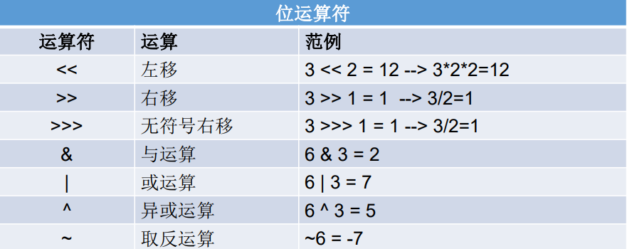
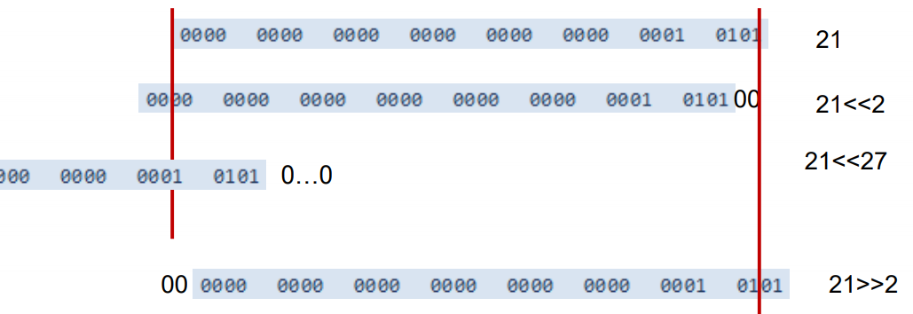
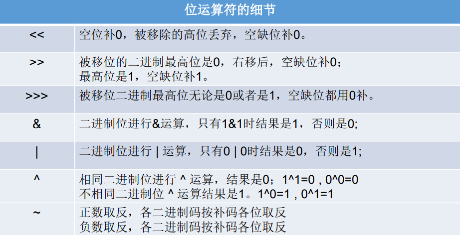
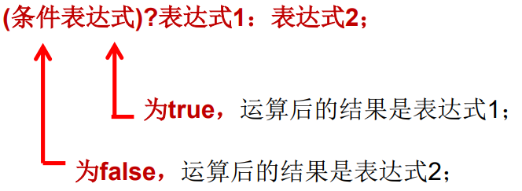
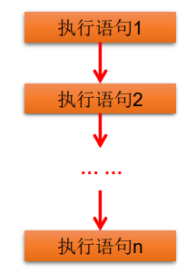
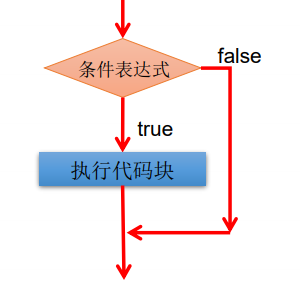
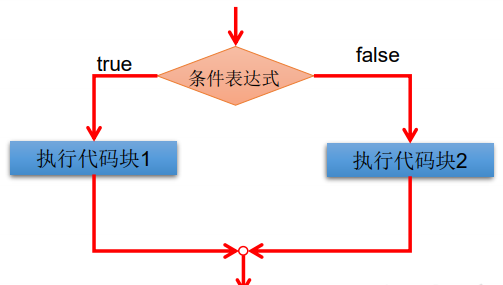
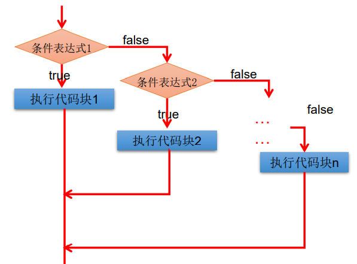
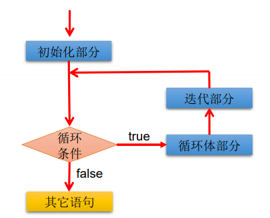
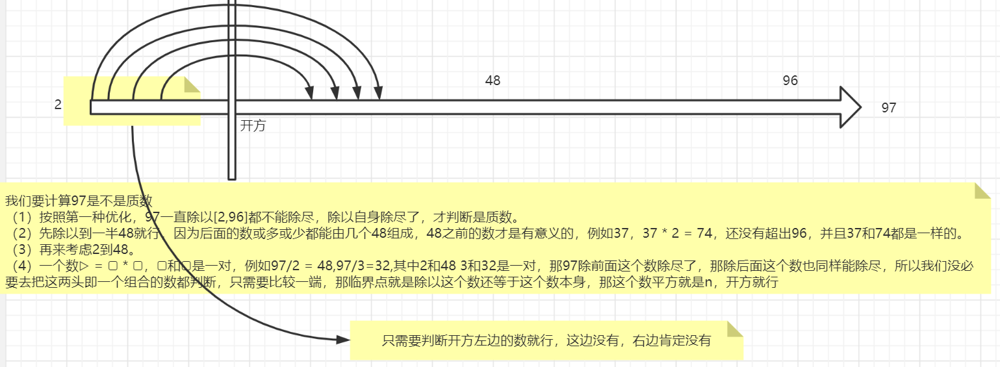

<!-- @import "[TOC]" {cmd="toc" depthFrom=1 depthTo=6 orderedList=false} -->

<!-- code_chunk_output -->

- [Java基本语法](#java基本语法)
  - [01_关键字和保留字](#01_关键字和保留字)
    - [关键字(keyword)](#关键字keyword)
    - [保留字(reserved word)](#保留字reserved-word)
  - [02_标识符](#02_标识符)
    - [什么是标识符(Identifier)](#什么是标识符identifier)
    - [标识符的命名规范](#标识符的命名规范)
  - [03_变量](#03_变量)
    - [基本数据类型](#基本数据类型)
    - [基本数据类型变量间转换](#基本数据类型变量间转换)
    - [基本数据类型与String间转换](#基本数据类型与string间转换)
    - [进制与进制间的转换](#进制与进制间的转换)
  - [04_运算符](#04_运算符)
    - [算术运算符](#算术运算符)
    - [赋值运算符](#赋值运算符)
    - [比较运算符](#比较运算符)
    - [逻辑运算符](#逻辑运算符)
    - [位运算符](#位运算符)
    - [三元运算符](#三元运算符)
    - [运算符的优先级](#运算符的优先级)
    - [扩展思路](#扩展思路)
  - [05_认识熟悉的陌生人](#05_认识熟悉的陌生人)
    - [认识Scanner类](#认识scanner类)
    - [认识main()方法](#认识main方法)
    - [认识System类](#认识system类)
    - [认识Math类](#认识math类)
  - [06_程序流程控制](#06_程序流程控制)
    - [顺序结构](#顺序结构)
    - [分支结构](#分支结构)
    - [循环结构](#循环结构)
    - [嵌套循环](#嵌套循环)
    - [break关键字和continue关键字](#break关键字和continue关键字)

<!-- /code_chunk_output -->


# Java基本语法

## 01_关键字和保留字

### 关键字(keyword)

定义：被Java语言赋予了特殊含义，用做专门用途的字符串（单词）

特点：关键字中所有字母都为小写，在IDEA中同种类都是一个颜色

官方地址：https://docs.oracle.com/javase/tutorial/java/nutsandbolts/_keywords.html

 

 

### 保留字(reserved word)

`Java`保留字：现有`Java`版本尚未使用，但以后版本可能会作为关键字使 用。自己命名标识符时要避免使用这些保留字`goto 、const`

## 02_标识符

### 什么是标识符(Identifier)

Java 对各种**变量**、**方法**和**类**等要素命名时使用的字符序列称为标识符

**技巧：凡是自己可以起名字的地方都叫标识符。**

定义合法标识符规则：

1. 由26个英文字母大小写，0-9 ，_或 $ 组
2. 数字不可以开头。
3. 不可以使用关键字和保留字，但能包含关键字和保留字。
4. Java中严格区分大小写，长度无限制。
5. 标识符不能包含空格。

### 标识符的命名规范

1. 包名：多单词组成时所有字母都小写：xxxyyyzzz
2. 类名、接口名：多单词组成时，所有单词的首字母大写：XxxYyyZzz
3. 变量名、方法名：多单词组成时，第一个单词首字母小写，第二个单词开始每个 单词首字母大写：xxxYyyZzz
4. 常量名：所有字母都大写。多单词时每个单词用下划线连接：XXX_YYY_ZZZ

注意1：在起名字时，为了提高阅读性，要尽量有意义，“见名知意”。

注意2：`Java`采用`unicode`字符集，因此标识符也可以使用汉字声明，但是不建议使用。

## 03_变量

变量的概念：

1. 内存中的一个存储区域
2. 该区域的数据可以在同一类型范围内不断变化
3. 变量是程序中最基本的存储单元。包含**变量类型**、**变量名**和**存储的值**

变量的作用：

1. 用于在内存中保存数据

使用变量注意：

1. Java中每个变量必须先声明，后使用
2. 使用变量名来访问这块区域的数据
3. 变量的作用域：其定义所在的一对{ }内
4. 变量只有在其作用域内才有效
5. 同一个作用域内，不能定义重名的变量

具体使用：

1. 声明变量<数据类型> <变量名称>：int var;
2. 变量的赋值<变量名称> = <值>：var = 10;
3. 声明和赋值变量<数据类型> <变量名> = <初始化值>：int var = 10;

> **变量的分类：按数据类型**

对于每一种数据都定义了明确的具体数据类型（强类型语言），在内存中分配了不同大小的内存空间。

  

| 基本数据类型         | 字节byte    | 位数bit | 默认值  | 值域                                     |
| -------------------- | ----------- | ------- | ------- | ---------------------------------------- |
| byte                 | 1字节       | 8位     | 0       | -128~127                                 |
| short                | 2字节       | 16位    | 0       | -32768~32767                             |
| **int**整数缺省值    | 4字节       | 32位    | 0       | -2147483648~2147483647                   |
| long                 | 8字节       | 64位    | 0L      | -9223372036854774808~9223372036854774807 |
| float                | 4字节       | 32位    | 0.0f    | ±340282346638528859811704183484516925440 |
| **double**浮点缺省值 | 8字节       | 64位    | 0.0d    | 精度是float的一倍                        |
| boolean              | 1字节/4字节 | 1位     | false   | true/false                               |
| char                 | 2字节       | 16位    | 'u0000' | 所有字符（最多65535个）                  |

注意：

1. 对于boolean，官方文档未明确定义，它依赖于 JVM 厂商的具体实现。逻辑上理解是占用 1位，但是实际中会考虑计算机高效存储因素

   [链接：Java中boolean类型占用多少个字节](https://www.cnblogs.com/wangtianze/p/6690665.html)

2. Java 里使用 long 类型的数据一定要在数值后面加上 **L**，否则将作为整型解析：

3. `char a = 'h'`char :单引号，`String a = "hello"` :双引号

4. 缺省值、默认值、default值代表一个意思

>**变量的分类：按声明的位置的不同**

 

### 基本数据类型

> 整数类型

- Java各整数类型有固定的表数范围和字段长度，不受具体OS的影响，以保证Java程序的可移植性。
- Java的整型常量默认为 int 型，声明long型常量须后加‘l’或‘L
- Java程序中变量通常声明为int型，除非不足以表示较大的数，才使用long
- bit：计算机中的最小存储单位。byte：计算机中基本存储单元。

 

一个`bit`存0或者存1有这两种情况，那么8位有多少种组合情况？2的8次方种也就是256个数字，如果只是正数表示0-255，加上负数就是-128-127也就是-2的7次方到2的7次方-1

符号位：一个数是正数还是负数是有符号位表示的，例如byte占用一个byte，如果是正数的话可以表达2的8次方也就是255，但是一位是符号位去表示是正数还是负数，也就只能是2的7次方128，值域减少一半。

> 浮点类型

- 与整数类型类似，Java 浮点类型也有固定的表数范围和字段长度，不受具体操作系统的影响。
- 浮点型常量有两种表示形式：
  -  十进制数形式：如：5.12 512.0f .512 (必须有小数点）
  - 科学计数法形式:如：5.12e2 512E2 100E-2
- float:单精度，尾数可以精确到7位有效数字。很多情况下，精度很难满足需求。
- double:双精度，精度是float的两倍。通常采用此类型。
- Java 的浮点型常量默认为double型，声明float型常量，须后加‘f’或‘F’。

 

- 为什么占用相同的存储空间下，浮点数比int，long表示的范围要大？参考https://blog.csdn.net/sky1988818/article/details/86539119

  float型它有指数部分，规约数的指数可以表示到`2^127`，差不多是`10^38`这么大。从信息论的角度看，我们有额外的信息（IEEE 754的编码格式规定）嵌入在了数值范围的表示中，即我们知道哪个是符号位，哪些是指数部分，哪些是小数部分，以及省略的最高位的1，所以float型32个bit才能存下这么多信息。

- 认识精度

  ```java
  System.out.println(1 / 3.0);
  // 结果:0.3333333333333333
  // 计算机没有能力去把无线循环的结果展现出来
  ```

> 字符类型

- char 型数据用来表示通常意义上“字符”(2字节)
- Java中的所有字符都使用UTF-16编码的`Unicode`，故一个字符可以存储一个字母，一个汉字，或其他书面语的一个字符。UTF-16用16个bit，即两个byte，这也是char占用两个byte的原因。当把char转成数字的时候，需要用int。
- 字符型变量的三种表现形式：
  - 字符常量是用单引号(‘ ’)括起来的单个字符。例如：char c1 = 'a'; char c2 = '中'; char c3 = '9';
  - Java中还允许使用转义字符‘\’来将其后的字符转变为特殊字符型常量。 例如：char c3 = ‘\n’; // '\n'表示换行符
  - 直接使用 `Unicode` 值来表示字符型常量：‘\uXXXX’。其中，XXXX代表 一个十六进制整数。如：\u000a 表示 \n。
- char类型是可以进行运算的。因为它都对应有`Unicode`码。

| 转义字符 | 说明   |
| -------- | ------ |
| `\b`     | 退格符 |
| `\n`     | 换行符 |
| `\r`     | 回车符 |
| `\t`     | 制表符 |
| `\"`     | 双引号 |
| `\'`     | 单引号 |
| `\\`     | 反斜线 |

> 什么是字符集`(Charset )`

字符集就是字符的集合。一般会包含一种语言的字符。比如GBK，是包含所有常用汉字字符的字符集。ASCII是包含英文字符的字符集。

字符就是Java中的char , char是 character的简写。

> 什么是编码`( Encoding )`

char代表一个字符，char的本质也是数字。**将数字映射到字符**，就叫编码。

将一个字符集映射到数字，就是给这个字符集编码。编码是有标准的，所有的计算机系统按照同一个编码标准执行。

有时候编码和字符集会混用。

所有的字符都是由数字来表示的，数字由编码来映射到具体一个一个的字符的。

通俗讲：我们看到的计算机显示出来的多彩多样的汉字等，在计算机内部肯定使用二进制进行存储的，而将二进制组织起来成为一个个数字，例如007代表宋嘉诚，就是编码。就像是一种函数映射关系。

> ASCII码

- ASCII表:https://baike.baidu.com/item/ASCI/309296#3
- 在计算机内部，所有数据都使用二进制表示。每一个二进制位（bit）有 0 和 1 两种状态， 因此 8 个二进制位就可以组合出 256 种状态，这被称为一个字节（byte）。一个字节一 共可以用来表示 256 种不同的状态，每一个状态对应一个符号，就是 256 个符号，从 0000000 到 11111111。
- ASCII码：上个世纪60年代，美国制定了一套字符编码，对英语字符与二进制位之间的 关系，做了统一规定。这被称为ASCII码。ASCII码一共规定了128个字符的编码，比如 空格“SPACE”是32（二进制00100000），大写的字母A是65（二进制01000001）。这 128个符号（包括32个不能打印出来的控制符号），只占用了一个字节的后面7位，最前 面的1位统一规定为0。
- 缺点：
  -  不能表示所有字符。
  -  相同的编码表示的字符不一样：比如，130在法语编码中代表了é，在希伯来语编码中却代表了字母Gime(ג)

> Unicode 编码

- 乱码：世界上存在着多种编码方式，同一个二进制数字可以被解释成不同的符号。因 此，要想打开一个文本文件，就必须知道它的编码方式，否则用错误的编码方式解读， 就会出现乱码。
- Unicode：一种编码，将世界上所有的符号都纳入其中。每一个符号都给予一个独一 无二的编码，使用 Unicode 没有乱码的问题。
- Unicode 的缺点：Unicode 只规定了符号的二进制代码，却没有规定这个二进制代码应该如何存储：无法区别 Unicode 和 ASCII：计算机无法区分三个字节表示一个符号 还是分别表示三个符号。另外，我们知道，英文字母只用一个字节表示就够了，如果 unicode统一规定，每个符号用三个或四个字节表示，那么每个英文字母前都必然有 二到三个字节是0，这对于存储空间来说是极大的浪费。

> UTF-8 ( 8-bit Unicode Transformation Format ) 

- UTF-8 是在互联网上使用最广的一种 Unicode 的实现方式。
- UTF-8 是一种变长的编码方式。它可以使用 1-6 个字节表示一个符号，根据 不同的符号而变化字节长度
- UTF-8的编码规则：
  - 对于单字节的UTF-8编码，该字节的最高位为0，其余7位用来对字符进行编码（等同于 ASCII码）。
  - 对于多字节的UTF-8编码，如果编码包含 n 个字节，那么第一个字节的前 n 位为1，第一 个字节的第 n+1 位为0，该字节的剩余各位用来对字符进行编码。在第一个字节之后的 所有的字节，都是最高两位为"10"，其余6位用来对字符进行编码。

> 布尔类型

- boolean 类型用来判断逻辑条件，一般用于程序流程控制：
  - if条件控制语句；
  - while循环控制语句；
  - do-while循环控制语句；
  - for循环控制语句；
- boolean类型数据只允许取值true和false，无null
  - 不可以使用0或非 0 的整数替代false和true，这点和C语言不同。
  - Java虚拟机中没有任何供boolean值专用的字节码指令，Java语言表达所操作的 boolean值，在编译之后都使用java虚拟机中的int数据类型来代替：true用1表示，false 用0表示。———《java虚拟机规范 8版》

boolean类型占用字节提问？

问：“对于boolean，官方文档未明确定义，它依赖于 JVM 厂商的具体实现。逻辑上理解是占用 1位，但是实际中会考虑计算机高效存储因素”。如何看待这段解释。

答：JVM不是只能跑在高性能的服务器上，或者动则几个G的手机里，也可能跑在嵌入式设备里，跑在内存CPU很小的设备上。这时候JVM可能就值得优化了。

这就是标准的能力。标准只规定了boolean的使用规范，并不涉及其底层是怎么存储的。只要能当boolean用就行。

对于服务器之类的，当然是不在乎boolean占一个字节还是一个bit，访问的效率更重要，那就用一个byte。对于内存稀罕的，对访问速度又没什么要求的，没准可以（但是我觉得可能性也不高，寻址有问题）用一个byte表示好几个boolean。

### 基本数据类型变量间转换

前提：这里只考虑七种基本数据类型变量间的运算，不包含boolean类型

> 自动类型转换（提升）

- 不会出现问题的类型转换，编程语言可以做自动类型转换，比如低精度的数字向高精度的数字转换。

- 自动类型转换可以发生在算数运算，也可以发生在赋值。

- 当容量小(指表示数的范围的大小，不是存储空间的大小)的数据类型的变量与容量大的数据类型的变量做运算时，结果自动提升为容量大的数据类型。`byte、char、short-->int-->long-->float-->double`

   

- byte,short,char之间不会相互转换，他们三者在计算时首先转换为int类型。

- boolean类型不能与其它数据类型运算。

- 当把任何基本数据类型的值和字符串(String)进行连接运算时(+)，基本数据类 型的值将自动转化为字符串(String)类型。

> 强制类型转换和数字溢出

1、强制类型转换：自动类型转换的逆运算，即高精度数值向低精度数值转换。

- 强制类型转换也是操作符，需要使用强转符：（），语法是用小括号将目标类型括起来放在被转换的前面

- 使用强制类型转换，可能出现问题

  ```java
  int intVal = 99;
  long longVal = 99999L;
  intVal = (int) longVal;
  // 超过int的值域就会丢失值
  System.out.println("intVal = " + intVal);
  
  int a = 65 + 2;
  char ch = (char) a;
  System.out.println("ch = " + ch);
  ```

- 强制转换会造成数据精度丢失

  ```java
  long longVal = 99999999999999L;
  int intVal = (int) longVal;
  System.out.println("intVal = " + intVal);// 276447231
  
  double doubleVal =  1234567890.123456789;
  float floatVal = (float)doubleVal;
  System.out.println("floatVal = " + floatVal);//  1.23456794E9
  ```

2、数值溢出

- 数值计算一旦溢出，结果将失去其原有意义。比如，两个正数会加出负数。

  ```java
  int intVal = 2000000000;
  // -294967296
  System.out.println(intVal + intVal);
  ```

- 要对能够处理的值有大概的估计。

3、从数值计算溢出理解程序员和编程语言：程序员就像是编程语言和问题之间的一个桥梁

- 编程语言的作用
  - 编程语言负责按照语法执行
  - 编程语言负责和计算机交互

- 程序员的任务
  - 程序员负责理解问题
  - 程序员负责理解程序，并将问题转换为程序
  - 编程语言不负责解决问题，程序员才负责解决问题

> 特殊情况

转换时候注意，**int**是整数缺省值，**double**是浮点类型缺省值，标题是变量间转换，如果`byte a1 = 1;a1 + 1`就不能使用`byte`来接收。

- `short s = 5;s = s -2;`不能通过编译
- `byte b = 3; b = b + 4;`不能通过编译。`b = (byte)(b+4); `可以通过编译
- `char c = ‘a’;int i = 5;float d = .314F;double result = c+i+d;`可以通过编译
- ` byte b = 5;short s = 3;short t = s + b; `不能通过编译

### 基本数据类型与String间转换

> String

- `String`不是基本数据类型，属于引用数据类型，翻译为字符串
- `String`不是`Java` 中的关键字。`String String = "Hello";`

- 声明`String`类型变量时，使用一对“”，使用方式与基本数据类型一致。例如：`String str = “abcd”;`
- `String str = "";`编译通过，`char ch = '';`编译失败。
- `String`类一旦创建出来就再也不能变了，他也没有提供`get/set`的方法
- 为什么`String`是引用数据类型，但是使用的时候直接赋值呢？这就是`Java`给他开的后门，因为用到`String`的地方实在太多了，每次`new`很费时间
- `String` 对象最重要的特点：不可变（`immutable`）不可变不可变，重要的事情说三遍。`String`用来存储字符的数据是 `private` 的，而且不提供任何修改内容的方法，所以`String` 对象一旦生成，其内容就是完全不可能被修改的

```java
String content = "01234567aAbBcCdD";

// String的length()是个方法不是属性
System.out.println("content.length() = " + content.length());

// 其实是生成了一个新的String对象
// 全部大写
System.out.println(content.toUpperCase());
// 全部小写
System.out.println(content.toLowerCase());

// content指向对象的内容并没有变化
System.out.println(content); // 01234567aAbBcCdD
```

> String连接符运算

- `String`可以和八种基本数据类型做运算，且运算只能是+连接运算，运算结果只能是`String`类型；
- 一个字符串可以串接另一个字符串，也可以直接串接其他类型的数据。例如：`str = str + “xyz”; int n = 100; str = str + n;`

```java
char ch = 'a';
int num = 10;
String str = "hello";

// 107hello
System.out.println(ch + num + str);
// ahello10
System.out.println(ch + str + num);
```

> String与基本数据类型转换

```java
String str = 123;  // 编译不通过
String str = 123 + ""; // 编译通过

int num = str;	// 编译不通过
int num = (int)str // 编译不通过
    
int num = Integer.parseInt(str); // 编译通过
```

### 进制与进制间的转换

世界上有10种人 ，认识和不认识二进制的。所有数字在计算机底层都以**二进制**形式存在。

> 什么是二进制？八进制？十进制？十六进制？

- 二进制：每一位可以是0,1 ，满2进1.以**0b或0B**开头。
- 八进制：每一位可以是0-9 ，满10进1。
- 十进制：每一位可以是0-7 ，满8进1. 以数字**0开头**表示。
- 十六进制：0-9及A-F，满16进1. 以**0x或0X**开头表示。此处的A-F不区分大小写。 如：0x21AF +1= 0X21B0

> 再来认识`bit`和`byte`

在第一章的《编程入门》种曾经提到过`bit`和`byte`，现在我们学习二进制，再来看看

- 一个二进制的位叫做一个bit。网络带宽中的单位，都是bit。比如办宽带说是100M，这里指的就是100M的bit
- 八个二进制的位，组成一个byte。硬盘等存储单位，都是byte。所以办100M宽带下载速度并不是100M，对应文件大小是byte，所以要将100M bit/8也就是12.5M
- byte是计算机中基本的衡量存储单位，计算机在对外使用时不会用bit作为划分存储的单位

> 为什么要诞生这些进制？这些进制分别在什么场景下使用？

- 在电子计算机的设计中，要表示数值，用二进制是最方便实现的，并且其实现成版本最低，这一点很重要。电子元器件的开和关，可以与二进制的1和0对应；如果要用十进制来设计计算机的话，实现难度比起采用开和关的二进制表示法要高很多，而且对于电子元器件的使用成本来说，也要高很多(早期，电子元器件是很昂贵的器材)。
- 计算机使用二进制较为方便，但是过长的数字代码对人的阅读造成了较大回的障碍，为了解决这一问题，才使用十六进制来表示二进制，4位二进制数用1位十六进制数就可以表示，例如一个16位的二进制数1111 1111 1111 1111用十六进制FFFF就可以表示了。

> 进制之间如何进行转换？

- N进制（二进制、八进制、十六进制）转十进制：从个位数开始，例如二进制101，1×2的0次方，0x2的1次方，1x2的2次方
- 十进制转N进制：例如100的二进制，先看最大能凑成2的几次方，2的6次方64，2的5次方32，2的2次方4，1100100

看看常用的进制转换：

| 十进制 | 二进制 | 八进制 | 十六进制 |
| ------ | ------ | ------ | -------- |
| 0      | 0000   | 0      | 0        |
| 1      | 0001   | 1      | 1        |
| 2      | 0010   | 2      | 2        |
| 3      | 0011   | 3      | 3        |
| 4      | 0100   | 4      | 4        |
| 5      | 0101   | 5      | 5        |
| 6      | 0110   | 6      | 6        |
| 7      | 0111   | 7      | 7        |
| 8      | 1000   | 10     | 8        |
| 9      | 1001   | 11     | 9        |
| 10     | 1010   | 12     | A        |
| 11     | 1011   | 13     | B        |
| 12     | 1100   | 14     | C        |
| 13     | 1101   | 15     | D        |
| 14     | 1110   | 16     | E        |
| 15     | 1111   | 17     | F        |
| 16     | 10000  | 20     | 10       |
| 17     | 10001  | 21     | 11       |

> 二进制

我们来重点了解一下二进制，因为**计算机所有的底层数据都以二进制的补码方式进行存储。**

- `Java`整数常量默认是`int`类型，当用二进制定义整数时，其第32位是符号位； 当是`long`类型时，二进制默认占64位，第64位是符号位。

- 二进制的整数有如下三种形式：

1. 原码：直接将一个数值换成二进制数。最高位是符号位
2. 负数的反码：是对原码按位取反，只是最高位（符号位）确定为1。
3. 负数的补码：其反码加1。

- 计算机以二进制**补码**的形式保存所有的整数
  - 正数的原码、反码、补码都相同
  - 负数的补码是其反码+1

为什么要使用原码、反码、补码表示形式呢？

计算机辨别“符号位”显然会让计算机的基础电路设计变得十分复杂! 于是 人们想出了将符号位也参与运算的方法。我们知道，根据运算法则减去一个正数等于加上一个负数， 即：1-1 = 1 + (-1) = 0 ，所以机器可以只有加法而没有减法,，这样计算机运算的设计就更简单了。隐约记得加法器的实现相对来说比较简单。

来看下二进制转换为十进制，以及原码、反码、补码的引出：

 

再看个例子，给定`10111011`，这个是原码、反码、还是补码呢？这就不用问了，没有说给定的肯定是补码。我们需要往回推：

 

## 04_运算符

> 什么是运算符

1. 运算符是一种特殊的符号，用以表示数据的运算、赋值和比较等。
2. 运算符对一个或者多个值进行运算，并得出一个运算结果。
3. 运算符的运算结果类型有的是固定的，有时候会根据被计算的值变化。比如两个int相加，结果的类型就是int。两个byte 相加，返回值的类型也是int。
4. 混淆点：除赋值运算符外，运算符本身不会更改变量的值

```java
int a = 100;
System.out.println("a + 1 = " + a + 1);	// 101
System.out.println("a = " + a);	// 100

// 如果真的要赋值
a = a + 6; // 106
```

- 算术运算符
- 赋值运算符
- 比较运算符（关系运算符）
- 逻辑运算符
- 位运算符
- 三元运算符

### 算术运算符

 

>取模运算符：用来计算余数，开发中经常使用%来判断能否被除尽的情况。

**切记不要和除法运算搞混，一个是取余，一个是取商。**

1、**用来计算余数**：编程语言中，取余和取模的区别到底是什么？https://www.zhihu.com/question/30526656

2、负数也可以被取模

```java
int num = 10;
System.out.println(num % 2);	// 0
System.out.println(num % -3);	// 1
System.out.println(num % 4);	// 2
System.out.println(num % 5);	// 0
System.out.println(num % -6);	// 4
```

3、负数也可以取模

```java
int num = -10;
System.out.println(num % 2);	// 0
System.out.println(num % -3);	// -1
System.out.println(num % 4);	// -2
System.out.println(num % 5);	// 0
System.out.println(num % -6);	// -4
```

4、小数也可以取模（不常用）

结论：**取模的符号跟被取模的数没有关系，取决于取模的数，比如-10，那结果就是负数**

```
取余：rem(x,y)=x-y.*fix(x./y)
取模：mod(x,y)=x-y.*floor(x./y)
其中，fix()函数是向0取整，floor()函数是向负无穷取整
```

>整数的除法运算

1、对于除号“/”，它的整数除和小数除是有区别的：整数之间做除法时，只保留整数部分而舍弃小数部分。 例如：`int x = 3510;x = x / 1000 * 1000; ` x的结果是3000。

2、这个问题经典的表达出：**两个int相除，不会出现第三种结果**

```java
// 整数和整数相运算不会出现另外一个运算符
int a = 10;
int b = 3;
System.out.println("a/b = " + a / b);	// 3

double c = a / b;
sout(c); // 3.0 a/b计算出来已经是3了，只不过是把int类型的值赋值给double类型

```

**如果想得到比较正确的结果，那就改变任意一个数为浮点数**

```java
double a1 = 10.0;
int b1 = 3;
System.out.println("a1/b1 = " + a1 / b1);	// 3.3333333333333335


double d = a / (b + 0.1);
sout(d); // 3.3333333333333335

double d = (double)a / b;
sout(d); // 3.3333333333333335
```

为什么结果是3.33335而不是3.33333呢，这就是之前说的，double也是有精度的，15-16位精度

```java
System.out.println(1/0);		// ArithmeticException
System.out.println(1.0/0.0);	// Infinity
System.out.println(0.0/0.0);	// NaN
```

> "+" 的作用

之前提到过，“+”除字符串相加功能外，还能把非字符串转换成字符串。例如： `System.out.println(“5+5=”+5+5);` //打印结果是？ `5+5=55 `。

字符串的加法运算符符合加法运算符本身的优先级。因为`+`按照顺序是先进行拼接。

```java
int a = 10;
int b = 20;
System.out.println("a+b=" + a + b);		// 会以字符串的形式输出：因为+按照顺序是先进行拼接
System.out.println("a+b=" + (a + b));	// ()是优先级别最高的
System.out.println("a+b=" + a * b);		// *也比＋的优先级别高
```

>**自增、自减**

自增自减是一个比较拿捏不定的问题，先来简单认识下

- 前++：先自增1，然后再运算
- 后++：先运算，后自增1

```java
int a1 = 10;
int b1 = ++a1;
System.out.println("a1 = " + a1);	// 11
System.out.println("b1 = " + b1);   // 11

int a2 = 10;
int b2 = a2++;
System.out.println("a2 = " + a2);   // 11
System.out.println("b2 = " + b2);   // 10
```

结论：

1. 不管是前++还是后++，表示的意思都是自增1，所以a1和a2都会进行自增
2. b1：先++后赋值给b1
3. b2：先赋值后再++操作

```java
short s1 = 1;
s1 = s1 + 1; // 编译失败
s1 = (short) (s1 + 1); // 编译成功,但是繁琐还要改变以前的数据类型
s1++; // 自增1不会改变以前的数据类型
```

结论：

1. 因为自增1不会改变以前的数据类型，所以我们自增操作用后＋+

练习一：

```java
int i1 = 10;
int i2 = 20;
int i = i1++;
System.out.print("i="+i);       // 10
System.out.println("i1="+i1);   // 11
i = ++i1;
System.out.print("i="+i);       // 12
System.out.println("i1="+i1);   // 12
i = i2--;
System.out.print("i="+i);       // 20
System.out.println("i2="+i2);   // 19
i = --i2;
System.out.print("i="+i);       // 18
System.out.println("i2="+i2);   // 18
```

练习二：

随意给出一个整数，打印显示它的个位数，十位数，百位数的值。 

格式如下： 数字xxx的情况如下： 个位数： 十位数： 百位数： 例如： 数字153的情况如下： 个位数：3 十位数：5 百位数：1

```java
int num = 187;
System.out.println("数字" + num + "的情况如下：");
System.out.println("个位数：" + num % 10);
System.out.println("十位数：" + (num % 100) / 10);
System.out.println("百位数：" + num / 100);
```

### 赋值运算符

1. 当“=”两侧数据类型不一致时，可以使用自动类型转换或使用强制类型转换原则进行处理。
2. 支持连续赋值
3. 扩展赋值运算符：` +=, -=, *=, /=, %=`

```java
// 开发中，如果希望变量实现+2的操作，有几种方法？（前提：int num = 10;）
int num = 10;
// 方式一
num = num + 2;
// 方式二（推荐使用）
num += 2;

// 开发中，如果希望变量实现+1的操作，有几种方法？（前提：int num1 = 10;）
int num1 = 10;
// 方式一
num1 = num1 + 1;
// 方式二
num += 1;
// 方式三（推荐）
num++;
```

问：①和②有什么区别？

答：①编译的时候报错，因为整数类型2的默认类型是`int`，用`short`接收需要强制类型转换，②结果为5，**`+=`不会改变变量本身的类型**

```java
short s = 3;
s = s+2; ①
s += 2; ②
```

问：以下程序输出结果，自己的结果是0.1和1.1

答：首先牢记`+=, -=, *=, /=, %=`**不会改变变量本身的类型**，结果首先还是整形`int`，正常计算的话是`0.1`,截断后变成`0`

```java
int i = 1;
i *= 0.1;
System.out.println(i); // 0
i++;
System.out.println(i); // 1
```

问：以下程序输出结果

答：这次作对了

```java
int m = 2;
int n = 3;
n *= m++;
System.out.println("m=" + m); // 3
System.out.println("n=" + n); // 6
```

问：以下程序输出结果

答：这次又作对了

```java
int n = 10;
n += (n++) + (++n);
System.out.println(n);  // 32
```

### 比较运算符

 

- 比较运算符的结果都是boolean型，也就是要么是true，要么是false。
- 比较运算符“==”不能误写成“=” 。

### 逻辑运算符

- 逻辑运算符操作的都是布尔类型的变量，并且结果也是布尔类型

- &逻辑与 。true & true是true , true & false是false。
- | 逻辑或。true | false是true ,false | false是false,true | true是true。
- ！逻辑非。！true是false , ！false是true。
- && 短路与 **建议使用**
- || 短路或 **建议使用**
- ^ 逻辑异或

 

- “&”和“&&”的区别：
  - 单&时，左边无论真假，右边都进行运算；
  - 双&时，如果左边为真，右边参与运算，如果左边为假，那么右边不参与运算。
  - “|”和“||”的区别同理，||表示：当左边为真，右边不参与运算。
- 异或( ^ )与或( | )的不同之处是：当左右都为true时，结果为false。异或，追求的是“异”!
  - a⊕b= a& (!b) || (!a) & b
  - 同为0，异为1
  - 0异或任何数=任何数
  - 1异或任何数=任何数取反
  - 任何数异或自己=把自己置0

练习一：第一次还是太年轻，以为结果是1，1，殊不知已经做了运算

```java
int x = 1;
int y = 1;
if (x++ == 2 & ++y == 2) {
    x = 7;
}
System.out.println("x=" + x + ",y=" + y);	// x=2,y=2
```

练习二：又大意了？？以为结果是2，2，`&&`在左边为`false`的情况下不会再对右边表达式做判断计算

```java
int x = 1, y = 1;
if (x++ == 2 && ++y == 2) {
    x = 7;
}
System.out.println("x=" + x + ",y=" + y);	// x=2,y=1
```

练习三：

```java
int x = 1, y = 1;
if (x++ == 1 | ++y == 1) {
    x = 7;
}
System.out.println("x=" + x + ",y=" + y);	// x=7,y=2
```

练习四：**后++先进行赋值，再自增**

```java
int x = 1, y = 1;
if (x++ == 1 || ++y == 1) {
    x = 7;
}
System.out.println("x=" + x + ",y=" + y);	// x=7,y=1
```

练习五：

```java
class Test {
    public static void main (String [] args) {
        boolean x = true;
        boolean y = false;
        short z = 42;
        if ((z++ == 42) && (y = true)) {	// (z++ == 42)先比较后自增为true
            z++;	// 44
        }
        if ((x = false) || (++z == 45)) {   // 先自增 45
            z++;    // 46
        }

        System.out.println("z =" + z);	// 46
    }
}
```

### 位运算符

 

- 位运算是直接对整数的二进制进行的运算

- 在一定范围内，`<<` 左移一位相当于 * 2

- 在一定范围内，`>>`右移一位相当于 / 2

- 经典面试题：最高效的方式计算2 * 8？ 2 << 3 或8 << 1

- `>>>`：符号位一起右移，左边补0，又称无符号右移。也就是不管是正数还是负数，统一又移左补0。言外之意如果是负数，一下就变成了正数。可以看后面的代码。但是我们自己写代码的时候一般不用，`HashMap`的源码中似曾相识。后面学到集合的时候可以研究下。

  有一种场景，就是不管是否对操作数除2，我只想让他右移不管高位，用这个。

- **位运算符不会改变原变量的值**

- 取反，包括符号位在内的各位取反。`~6 = -7`，`~-7 = 6`

 

 

```java
int a = 0x400;
System.out.println("a = " + a);	 // 十六进制0x400 = 二进制0100 0000 0000 = 十进制1024

// 符号位不动，其余位右移，符号位后面正数补0负数补1   
System.out.println(a >> 1);// result = 512
System.out.println(a >> 2);// result = 256
System.out.println(a << 1);// result = 2048  位运算符不会改变原变量的值
System.out.println(a << 2);// result = 4096

int b = -0x400;  // 十六进制-0x400 = 二进制0001 0100 0000 0000 = 十进制-1024
System.out.println("b = " + b);

System.out.println(b >> 1);	// result = -512
System.out.println(b >> 2);	// result = -256
System.out.println(b << 1); // result = -2048
System.out.println(b << 2); // result = -4096

System.out.println(a >>> 1); // 512
System.out.println(a >>> 2); // 256
System.out.println(b >>> 1); // 2147483136
System.out.println(b >>> 2); // 1073741568
```

> 位运算符的应用

1、掩码（MASK）使用一个字节表示不同的身份

```java
int base = 1;// 基准数
int isStudentMask = base;// 学生掩码 0001
int isProgrammerMask = base  << 1;// 程序员掩码 0010
int isDriverMask = base<< 2;// 司机掩码 0100
int isPainterMask = base << 3;// 画家掩码 1000

int data = 5;// 输入数据 0101
boolean isStudent = (data & isStudentMask) != 0;//  0101 & 0001 = 0001 = 1是学生
boolean isProgrammer = (data & isProgrammerMask) != 0;//  0101 & 0010 = 0000 = 0不是程序员
boolean isDriver = (data & isDriverMask) != 0;//  0101 & 0100 = 0100 = 4是司机
boolean isPainter = (data & isPainterMask) != 0;// 0101 & 1000 = 0000 = 不是画家
```

2、实现两个数字的交换

在我们日后的开发中，不管是学习算法还是日常开发，都会接触到两个数的交换问题，例如给`1,5,4,2,3`这五个数字进行排序从小到大输出，你在对两个数字进行比较之后，肯定要交换位置，下面看看可是实现两数交换的几种方式

- 采用中间变量的方法（推荐）：想想有一杯可乐、一杯雪碧、一个空杯子，你想把可乐和雪碧互换，也就是可乐桶装雪碧，雪碧桶装可乐

  ```java
  int num1 = 1;	// 可乐
  int num2 = 2;	// 雪碧
  int temp = num1; // 先把可乐倒入空杯子
  num1 = num2;	 // 再把雪碧倒入可乐杯
  num2 = temp;	 // 再把可乐倒入雪碧杯
  ```

- 利用亦或进行位操作，不借助中间变量的情况下，实现两个数字的交换。

  ```java
  // 1.异或有一出一：a异或b=a’b+ab’、a同或b=ab+a‘b’（a'为非a）
  // 2.任何一个数字和自身异或均为0，和0异或不变，和1异或取反
  第一步：x = x ^ y;
  第二步：y = y ^ x = y ^ (x ^ y) = y ^ x ^ y = x ^ 0 =  x;
  第三步：x = x ^ y = (x ^ y) ^ x = x ^ y ^ x = y ^ 0 = y;
  ```

- 采用加减法：好处是不用定义临时变量，缺点是相加操作可能超出存储范围，并且有局限性，只能适用于数值类型

  ```java
  int num1 = 1;	
  int num2 = 2;	
  num1 = num1 + num2; // 3
  num2 = num1 - num2; // 1
  num1 = num1 - num2; // 2
  ```

3、高效乘除2

### 三元运算符

格式：

 

- 表达式1和表达式2为**同种类型**
- 三元运算符可以嵌套使用，但是日常开发中没有人这样用，因为不方便维护
- 凡是写成三元运算符形式的都可以用`if-else`代替，反之不成立，`if-else`中的语句块可以更加丰富，没有类型限制之说
- 如果程序既可以使用三元运算符又可以使用`if-else`语句，选择三元运算符，运行效率高，且阿里巴巴编程规约推荐。

```java
int m = 12;
int n = 5;
int max = (m > n) ? m : n;
System.out.println("max = " + max);

double num = (m > n) ? 2 : 1.0;
System.out.println("num = " + num);

n = 12;
String maxStr = (m > n) ? "m大" : ((m == n) ? "相等" : "n大");
System.out.println("maxStr = " + maxStr);

// 获取三个数的最大值
int n1 = 12;
int n2 = 43;
int n3 = -34;
int max1 = (n1 > n2) ? n1 : n2;
int max2 = (max1 > n3) ? max1 : n3;
```

### 运算符的优先级

运算符优先级从高到低依次为：算数运算符、比较运算符、逻辑运算符、赋值运算符

- （）
- ！
- `*`,`/`,`%`
- `+`,`-`
- `>`，`<`，`>=`，`<=`
- `==`
- `!=`
- `&`，`&&`,`|`,`||`
- `=`

**为什么等号的优先级最低?**

等号是赋值运算符，得等右边的数算好了，才能赋值给左边的

**为什么逻辑运算符的优先级低于比较运算符?**

布尔值的操作数是通过比较运算符得出的。比出来我才能判断。

**为什么比较运算符的优先级比算数运算符低?**

比较运算符比较的数是算数运算符算出来的。算出来我才能比较。

### 扩展思路

综上学习，感受一下编程之美

问题：如何求一个0~255范围内的整数的十六进制，例如60的十六进制表示形式3C

```java
// 方式一:自动实现
String str1 = Integer.toBinaryString(60);
String str2 = Integer.toHexString(60);

// 方式二:手动实现
int i1 = 60;											// 定义要计算的数字
int i2 = i1 & 15;										// 使用位运算符 & 15取出最后四位数(想想15的二进制是多少)
String j = (i2 > 9) ? (char)(i2-10+'A')+":"i2+"";		// 使用三元运算符取出转换后的值
int temp = i1 >>> 4;									// 单纯想右移取数使用无符号右移>>>
i2 = temp & 15;
String k = (i2 > 9) ? (char)(i2-10+'A')+":"i2+"";
System.out.println(k+""+j);
```

## 05_认识熟悉的陌生人

### 认识Scanner类

如何从键盘获取不同类型的变量，需要使用`Scanner`类

`Scanner`是一个方便的可以帮我们从标准输入读取并转换数据的类

查看 `Scanner`的源代码和 `since`，理解 `public `带来的现实中的约束：

注释里 `@since   1.5` 表示它是从`Java5`才开始有的。但是这并不是说从`Java5`开始，这个类就没有变化过了，在源代码里搜索一下`@since`，会发现很多方法是在后续的`Java`版本中加进去的，但是`private`方法就不会有这个文档标示，因为`private`方法本来就不给用。

源码中很多方法是`private`，这样做的好处就是，用户假如`JDK5、JDK6、JDK7`用的方法是`public`，`JDK11`改成`private`就意味着无法使用，成员变量定义成`private`这是毋庸置疑的，并且提供`public`方法提供访问。方法层面使用`public`意味着我可以长期提供这样一个功能给别人，不需要改动和加减参数、返回值。自己内部操作用的话用`private`，将一些内部公用的方法抽出使用`private`修饰方法！ 

```java
// 1.导包import java.util.Scanner;
// 2.Scanner的实例化
// 3.调用Scanner类的相关方法,来获取指定类型的变量,输入类型不匹配会抛InputMismatchException异常
```

Scanner 里 nextInt 的小坑：https://xie.infoq.cn/article/59084d3e123889a4e7fd8f4ff

### 认识main()方法

**问题：为什么web项目没有main()方法？**

`main`方法：你的`Java`程序要运行，总要有一个起点，所以我们就约定，从`main`方法这里开始一行一行执行，`Java`程序跑起来，一般是通过主类的`main`方法启动的。

`web`容器是作为`web`程序的一部分存在的，由`web`容器启动你自己写的代码,像`void main()`之类的，测试的时候有时候会用到，其他基本不用。

`tomcat`的主类是`BootStrap`类，也是以此类的`main`方法作为入口启动的,`web`项目部署到`tomcat`服务器之后，启动`tomcat`，`tomcat`从它自己的主函数开始运行，就一直在跑着，等到请求过来的时候。`tomcat`接受到请求，它直接从项目文件中把那个没有主函数的应用拉进来，就这么直截了当的执行了其中的方法。

任何独立的程序都是从`Main`函数开始的，只是有些框架程序把入口给隐藏了，或者直接写到框架内部!这种情况你不用考虑！

`Tomcat`：从启动到运行
 首先，我们是通过执行 `Tomcat`的`startup`的`Shell `脚本启动 `Tomcat `的，而在` Shell `脚本里，其实启动的是` JVM`。`Tomcat `启动以后，其实在操作系统里看到的是一个`JVM `进程。`JVM`进程启动以后，类加载器加载` class `进来执行，首先加载的就这个`org.apache.catalina.startup.Bootstrap`类，这个类里面有一个`main()`函数，是整个` Tomcat` 的入口函数，`JVM `虚拟机会启动一个主线程从这个入口函数开始执行。

- main 方法也只是一个静态的，有 String[] 做参数的，没有返回值的方法而 已。它的特殊性在于 Java 可以把 main 方作为程序入口

  ```java
  public class LearnMain {
      public static void main(String[] args) {
          System.out.println("args = " + args);				// args = [Ljava.lang.String;@1b6d3586
          System.out.println("args.length = " + args.length);	// args.length = 0
      }
  }
  ```

- 给 main 方法传递参数

  在启动参数Program arguments：添加abc sjc "hello world"

  ```java
  public class LearnMain {
      public static void main(String[] args) {
          System.out.println("args = " + args);
          System.out.println("args.length = " + args.length);
          for (String arg : args) {
              System.out.println(arg);
          }
      }
  }
  
  args = [Ljava.lang.String;@1b6d3586
  args.length = 3
  abc
  sjc
  hello world
  ```

- 自己试着调用 main 方法

  ```java
  public class InvokeMain {
      public static void main(String[] args) {
          System.out.println("进入了InvokeMain的main方法");
          LearnMain.main(args);
          System.out.println("InvokeMain的main方法执行结束");
      }
  }
  
  进入了InvokeMain的main方法
  args = [Ljava.lang.String;@1b6d3586
  args.length = 1
  hhh
  InvokeMain的main方法执行结束
  ```

### 认识System类

- `System `类中有很多和系统相关的方法。我们用的最多的就是 `in` 和 `out` 来读取和输出数据
- `System `里另一个最常用的，无可替代的方法，取当前时间
- `System `的文档[System (Java SE 11 & JDK 11 ) (oracle.com)](https://docs.oracle.com/en/java/javase/11/docs/api/java.base/java/lang/System.html)

```java
// 当前毫秒
long startMS = System.currentTimeMillis();
int counter = 0;
for (int i = 0; i < 1000; i++) {
    counter++;
}
System.out.println("counter = " + counter);
long endMS = System.currentTimeMillis();
System.out.println("程序执行使用了几个毫秒？" + (endMS - startMS));

// 当前纳秒
long startNS = System.nanoTime();
counter = 0;
for (int i = 0; i < 1000; i++) {
    counter++;
}
long endNS = System.nanoTime();
System.out.println("程序执行使用了几个纳秒？" + (endNS - startNS));
```

### 认识Math类

https://docs.oracle.com/en/java/javase/12/docs/api/java.base/java/lang/Math.html

> 查看Math类的源代码

可以看到构造方法使用`private`进行修饰也就是不让实例化，没有成员变量，是一个工具类

```java
public final class Math {

    /**
     * Don't let anyone instantiate this class.	// 不要让任何人实例化此类
     */
    private Math() {}
```

> Math中的常用方法

- `Math.random()`给我们产生的是一个`[0,1)`的随机数，类型是double

- 想要一个`[10,99]`之间的随机数

- `Math.random()*100`变成`[0.0,100.0)`不符合，我们乘90变成`[0.0,90.0)`,加10变成`[10,100)`即`[10,90]`

- 取范围内随机整数数的公式：`[rangeStart, rangeEnd) = (int)Math.random()*(endNum - startNum)+ startNum;`

  `[a,b]= Math.random()*(b-a+1)+a`

```java
// 我们调用的都是 Math 里的静态方法，Math的构造函数就是private的，意味着不能创建Math类的实例
System.out.println(Math.random());
```

```java
// 原来归根结底，Math的random是用的Random类来实现的。它在java.util包里
Random random = new Random();
for (int i = 0; i < 100; i++) {
    // nextInt的返回值竟然有正数有负数哦！所以使用别人的类之前，一定要看看文档，避免出问题
    System.out.println(random.nextInt());
}
```

```java
// 负数变为正数
System.out.println(Math.abs(-9));

// 舍小数
System.out.println(Math.round(-9.2));
```

## 06_程序流程控制

流程控制语句是用来控制程序中各语句执行顺序的语句，可以把语句组合成能完成一定功能的小逻辑模块。其流程控制方式采用结构化程序设计中规定的三种基本流程结构，即：

- 顺序结构：程序从上到下逐行地执行，中间没有任何判断和跳转。
- 分支结构：根据条件，选择性地执行某段代码。
  - 有`if…else`和`switch-case`两种分支语句。
- 循环结构：根据循环条件，重复性的执行某段代码。
  - 有`while、do…while、for`三种循环语句。
  - 注：`JDK1.5`提供了`foreach`循环，方便的遍历集合、数组元素。

### 顺序结构

 

Java中定义成员变量时采用合法的前向引用。如：

```java
public class Test{
    int num1 = 12;
    int num2 = num1 + 2;
}
```

错误形式：

```java
public class Test{
    int num2 = num1 + 2;
    int num1 = 12;
}
```

### 分支结构

> 分支结构之`if`语句三种格式：

 第一种结构

```java
if(条件表达式){
    执行代码块;
}
```

 第二种结构，通常叫做**二选一**

```java
if(条件表达式){
    执行代码块1;
}
else{
    执行代码块2;
}
```

 第三种结构，可以看作是**多选一**

```java
if(条件表达式1){
    执行代码块1;
}
else if (条件表达式2){
    执行代码块2;
}
……
    else{
        执行代码块n;
    }
```

- 条件表达式必须是布尔表达式（关系表达式或逻辑表达式）、布尔变量
- 语句块只有一条执行语句时，一对`{}`可以省略，但建议保留，阿里巴巴编程规约建议强制保留
- `if-else`语句结构，根据需要可以嵌套使用
- 当`if-else`结构是“多选一”时，最后的`else`是可选的，根据需要可以省略，条件都不满足才走`else`
- **当多个条件是“互斥”（没有交集）关系时，条件判断语句及执行语句间顺序无所谓。当多个条件是“包含”（有交集）关系时，“小上大下 / 子上父下”**，此处的小指条件范围的大小。

1、编写程序：由键盘输入三个整数分别存入变量num1、num2、num3，对它们进行排序(使用 if-else if-else),并且从小到大输出

```java
// 可以使用坐标轴的思考方式，先固定两个数，去移动第三个数的位置
if (num1 >= num2) {
    if (num3 >= num1) {
        System.out.println("213");
    } else if (num3 <= num2) {
        System.out.println("321");
    } else {
        System.out.println("231");
    }
} else {
    if (num3 >= num2) {
        System.out.println("123");
    } else if (num3 <= num1) {
        System.out.println("312");
    } else {
        System.out.println("132");
    }
}
```

2、输出什么：`hello`

```java
int x = 4;
int y = 1;
if (x > 2) {
    if (y > 2) {
        System.out.println(x + y);
    }
    System.out.println("hello");
} else {
    System.out.println("x is " + x);
}
```

3、输出什么：`c`

```java
boolean b = true;
if(b = false) {		// 注意这里是赋值语句并不是条件判断语句
    System.out.println("a");
} else if(b) {
    System.out.println("b");
} else if(!b) {
    System.out.println("c");
} else {
    System.out.println("d");
}
}
```

> 分支结构之`switch-case`结构

1、语法

```java
switch (表达式){
    case目标值1，对应一个 if else(xxx) :
        匹配后可以执行的语句
    case目标值2，不可以与别的case 字句重复:
        匹配后可以执行的语句
    default(对应最后的else，可选)∶
            default语句
}
```

2、语句有关规则

- `switch`语句适用于有固定多个目标值匹配，然后执行不同的逻辑的情况
- `switch`(表达式)中表达式的值必须是下述几种类型之一：**byte，short， char，int，枚举 (jdk 5.0)，String (jdk 7.0)；**
- `case`子句中的值必须是**常量**，不能是变量名或不确定的表达式值；也就是不能声明范围。
- 同一个`switch`语句，所有`case`子句中的常量值互不相同；
- `switch`里的`case`子句中也可以有任意合法的语句，比如`if-else , for`循环等
- `break`语句用来在执行完一个`case`分支后使程序跳出`switch`语句块；如果没有`break`，程序会顺序执行到`switch`结尾
- 通常情况下必须使用break语句显示的结束一个case子句，否则 `switch`语句会从第一个match 的`case`语句开始执行直到遇到break语句或者`switch`语句结束
- `default`子句**是可选的且灵活**，如果所有的`case`语句都没有匹配上，才会执行`default `中的代码，一般放在末尾，不用加`break`语句。
- `if`和`switch`语句很像，具体什么场景下，应用哪个语句呢？
  - 如果判断的具体数值不多，而且符合`byte、short 、char、int、String`、枚举等几 种类型。虽然两个语句都可以使用，建议使用`switch`语句。因为**效率稍高**。比如说`a=0`的判断，`switch`和`if`在`cpu`上面的处理方式是不一样的，`switch`是在编译阶段将子函数的地址和判断条件绑定了，只要直接将`a`的值直接映射到子函数地址去执行就可以了，但是`if`处理起来就不一样了。它首先要把`a`的值放到`cpu`的寄存器中，然后要把比较的值放到`cpu`的另一个寄存器中，然后做减法，然后根据计算结果跳转到子函数去执行，这样一来就要多出3步的操作了，如果逻辑判断多的话，那么将会比`switch`多处许多倍的操作，尽管寄存器操作的速度很快，但是对于当时的学习机来说，这点速度根本不够用啊。
  - 其他情况：对区间判断，对结果为`boolean`类型判断，使用`if`，`if`的使用范围更广。 也就是说，**使用`switch-case`的，都可以改写为`if-else`**。反之不成立。
- 总结：根据`switch`表达式中的值，以此匹配各个`case`中的常量，一旦匹配成功，则进入到相应`case`结构中调用其执行语句。当调用完执行语句之后，则仍然向下执行其他`case`结构中的执行语句，知道遇到`break`关键字或者此`switch-case`结构末尾为止结束。

3、练习

```java
// 1.对学生成绩大于60分的，输出“合格”。低于60分的，输出“不合格”。
// 这种方法对于if-else结构是非常方便编写的，对于switch-case结构略显复杂，在优化后采用除数的方式结合无break顺序执行的方式进行优化
// 方式一:从case0一直到case100
// 方式二:
switch (score / 10) {
    case 0:
    case 1:
    case 2:
    case 3:
    case 4:
    case 5:
        System.out.println("不及格");
        break;
    case 6:
    case 7:
    case 8:
    case 9:
    case 10:
        System.out.println("合格");
        break;
    default:
        System.out.println("请合法输入");

        // 方式三:最优策略
        switch(score / 60){
            case 0:
                sout("不及格");
                break;
            case 1:
                sout("及格");
                break;
        }
```

```java
// 2.编写程序：从键盘上输入2019年的“month”和“day”，要求通过程序输出输入的日期为2019年的第几天。
// 方法一: 
int bigMonth = 31;
int normal = 30;
int small = 28;
switch (month) {
    case 1:
        System.out.println(day);
        break;
    case 2:
        System.out.println(bigMonth + day);
        break;
    case 3:
        System.out.println(bigMonth + small + day);
        break;
    case 4:
        System.out.println(bigMonth * 2 + small + day);
        break;
    case 5:
        System.out.println(bigMonth * 2 + normal + small + day);
        break;
    case 6:
        System.out.println(bigMonth * 3 + normal + small + day);
        break;
    case 7:
        System.out.println(bigMonth * 3 + normal * 2 + small + day);
        break;
    case 8:
        System.out.println(bigMonth * 3 + normal * 3 + small + day);
        break;
    case 9:
        System.out.println(bigMonth * 3 + normal * 4 + small + day);
        break;
    case 10:
        System.out.println(bigMonth * 3 + normal * 5 + small + day);
        break;
    case 11:
        System.out.println(bigMonth * 4 + normal * 5 + small + day);
        break;
    case 12:
        System.out.println(bigMonth * 3 + normal * 6 + small + day);
        break;

        // 方法二:最优策略,利用无break语句会顺序执行,并且越小的月份每次都会相加的思想
        int bigMonth = 31;
        int normal = 30;
        int small = 28;
        int sumDays = 0;
        switch (month) {
            case 12:
                sumDays += normal;
            case 11:
                sumDays += bigMonth;
            case 10:
                sumDays += normal;
            case 9:
                sumDays += bigMonth;
            case 8:
                sumDays += bigMonth;
            case 7:
                sumDays += normal;
            case 6:
                sumDays += bigMonth;
            case 5:
                sumDays += normal;
            case 4:
                sumDays += bigMonth;
            case 3:
                sumDays += small;
            case 2:
                sumDays += bigMonth;
            case 1:
                sumDays += day;       
```

```java
// 3.从键盘分别输入年、月、日，判断这一天是当年的第几天 注：判断一年是否是闰年的标准：1）可以被4整除，但不可被100整除或2）可以被400整除
// 相对于上一题,重点是判断年份是否是闰年后对2月份天数的变更
case 3:
if ((year % 4 == 0 && year % 100 != 0) || year % 400 == 0) {
    sumDays += 29;
}else {
    sumDays += small;
}
```

### 循环结构

在某些条件满足的情况下，反复执行特定代码的功能

循环的分类有：

- for 循环 

- while 循环 

- do-while 循环

循环语句的四个组成部分：

- 初始化部分(init_statement) 
- 循环条件部分(test_exp) 是boolean类型
- 循环体部分(body_statement) 
- 迭代部分(alter_statement)

 

通常情况下，循环结束都是因为②中的循环条件返回false了

> 循环结构之`for`循环

1、语法格式

```java
for (①初始化部分; ②循环条件部分; ④迭代部分)｛
    ③循环体部分;
｝
```

2、执行过程

①-②-③-④-②-③-④-②-③-④-.....-②

①初始语句在 for循环开始前执行一次，以后不再执行；

②循环体条件表达式在每次循环执行前会执行，如果为 true，则执行循环体，否则循环结束；

④迭代部分循环体后语句会在每次循环执行后被执行；

3、说明

- ①初始化部分可以声明多个变量，但必须是同一个类型，用逗号分隔
- ②循环条件部分为boolean类型表达式，当值为false时，退出循环
- ④可以有多个变量更新，用逗号分隔

4、练习

练习一：以下程序执行结果

```java
@Test
public void test1(){
    int num = 1;
    for (System.out.println("a"); num <= 3; System.out.println("c"), num++) {
        System.out.println("b");
    }
    // a b c b c b c
}
```

练习二：遍历100内的偶数，输出所有偶数的和，输出偶数的个数

```java
@Test
public void test2(){
    int sum = 0;
    int count = 0;
    for (int i = 0; i <= 100; i++) {
        if (i % 2 == 0) {
            System.out.print(i + ",");
            sum += i;
            count++;
        }
    }
    System.out.println("sum = " + sum);
    System.out.println("count = " + count);
}
```

练习三：编写程序从1循环到150，并在每行打印一个值，另外在每个3的倍数行 上打印出“foo”,在每个5的倍数行上打印“biz”,在每个7的倍数行上打印 输出“baz” 。`if-else`结构不能用的原因是多选一，不能满足这种21既是3的倍数又是7的倍数。

```java
@Test
public void test3(){
    for (int i = 0; i <= 150; i++) {
        System.out.print("第" + i + "行" + " ");
        if (i % 3 == 0) {
            System.out.print("foo"+" ");
        }
        if (i % 5 == 0) {
            System.out.print("biz"+" ");
        }
        if (i % 7 == 0) {
            System.out.print("baz"+" ");
        }
        System.out.println();
    }
}
```

练习四：题目：输入两个正整数m和n，求其最大公约数和最小公倍数。 比如：12和20的最大公约数是4，最小公倍数是60。 说明：break关键字的使用

- [ ] 最大公约数：约数就是能够被12除尽的数，有1，2，3，4，6，12。最大公约数就是两个数最大的约数
- [ ] 最小公倍数：倍数就是除它能除尽的，12，24，36...。最小公倍数就是两个数最小的倍数

求最大公约数思路：公约数肯定是至少小于等于这两个数的，并且小于Min(m,n)的

1. 首先获取两个数的较小值
2. 从较小值的最大数开始遍历，也就是获取循环变量的取值范围

求最小公倍数思路：公倍数肯定是至少大于等于这两个数的，并且大于Max(m,n)的

1. 首先获取两个数的较小值
2. 从较小值的最大数开始遍历，也就是获取循环变量的取值范围

```java
@Test
public void test4(){
    Scanner input = new Scanner(System.in);
    System.out.println("请输入第一个正整数：");
    int m = input.nextInt();
    System.out.println("请输入第二个正整数：");
    int n = input.nextInt();

    int min = Math.min(m, n);
    for (int i = min; i >= 1; i--) {
        if (m % i == 0 && n % i == 0) {
            System.out.println("最大公约数" + i);
            break;
        }
    }
    int max = Math.max(m, n);
    for (int i = max; i < m * n; i++) {
        if (m % i == 0 && n % i == 0) {
            System.out.println("最小公倍数" + i);
            break;
        }
    }
}
```

>循环结构之`while`循环

1、语法格式

```java
    ①初始化部分
    while(②循环条件部分){
        ③循环体部分;
        ④迭代部分;
    }
```

2、执行过程

①-②-③-④-②-③-④-②-③-④-...-②

3、说明：

- 注意不要忘记声明④迭代部分。否则，循环将不能结束，变成死循环。
- for循环和while循环可以相互转换，区别在于for循环和while循环的初始化条件部分的作用范围不同。

4、练习

练习一：遍历100以内所有的偶数

```java
@Test
public void test1() {
    int i = 1;
    while (i <= 100) {
        if (i % 2 == 0) {
            System.out.println(i);
        }
        i++;
    }
}
```

练习二：从键盘读入个数不确定的整数，并判断读入的正数和负数的个数，输入为0时结束程序。

- **最简单“无限” 循环格式：while(true) , for(;;),无限循环存在的原因是并不知道循环多少次，需要根据循环体内部某些条件，来控制循环的结束。**
- 结束循环的方式
  - 方式一：循环条件的部分返回了false
  - 方式二：在循环体中，执行break

```java
@Test
public void test2() {
    Scanner scanner = new Scanner(System.in);
    int positiveNumber = 0;
    int negativeNumber = 0;
    while (true) {
        System.out.println("请输入整数:");
        int i = scanner.nextInt();
        if (i > 0) {
            positiveNumber++;
        } else if (i < 0) {
            negativeNumber++;
        } else {
            break;
        }
    }
    System.out.println("positiveNumber = " + positiveNumber);
    System.out.println("negativeNumber = " + negativeNumber);
}
```

> 循环结构之`do-while`循环

1、语法格式

```java
①初始化部分;
do{
    ③循环体部分
    ④迭代部分
}while(②循环条件部分);
```

2、执行过程

①-**③-④**-②-③-④-②-③-④-...②

3、说明

- do-while循环至少执行一次循环体。
- 开发中使用for和while更多一些，较少使用do-while。

4、测试使用

```java
@Test
public void test1() {
    // 遍历100以内的偶数
    int num = 1;
    do {
        if (num % 2 == 0) {
            System.out.println(num);
        }
        num++;
    } while (num <= 100);
}
```

### 嵌套循环

- 将一个循环放在另一个循环体内，就形成了嵌套循环。其中， `for ,while ,do…while`均可以作为外层循环或内层循环。
- **外层循环循环体执行一次，内层循环结构遍历一遍。**
- **外层循环控制行数、内层循环控制列数**
- 一般嵌套循环不超过三层
- 实质上，嵌套循环就是把内层循环当成外层循环的循环体。当只有内层循环的循环条件为false时，才会完全跳出内层循环，才可结束外层的当次循环，开始下一次的循环。
- 设外层循环次数为m次，内层为n次，则内层循环体实际上需要执行m*n次。

练习一：打印

```
*
**
***
****
*****
```

```java
@Test
public void test1() {
    for (int i = 0; i <= 5; i++) {
        for (int j = 0; j < i; j++) {
            System.out.print("*");
        }
        System.out.println();
    }
}
```

练习二：打印

```java
*****
****
***
**
*
```

```java
public void test2() {
    for (int i = 0; i <= 5; i++) {
        for (int j = 0; j < 5 - i; j++) {
            System.out.print("*");
        }
        System.out.println();
    }
}
```

练习三：九九乘法表

```java
@Test
public void test3() {
    for (int i = 1; i < 10; i++) {
        for (int j = 1; j <= i; j++) {
            System.out.print(i + "*" + j + "=" + (i * j) + " ");
        }
        System.out.println();
    }
}
```

练习四：100以内所有质数

什么是质数：质数也叫做素质，只能被1和他本身整除的自然数（非负整数）。例如7只能被1和自身整除。在密码学和数学上有广泛的使用，因为不可再分了。

```java
@Test
public void test1() {
    // 标识n是否被j除尽过
    boolean isFlag;
    // 遍历100以内的自然数（相当于从键盘输入的n）
    for (int n = 2; n <= 100; n++) {
        isFlag = true;
        // 拿到2到n-1的数
        for (int j = 2; j <= n - 1; j++) {
            // 如果 这期间的数都无法整除n则证明n是质数。注意，一次无法整数不能说明情况，得这循环之间所有的数
            if (n % j == 0) {
                isFlag = false;
                // 一旦遇到不是质数,就跳出本此循环,效率提升10倍左右
                break;
            }
        }
        if (isFlag) {
            System.out.println(n);
        }
    }
}
```

优化：不用去整数2到n-1

 

```java
@Test
public void test2() {
    // 标识n是否被j除尽过
    boolean isFlag;
    // 遍历100以内的自然数（相当于从键盘输入的n）
    for (int n = 2; n <= 100; n++) {
        isFlag = true;
        // 优化二：开方，对本身是质数的数缩减了
        for (int j = 2; j <= Math.sqrt(n); j++) {
            // 如果 这期间的数都无法整除n则证明n是质数。注意，一次无法整数不能说明情况，得这循环之间所有的数
            if (n % j == 0) {
                isFlag = false;
                break;
            }
        }
        if (isFlag) {
            System.out.println(n);
        }
    }
}
```

### break关键字和continue关键字

- **break语句结束当前循环**

  - break语句可以结束循环
  - 在求整除程序中使用break提前结束循环
  - IDEA中点击break可以看到for会高亮，得出结束的是哪次循环

  ```java
  @Test
  public void test1() {
      int divisor = 3;
      int count = 0;
      int breakCount = 10;
      for (int i = 0; i < 100; i++) {
          if (i % divisor == 0) {
              System.out.println(i + "可以整除" + divisor + "。商为" + i / divisor);
              count++;
          }
          if (count >= breakCount) {
              System.out.println("已经找到" + breakCount + "个数字，跳出当前循环");
              break;
          }
      }
  }
  ```

- **continue语句结束当此循环**即跳过不符合条件的循环

  ```java
  @Test
  public void test2() {
      int divisor = 3;
      for (int i = 0; i < 100; i++) {
          if (i % divisor == 0 && i % 5 == 0) {
              System.out.println("i能同时被3和5整除,跳过" + i);
              continue;
          }
          if (i % divisor == 0) {
              System.out.println(i + "可以整除" + divisor + "。商为" + i / divisor);
          }
      }
  }
  ```
  
- 带标签的break和continue的使用

  ```java
  @Test
  public void test1(){
      label:for(int i = 0;i<10;i++){
          for(j=0;j<10;j++){
              if(i*j==9){
                  // break label; 结束指定标识的一层循环结构
                  // continue label; 结束指定标识的一层循环结构当此循环
              }
          }
      }
  }
  ```

  继续优化上面寻找质数的案例，用带标签的优化：

  ```java
  @Test
  public void test2() {
      // 遍历100以内的自然数（相当于从键盘输入的n）
      label:for (int n = 2; n <= 100; n++) {
          // 优化二：开方，对本身是质数的数缩减了
          for (int j = 2; j <= Math.sqrt(n); j++) {
              // 如果 这期间的数都无法整除n则证明n是质数。注意，一次无法整数不能说明情况，得这循环之间所有的数
              if (n % j == 0) {
                  continue label;
              }
          }
      }
  }
  ```

  


