# Java基本语法

## 01_关键字和保留字

### 关键字(keyword)

定义：被Java语言赋予了特殊含义，用做专门用途的字符串（单词）

特点：关键字中所有字母都为小写，在IDEA中同种类都是一个颜色

官方地址：https://docs.oracle.com/javase/tutorial/java/nutsandbolts/_keywords.html

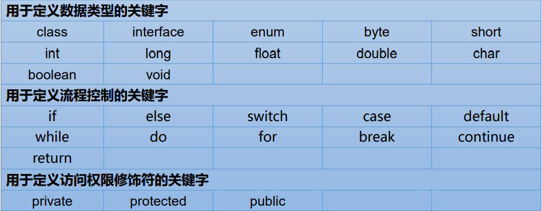 

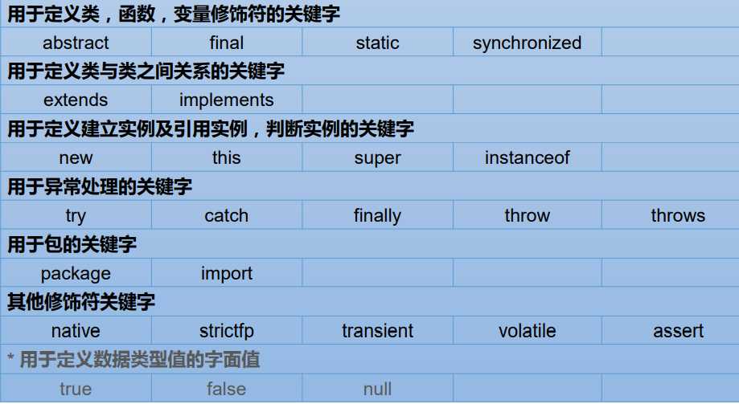 

### 保留字(reserved word)

`Java`保留字：现有`Java`版本尚未使用，但以后版本可能会作为关键字使 用。自己命名标识符时要避免使用这些保留字`goto 、const`

## 02_标识符

### 什么是标识符(Identifier)

Java 对各种**变量**、**方法**和**类**等要素命名时使用的字符序列称为标识符

**技巧：凡是自己可以起名字的地方都叫标识符。**

定义合法标识符规则：

1. 由26个英文字母大小写，0-9 ，_或 $ 组
2. 数字不可以开头。
3. 不可以使用关键字和保留字，但能包含关键字和保留字。
4. Java中严格区分大小写，长度无限制。
5. 标识符不能包含空格。

### 标识符的命名规范

1. 包名：多单词组成时所有字母都小写：xxxyyyzzz
2. 类名、接口名：多单词组成时，所有单词的首字母大写：XxxYyyZzz
3. 变量名、方法名：多单词组成时，第一个单词首字母小写，第二个单词开始每个 单词首字母大写：xxxYyyZzz
4. 常量名：所有字母都大写。多单词时每个单词用下划线连接：XXX_YYY_ZZZ

注意1：在起名字时，为了提高阅读性，要尽量有意义，“见名知意”。

注意2：`Java`采用`unicode`字符集，因此标识符也可以使用汉字声明，但是不建议使用。

## 03_变量

变量的概念：

1. 内存中的一个存储区域
2. 该区域的数据可以在同一类型范围内不断变化
3. 变量是程序中最基本的存储单元。包含**变量类型**、**变量名**和**存储的值**

变量的作用：

1. 用于在内存中保存数据

使用变量注意：

1. Java中每个变量必须先声明，后使用
2. 使用变量名来访问这块区域的数据
3. 变量的作用域：其定义所在的一对{ }内
4. 变量只有在其作用域内才有效
5. 同一个作用域内，不能定义重名的变量

具体使用：

1. 声明变量<数据类型> <变量名称>：int var;
2. 变量的赋值<变量名称> = <值>：var = 10;
3. 声明和赋值变量<数据类型> <变量名> = <初始化值>：int var = 10;

> **变量的分类：按数据类型**

对于每一种数据都定义了明确的具体数据类型（强类型语言），在内存中分配了不同大小的内存空间。

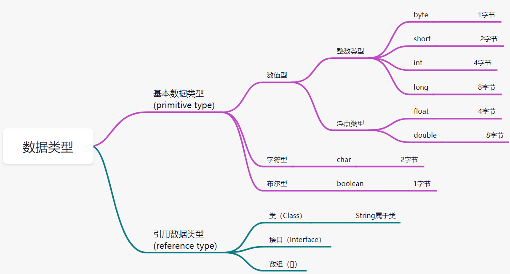  

| 基本数据类型         | 字节byte    | 位数bit | 默认值  | 值域                                     |
| -------------------- | ----------- | ------- | ------- | ---------------------------------------- |
| byte                 | 1字节       | 8位     | 0       | -128~127                                 |
| short                | 2字节       | 16位    | 0       | -32768~32767                             |
| **int**整数缺省值    | 4字节       | 32位    | 0       | -2147483648~2147483647                   |
| long                 | 8字节       | 64位    | 0L      | -9223372036854774808~9223372036854774807 |
| float                | 4字节       | 32位    | 0.0f    | ±340282346638528859811704183484516925440 |
| **double**浮点缺省值 | 8字节       | 64位    | 0.0d    | 精度是float的一倍                        |
| boolean              | 1字节/4字节 | 1位     | false   | true/false                               |
| char                 | 2字节       | 16位    | 'u0000' | 所有字符（最多65535个）                  |

注意：

1. 对于boolean，官方文档未明确定义，它依赖于 JVM 厂商的具体实现。逻辑上理解是占用 1位，但是实际中会考虑计算机高效存储因素

   [链接：Java中boolean类型占用多少个字节](https://www.cnblogs.com/wangtianze/p/6690665.html)

2. Java 里使用 long 类型的数据一定要在数值后面加上 **L**，否则将作为整型解析：

3. `char a = 'h'`char :单引号，`String a = "hello"` :双引号

4. 缺省值、默认值、default值代表一个意思

>**变量的分类：按声明的位置的不同**

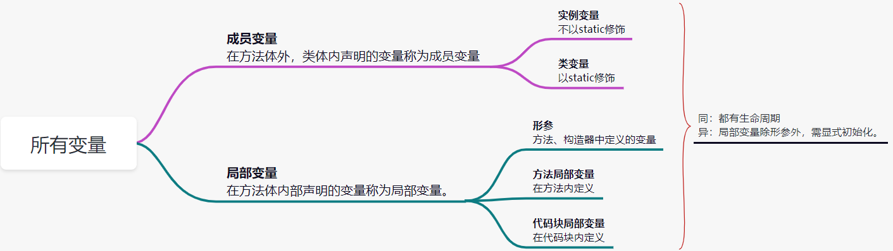 

### 基本数据类型

> 整数类型

- Java各整数类型有固定的表数范围和字段长度，不受具体OS的影响，以保证Java程序的可移植性。
- Java的整型常量默认为 int 型，声明long型常量须后加‘l’或‘L
- Java程序中变量通常声明为int型，除非不足以表示较大的数，才使用long
- bit：计算机中的最小存储单位。byte：计算机中基本存储单元。

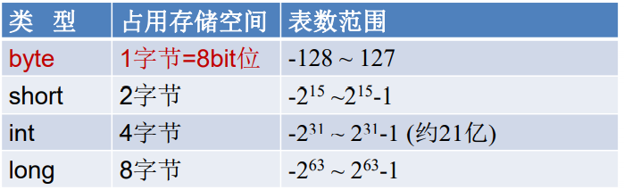 

一个`bit`存0或者存1有这两种情况，那么8位有多少种组合情况？2的8次方种也就是256个数字，如果只是正数表示0-255，加上负数就是-128-127也就是-2的7次方到2的7次方-1

符号位：一个数是正数还是负数是有符号位表示的，例如byte占用一个byte，如果是正数的话可以表达2的8次方也就是255，但是一位是符号位去表示是正数还是负数，也就只能是2的7次方128，值域减少一半。

> 浮点类型

- 与整数类型类似，Java 浮点类型也有固定的表数范围和字段长度，不受具体操作系统的影响。
- 浮点型常量有两种表示形式：
  -  十进制数形式：如：5.12 512.0f .512 (必须有小数点）
  - 科学计数法形式:如：5.12e2 512E2 100E-2
- float:单精度，尾数可以精确到7位有效数字。很多情况下，精度很难满足需求。
- double:双精度，精度是float的两倍。通常采用此类型。
- Java 的浮点型常量默认为double型，声明float型常量，须后加‘f’或‘F’。

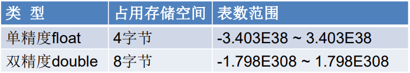 

- 为什么占用相同的存储空间下，浮点数比int，long表示的范围要大？参考https://blog.csdn.net/sky1988818/article/details/86539119

  float型它有指数部分，规约数的指数可以表示到`2^127`，差不多是`10^38`这么大。从信息论的角度看，我们有额外的信息（IEEE 754的编码格式规定）嵌入在了数值范围的表示中，即我们知道哪个是符号位，哪些是指数部分，哪些是小数部分，以及省略的最高位的1，所以float型32个bit才能存下这么多信息。

- 认识精度

  ```java
  System.out.println(1 / 3.0);
  // 结果:0.3333333333333333
  // 计算机没有能力去把无线循环的结果展现出来
  ```

> 字符类型

- char 型数据用来表示通常意义上“字符”(2字节)
- Java中的所有字符都使用UTF-16编码的`Unicode`，故一个字符可以存储一个字母，一个汉字，或其他书面语的一个字符。UTF-16用16个bit，即两个byte，这也是char占用两个byte的原因。当把char转成数字的时候，需要用int。
- 字符型变量的三种表现形式：
  - 字符常量是用单引号(‘ ’)括起来的单个字符。例如：char c1 = 'a'; char c2 = '中'; char c3 = '9';
  - Java中还允许使用转义字符‘\’来将其后的字符转变为特殊字符型常量。 例如：char c3 = ‘\n’; // '\n'表示换行符
  - 直接使用 `Unicode` 值来表示字符型常量：‘\uXXXX’。其中，XXXX代表 一个十六进制整数。如：\u000a 表示 \n。
- char类型是可以进行运算的。因为它都对应有`Unicode`码。

| 转义字符 | 说明   |
| -------- | ------ |
| `\b`     | 退格符 |
| `\n`     | 换行符 |
| `\r`     | 回车符 |
| `\t`     | 制表符 |
| `\"`     | 双引号 |
| `\'`     | 单引号 |
| `\\`     | 反斜线 |

> 什么是字符集`(Charset )`

字符集就是字符的集合。一般会包含一种语言的字符。比如GBK，是包含所有常用汉字字符的字符集。ASCII是包含英文字符的字符集。

字符就是Java中的char , char是 character的简写。

> 什么是编码`( Encoding )`

char代表一个字符，char的本质也是数字。**将数字映射到字符**，就叫编码。

将一个字符集映射到数字，就是给这个字符集编码。编码是有标准的，所有的计算机系统按照同一个编码标准执行。

有时候编码和字符集会混用。

所有的字符都是由数字来表示的，数字由编码来映射到具体一个一个的字符的。

通俗讲：我们看到的计算机显示出来的多彩多样的汉字等，在计算机内部肯定使用二进制进行存储的，而将二进制组织起来成为一个个数字，例如007代表宋嘉诚，就是编码。就像是一种函数映射关系。

> ASCII码

- ASCII表:https://baike.baidu.com/item/ASCI/309296#3
- 在计算机内部，所有数据都使用二进制表示。每一个二进制位（bit）有 0 和 1 两种状态， 因此 8 个二进制位就可以组合出 256 种状态，这被称为一个字节（byte）。一个字节一 共可以用来表示 256 种不同的状态，每一个状态对应一个符号，就是 256 个符号，从 0000000 到 11111111。
- ASCII码：上个世纪60年代，美国制定了一套字符编码，对英语字符与二进制位之间的 关系，做了统一规定。这被称为ASCII码。ASCII码一共规定了128个字符的编码，比如 空格“SPACE”是32（二进制00100000），大写的字母A是65（二进制01000001）。这 128个符号（包括32个不能打印出来的控制符号），只占用了一个字节的后面7位，最前 面的1位统一规定为0。
- 缺点：
  -  不能表示所有字符。
  -  相同的编码表示的字符不一样：比如，130在法语编码中代表了é，在希伯来语编码中却代表了字母Gime(ג)

> Unicode 编码

- 乱码：世界上存在着多种编码方式，同一个二进制数字可以被解释成不同的符号。因 此，要想打开一个文本文件，就必须知道它的编码方式，否则用错误的编码方式解读， 就会出现乱码。
- Unicode：一种编码，将世界上所有的符号都纳入其中。每一个符号都给予一个独一 无二的编码，使用 Unicode 没有乱码的问题。
- Unicode 的缺点：Unicode 只规定了符号的二进制代码，却没有规定这个二进制代码应该如何存储：无法区别 Unicode 和 ASCII：计算机无法区分三个字节表示一个符号 还是分别表示三个符号。另外，我们知道，英文字母只用一个字节表示就够了，如果 unicode统一规定，每个符号用三个或四个字节表示，那么每个英文字母前都必然有 二到三个字节是0，这对于存储空间来说是极大的浪费。

> UTF-8 ( 8-bit Unicode Transformation Format ) 

- UTF-8 是在互联网上使用最广的一种 Unicode 的实现方式。
- UTF-8 是一种变长的编码方式。它可以使用 1-6 个字节表示一个符号，根据 不同的符号而变化字节长度
- UTF-8的编码规则：
  - 对于单字节的UTF-8编码，该字节的最高位为0，其余7位用来对字符进行编码（等同于 ASCII码）。
  - 对于多字节的UTF-8编码，如果编码包含 n 个字节，那么第一个字节的前 n 位为1，第一 个字节的第 n+1 位为0，该字节的剩余各位用来对字符进行编码。在第一个字节之后的 所有的字节，都是最高两位为"10"，其余6位用来对字符进行编码。

> 布尔类型

- boolean 类型用来判断逻辑条件，一般用于程序流程控制：
  - if条件控制语句；
  - while循环控制语句；
  - do-while循环控制语句；
  - for循环控制语句；
- boolean类型数据只允许取值true和false，无null
  - 不可以使用0或非 0 的整数替代false和true，这点和C语言不同。
  - Java虚拟机中没有任何供boolean值专用的字节码指令，Java语言表达所操作的 boolean值，在编译之后都使用java虚拟机中的int数据类型来代替：true用1表示，false 用0表示。———《java虚拟机规范 8版》

boolean类型占用字节提问？

问：“对于boolean，官方文档未明确定义，它依赖于 JVM 厂商的具体实现。逻辑上理解是占用 1位，但是实际中会考虑计算机高效存储因素”。如何看待这段解释。

答：JVM不是只能跑在高性能的服务器上，或者动则几个G的手机里，也可能跑在嵌入式设备里，跑在内存CPU很小的设备上。这时候JVM可能就值得优化了。

这就是标准的能力。标准只规定了boolean的使用规范，并不涉及其底层是怎么存储的。只要能当boolean用就行。

对于服务器之类的，当然是不在乎boolean占一个字节还是一个bit，访问的效率更重要，那就用一个byte。对于内存稀罕的，对访问速度又没什么要求的，没准可以（但是我觉得可能性也不高，寻址有问题）用一个byte表示好几个boolean。

### 基本数据类型变量间转换

前提：这里只考虑七种基本数据类型变量间的运算，不包含boolean类型

> 自动类型转换（提升）

- 不会出现问题的类型转换，编程语言可以做自动类型转换，比如低精度的数字向高精度的数字转换。

- 自动类型转换可以发生在算数运算，也可以发生在赋值。

- 当容量小(指表示数的范围的大小，不是存储空间的大小)的数据类型的变量与容量大的数据类型的变量做运算时，结果自动提升为容量大的数据类型。`byte、char、short-->int-->long-->float-->double`

  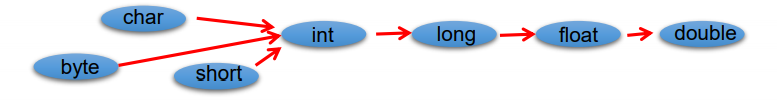 

- byte,short,char之间不会相互转换，他们三者在计算时首先转换为int类型。

- boolean类型不能与其它数据类型运算。

- 当把任何基本数据类型的值和字符串(String)进行连接运算时(+)，基本数据类 型的值将自动转化为字符串(String)类型。

> 强制类型转换和数字溢出

1、强制类型转换：自动类型转换的逆运算，即高精度数值向低精度数值转换。

- 强制类型转换也是操作符，需要使用强转符：（），语法是用小括号将目标类型括起来放在被转换的前面

- 使用强制类型转换，可能出现问题

  ```java
  int intVal = 99;
  long longVal = 99999L;
  intVal = (int) longVal;
  // 超过int的值域就会丢失值
  System.out.println("intVal = " + intVal);
  
  int a = 65 + 2;
  char ch = (char) a;
  System.out.println("ch = " + ch);
  ```

- 强制转换会造成数据精度丢失

  ```java
  long longVal = 99999999999999L;
  int intVal = (int) longVal;
  System.out.println("intVal = " + intVal);// 276447231
  
  double doubleVal =  1234567890.123456789;
  float floatVal = (float)doubleVal;
  System.out.println("floatVal = " + floatVal);//  1.23456794E9
  ```

2、数值溢出

- 数值计算一旦溢出，结果将失去其原有意义。比如，两个正数会加出负数。

  ```java
  int intVal = 2000000000;
  // -294967296
  System.out.println(intVal + intVal);
  ```

- 要对能够处理的值有大概的估计。

3、从数值计算溢出理解程序员和编程语言：程序员就像是编程语言和问题之间的一个桥梁

- 编程语言的作用
  - 编程语言负责按照语法执行
  - 编程语言负责和计算机交互

- 程序员的任务
  - 程序员负责理解问题
  - 程序员负责理解程序，并将问题转换为程序
  - 编程语言不负责解决问题，程序员才负责解决问题

> 特殊情况

转换时候注意，**int**是整数缺省值，**double**是浮点类型缺省值，标题是变量间转换，如果`byte a1 = 1;a1 + 1`就不能使用`byte`来接收。

- `short s = 5;s = s -2;`不能通过编译
- `byte b = 3; b = b + 4;`不能通过编译。`b = (byte)(b+4); `可以通过编译
- `char c = ‘a’;int i = 5;float d = .314F;double result = c+i+d;`可以通过编译
- ` byte b = 5;short s = 3;short t = s + b; `不能通过编译

### 基本数据类型与String间转换

> String

- `String`不是基本数据类型，属于引用数据类型，翻译为字符串
- `String`不是`Java` 中的关键字。`String String = "Hello";`

- 声明`String`类型变量时，使用一对“”，使用方式与基本数据类型一致。例如：`String str = “abcd”;`
- `String str = "";`编译通过，`char ch = '';`编译失败。
- `String`类一旦创建出来就再也不能变了，他也没有提供`get/set`的方法
- 为什么`String`是引用数据类型，但是使用的时候直接赋值呢？这就是`Java`给他开的后门，因为用到`String`的地方实在太多了，每次`new`很费时间
- `String` 对象最重要的特点：不可变（`immutable`）不可变不可变，重要的事情说三遍。`String`用来存储字符的数据是 `private` 的，而且不提供任何修改内容的方法，所以`String` 对象一旦生成，其内容就是完全不可能被修改的

```java
String content = "01234567aAbBcCdD";

// String的length()是个方法不是属性
System.out.println("content.length() = " + content.length());

// 其实是生成了一个新的String对象
// 全部大写
System.out.println(content.toUpperCase());
// 全部小写
System.out.println(content.toLowerCase());

// content指向对象的内容并没有变化
System.out.println(content); // 01234567aAbBcCdD
```

> String连接符运算

- `String`可以和八种基本数据类型做运算，且运算只能是+连接运算，运算结果只能是`String`类型；
- 一个字符串可以串接另一个字符串，也可以直接串接其他类型的数据。例如：`str = str + “xyz”; int n = 100; str = str + n;`

```java
char ch = 'a';
int num = 10;
String str = "hello";

// 107hello
System.out.println(ch + num + str);
// ahello10
System.out.println(ch + str + num);
```

> String与基本数据类型转换

```java
String str = 123;  // 编译不通过
String str = 123 + ""; // 编译通过

int num = str;	// 编译不通过
int num = (int)str // 编译不通过
    
int num = Integer.parseInt(str); // 编译通过
```

### 进制与进制间的转换

世界上有10种人 ，认识和不认识二进制的。所有数字在计算机底层都以**二进制**形式存在。

> 什么是二进制？八进制？十进制？十六进制？

- 二进制：每一位可以是0,1 ，满2进1.以**0b或0B**开头。
- 八进制：每一位可以是0-9 ，满10进1。
- 十进制：每一位可以是0-7 ，满8进1. 以数字**0开头**表示。
- 十六进制：0-9及A-F，满16进1. 以**0x或0X**开头表示。此处的A-F不区分大小写。 如：0x21AF +1= 0X21B0

> 再来认识`bit`和`byte`

在第一章的《编程入门》种曾经提到过`bit`和`byte`，现在我们学习二进制，再来看看

- 一个二进制的位叫做一个bit。网络带宽中的单位，都是bit。比如办宽带说是100M，这里指的就是100M的bit
- 八个二进制的位，组成一个byte。硬盘等存储单位，都是byte。所以办100M宽带下载速度并不是100M，对应文件大小是byte，所以要将100M bit/8也就是12.5M
- byte是计算机中基本的衡量存储单位，计算机在对外使用时不会用bit作为划分存储的单位

> 为什么要诞生这些进制？这些进制分别在什么场景下使用？

- 在电子计算机的设计中，要表示数值，用二进制是最方便实现的，并且其实现成版本最低，这一点很重要。电子元器件的开和关，可以与二进制的1和0对应；如果要用十进制来设计计算机的话，实现难度比起采用开和关的二进制表示法要高很多，而且对于电子元器件的使用成本来说，也要高很多(早期，电子元器件是很昂贵的器材)。
- 计算机使用二进制较为方便，但是过长的数字代码对人的阅读造成了较大回的障碍，为了解决这一问题，才使用十六进制来表示二进制，4位二进制数用1位十六进制数就可以表示，例如一个16位的二进制数1111 1111 1111 1111用十六进制FFFF就可以表示了。

> 进制之间如何进行转换？

- N进制（二进制、八进制、十六进制）转十进制：从个位数开始，例如二进制101，1×2的0次方，0x2的1次方，1x2的2次方
- 十进制转N进制：例如100的二进制，先看最大能凑成2的几次方，2的6次方64，2的5次方32，2的2次方4，1100100

看看常用的进制转换：

| 十进制 | 二进制 | 八进制 | 十六进制 |
| ------ | ------ | ------ | -------- |
| 0      | 0000   | 0      | 0        |
| 1      | 0001   | 1      | 1        |
| 2      | 0010   | 2      | 2        |
| 3      | 0011   | 3      | 3        |
| 4      | 0100   | 4      | 4        |
| 5      | 0101   | 5      | 5        |
| 6      | 0110   | 6      | 6        |
| 7      | 0111   | 7      | 7        |
| 8      | 1000   | 10     | 8        |
| 9      | 1001   | 11     | 9        |
| 10     | 1010   | 12     | A        |
| 11     | 1011   | 13     | B        |
| 12     | 1100   | 14     | C        |
| 13     | 1101   | 15     | D        |
| 14     | 1110   | 16     | E        |
| 15     | 1111   | 17     | F        |
| 16     | 10000  | 20     | 10       |
| 17     | 10001  | 21     | 11       |

> 二进制

我们来重点了解一下二进制，因为**计算机所有的底层数据都以二进制的补码方式进行存储。**

- `Java`整数常量默认是`int`类型，当用二进制定义整数时，其第32位是符号位； 当是`long`类型时，二进制默认占64位，第64位是符号位。

- 二进制的整数有如下三种形式：

1. 原码：直接将一个数值换成二进制数。最高位是符号位
2. 负数的反码：是对原码按位取反，只是最高位（符号位）确定为1。
3. 负数的补码：其反码加1。

- 计算机以二进制**补码**的形式保存所有的整数
  - 正数的原码、反码、补码都相同
  - 负数的补码是其反码+1

为什么要使用原码、反码、补码表示形式呢？

计算机辨别“符号位”显然会让计算机的基础电路设计变得十分复杂! 于是 人们想出了将符号位也参与运算的方法。我们知道，根据运算法则减去一个正数等于加上一个负数， 即：1-1 = 1 + (-1) = 0 ，所以机器可以只有加法而没有减法,，这样计算机运算的设计就更简单了。隐约记得加法器的实现相对来说比较简单。

来看下二进制转换为十进制，以及原码、反码、补码的引出：

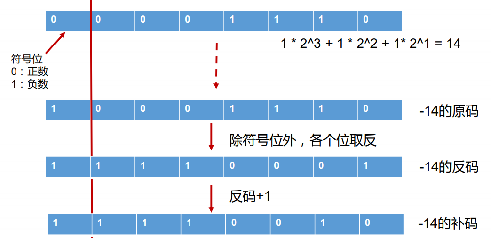 

再看个例子，给定`10111011`，这个是原码、反码、还是补码呢？这就不用问了，没有说给定的肯定是补码。我们需要往回推：

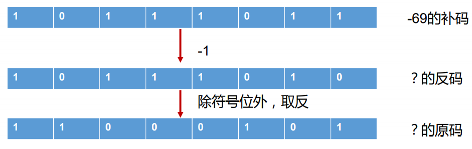 

## 04_运算符

> 什么是运算符

1. 运算符是一种特殊的符号，用以表示数据的运算、赋值和比较等。
2. 运算符对一个或者多个值进行运算，并得出一个运算结果。
3. 运算符的运算结果类型有的是固定的，有时候会根据被计算的值变化。比如两个int相加，结果的类型就是int。两个byte 相加，返回值的类型也是int。
4. 混淆点：除赋值运算符外，运算符本身不会更改变量的值

```java
int a = 100;
System.out.println("a + 1 = " + a + 1);	// 101
System.out.println("a = " + a);	// 100

// 如果真的要赋值
a = a + 6; // 106
```

- 算术运算符
- 赋值运算符
- 比较运算符（关系运算符）
- 逻辑运算符
- 位运算符
- 三元运算符

### 算术运算符

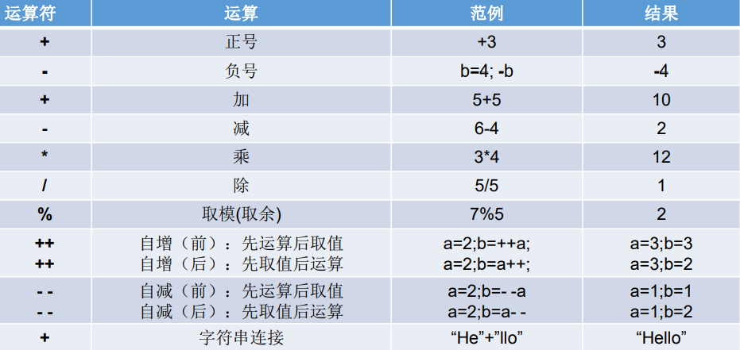 

>取模运算符：用来计算余数，开发中经常使用%来判断能否被除尽的情况。

**切记不要和除法运算搞混，一个是取余，一个是取商。**

1、**用来计算余数**：编程语言中，取余和取模的区别到底是什么？https://www.zhihu.com/question/30526656

2、负数也可以被取模

```java
int num = 10;
System.out.println(num % 2);	// 0
System.out.println(num % -3);	// 1
System.out.println(num % 4);	// 2
System.out.println(num % 5);	// 0
System.out.println(num % -6);	// 4
```

3、负数也可以取模

```java
int num = -10;
System.out.println(num % 2);	// 0
System.out.println(num % -3);	// -1
System.out.println(num % 4);	// -2
System.out.println(num % 5);	// 0
System.out.println(num % -6);	// -4
```

4、小数也可以取模（不常用）

结论：**取模的符号跟被取模的数没有关系，取决于取模的数，比如-10，那结果就是负数**

```
取余：rem(x,y)=x-y.*fix(x./y)
取模：mod(x,y)=x-y.*floor(x./y)
其中，fix()函数是向0取整，floor()函数是向负无穷取整
```

>整数的除法运算

1、对于除号“/”，它的整数除和小数除是有区别的：整数之间做除法时，只保留整数部分而舍弃小数部分。 例如：`int x = 3510;x = x / 1000 * 1000; ` x的结果是3000。

2、这个问题经典的表达出：**两个int相除，不会出现第三种结果**

```java
// 整数和整数相运算不会出现另外一个运算符
int a = 10;
int b = 3;
System.out.println("a/b = " + a / b);	// 3

double c = a / b;
sout(c); // 3.0 a/b计算出来已经是3了，只不过是把int类型的值赋值给double类型

```

**如果想得到比较正确的结果，那就改变任意一个数为浮点数**

```java
double a1 = 10.0;
int b1 = 3;
System.out.println("a1/b1 = " + a1 / b1);	// 3.3333333333333335


double d = a / (b + 0.1);
sout(d); // 3.3333333333333335

double d = (double)a / b;
sout(d); // 3.3333333333333335
```

为什么结果是3.33335而不是3.33333呢，这就是之前说的，double也是有精度的，15-16位精度

```java
System.out.println(1/0);		// ArithmeticException
System.out.println(1.0/0.0);	// Infinity
System.out.println(0.0/0.0);	// NaN
```

> "+" 的作用

之前提到过，“+”除字符串相加功能外，还能把非字符串转换成字符串。例如： `System.out.println(“5+5=”+5+5);` //打印结果是？ `5+5=55 `。

字符串的加法运算符符合加法运算符本身的优先级。因为`+`按照顺序是先进行拼接。

```java
int a = 10;
int b = 20;
System.out.println("a+b=" + a + b);		// 会以字符串的形式输出：因为+按照顺序是先进行拼接
System.out.println("a+b=" + (a + b));	// ()是优先级别最高的
System.out.println("a+b=" + a * b);		// *也比＋的优先级别高
```

>**自增、自减**

自增自减是一个比较拿捏不定的问题，先来简单认识下

- 前++：先自增1，然后再运算
- 后++：先运算，后自增1

```java
int a1 = 10;
int b1 = ++a1;
System.out.println("a1 = " + a1);	// 11
System.out.println("b1 = " + b1);   // 11

int a2 = 10;
int b2 = a2++;
System.out.println("a2 = " + a2);   // 11
System.out.println("b2 = " + b2);   // 10
```

结论：

1. 不管是前++还是后++，表示的意思都是自增1，所以a1和a2都会进行自增
2. b1：先++后赋值给b1
3. b2：先赋值后再++操作

```java
short s1 = 1;
s1 = s1 + 1; // 编译失败
s1 = (short) (s1 + 1); // 编译成功,但是繁琐还要改变以前的数据类型
s1++; // 自增1不会改变以前的数据类型
```

结论：

1. 因为自增1不会改变以前的数据类型，所以我们自增操作用后＋+

练习一：

```java
int i1 = 10;
int i2 = 20;
int i = i1++;
System.out.print("i="+i);       // 10
System.out.println("i1="+i1);   // 11
i = ++i1;
System.out.print("i="+i);       // 12
System.out.println("i1="+i1);   // 12
i = i2--;
System.out.print("i="+i);       // 20
System.out.println("i2="+i2);   // 19
i = --i2;
System.out.print("i="+i);       // 18
System.out.println("i2="+i2);   // 18
```

练习二：

随意给出一个整数，打印显示它的个位数，十位数，百位数的值。 

格式如下： 数字xxx的情况如下： 个位数： 十位数： 百位数： 例如： 数字153的情况如下： 个位数：3 十位数：5 百位数：1

```java
int num = 187;
System.out.println("数字" + num + "的情况如下：");
System.out.println("个位数：" + num % 10);
System.out.println("十位数：" + (num % 100) / 10);
System.out.println("百位数：" + num / 100);
```

### 赋值运算符

1. 当“=”两侧数据类型不一致时，可以使用自动类型转换或使用强制类型转换原则进行处理。
2. 支持连续赋值
3. 扩展赋值运算符：` +=, -=, *=, /=, %=`

```java
// 开发中，如果希望变量实现+2的操作，有几种方法？（前提：int num = 10;）
int num = 10;
// 方式一
num = num + 2;
// 方式二（推荐使用）
num += 2;

// 开发中，如果希望变量实现+1的操作，有几种方法？（前提：int num1 = 10;）
int num1 = 10;
// 方式一
num1 = num1 + 1;
// 方式二
num += 1;
// 方式三（推荐）
num++;
```

问：①和②有什么区别？

答：①编译的时候报错，因为整数类型2的默认类型是`int`，用`short`接收需要强制类型转换，②结果为5，**`+=`不会改变变量本身的类型**

```java
short s = 3;
s = s+2; ①
s += 2; ②
```

问：以下程序输出结果，自己的结果是0.1和1.1

答：首先牢记`+=, -=, *=, /=, %=`**不会改变变量本身的类型**，结果首先还是整形`int`，正常计算的话是`0.1`,截断后变成`0`

```java
int i = 1;
i *= 0.1;
System.out.println(i); // 0
i++;
System.out.println(i); // 1
```

问：以下程序输出结果

答：这次作对了

```java
int m = 2;
int n = 3;
n *= m++;
System.out.println("m=" + m); // 3
System.out.println("n=" + n); // 6
```

问：以下程序输出结果

答：这次又作对了

```java
int n = 10;
n += (n++) + (++n);
System.out.println(n);  // 32
```

### 比较运算符

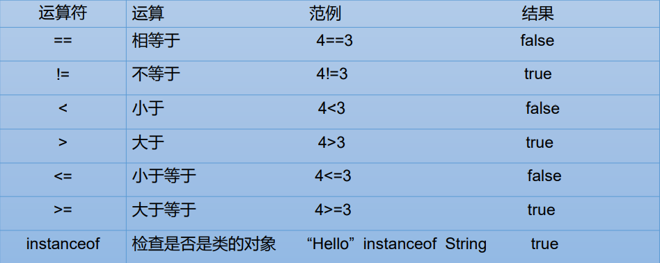 

- 比较运算符的结果都是boolean型，也就是要么是true，要么是false。
- 比较运算符“==”不能误写成“=” 。

### 逻辑运算符

- &逻辑与 
- | 逻辑或
- ！逻辑非 
- && 短路与 
- || 短路或 
- ^ 逻辑异或

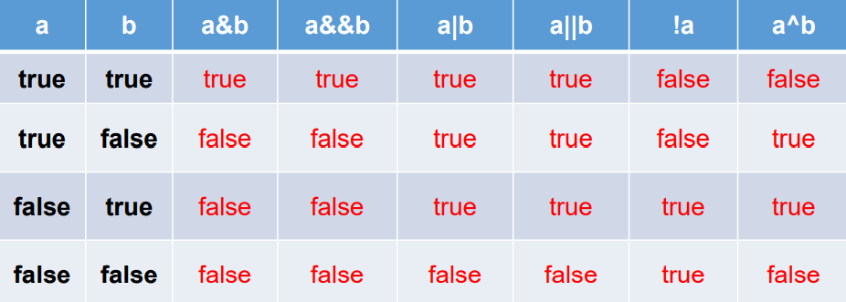 

### 位运算符

### 三元运算符

## 05_程序流程控制

