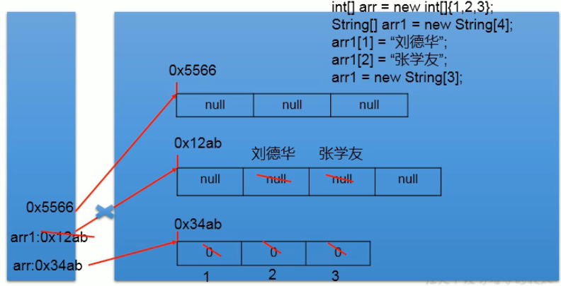
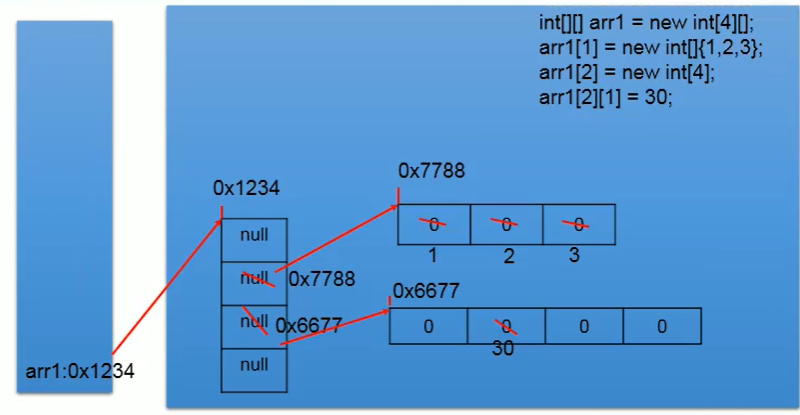
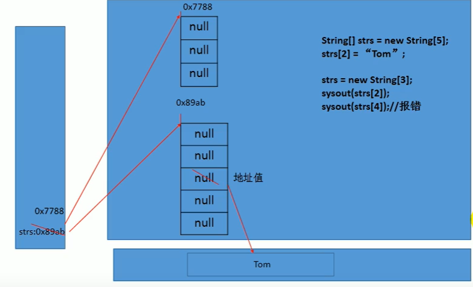

# 数组

## 01_数组的概述

定义：数组(Array)，是多个**相同类型数据**按**一定顺序排列**的集合，并使用**一个名字命名**，并通过**编号**的方式对这些数据进行统一管理。

概念：

1. 数组名
2. 下标（或索引）
3. 元素
4. 数组的长度：元素的个数

特点：

1. 数组是有序排列的
2. 数组本身是引用数据类型，而数组中的元素可以是**任何数据类型**，包括基本数据类型和引用数据类型。
3. 创建数组对象会在内存中开辟一整块**连续的空间**，而**数组名中引用的是这块连续空间的首地址**。
4. 数组的**长度一旦确定，就不能修改。**
5. 我们可以直接通过下标(或索引)的方式调用指定位置的元素，速度很快。

分类：

1. 按照维度：一维数组、二维数组、三维数组、…
2. 按照元素的数据类型分：基本数据类型元素的数组、引用数据类型元素的数组(即对 象数组)

## 02_一维数组的使用

需要注意的点：

1. 一维数组的声明和初始化
2. 如何调用数组指定位置的元素
3. 如何获取数组的长度
4. 如何遍历数组
5. 数组元素的默认初始化值
6. 数组的内存解析

> 一维数组的声明和初始化

- 静态初始化：在定义数组的同时就为数组元素分配空间并赋值。
- 动态初始化：数组声明且为数组元素分配空间与赋值的操作分开进行

```java
@Test
public void test() {
    int a;     // 声明
    a =10;	   // 初始化
    int b = 10;// 声明+初始化

    int[] ids; // 数组的声明
    // 1.静态初始化:数组的初始化和数组元素的赋值操作同时进行
    ids = new int[]{1,2,3,4};
	// 2.动态初始化:数组的初始化和数组元素的赋值操作分开进行
    String[] names = new String[4];
}
```

总结：数组一旦初始化完成，其长度就确定了

> 如何调用数组指定位置的元素

- 数组的索引是从0开始的到数组的长度-1结束

```java
names[0] = "宋嘉诚";
names[1] = "周杰伦";
names[2] = "周星驰";
names[3] = "李连杰";
System.out.println("names[0] = " + names[0]); // 宋嘉诚
```

>如何获取数组的长度

- 属性：length

```java
System.out.println("names.length = " + names.length);
System.out.println("ids.length = " + ids.length);
```

>如何遍历数组

```java
for (int i = 0; i < names.length; i++) {
    System.out.println("names[i] = " + names[i]);
}

for (String name : names) {
    System.out.println("name = " + name);
}
```

> 数组元素的默认初始化值

- 数组元素是整形：0
- 数组元素是浮点型：0.0
- 数组元素是char类型：0或uniquecode的表示'\u0000'而非'0'
- 数组元素是boolean型：false
- 数组元素是引用数据类型：null

```java
@Test
public void test2() {
    // 数组元素的默认初始化值
    int[] arr = new int[4];
    for (int i : arr) {
        System.out.println("i = " + i);	// 0 0 0 0
    }

    // 引用数据类型的默认初始值为null
    String[] strings = new String[5];
    if(strings[2]==null){
        System.out.println("strings[2]==null"); // strings[2]==null
    }
}
```

> 数组的内存解析

首先认识一下Java的内存空间分布，后续会继续学习。Java内存空间主要由栈（存放局部变量）、堆（存放对象、数组）和方法区构成。

 

看一下这几行代码在内存中是如何解析的（一维数组的内存解析）：

```java
int[] arr = new int[]{1,2,3};
String[] arr1 = new String[4];
arr1[1] = "刘德华";
arr1[2] = "张学友";
arr1 = new String[3];
sout(arr[1]); // null
```

 

> 练习

一、算出该人联系方式

```java
@Test
public void test3() {
    int[] arr = new int[]{8, 2, 1, 0, 3};
    int[] index = new int[]{2, 0, 3, 2, 4, 0, 1, 3, 2, 3, 3};
    StringBuilder tel = new StringBuilder();
    for (int value : index) {
        tel.append(arr[value]);
    }
    System.out.println("联系方式：" + tel);
}
```

二、从键盘读入学生成绩，找出最高分， 并输出学生成绩等级。 成绩>=最高分-10 等级为’A’  成绩>=最高分-20 等级为’B’ 成绩>=最高分-30 等级为’C’  其余 等级为’D’ 提示：先读入学生人数，根据人数创建int数组， 存放学生成绩。**junit不支持键盘输入**

```java
@Test
public void test4() {
    // 1.读取学生个数
    Scanner input = new Scanner(System.in);
    System.out.println("请输入学生人数：");
    int stuNum = input.nextInt();
    // 2.创建数组，动态初始化
    int[] stuScoreArr = new int[stuNum];
    // 3.给数组元素赋值并求最高分
    int maxScore = 0;
    for (int i = 0; i < stuScoreArr.length; i++) {
        System.out.println("请输入学生" + (i + 1) + "的成绩");
        int score = input.nextInt();
        stuScoreArr[i] = score;

        if (score > maxScore) {
            maxScore = score;
        }
    }
    // 4.计算每个学生与最高分差值，得到等级
    char level;
    for (int i = 0; i < stuScoreArr.length; i++) {
        int distance = maxScore - stuScoreArr[i];
        switch (distance / 10) {
            case 0:
            case 1:
                level = 'A';
                break;
            case 2:
                level = 'B';
                break;
            case 3:
                level = 'C';
                break;
            default:
                level = 'D';
        }
        System.out.println("student" + (i + 1) + "score is" + stuScoreArr[i] + "grade is" + level);
    }
}
```

## 03_多维数组的使用

重点看二维数组是怎么使用的

1. 二维数组的声明和初始化
2. 如何调用二数组指定位置的元素
3. 如何获取二维数组的长度
4. 如何遍历二维数组
5. 二维数组元素的默认初始化值
6. 二维数组的内存解析

>二维数组的声明和初始化

```java
@Test
public void test1() {
    // 二维数组的静态初始化
    int[][] intArr = new int[][]{{1, 2, 3}, {5, 6}, {7, 8, 9}};
    // 二维数组的动态初始化方式一
    String[][] strArr1 = new String[3][2];
    // 二维数组的动态初始化方式二
    String[][] strArr2 = new String[3][];

    // 类型推断,这样也是正确的但是不标准
    int[] arr1 = {1,2,3};
    int[][] arr2 = {{1,2},{3,4}};
}
```

>如何调用二维数组指定位置的元素

```java
// 2.如何调用二维数组指定位置的元素
System.out.println(intArr[0][1]);
System.out.println(strArr1[1][1]);
// strArr2[i][j]此时访问空指针 
strArr2[1] = new String[4];
System.out.println(strArr2[1][2]);// null
```

> 如何获取二维数组的长度

```java
int[][] intArr = new int[][]{{1, 2, 3}, {5, 6}, {7, 8, 9}};
System.out.println("intArr.length = " + intArr.length);
System.out.println("intArr[0].length = " + intArr[0].length);
System.out.println("intArr[1].length = " + intArr[1].length);
```

> 如何遍历二维数组

```java
for (int i = 0; i < intArr.length; i++) {
    for (int j = 0; j < intArr[i].length; j++) {
        System.out.print("intArr = " + intArr[i][j]);
    }
    System.out.println();
}

for (int[] ints : intArr) {
    for (int anInt : ints) {
        System.out.print("intArr = " + anInt);
    }
    System.out.println();
}
```

> 二维数组元素的默认初始化值

规定：二维数组分为外层数组的元素和内层数组的元素

例如：`int[][] arr = new int[4][3];`

内层元素：`arr[0]`

外层元素：`arr[0][1]`

- 针对初始化方式一：例如` int[][] arr1 = new int[4][5];`
  - 外层元素的初始化值为：地址值
  - 内层元素的初始化值为：与一维数组初始化默认值相同，就是各个数据类型的默认值
- 针对初始化方式二：例如`double[][] arr2 = new double[4][];`
  - 外层元素的初始化值为：null
  - 内层元素的初始化值为：不能调用否则npe

```java
@Test
public void test2() {
    int[][] arr1 = new int[4][5];
    System.out.println("arr1 = " + arr1);				// [[I@69d0a921 [[代表二维数组 I代表Int @69d0a921代表内存中的地址
    System.out.println("arr1[1] = " + arr1[1]);			// [I@446cdf90
    System.out.println("arr1[1][1] = " + arr1[1][1]);	// Int元素的默认初始化值为0

    double[][] arr2 = new double[4][];
    System.out.println("arr2 = " + arr2);				// [[D@799f7e29
    System.out.println("arr2[1] = " + arr2[1]);			// null
    System.out.println("arr2[1][2] = " + arr2[1][2]);	// npe
}
```

>二维数组的内存解析

```java
// 分析以下四步在内存中的情况
int[][] arr1 = new int[4][];
arr1[1] = new int[]{1,2,3};
arr1[2] = new int[4];
arr1[2][1] = 30;
```

 

图中的0x1234并不是真实内存地址，而是JVM帮我们算出来的内存地址，屏蔽了底层真实内存地址。

 

## 04_数组中涉及的常见算法

数据结构：

1、数据与数据之间的逻辑关系：集合、一对一、一对多、多对多，对应数据结构就是集合、链式结构、树状结构、图状结构

2、数据的存储结构：

线性表：主要刻画一对一的关系，顺序表（例如数组）、链表、栈、队列

数形结构：主要刻画一对多的关系，二叉树

图形结构：主要刻画多对多的关系


算法：

排序算法

搜索算法


## 05_Arrays工具类的使用

## 06_数组使用中的常见异常

