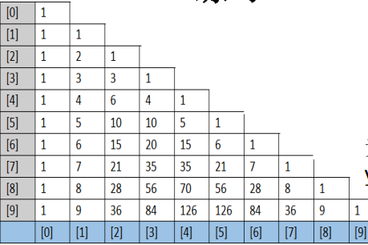
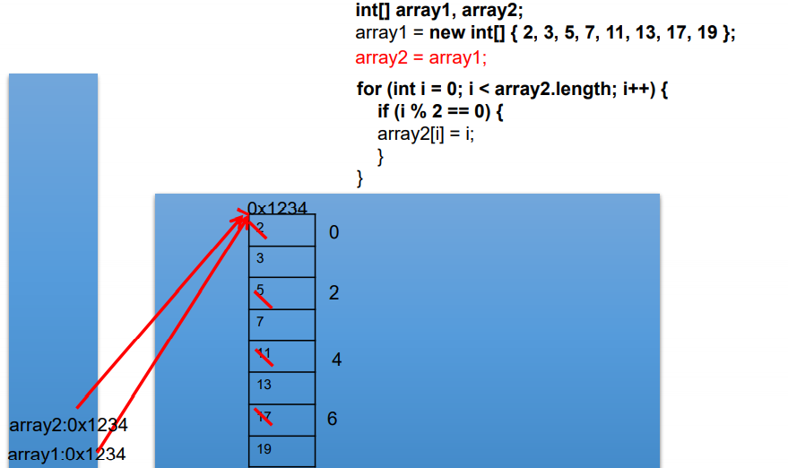
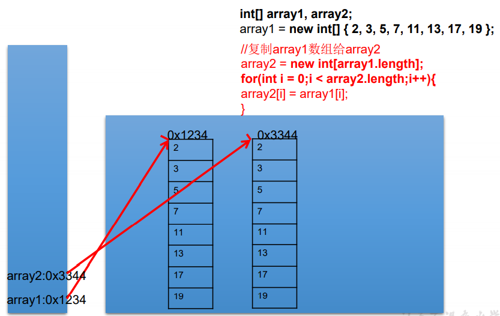

# 数组

## 01_数组的概述

定义：数组(Array)，是多个**相同类型数据**按**一定顺序排列**的集合，并使用**一个名字命名**，并通过**编号**的方式对这些数据进行统一管理。

概念：

1. 数组名
2. 下标（或索引）
3. 元素
4. 数组的长度：元素的个数

特点：

1. 数组是有序排列的
2. 数组本身是引用数据类型，而数组中的元素可以是**任何数据类型**，包括基本数据类型和引用数据类型。
3. 创建数组对象会在内存中开辟一整块**连续的空间**，而**数组名中引用的是这块连续空间的首地址**。
4. 数组的**长度一旦确定，就不能修改。**
5. 我们可以直接通过下标(或索引)的方式调用指定位置的元素，速度很快。

分类：

1. 按照维度：一维数组、二维数组、三维数组、…
2. 按照元素的数据类型分：基本数据类型元素的数组、引用数据类型元素的数组(即对 象数组)

## 02_一维数组的使用

需要注意的点：

1. 一维数组的声明和初始化
2. 如何调用数组指定位置的元素
3. 如何获取数组的长度
4. 如何遍历数组
5. 数组元素的默认初始化值
6. 数组的内存解析

> 一维数组的声明和初始化

- 静态初始化：在定义数组的同时就为数组元素分配空间并赋值。
- 动态初始化：数组声明且为数组元素分配空间与赋值的操作分开进行

```java
@Test
public void test() {
    int a;     // 声明
    a =10;	   // 初始化
    int b = 10;// 声明+初始化

    int[] ids; // 数组的声明
    // 1.静态初始化:数组的初始化和数组元素的赋值操作同时进行
    ids = new int[]{1,2,3,4};
	// 2.动态初始化:数组的初始化和数组元素的赋值操作分开进行
    String[] names = new String[4];
}
```

总结：数组一旦初始化完成，其长度就确定了

> 如何调用数组指定位置的元素

- 数组的索引是从0开始的到数组的长度-1结束

```java
names[0] = "宋嘉诚";
names[1] = "周杰伦";
names[2] = "周星驰";
names[3] = "李连杰";
System.out.println("names[0] = " + names[0]); // 宋嘉诚
```

>如何获取数组的长度

- 属性：length

```java
System.out.println("names.length = " + names.length);
System.out.println("ids.length = " + ids.length);
```

>如何遍历数组

```java
for (int i = 0; i < names.length; i++) {
    System.out.println("names[i] = " + names[i]);
}

for (String name : names) {
    System.out.println("name = " + name);
}
```

> 数组元素的默认初始化值

- 数组元素是整形：0
- 数组元素是浮点型：0.0
- 数组元素是char类型：0或uniquecode的表示'\u0000'而非'0'
- 数组元素是boolean型：false
- 数组元素是引用数据类型：null

```java
@Test
public void test2() {
    // 数组元素的默认初始化值
    int[] arr = new int[4];
    for (int i : arr) {
        System.out.println("i = " + i);	// 0 0 0 0
    }

    // 引用数据类型的默认初始值为null
    String[] strings = new String[5];
    if(strings[2]==null){
        System.out.println("strings[2]==null"); // strings[2]==null
    }
}
```

> 数组的内存解析

首先认识一下Java的内存空间分布，后续会继续学习。Java内存空间主要由栈（存放局部变量）、堆（存放对象、数组）和方法区构成。

 

看一下这几行代码在内存中是如何解析的（一维数组的内存解析）：

```java
int[] arr = new int[]{1,2,3};
String[] arr1 = new String[4];
arr1[1] = "刘德华";
arr1[2] = "张学友";
arr1 = new String[3];
sout(arr[1]); // null
```

 

> 练习

一、算出该人联系方式

```java
@Test
public void test3() {
    int[] arr = new int[]{8, 2, 1, 0, 3};
    int[] index = new int[]{2, 0, 3, 2, 4, 0, 1, 3, 2, 3, 3};
    StringBuilder tel = new StringBuilder();
    for (int value : index) {
        tel.append(arr[value]);
    }
    System.out.println("联系方式：" + tel);
}
```

二、从键盘读入学生成绩，找出最高分， 并输出学生成绩等级。 成绩>=最高分-10 等级为’A’  成绩>=最高分-20 等级为’B’ 成绩>=最高分-30 等级为’C’  其余 等级为’D’ 提示：先读入学生人数，根据人数创建int数组， 存放学生成绩。**junit不支持键盘输入**

```java
@Test
public void test4() {
    // 1.读取学生个数
    Scanner input = new Scanner(System.in);
    System.out.println("请输入学生人数：");
    int stuNum = input.nextInt();
    // 2.创建数组，动态初始化
    int[] stuScoreArr = new int[stuNum];
    // 3.给数组元素赋值并求最高分
    int maxScore = 0;
    for (int i = 0; i < stuScoreArr.length; i++) {
        System.out.println("请输入学生" + (i + 1) + "的成绩");
        int score = input.nextInt();
        stuScoreArr[i] = score;

        if (score > maxScore) {
            maxScore = score;
        }
    }
    // 4.计算每个学生与最高分差值，得到等级
    char level;
    for (int i = 0; i < stuScoreArr.length; i++) {
        int distance = maxScore - stuScoreArr[i];
        switch (distance / 10) {
            case 0:
            case 1:
                level = 'A';
                break;
            case 2:
                level = 'B';
                break;
            case 3:
                level = 'C';
                break;
            default:
                level = 'D';
        }
        System.out.println("student" + (i + 1) + "score is" + stuScoreArr[i] + "grade is" + level);
    }
}
```

## 03_多维数组的使用

重点看二维数组是怎么使用的

1. 二维数组的声明和初始化
2. 如何调用二数组指定位置的元素
3. 如何获取二维数组的长度
4. 如何遍历二维数组
5. 二维数组元素的默认初始化值
6. 二维数组的内存解析

>二维数组的声明和初始化

```java
@Test
public void test1() {
    // 二维数组的静态初始化
    int[][] intArr = new int[][]{{1, 2, 3}, {5, 6}, {7, 8, 9}};
    // 二维数组的动态初始化方式一
    String[][] strArr1 = new String[3][2];
    // 二维数组的动态初始化方式二
    String[][] strArr2 = new String[3][];

    // 类型推断,这样也是正确的但是不标准
    int[] arr1 = {1,2,3};
    int[][] arr2 = {{1,2},{3,4}};
}
```

>如何调用二维数组指定位置的元素

```java
// 2.如何调用二维数组指定位置的元素
System.out.println(intArr[0][1]);
System.out.println(strArr1[1][1]);
// strArr2[i][j]此时访问空指针 
strArr2[1] = new String[4];
System.out.println(strArr2[1][2]);// null
```

> 如何获取二维数组的长度

```java
int[][] intArr = new int[][]{{1, 2, 3}, {5, 6}, {7, 8, 9}};
System.out.println("intArr.length = " + intArr.length);
System.out.println("intArr[0].length = " + intArr[0].length);
System.out.println("intArr[1].length = " + intArr[1].length);
```

> 如何遍历二维数组

```java
for (int i = 0; i < intArr.length; i++) {
    for (int j = 0; j < intArr[i].length; j++) {
        System.out.print("intArr = " + intArr[i][j]);
    }
    System.out.println();
}

for (int[] ints : intArr) {
    for (int anInt : ints) {
        System.out.print("intArr = " + anInt);
    }
    System.out.println();
}
```

> 二维数组元素的默认初始化值

规定：二维数组分为外层数组的元素和内层数组的元素

例如：`int[][] arr = new int[4][3];`

内层元素：`arr[0]`

外层元素：`arr[0][1]`

- 针对初始化方式一：例如` int[][] arr1 = new int[4][5];`
  - 外层元素的初始化值为：地址值
  - 内层元素的初始化值为：与一维数组初始化默认值相同，就是各个数据类型的默认值
- 针对初始化方式二：例如`double[][] arr2 = new double[4][];`
  - 外层元素的初始化值为：null
  - 内层元素的初始化值为：不能调用否则npe

```java
@Test
public void test2() {
    int[][] arr1 = new int[4][5];
    System.out.println("arr1 = " + arr1);				// [[I@69d0a921 [[代表二维数组 I代表Int @69d0a921代表内存中的地址
    System.out.println("arr1[1] = " + arr1[1]);			// [I@446cdf90
    System.out.println("arr1[1][1] = " + arr1[1][1]);	// Int元素的默认初始化值为0

    double[][] arr2 = new double[4][];
    System.out.println("arr2 = " + arr2);				// [[D@799f7e29
    System.out.println("arr2[1] = " + arr2[1]);			// null
    System.out.println("arr2[1][2] = " + arr2[1][2]);	// npe
}
```

>二维数组的内存解析

```java
// 分析以下四步在内存中的情况
int[][] arr1 = new int[4][];
arr1[1] = new int[]{1,2,3};
arr1[2] = new int[4];
arr1[2][1] = 30;
```

 

图中的0x1234并不是真实内存地址，而是JVM帮我们算出来的内存地址，屏蔽了底层真实内存地址。

 

例题：声明：`int[] x,y[]; `在给x,y变量赋值以后，以下选项允许通过编译的是：

1. `x[0] = y; `no y是二维数组
2. `y[0] = x; `yes
3. `y[0][0] = x; `no
4. `x[0][0] = y;` no
5. `y[0][0] = x[0]; `yes
6. `x = y;` no

提示： 一维数组：`int[] x `或者`int x[]  `二维数组：`int[][] y `或者` int[] y[] `或者` int y[][]`

## 04_数组中涉及的常见算法

1. 数组元素的赋值(杨辉三角、回形数等)
2. 求数值型数组中元素的最大值、最小值、平均数、总和等 
3. 数组的复制、反转、查找(线性查找、二分法查找) 
4. 数组元素的排序算法

### 什么是数据结构和算法

我们常说，程序 = 数据结构 + 算法，那么数据结构是什么呢？算法又是什么？

数据结构：

1、数据与数据之间的逻辑关系：集合、一对一、一对多、多对多，对应数据结构就是集合、链式结构、树状结构、图状结构

2、对应数据的存储结构：

1. 集合：主要刻画集合关系，
2. 线性表：主要刻画一对一的关系，顺序表（例如数组）、链表、栈、队列

3. 树形结构：主要刻画一对多的关系，二叉树

4. 图形结构：主要刻画多对多的关系


算法：

1. 排序算法

2. 搜索算法

### 数组元素赋值

> 杨辉三角

使用二维数组打印一个 10 行杨辉三角。 

 

【提示】 

1. 第一行有 1 个元素, 第 n 行有 n 个元素 
2. 每一行的第一个元素和最后一个元素都是 1 
3. 从第三行开始, 对于非第一个元素和最后一个元素的元素。即：` yanghui[i][j] = yanghui[i-1][j-1] + yanghui[i-1][j];`

```java
@Test
public void test() {
    // 1.声明并初始化二维数组
    int[][] arr = new int[10][];
    // 2.给数组的元素赋值
    for (int i = 0; i < arr.length; i++) {
        // 2-1 构造三角形，第一行有一个元素，第二行有两个元素....
        arr[i] = new int[i + 1];
        // 2-2 给首末元素赋值
        arr[i][0] = 1;
        arr[i][i] = 1;
        // 2-3 给每行非首末元素赋值,i>1表示从第二行开始
        if (i > 1) {
            for (int j = 1; j < arr[i].length - 1; j++) {
                arr[i][j] = arr[i-1][j-1] + arr[i-1][j];
            }
        }
    }

    // 3.遍历二维数组
    for (int[] ints : arr) {
        for (int anInt : ints) {
            System.out.print(anInt + " ");
        }
        System.out.println();
    }
}
```

> 填充随机异值

创建一个长度为6的int型数组，要求数组元素的值都在1-30之间，且是随机赋值。同时，要求元素的值各不相同。

分析：声明数组后，放置第一个数的时候，不用条件判断，放置第二个数及以后的数，都需要和前面所有的数字进行比较判断是否相等；

```java
@Test
public void test2() {
    int[] arr = new int[6];
    for (int i = 0; i < arr.length; i++) {
        // [0,1) [0,30) [0,31) [0,30]
        arr[i] = (int) (Math.random() * 30) + 1;
        // 给元素赋值完成后，比较数组中该元素之前的值
        for (int j = 0; j < i; j++) {
            if (arr[i] == arr[j]) {
                // 如果发现相同，下标--，即本次赋值失效
                i--;
                break;
            }
        }
    }
    for (int i : arr) {
        System.out.println("i = " + i);
    }
}
```

> 回型数(TODO)

也叫旋转矩阵，力扣原题

### 数组元素数值型计算

定义一个int型的一维数组，包含10个元素，分别赋一些随机整数， 然后求出所有元素的最大值，最小值，和值，平均值，并输出出来。 要求：所有随机数都是两位数。[10,99] = [0,1) *90 [0,90) +10 [10,99] 

```java
@Test
public void test(){
    // 获取两位数
    int num = (int)(Math.random() * 90 + 10)
}
```

最大最小可以先将数组中第一个元素设置为最大最小值，遍历的时候判断与替换。

### 数组赋值与数组的复制

> 数组的赋值

先看这种操作是数组的复制吗？

声明array1和array2两个变量， 他们是int[]类型的数组。使用大括号{}，把array1初始化为8个素数：2,3,5,7,11,13,17,19。显示array1的内容。赋值array2变量等于array1，修改array2中的偶索引元素，使其等于索引值 (如array[0]=0,array[2]=2)。再次打印出array1。

```java
@Test
public void test() {
    int[] array1, array2;
    array1 = new int[]{2, 3, 5, 7, 11, 13, 17, 19};
    for (int i : array1) {
        System.out.print(i + " ");	// 2 3 5 7 11 13 17 19
    }
    array2 = array1;
    for (int i = 0; i < array2.length; i++) {
        if (i % 2 == 0) {
            array2[i] = i;
        }
    }
    System.out.println("第二次打印");
    for (int i : array1) {
        System.out.print(i + " ");	// 0 3 2 7 4 13 6 19
    }
}
```

我们只更改了array2中的元素，但是array1的元素也被更改了，证明两个变量（地址值一样）即引用指向的是同一个地址空间（指向同一实体），数组也只有一份，这样不是复制；以下为过程分析：

 

> 数组的复制

实现array2对array1数组的复制：

```java
int[] array2 = new int[array1.length];
for(int i = 0;i<array2.length;i++){
    array2[i] = array1[i];
}
```

 

### 数组的反转

方式一：对于循环结束条件、循环迭代部分不清楚可以用特例进行演算得出

```java
@Test
public void test2() {
    int[] array = new int[]{2, 3, 5, 7, 11, 13, 17, 19};
    for (int i = 0; i < array.length / 2; i++) {
        int temp = array[i];
        array[i] = array[array.length - 1 - i];
        array[array.length - 1 - i] = temp;
    }
}
```

方式二：

```java
@Test
public void test2() {
    int[] array = new int[]{2, 3, 5, 7, 11, 13, 17, 19};
    for (int i = 0, j = array.length - 1; i < j; i++, j--) {
        int temp = array[i];
        array[i] = array[j];
        array[j] = temp;
    }
}
```

### 数组的查找

> 数组线性查找

```java
@Test
public void linearSearch() {
    String[] arr = new String[]{"AA", "BB", "CC", "DD", "EE", "FF", "GG"};
    String dest = "DD";
    boolean isFlag = false;
    for (int i = 0; i < arr.length; i++) {
        if (dest.equals(arr[i])) {
            isFlag = true;
            System.out.println("找到了指定的元素，位置为" + i);
            break;
        }
    }
    if (!isFlag) {
        System.out.println("未找到指定元素");
    }
}
```

> 数组二分法查找

**前提是所有查找的数组必须有序！**

```java
@Test
public void binarySearch() {
    int[] arr = new int[]{-98, -34, -4, 7, 23, 45, 53, 78, 99, 584};
    int dest = 7;
    // 初始的首索引
    int head = 0;
    // 初始的末索引
    int end = arr.length - 1;
    boolean isFlag = false;
    while (head <= end) {
        int middle = (head + end) / 2;
        if (dest == arr[middle]) {
            isFlag = true;
            System.out.println("找到了指定的元素，位置为" + middle);
            break;
        } else if (arr[middle] > dest) {
            end = middle - 1;
        } else {
            head = middle + 1;
        }
    }
    if (!isFlag) {
        System.out.println("未找到指定元素");
    }
}
```

思考：为什么是二分法查找呢？能不能三分法、四分法查找？

其实是可以的，如果一组数你知道他是大的数偏多，而且你要找小的数，那完全可以三分法查找，可能你要找到数就在左边的三分之一处，那这个关系怎么样可以维护呢？

一组比较均匀的数组，例如1-100比较均匀，我找10，可以使用**差值法**，即10减去第一个元素，最后一个数减去第一个元素：

```java
10 - 0
_______
100 - 0    
```

也就是这个数字整体在数组的几分之几的位置，在最理想的情况下，1/10处刚好就是10。

### 数组的排序（todo）

排序算法分类：**内部排序**和**外部排序**。

- **内部排序：**整个排序过程不需要借助于外部存储器（如磁盘等），所有排序操作都在内存中完成。
- **外部排序：**参与排序的数据非常多，数据量非常大，计算机无法把整个排序过程放在内存中完成，必须借助于外部存储器（如磁盘）。外部排序最常见的是多路归并排序。可以认为外部排序是由多次内部排序组成。

排序的稳定性：

- 21，32，13，45，21，排序后两个21交换位置即为不稳定排序
- 21，32，13，45，21，排序后两个21不交换位置即为稳定排序

十大内部排序算法：

- 选择排序
  - 直接选择排序：首先在所有记录中选出最小的数，把它与第1个记录交换，然后在其余记录中选出最小的数与第2个记录交换，依次直到所有记录排完为止。
  - 堆排序
- 交换排序
  - 冒泡排序：通过相邻元素之间的比较和交换，将排序码较小的元素逐渐从底部移向顶部。由于整个排序的过程就像水底气泡一样逐渐上冒，故称冒泡排序。48，25，36，5，79，81
  - 快速排序
- 插入排序
  - 直接插入排序：**类比于抓扑克牌**，当插入第i个元素时，R1，R2，R3....Ri-1已经排好顺序，因此将第i个元素Ri依次与之前的元素进行比较找到合适的位置插入。这种方式简单明了，但速度很慢。稳定：T(n) = O(n^2)
  - 折半插入排序
  - 希尔（Shell）排序：**缩小增量多遍插入排序**。先取一个小于n（数组长度）的整数d1，作为第一个增量。把数组全部元素分为d1个组。所有距离为d1的倍数的记录放在同一组，**先在各自组内进行直接插入排序**，然后取第二个增量d2<d1重复上述分组与排序，直至dt=1，即所有记录放在同一组中进行直接插入排序为止。**该方法实质上是一种分组插入方法**。
- 归并排序
- 桶式排序
- 基数排序

## 05_Arrays工具类的使用

一般我们学习时，一般看到某个类加后缀`S`，一般就是这个类的工具类，`java.util.Arrays`类即为操作数组的工具类，包含了用来操作数组（比如排序和搜索）的各种方法。

写代码前先去API文档上看看常用的方法：

| 方法                                | 说明                                   |
| ----------------------------------- | -------------------------------------- |
| `boolean equals(int[] a,int[] b)`   | 判断两个数组是否相等。                 |
| `String toString(int[] a)`          | 输出数组信息。                         |
| `void fill(int[] a,int val)`        | 将指定值填充到数组之中。               |
| `void sort(int[] a)`                | 对数组进行排序。                       |
| `int binarySearch(int[] a,int key)` | 对排序后的数组进行二分法检索指定的值。 |

看看如何使用：

```java
@Test
public void testEquals() {
    int[] arr1 = new int[]{1, 2, 3, 4};
    int[] arr2 = new int[]{1, 3, 2, 4};
    boolean equals = Arrays.equals(arr1, arr2);  // false
}

// Arrays.equals()的源码
public static boolean equals(int[] a, int[] a2) {
    // 先判断地址是否一致
    if (a==a2)
        return true;
    // 判空操作
    if (a==null || a2==null)
        return false;

    // 判断长度是否一致
    int length = a.length;
    if (a2.length != length)
        return false;

    // 长度都一致就挨个比较元素
    for (int i=0; i<length; i++)
        if (a[i] != a2[i])
            return false;

    return true;
}
```

```java
@Test
public void testToString() {
    int[] arr1 = new int[]{1, 2, 3, 4};
    System.out.println(Arrays.toString(arr1));	// [1, 2, 3, 4]
}

// Arrays.toString()的源码
public static String toString(int[] a) {
    // 注意这里会将空对象转换成空字符串
    if (a == null)
        return "null";
    
    // 无元素情况
    int iMax = a.length - 1;
    if (iMax == -1)
        return "[]";

    // 拼接结果
    StringBuilder b = new StringBuilder();
    b.append('[');
    for (int i = 0; ; i++) {
        b.append(a[i]);
        if (i == iMax)
            return b.append(']').toString();
        b.append(", ");
    }
}
```

```java
@Test
public void testFill() {
    int[] arr1 = new int[10];
    Arrays.fill(arr1, 10);
    System.out.println(Arrays.toString(arr1)); 	// [10, 10, 10, 10, 10, 10, 10, 10, 10, 10]
}

// Arrays.fill()的源码
public static void fill(int[] a, int val) {
    // 遍历赋值
    for (int i = 0, len = a.length; i < len; i++)
        a[i] = val;
}
```

```java
@Test
public void testSort() {
    int[] arr1 = new int[]{1, 3, 2, 4};
    Arrays.sort(arr1);
    System.out.println(Arrays.toString(arr1));
}

// 底层用到了快排
public static void sort(int[] a) {
    DualPivotQuicksort.sort(a, 0, a.length - 1, null, 0, 0);
}
```

```java
@Test
public void testBinarySearch() {
    int[] arr1 = new int[]{1, 2, 3, 4};
    int i = Arrays.binarySearch(arr1, 3);
    System.out.println("i = " + i); // 2  结果<0就是没找到
}
// 二分查找的前提是数组有序
public static int binarySearch(int[] a, int key) {
    return binarySearch0(a, 0, a.length, key);
}

private static int binarySearch0(int[] a, int fromIndex, int toIndex,int key) {
    // 数组起始位置
    int low = fromIndex;
    // 数组结束位置
    int high = toIndex - 1;

    while (low <= high) {
        // 除以2的快捷操作
        int mid = (low + high) >>> 1;
        int midVal = a[mid];

        if (midVal < key)
            low = mid + 1;
        else if (midVal > key)
            high = mid - 1;
        else
            return mid; // key found
    }
    return -(low + 1);  // key not found.
}
```

## 06_数组使用中的常见异常

- 数组脚标越界异常`(ArrayIndexOutOfBoundsException)`访问到了数组中的不存在的脚标时发生。

  ```java
  int[] arr = new int[2];
  System.out.println(arr[2]);
  System.out.println(arr[-1]);
  ```

- 空指针异常`(NullPointerException)`arr引用没有指向实体，却在操作实体中的元素时。

  ```java
  // 情景一
  int[] arr = null;
  System.out.println(arr[0]);
  
  // 情景二
  int[][] arr = new int[4][];
  System.out.println(arr[1]);	// null
  System.out.println(arr[1][0]); // npe
  
  // 情景三
  String[] arr = new String[]{null,"bb"};
  System.out.println(arr[0].toString());	// npe
  ```

  