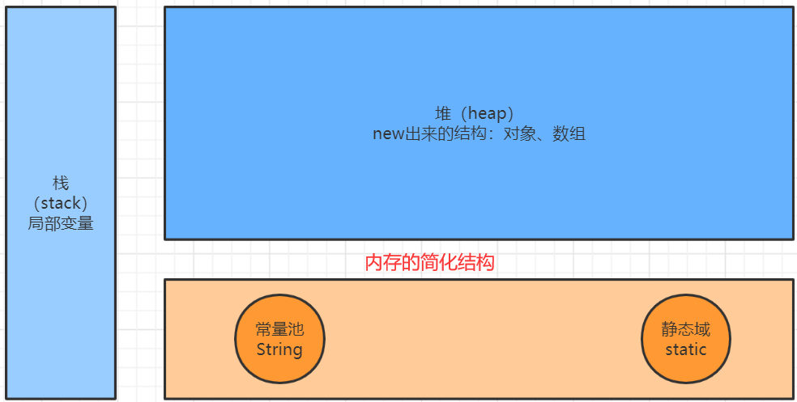

# 数组

## 01_数组的概述

定义：数组(Array)，是多个**相同类型数据**按**一定顺序排列**的集合，并使用**一个名字命名**，并通过**编号**的方式对这些数据进行统一管理。

概念：

1. 数组名
2. 下标（或索引）
3. 元素
4. 数组的长度：元素的个数

特点：

1. 数组是有序排列的
2. 数组本身是引用数据类型，而数组中的元素可以是**任何数据类型**，包括基本数据类型和引用数据类型。
3. 创建数组对象会在内存中开辟一整块**连续的空间**，而**数组名中引用的是这块连续空间的首地址**。
4. 数组的**长度一旦确定，就不能修改。**
5. 我们可以直接通过下标(或索引)的方式调用指定位置的元素，速度很快。

分类：

1. 按照维度：一维数组、二维数组、三维数组、…
2. 按照元素的数据类型分：基本数据类型元素的数组、引用数据类型元素的数组(即对 象数组)

## 02_一维数组的使用

需要注意的点：

1. 一维数组的声明和初始化
2. 如何调用数组指定位置的元素
3. 如何获取数组的长度
4. 如何遍历数组
5. 数组元素的默认初始化值
6. 数组的内存解析

> 一维数组的声明和初始化

- 静态初始化：在定义数组的同时就为数组元素分配空间并赋值。
- 动态初始化：数组声明且为数组元素分配空间与赋值的操作分开进行

```java
@Test
public void test() {
    int a;     // 声明
    a =10;	   // 初始化
    int b = 10;// 声明+初始化

    int[] ids; // 数组的声明
    // 1.静态初始化:数组的初始化和数组元素的赋值操作同时进行
    ids = new int[]{1,2,3,4};
	// 2.动态初始化:数组的初始化和数组元素的赋值操作分开进行
    String[] names = new String[4];
}
```

总结：数组一旦初始化完成，其长度就确定了

> 如何调用数组指定位置的元素

- 数组的索引是从0开始的到数组的长度-1结束

```java
names[0] = "宋嘉诚";
names[1] = "周杰伦";
names[2] = "周星驰";
names[3] = "李连杰";
System.out.println("names[0] = " + names[0]); // 宋嘉诚
```

>如何获取数组的长度

- 属性：length

```java
System.out.println("names.length = " + names.length);
System.out.println("ids.length = " + ids.length);
```

>如何遍历数组

```java
for (int i = 0; i < names.length; i++) {
    System.out.println("names[i] = " + names[i]);
}

for (String name : names) {
    System.out.println("name = " + name);
}
```

> 数组元素的默认初始化值

- 数组元素是整形：0
- 数组元素是浮点型：0.0
- 数组元素是char类型：0或uniquecode的表示'\u0000'而非'0'
- 数组元素是boolean型：false
- 数组元素是引用数据类型：null

```java
@Test
public void test2() {
    // 数组元素的默认初始化值
    int[] arr = new int[4];
    for (int i : arr) {
        System.out.println("i = " + i);	// 0 0 0 0
    }

    // 引用数据类型的默认初始值为null
    String[] strings = new String[5];
    if(strings[2]==null){
        System.out.println("strings[2]==null"); // strings[2]==null
    }
}
```

> 数组的内存解析

 


## 03_多维数组的使用

## 04_数组中涉及的常见算法

## 05_Arrays工具类的使用

## 06_数组使用中的常见异常

