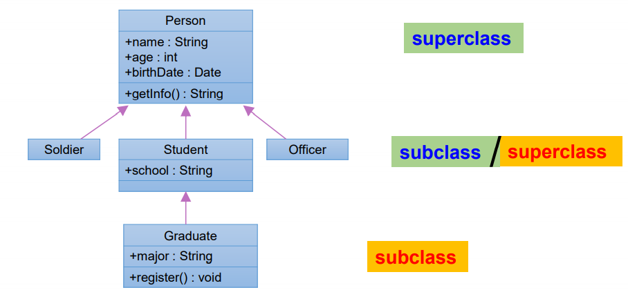
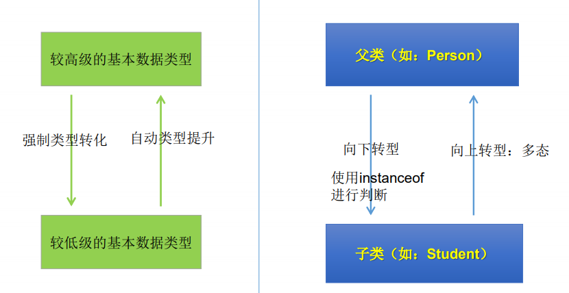
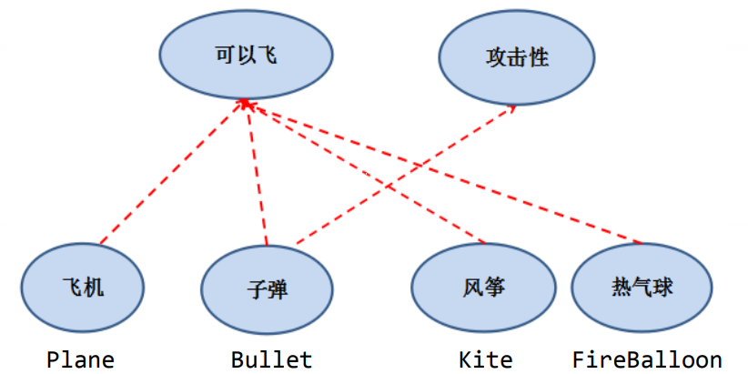

<!-- @import "[TOC]" {cmd="toc" depthFrom=1 depthTo=6 orderedList=false} -->

<!-- code_chunk_output -->

- [面向对象编程](#面向对象编程)
  - [01_面向过程与面向对象](#01_面向过程与面向对象)
    - [什么是面向对象的编程思想？](#什么是面向对象的编程思想)
    - [面向过程与面向对象](#面向过程与面向对象)
    - [面向对象的思想概述](#面向对象的思想概述)
  - [02_Java基本元素：类和对象](#02_java基本元素类和对象)
    - [面向对象的思想概述](#面向对象的思想概述-1)
    - [Java类及类的成员](#java类及类的成员)
    - [类的语法格式](#类的语法格式)
  - [03_对象的创建和使用](#03_对象的创建和使用)
    - [对象的创建和使用](#对象的创建和使用)
    - [匿名对象](#匿名对象)
    - [类和多个对象的关系](#类和多个对象的关系)
    - [类的访问机制](#类的访问机制)
    - [对象的内存解析](#对象的内存解析)
  - [04_类的成员之一：属性](#04_类的成员之一属性)
    - [基本使用](#基本使用)
    - [变量的分类](#变量的分类)
    - [成员变量赋初始化值](#成员变量赋初始化值)
    - [属性赋值过程](#属性赋值过程)
  - [05_类的成员之二：方法](#05_类的成员之二方法)
    - [什么是方法(`method`、函数):](#什么是方法method-函数)
    - [方法的声明格式](#方法的声明格式)
    - [方法的分类](#方法的分类)
    - [方法的基本概念](#方法的基本概念)
    - [对象数组的内存解析](#对象数组的内存解析)
  - [06_再谈方法](#06_再谈方法)
    - [方法的重载](#方法的重载)
    - [可变形参的方法](#可变形参的方法)
    - [方法参数的值传递机制（重点）](#方法参数的值传递机制重点)
    - [递归方法](#递归方法)
  - [07_OOP特征一：封装与隐藏](#07_oop特征一封装与隐藏)
    - [为什么需要封装？封装的作用和含义？](#为什么需要封装封装的作用和含义)
    - [封装性的体现](#封装性的体现)
    - [四种访问权限修饰符](#四种访问权限修饰符)
  - [08_类的成员之三：构造器（构造方法）](#08_类的成员之三构造器构造方法)
    - [构造器的特征](#构造器的特征)
    - [构造器的作用](#构造器的作用)
    - [构造器的语法格式](#构造器的语法格式)
    - [构造器说明](#构造器说明)
    - [构造器重载和互相调用的语法](#构造器重载和互相调用的语法)
    - [构造器私有化](#构造器私有化)
  - [09_关键字：this](#09_关键字this)
    - [参数和局部变量重名会怎样](#参数和局部变量重名会怎样)
    - [this是什么](#this是什么)
    - [使用this调用属性和方法](#使用this调用属性和方法)
    - [使用this调用本类构造器](#使用this调用本类构造器)
    - [实际使用](#实际使用)
  - [10_关键字：package、import](#10_关键字package-import)
    - [package说明](#package说明)
    - [包的作用](#包的作用)
    - [JDK中主要的包介绍](#jdk中主要的包介绍)
    - [import关键字](#import关键字)
  - [11_OOP特征二：继承性](#11_oop特征二继承性)
    - [初步认识继承](#初步认识继承)
    - [为什么要有继承](#为什么要有继承)
    - [继承的作用](#继承的作用)
    - [继承的规则](#继承的规则)
  - [12_方法的重写(override)](#12_方法的重写override)
    - [重写的定义](#重写的定义)
    - [重写方法举例](#重写方法举例)
  - [13_四种访问权限修饰符](#13_四种访问权限修饰符)
  - [14_关键字：super](#14_关键字super)
    - [super是什么](#super是什么)
    - [关键字super举例](#关键字super举例)
    - [使用super调用父类的构造器](#使用super调用父类的构造器)
    - [this和super的区别](#this和super的区别)
  - [15_子类对象实例化过程](#15_子类对象实例化过程)
  - [16_OOP特征三：多态性](#16_oop特征三多态性)
    - [什么是转型](#什么是转型)
    - [什么是多态性](#什么是多态性)
    - [多态性结论](#多态性结论)
    - [多态里更多的语法点](#多态里更多的语法点)
    - [虚拟方法调用](#虚拟方法调用)
    - [instanceof 操作符](#instanceof-操作符)
    - [对象类型转换 (Casting)](#对象类型转换-casting)
  - [17_Object类的使用](#17_object类的使用)
    - [Object类的理解](#object类的理解)
    - [Object类中的主要方法](#object类中的主要方法)
    - [clone()](#clone)
    - [finalize()](#finalize)
    - [getClass()](#getclass)
    - [equals(Object obj)](#equalsobject-obj)
    - [hashCode()](#hashcode)
    - [toString()](#tostring)
  - [18_包装类的使用](#18_包装类的使用)
    - [认识包装类](#认识包装类)
    - [装箱与拆箱](#装箱与拆箱)
    - [基本数据类型与字符串相互转换](#基本数据类型与字符串相互转换)
    - [基本类型、包装类、String类之间的装换](#基本类型-包装类-string类之间的装换)
    - [常见面试题](#常见面试题)
  - [19_关键字：static](#19_关键字static)
    - [关键字static是什么](#关键字static是什么)
    - [类属性、类方法的设计思想](#类属性-类方法的设计思想)
    - [static修饰变量(类变量)](#static修饰变量类变量)
    - [static修饰方法（类方法）](#static修饰方法类方法)
    - [static修饰代码块](#static修饰代码块)
    - [static修饰内部类](#static修饰内部类)
    - [实际开发使用static场景](#实际开发使用static场景)
    - [单例模式](#单例模式)
  - [20_理解main方法的语法](#20_理解main方法的语法)
  - [21_类的成员之四：代码块](#21_类的成员之四代码块)
    - [什么是代码块](#什么是代码块)
    - [静态代码块与非静态代码块](#静态代码块与非静态代码块)
    - [开发中代码块使用](#开发中代码块使用)
    - [类成员执行顺序](#类成员执行顺序)
  - [22_关键字：final](#22_关键字final)
    - [什么是final](#什么是final)
    - [final修饰类](#final修饰类)
    - [final修饰方法](#final修饰方法)
    - [final修饰变量](#final修饰变量)
    - [final修饰引用](#final修饰引用)
  - [23_抽象类与抽象方法](#23_抽象类与抽象方法)
    - [abstract关键字](#abstract关键字)
    - [思考](#思考)
    - [创建抽象类的匿名子类对象](#创建抽象类的匿名子类对象)
    - [模板方法的设计模式及使用场景](#模板方法的设计模式及使用场景)
  - [24_接口(interface)](#24_接口interface)
    - [接口概述](#接口概述)
    - [接口的定义与使用](#接口的定义与使用)
    - [创建接口匿名实现类的对象](#创建接口匿名实现类的对象)
    - [接口的应用之代理模式](#接口的应用之代理模式)
    - [接口的应用之工厂模式](#接口的应用之工厂模式)
    - [接口排错](#接口排错)
    - [Java8中关于接口的改进](#java8中关于接口的改进)
    - [接口和抽象类的区别](#接口和抽象类的区别)
  - [25_类的成员之五：内部类](#25_类的成员之五内部类)
    - [什么是内部类](#什么是内部类)
    - [内部类代码示例](#内部类代码示例)
    - [成员内部类](#成员内部类)
      - [什么是成员内部类](#什么是成员内部类)
      - [成员内部类区分调用外部类结构](#成员内部类区分调用外部类结构)
      - [如何实例化成员内部类对象](#如何实例化成员内部类对象)
      - [普通成员内部类](#普通成员内部类)
      - [静态成员内部类](#静态成员内部类)
    - [局部内部类](#局部内部类)
    - [匿名内部类](#匿名内部类)
    - [特殊类的总结](#特殊类的总结)
  - [26_扩展知识](#26_扩展知识)
    - [JavaBean](#javabean)
    - [UML类图](#uml类图)
    - [MVC设计模式](#mvc设计模式)
    - [IDEA单元测试](#idea单元测试)
    - [native关键字](#native关键字)
    - [类与类之间的关系说明](#类与类之间的关系说明)
      - [依赖关系（Dependency）](#依赖关系dependency)
      - [关联关系（Association）](#关联关系association)
      - [聚合（Aggregation）](#聚合aggregation)
      - [组合（Composite）](#组合composite)
      - [继承（Generalization，又称为泛化，is-a 的关系）](#继承generalization又称为泛化is-a-的关系)

<!-- /code_chunk_output -->


# 面向对象编程

学习面向对象内容的三条主线：

1. Java类及类的成员：属性、方法、构造器;代码块、内部类
2. 面向对象的三大特征：封装性、继承性、多态性、（抽象性）
3. 其它关键字：this、super、static、final、abstract、interface、package、import.....

学习的时候，发现自己可能处于以下几种状态：

1. 我不知道我自己不知道
2. 我知道我自己不知道
3. 我不知道我自己知道
4. 我知道我自己知道

目前第一种和第二种偏多，希望在以后的学习过程中，走向后两种状态。

## 01_面向过程与面向对象

### 什么是面向对象的编程思想？

首先解释一下“思想”。你想做个怎样的人？可能你会回答：我想做个好人，孝敬父母，尊重长辈，关爱亲朋…这就是思想。这是你做人的思想，或者说，是你做人的原则。 做人有做人的原则，编程也有编程的原则。这些编程的原则呢，就 是编程思想。

### 面向过程与面向对象

- 面向过程(POP:`Procedure Oriented Programming`) 与 面向对象(OOP:`Object Oriented Programming`)

  - 二者都是一种思想，面向对象是相对于面向过程而言的。面向过程，强调的是功能行为，以函数为最小单位，考虑怎么做。面向对象，将功能封装进对象，强调具备了功能的对象，以类/对象为最小单位，考虑谁来做。用英文单词来概括的话，面向过程就是**How**，面向对象就是**Who**;
  - 面向对象更加强调运用人类在日常的思维逻辑中采用的思想方法与原则，如 抽象、分类、继承、聚合、多态等。

- 面向对象的三大特征

  - 封装 (Encapsulation)
  - 继承 (Inheritance)
  - 多态 (Polymorphism)

- 举例：人把大象装进冰箱

  - 面向过程：强调的是功能行为，以函数为最小单位，考虑怎么做

    ```java
    1.打开冰箱
    2.把大象装进冰箱
    3.把冰箱门关住
    ```

  - 面向对象

    ````java
    人{
        打开(冰箱){
            冰箱.开门();
        }
        操作(大象){
            大象.进入(冰箱);
        }
        关闭(冰箱){ 
            冰箱.关门(); 
        }
    }
    
    冰箱{
        开门(){}
        关门(){}
    }
    
    大象{
        进入(冰箱){}
    }
    ````

### 面向对象的思想概述

程序员从面向过程的**执行者**转化成了面向对象的**指挥者**

面向对象分析方法分析问题的思路和步骤：

- 根据问题需要，选择问题所针对的**现实世界中的实体**。
- 从实体中寻找解决问题相关的属性和功能，这些属性和功能就形成了**概念世界中的类**。
- 把抽象的实体用计算机语言进行描述，形成**计算机世界中类的定义**。即借助某种程序 语言，把类构造成计算机能够识别和处理的数据结构。
- 将**类实例化成计算机世界中的对象**。对象是计算机世界中解决问题的最终工具。

## 02_Java基本元素：类和对象

### 面向对象的思想概述

- 类(`Class`)和对象(`Object`)是面向对象的核心概念。
  - 类是对一类事物的描述，是**抽象的**、概念上的定义
  - 对象是**实际存在**的该类事物的每个个体，因而也称为**实例**(`instance`)。
-  万事万物皆对象
- 人？比尔盖茨、乔布斯、刘强东、雷军。可以理解为：类 = 抽象概念的人；对象 = 实实在在的某个人
- 面向对象程序设计的重点是**类的设计**
- 类的设计，**其实就是类的成员的设计**

### Java类及类的成员

- 现实世界的生物体，大到鲸鱼，小到蚂蚁，都是由最基本的**细胞**构成的。同理，`Java`代码世界是由诸多个不同功能的**类**构成的。
- 现实生物世界中的细胞又是由什么构成的呢？细胞核、细胞质、… 那么， `Java`中用类`Class`来描述事物也是如此。常见的类的成员有：
  - **属性**：对应类中的成员变量
  - **行为**：对应类中的成员方法
- `Field` = 属性 = 成员变量 = 域  = 字段，`Method` = (成员)方法 = 函数

先初步看下类的构成：

```java
public class Person {
    // 属性，或成员变量
    String name;
    boolean isMarried;

    // 构造器
    public Person() {
    }

    public Person(String name, boolean isMarried) {
        this.name = name;
        this.isMarried = isMarried;
    }

    // 方法，或函数
    public void walk() {
        System.out.println("人走路");
    }

    // 代码块
    {
        name = "宋嘉诚";
        isMarried = false;
    }

    // 内部类
    class Pet{
        String name;
        String age;
    }
}
```

### 类的语法格式

```java
修饰符 class 类名 {
    属性声明;
    方法声明;
}
```

说明：修饰符`public`：类可以被任意访问 类的正文要用`{ }`括起来

1. 定义类（考虑修饰符、类名）
2. 编写类的属性（考虑修饰符、属性类型、属性名、初始化值）
3. 编写类的方法（考虑修饰符、返回值类型、方法名、形参等）

## 03_对象的创建和使用

`Java`类及类的成员已经好了；但是如何使用`Java`类？那就涉及`Java`类的实例化，即创建类的对象；

### 对象的创建和使用

创建对象语法： **类名 对象名 = new 类名();**

使用“**对象名.对象成员**”的方式访问对象成员（包括属性和方法）

```java
public class Zoo{
    public static void main(String args[]){
            // 创建对象
            Animal animal = new Animal();
            animal.legs = 4;// 访问属性
            System.out.println(animal.legs);
            animal.eat();// 访问方法
            animal.move();// 访问方法
    }
}
```

1. 创建类，设计类的成员
2. 创建类对象
3. 通过"对象.属性"或者"对象.方法"调用对象的结构

### 匿名对象

我们也可以不定义对象的句柄，而直接调用这个对象的方法。这的对象叫做匿名对象：例如`new Person().shout();`

使用情况：

1. 匿名对象只能调用一次。
2. 如果对一个对象只需要进行一次方法调用，那么就可以使用匿名对象。
3. 我们经常将匿名对象作为实参传递给一个方法调用。

```java
class Test{
    PhoneMall phoneMall = new PhoneMall();
	phoneMall.show(new Phone());	
}

class PhoneMall{
    public void show(Phone phone){
        phone.sendEmail();
        phone.call();
    }
}
```

### 类和多个对象的关系

如果创建了一个类的多个对象，对于类中定义的属性，每个对象都拥有各自的一套副本，且互不干扰。意味着，如果我们修改一个对象的属性A，不会影响另一个对象属性A的值。

### 类的访问机制

在一个类中的访问机制：类中的方法可以直接访问类中的成员变量。（例外：`static`方法访问非`static`，编译不通过。）

在不同类中的访问机制：先创建要访问类的对象，再用对象访问类中定义的成员。

### 对象的内存解析

先来简单的认识下`Java`内存空间：

我们都知道，`Java`是一门面向对象的高级语言，它不仅语法非常复杂，抽象程度也非常高，并不能直接运行在计算机硬件机器上。`Java`代码是运行在`Java`虚拟机上的。`Java`虚拟机(`Java Virtual Machine `简称`JVM`)是运行所有`Java`程序的抽象计算机，是`Java`语言的运行环境。

`Java`虚拟机在运行`Java`程序时，会管理着一块内存区域：运行时数据区。在运行时数据区里，会根据用途进行划分：

1. `Java`虚拟机栈（栈区）
2. 本地方法栈
3. `Java`堆（堆区）
4. 方法区
5. 程序计数器

 

-  堆（`Heap`），此内存区域的唯一目的 就是**存放对象实例**，几乎所有的对象实例都在这里分配内存。这一点在 `Java`虚拟机规范中的描述是：所有的对象实例以及数组都要在堆上分配。
- 通常所说的栈（`Stack`），是指虚拟机栈。虚拟机栈用于**存储局部变量（方法中的变量都是局部变量）**等。 局部变量表存放了编译期可知长度的各种基本数据类型（`boolean、byte、 char 、 short 、 int 、 float 、 long 、 double`）、对象引用（`reference`类型， 它不等同于对象本身，是对象在堆内存的首地址）。 方法执行完，自动释放。
- 方法区（`Method Area`），用于存储已被虚拟机加载的**类信息、常量、静态变量、即时编译器编译后的代码**等数据。

 

## 04_类的成员之一：属性

### 基本使用

语法格式：修饰符 数据类型 属性名 = 初始化值 ;

- 修饰符：
  - 常用的权限修饰符有：`private`、缺省、`protected`、`public`
  - 其他修饰符：`static`、`final `(暂不考虑)
- 数据类型：
  - 任何基本数据类型或任何引用数据类型。
- 属性名：
  - 属于标识符，符合命名规则和规范即可。

```java
public class Person{
    private int age; 			 // 声明private变量 age
    public String name = “Lila”; // 声明public变量 name
}
```

### 变量的分类

> 成员变量与局部变量

- 在方法体外，类体内声明的变量称为成员变量。
  - 实例变量：创建了类的多个对象，每个对象独立的拥有一套类中的非静态属性。当修改其中一个对象中的非静态属性时，不会导致其他对象中同样的属性值修改；
  - 静态变量：我们创建了类的多个对象，多个对象共享类的同一个静态变量。当通过某一个对象修改静态变量时，会导致其他对象调用此静态变量时，是修改过了的。（所以`final`走一波）
- 在方法体内部声明的变量称为局部变量。

 

- 注意：二者在初始化值方面的异同：
  - 同：都有生命周期，先声明后使用，变量都有其作用域
  - 异：局部变量除形参外，均需显式初始化

> 成员变量（属性）和局部变量的区别？

|              | 成员变量                         | 局部变量                                 |
| ------------ | -------------------------------- | ---------------------------------------- |
| 声明的位置   | 直接声明在类中 ，方法体外        | 方法形参或内部、代码块内、构造器内等     |
| 修饰符       | private、public、static、final等 | 不能用权限修饰符修饰，可以用final修饰    |
| 初始化值     | 有默认初始化值                   | 没有默认初始化值，必须显式赋值，方可使用 |
| 内存加载位置 | 堆空间 或 静态域内               | 栈空间                                   |

### 成员变量赋初始化值

对象属性的默认初始化赋值：

当一个对象被创建时，会对其中各种类型的**成员变量**自动进行初始化赋值。除了 基本数据类型之外的变量类型都是引用类型，如上面的Person及前面讲过的数组。

- `byte、short、int:0`
- `float:0.0f`
- `double:0.0`
- `char:0 或写为:’\u0000’(表现为空)`
- `boolean:false`
- `引用类型:null`

回过头来看这个赋初始化值的问题：构造方法执行前，会执行给局部变量赋初始值的操作。我们说过，所有的代码都必须在方法里，那么这种给成员变赋初始值的代码在哪个方法里？怎么看不到呢？我们模拟赋初始值的时候出现异常看看异常提醒是出现在哪里：

```java
public class Student {
    public String name;
    // 构造方法执行前，会执行给成员变量赋初始值的操作
    // 我们说过，所有的代码都必须在方法里，那么这种给成员变赋初始值的代码在哪个方法里？怎么看不到呢？
    // 我们模拟赋初始值的时候出现异常 看看异常提醒是出现在哪里
    public int age = 23/0;
}
```

```JAVA
Exception in thread "main" java.lang.ArithmeticException: / by zero
    at com.turning.oop01.code05.InitTest.<init>(InitTest.java:12)
    at com.turning.oop01.code05.InitTest.main(InitTest.java:15)
```

> 成员变量vs局部变量的内存位置

属性：加载到堆空间中（`static`修饰的属性在方法区中）

局部变量：加载到栈空间中

```java
class Person{//人类
    //1.属性
    String name;//姓名
    int age = 1;//年龄
    boolean isMale;//是否是男性
    public void show(String nation){
        //nation:局部变量
        String color;//color:局部变量
        color = "yellow";
    }
}
//测试类
class PersonTest{
    public static void main(String[] args){
        Person p = new Person();
        p.show(“USA”);
    }
}
```

 

### 属性赋值过程

截止到构造器篇章，我们学到了很多位置都可以对类的属性赋值。现总结这几个位置，并指明赋值的先后顺序：

赋值的位置：

1. 默认初始化：只在类中声明，但是不赋值；
2. 显式初始化：在类中声明属性的时候就赋值；/ 5.在代码块中初始化。看代码块和显示初始化的声明顺序。
3. 构造器中初始化；
4. 通过“对象.属性“或“对象.方法”的方式赋值；

赋值的先后顺序：1-2-3-4

注意：【强制】定义 DO/DTO/VO 等 POJO 类时，不要设定任何属性默认值。

 

## 05_类的成员之二：方法

### 什么是方法(`method`、函数):

- 方法是类或对象行为特征的抽象，用来完成某个功能操作。在某些语言中也称为函数或过程。

- 将功能封装为方法的目的是，可以实现代码重用，简化代码

- `Java`里的方法不能独立存在，**所有的方法必须定义在类里，所有的代码都必须在方法里**；

- 举例：

  ```java
  public class Person{
      private int age;
      public int getAge() { //声明方法getAge()
          return age; 
      }
      public void setAge(int i) { //声明方法setAge
          age = i; //将参数i的值赋给类的成员变量age
      }
  }
  ```

### 方法的声明格式

```java
修饰符 返回值类型 方法名（参数类型 形参1, 参数类型 形参2, ….）｛
    方法体程序代码
    return 返回值;
｝
```

- 修饰符：`public`,缺省,`private`,`protected`等
- 返回值类型：
  - 没有返回值：`void`
  - 有返回值，声明出返回值的类型。与方法体中`return 返回值`搭配使用
- 方法名：属于标识符，命名时遵循标识符命名规则和规范，“见名知意”
- 形参列表：可以包含零个，一个或多个参数。多个参数时，中间用`,`隔开
- 返回值：方法在执行完毕后返还给调用它的程序的数据。

### 方法的分类

|        | 无返回值                  | 有返回值                          |
| ------ | ------------------------- | --------------------------------- |
| 无形参 | void 方法名（）{}         | 返回值的类型 方法名（）{}         |
| 有形参 | void 方法名（形参列表）{} | 返回值的类型 方法名（形参列表）{} |

### 方法的基本概念

1. 方法的调用： 方法通过方法名被调用，且只有被调用才会执行。方法被调用一次，就会执行一次

2. 方法调用的过程分析

    

3. 没有具体返回值的情况，返回值类型用关键字`void`表示，那么方法体中可以不必使用``return`语句。如果使用，仅用来结束方法。

4. 定义方法时，方法的结果应该返回给调用者，交由调用者处理。

5. 方法中只能调用方法或属性，特殊的，方法A中又调用方法A，称为递归方法。不可以在方法内部定义方法。

6. `return`的作用：①结束方法②针对有返回值的方法，使用`return data`结束方法的同时返回所要的数据，`return`关键字后面不能再有语句

### 对象数组的内存解析

定义类`Student`，包含三个属性：学号`number(int)`，年级`state(int)`，成绩 `score(int)`。 创建20个学生对象，学号为1到20，年级和成绩都由随机数确定。 

问题一：打印出3年级(state值为3）的学生信息。 

问题二：使用冒泡排序按学生成绩排序，并遍历所有学生信息

提示：

 1) 生成随机数：`Math.random()`，返回值类型`double`; 

 2) 四舍五入取整：`Math.round(double d)`，返回值类型`long`。

```java
public class ObjArrayTest {
    public static void main(String[] args) {
        Student[] students = new Student[20];
        for (int i = 0; i < students.length; i++) {
            students[i] = new Student();
            students[i].number = i + 1;
            // 年级[1,6]
            students[i].state = (int) (Math.random() * (6 - 1 + 1) + 1);
            // 成绩[0,100]
            students[i].score = (int) (Math.random() * 100 + 1);
        }

        // 遍历学生数组
        for (Student student : students) {
            if (student.state == 3) {
                System.out.println("students = " + student);
            }
        }

        // 冒泡排序
        for (int i = 0; i < students.length - 1; i++) {
            for (int j = 0; j < students.length - i - 1; j++) {
                if (students[j].score > students[j + 1].score) {
                    // 如果需要换序，交换的是数组的元素，也就是学生对象
                    Student temp = students[j];
                    students[j] = students[j + 1];
                    students[j + 1] = temp;
                }
            }
        }

        // 再次遍历
        for (Student student : students) {
            System.out.println("students = " + student);
        }
    }
}

class Student {
    int number;
    int state;
    int score;

    @Override
    public String toString() {
        return "Student{" +
            "number=" + number +
            ", state=" + state +
            ", score=" + score +
            '}';
    }
}
```

 

## 06_再谈方法

### 方法的重载

> 为什么有方法重载机制？

业务背景：不同的场景，不同的购买方法，有重复，但是逻辑又明显不一样，怎么办？

> 什么是方法签名？

方法签名∶方法名+依次参数类型。注意，**返回值不属于方法签名**。方法签名是一个方法在一个类中的唯一标识；

为什么返回值不属于方法签名呢？因为返回值不能帮助确定调用哪个方法，例如：

```java
// Java允许直接调用方法不声明返回值
fun(1,2);
fun(1,2);
```

>重载的概念：

一个类中如果定义了名字相同，签名不同的方法，就叫做方法的重载；也就是在同一个类中，允许存在一个以上的同名方法，只要它们的参数个数或者参数类型不同即可。

实际上，像这种补充一些缺省的参数值，然后调用重载的方法，是重载的一个重要的使用场景。使用重载方法，可以为编程带来方便。

```java
public double buy(int count) { 
    return buy(count, false);
}
```

```java
public void println(byte x);
public void println(short x);
public void println(int x);
public void println(long x);
public void println(float x);
public void println(double x);
public void println(char x);
public void println(double x);
public void println();
```

> 重载的特点：

与返回值类型无关，只看参数列表，且参数列表必须不同。(参数个数或参数类型)。调用时，根据方法参数列表的不同来区别。

> 重载的参数匹配规则

1. 方法调用的时候，参数就不必完全类型一样，**对于数字类型的参数，实参数可以自动类型转换成形参类型即可；**

2. 重载的特殊之处是，参数满足自动自动类型转换的方法有好几个，重载的规则是选择最"近"的去调用

   ```java
   public double buy(double count){
       System.out.println("buy(double)被调用了");
   }
   
   public double buy() {
       System.out.println("buy()被调用了");
   }
   
   public double buy(int count) {
       System.out.println("buy(int)被调用了");
   }
   
   public double buy(int count, boolean isVIP) {
       System.out.println("buy(int,boolean)被调用了");
   }
   ```

   ```java
   byte countForOverride  = 1;
   merchandise.buy(countForOverride);
   // buy(int)被调用了
   // buy(int,boolean)被调用了
   
   short countForOverride  = 1;
   merchandise.buy(countForOverride);
   // buy(int)被调用了
   // buy(int,boolean)被调用了
   
   int countForOverride  = 1;
   merchandise.buy(countForOverride);
   // buy(int)被调用了
   // buy(int,boolean)被调用了
   
   long countForOverride  = 1;
   merchandise.buy(countForOverride);
   // buy(double)被调用了
   
   float countForOverride  = 1;
   merchandise.buy(countForOverride);
   // buy(double)被调用了
   
   double countForOverride  = 1;
   merchandise.buy(countForOverride);
   // buy(double)被调用了
   ```

### 可变形参的方法

`JavaSE 5.0` 中提供了`Varargs(variable number of arguments)`机制，允许直接定义能和多个实参相匹配的形参。从而，可以用一种更简单的方式，来传递个数可变的实参。

```JAVA
// JDK 5.0以前：采用数组形参来定义方法，传入多个同一类型变量
public static void test(int a ,String[] books);
// JDK5.0：采用可变个数形参来定义方法，传入多个同一类型变量
public static void test(int a ,String… books);
```

1. 声明格式：方法名(参数的类型名 ...参数名)
2. 可变参数：方法参数部分指定类型的参数个数是可变多个：0个，1个或多个
3. 可变个数形参的方法与同名的方法之间，彼此构成重载
4. 可变参数方法的使用与方法参数部分使用数组是一致的`show(String ... args)`等价于`show(String[] args)`，二者不能共存
5. 方法的参数部分有可变形参，需要放在形参声明的最后
6. 在一个方法的形参位置，最多只能声明一个可变个数形参

### 方法参数的值传递机制（重点）

看下之前的疑问：现在都明白了

 

- 方法，必须由其所在类或对象调用才有意义。若方法含有参数

  - 形参：方法声明时的参数
  - 实参：方法调用时实际传给形参的参数值

- `Java`的实参值如何传入方法呢？

  `Java`里方法的参数传递方式**只有一种：值传递**。 即将实际参数值的副本 （复制品）传入方法内，而参数本身不受影响。**值传递机制：**

  - 形参是基本数据类型：将实参基本数据类型变量的“数据值”传递给形参
  - 形参是引用数据类型：将实参引用数据类型变量的“地址值”传递给形参

- 内存图解参数为基本数据类型

   

- 内存图解参数为引用数据类型

   

练习：

```java
class Value {
    int i = 15;
}
public class TransferTest {
    public static void main(String args[]) {
        TransferTest test = new TransferTest();
        test.first();
    }
    public void first() {
        int i = 5;
        Value v = new Value();
        v.i = 25;
        second(v, i);
        System.out.println(v.i);		// 20
    }
    public void second(Value v, int i) {
        i = 0;
        v.i = 20;
        Value val = new Value();
        v = val;
        System.out.println(v.i + " " + i);	// 15 0
    }
}
```

  

> 例题一：貌似考查参数传递

```java
public class Test{
    public static void main(String[] args){
        int a = 10;
        int b = 10;
        method(a,b); // 需要在method方法被调用后,仅打印出a = 100,b = 200,请写出method()方法的代码
        System,out.println("a = "+a);
        System,out.println("b = "+b);
    }
}
```

方法一：

```java
public static void method(int a,int b){
    a = a * 10;
    b = b * 20;
    System,out.println("a = "+a);
    System,out.println("b = "+b);
    System.exit(0);
}
```

方法二：

```java
public static void method(int a,int b){
    PrintStream ps = new PrintStream(System.out){
        @Override
        public void println(String x){
            if("a=10".equales(x)){
                x = "a=100";
            }else if("b=10".equales(x)){
                x = "b=100";
            }
            super.printlx(x);
        };
        System.setOut(ps);
    }
}
```

> 例题二：

定义一个`int`型的数组：`int[] arr = new int[]{12,3,3,34,56,77,432}; `让数组的每个位置上的值去除以首位置的元素，得到的结果，作为该位置上的新值。遍历新的数组。

错误写法：这样第一个12/12首元素变为1之后，其他都是除以1

```java
for(int i= 0；i < arr.length;i++){
    arr[i] = arr[i] / arr[0];
}
```

方式一：倒着来

```java
for(int i = arr.length – 1;i >= 0;i--){
    arr[i] = arr[i] / arr[0];
}
```

方式二：取出首元素

```java
int temp = arr[0];
for(int i= 0；i < arr.length;i++){
    arr[i] = arr[i] / temp;
}
```

> 例题三

```java
int[] arr = new int[]{1,2,3};
System.out.println(arr);//地址值? 是 println(Object)
char[] arr1 = new char[]{'a','b','c'};
System.out.println(arr1); //地址值? 否 abc 
```

`println(char[])`方法

### 递归方法

- **递归方法：一个方法体内调用它自身。**

- 方法递归包含了一种隐式的循环，它会重复执行某段代码，但这种重复执行无须循环控制。

- 递归一定要向已知方向递归，否则这种递归就变成了无穷递归，类似于死循环。

- **递归一定要有出口**

- 计算1-100之间所有自然数的和

  ```java
  public int getSum(int num){
      if(num == 1){
          return 1;
      }else{
          return num + getSum(num - 1);
      }
  }
  ```

- 递归求阶乘(n!)的算法

  ```java
  public int getSum(int num){
      if(num == 1){
          return 1;
      }else{
          return num * getSum(num - 1);
      }
  }
  ```

- 已知有一个数列：`f(0) = 1,f(1) = 4,f(n+2)=2*f(n+1) + f(n)`,其中`n`是大于`0 `的整数，求`f(10)`的值。

  ```java
  public int fun(int n){
      if(n==0){
          return 1;
      }else if(n==1){
          return 4;
      }else{
          // return f(n+2)=2*f(n+1); 错误,越来越大，栈溢出
          // 换元法，另n = n - 2
          return 2 * f(n-2+1)+f(n-2);
      }
  }
  ```

- 已知一个数列：`f(20) = 1,f(21) = 4,f(n+2) = 2*f(n+1)+f(n)`, 其中`n`是大于`0`的整数，求`f(10)`的值。

  ```java
  public int fun(int n){
      if(n==20){
          return 1;
      }else if(n==21){
          return 4;
      }else{
          // return f(n+2)=2*f(n+1); 错误,越来越大，栈溢出
          // 换元法，另n = n - 2
          return 2 * f(n-2+1)+f(n-2);
      }
  }
  ```

- 输入一个数据`n`，计算斐波那契数列(`Fibonacci`)的第`n`个值 `1 1 2 3 5 8 13 21 34 55 `规律：一个数等于前两个数之和，要求：计算斐波那契数列(`Fibonacci`)的第n个值，并将整个数列打印出来

  ```java
  public int fun(int n){
      if(n==1 || n==2){
          return 1;
      }else {
          return fun(n-1)+fun(n-2);
      }
  }
  ```


> 总结

百度面试， 双重递归调用的问题：

```java
public class RecursionTest {
    @Test
    public void binomial(){
        recursion(10);
    }

    public static int count = 0;

    public static int recursion(int k) {
        count++;
        System.out.println("count = " + count);
        System.out.println("k = " + k);
        if (k <= 0) {
            return 0;
        }
        return recursion(k - 1) + recursion(k - 2);
    }
}
```

分析：用小一点的4来看

 

这不恰好是二叉树吗！而且是前序遍历！！这就是递归图，把递归放到一个平面上来思考，会容易很多。答案就是完全二叉树的节点数。

## 07_OOP特征一：封装与隐藏

### 为什么需要封装？封装的作用和含义？

这两个问题在初学时一直困惑着我，当时只觉得为成员变量生成`get/set`方法就是封装，现在回想下，这只是封装性的体现，并不等同于封装性。

- 我要用洗衣机，只需要按一下开关和洗涤模式就可以了。有必要了解洗衣机内 部的结构吗？有必要碰电动机吗？
- 我要开车，…

我们程序设计追求"高内聚，低耦合"：

- 高内聚 ：类的内部数据操作细节自己完成，不允许外部干涉；
- 低耦合 ：仅对外暴露少量的方法用于使用。

隐藏对象内部的复杂性，只对外公开简单的接口。便于外界调用，从而提 高系统的可扩展性、可维护性。通俗的说，**把该隐藏的隐藏起来，该暴露 的暴露出来。这就是封装性的设计思想。**

### 封装性的体现

使用者对类内部定义的属性（对象的成员变量）的直接操作会导致数据的错误、混乱或安全性问题。如下代码所示：

```java
class Animal {
    // 腿的个数
    public int legs;
    public void eat(){
        System.out.println("Eating");
    }
    public void move(){
        System.out.println("Moving.");
    }
}
public class Zoo {
    public static void main(String args[]) {
        Animal animal = new Animal();
        animal.legs = 4;
        System.out.println(animal.legs);
        animal.eat();
        animal.move();
    }
}
```

这段程序有什么问题呢？问题：`xb.legs = -1000`；应该将`legs`属性保护起来， 防止乱用。**保护的方式：信息隐藏**

`Java`中通过将数据声明为私有的(`private`)，再提供公共的（`public`） 方法：`getXxx()`和`setXxx()`实现对该属性的操作，以实现下述目的：

- **隐藏**一个类中不需要对外提供的实现细节；
- 使用者只能通过事先定制好的**方法来访问数据**，可以方便地加入控制逻辑， 限制对属性的不合理操作；
- 便于修改，增强代码的可维护性；

```java
class Animal {
    private int legs;// 将属性legs定义为private，只能被Animal类内部访问
    public void setLegs(int i) { 
        if (i != 0 && i != 2 && i != 4) {
            System.out.println("Wrong number of legs!");
            return;
        }
        legs = i;
    }
    public int getLegs() {
        return legs;
    }
}
public class Zoo {
    public static void main(String args[]) {
        Animal animal = new Animal();
        animal.setLegs(4); // animal.setLegs(-1000);
        // animal.legs = -1000; // 非法
        System.out.println(animal.getLegs());
    }
}
```

问题的引入：当我们创建一个类的对象以后，我们可以通过"对象﹒属性"的方式，对对象的属性进行赋值。这里，赋值操作要受到属性的数据类型和存储范围的制约。除此之外，没有其他制约条件。但是，在实际问题中，我们往往需要给属性赋值加入额外的限制条件。这个条件就不能在属性声明时体现，我门只能通过方法进行限制条件的添加。(比如：`setLegs`)。同时，我们需要避免用户再使用"对象.属性"的方式对属性进行赋值。则需要将属性声明为私有的`(private)`。此时，针对于属性就体现了封装性。

> 封装性的其他体现

- 如上，私有化成员变量，提供公开的访问和设置方法
- 不对外暴露的私有方法，例如一个方法中的子方法是`private`修饰的
- 单例模式，私有化构造器
- 如果不希望类在包外被调用，可以将类设置为缺省的

### 四种访问权限修饰符

`Java`权限修饰符`public`、`protected`、(缺省)、`private`置于类的成员定义前， 用来限定对象对该类成员的访问权限。

| 修饰符    | 类内部 | 同一个包 | 不同包的子类 | 同一个工程 |
| --------- | ------ | -------- | ------------ | ---------- |
| public    | YES    | YES      | YES          | YES        |
| protected | YES    | YES      | YES          |            |
| (缺省)    | YES    | YES      |              |            |
| private   | YES    |          |              |            |

四种权限可以用来修饰类的内部结构：属性、方法、构造器、内部类；

对于`class`的权限修饰只可以用`public`和`default`(缺省)：

1.  public类可以在任意地方被访问。
2. default类只可以被同一个包内部的类访问。

## 08_类的成员之三：构造器（构造方法）

构造器又叫构造方法，很多人称之为特殊的方法，但是不要误认为它是方法的一种，它与方法还是不一样的：

1. 格式不同，这是次要的
2. 功能不同，这才是主要的，方法是功能的封装，对象取调用；构造器是造对象的；

### 构造器的特征

- 它具有与类相同的名称
- 它不声明返回值类型。（与声明为void不同）
- 不能被`static、final、synchronized、abstract、native`修饰，不能有 `return`语句返回值

### 构造器的作用

**创建对象；**

**给对象进行初始化（初始化对象的属性）**

- 如：`Order o = new Order(); Person p = new Person(“Peter”,15);`
- 如同我们规定每个“人”一出生就必须先洗澡，我们就可以在“人”的 构造器中加入完成“洗澡”的程序代码，于是每个“人”一出生就会自动完成“洗澡”，程序就不必再在每个人刚出生时一个一个地告诉他们 要“洗澡”了。

### 构造器的语法格式

```java
修饰符 类名 (参数列表) {
    初始化语句；
} 
```

举例：创建Animal类的实例：`Animal a = new Animal();`调用构造器，将`legs`初始化为4。

```java
public class Animal {
    private int legs;
    // 构造器
    public Animal() {
        legs = 4;
    } 
    public void setLegs(int i) {
        legs = i;
    }
    public int getLegs() {
        return legs;
    }
}
```

### 构造器说明

根据参数不同，构造器可以分为如下两类：

1. 隐式无参构造器（系统**默认**提供）
2. **显式**定义一个或多个构造器（无参、有参）

注意：

1. Java语言中，每个类都至少有一个构造器
2. 默认构造器的修饰符与所属类的修饰符一致
3. 一旦显式定义了构造器，则系统不再提供默认构造器
4. 一个类可以创建多个重载的构造器
5. 父类的构造器不可被子类继承
6. OOP规约：【强制】构造方法里面禁止加入任何业务逻辑，如果有初始化逻辑，请放在 init 方法中。
7. 构造方法无法被点操作符调用或者在普通方法里调用，只能通过 new 语句在创建对象的时候，间接调用。
8. 理解一下为什么构造方法不能有返回值，因为有返回值也没有意义，new 语句永远返回的是创建出来的对象的引用

### 构造器重载和互相调用的语法

> 构造器重载

构造器一般用来创建对象的同时初始化对象。如：

```java
class Person{
    String name;
    int age;
    public Person(String n , int a) { 
        name=n; 
        age=a;
    }
}
```

构造器重载使得对象的创建更加灵活，方便创建各种不同的对象：（比如每次创建对象的时候都要执行40行代码，不可能每个构造器都去冗余这40行代码，可以将40行代码抽出为公共方法，每个构造器进行引入；还可以放在一个构造器中，其他构造器调用这个构造器）

```java
public class Person{
    public Person(String name, int age, Date d) {this(name,age);…}
    public Person(String name, int age) {…}
    public Person(String name, Date d) {…}
    public Person(){…}
}
```

构造器重载，参数列表**必须不同**

>互相调用的语法（结合后续篇章this）

1. 在构造方法里才能调用重载的构造方法，语法为this(实参列表)；

2. 在构造方法里才能调用重载的构造方法时，必须是方法的第一行。后面可以继续有代码；

   ```java
   @ToString
   public class OverloadConstructor {
       private String name;
       private Integer age;
   
       public OverloadConstructor(Integer age) {
           this.age = age;
           System.out.println("创建了对象...");
       }
   
       public OverloadConstructor(String name, Integer age) {
           // 在构造方法里才能调用重载的构造方法，语法为this(实参列表)；必须是方法的第一行。后面可以继续有代码;
           this(age);
           this.name = name;
           System.out.println("创建了对象...");
       }
   }
   
   public class OverloadConstructorTest {
       public static void main(String[] args) {
           OverloadConstructor overloadConstructor = new OverloadConstructor("SJC", 23);
           System.out.println("overloadConstructor = " + overloadConstructor);
           // 创建了对象...
           // 创建了对象...
           // overloadConstructor = OverloadConstructor{name='SJC', age=230}
       }
   }	
   ```

3. 构造方法不能自己调用自己，这会是一个死循环。

4. 在调用重载的构造方法时，不可以使用成员变量。因为用语意上讲，这个对象还没有被初始化完成，处于中间状态。

   ```java
   @ToString
   public class OverloadConstructor {
       private String name;
       private Integer age;
       private Integer id;
   
       public OverloadConstructor(Integer age) {
           this.age = age;
           System.out.println("创建了对象...");
       }
   
       public OverloadConstructor(String name, Integer age) {
           // 在调用重载的构造方法时，不可以使用成员变量。因为用语意上讲，这个对象还没有被初始化完成，处于中间状态。
           this(id * 10);
           this.name = name;
           System.out.println("创建了对象...");
       }
   }
   ```

### 构造器私有化

在讲解本操作之前，首先来观察如下的程序：

```java
// 定义一个类
class Singleton { 
    // 系统在这里会生成一个默认的无参构造方法
    // 定义一个成员方法
    public void print() {
        System.out.println("Hello World .") ;
    }
}
public class Test {
    public static void main(String args[]) {
        Singleton inst = null ;   	// 声明对象
        inst = new Singleton() ;    // 实例化对象
        inst.print() ;         		// 调用方法
    }
}
```

在以上的程序之中，`Singleton`类里面是存在构造方法的（因为如果一个类之中没有明确的定义一个构造方法的话，则会自动生成一个无参的，什么都不做的构造方法），但是下面要将构造方法改变一下：

```java
// 定义一个类
class Singleton { 
    // 构造方法私有化
    private Singleton() {} 
    // 定义一个成员方法
    public void print() {
        System.out.println("Hello World .") ;
    }
}
```

现在发现在实例化`Singleton`类对象的时候，程序出现了编译错误，因为构造方法被私有化了，无法在外部调用，即：无法在外部实例化`Singleton`类的对象。

那么现在就需要思考：在保证`Singleton`类之中的构造方法不修改不增加，以及`print()`方法不修改的情况下，如何操作，才可以让类的外部通过实例化对象再去调用`print()`方法？

1. **思考过程一**：使用`private`访问权限定义的操作只能被本类所访问，外部无法调用，那么现在既然构造方法被私有化了，就证明，这个类的构造方法只能被本类所调用，即：现在在本类之中产生本类实例化对象。

   ```java
   class Singleton { // 定义一个类
       Singleton instance = new Singleton() ;	// 思考点一
       private Singleton() {}   // 构造方法私有化
       public void print() {
           System.out.println("Hello World .") ;
       }
   }
   ```

2. **思考过程二：**对于一个类之中的普通属性，默认情况下一定要在本类存在了实例化对象之后才可以进行调用，可是现在在Singleton类的外部无法产生实例化对象，那么必须想一个办法，让`Singleton`类中的`instance`属性可以在没有`Singleton`类实例化对象的时候来进行调用，可以使用`static`完成，`static`定义的属性特点：由类名称直接调用，并且在没有实例化对象的时候也可以调用。

   ```java
   class Singleton { // 定义一个类
       static Singleton instance = new Singleton() ;
       private Singleton() {}   // 构造方法私有化
       public void print() {
           System.out.println("Hello World .") ;
       }
   }
   public class Test {
       public static void main(String args[]) {
           Singleton inst = null ;  	  // 声明对象
           inst = Singleton.instance ;    // 实例化对象
           inst.print() ;         		 // 调用方法
       }
   }
   ```

3. **思考过程三：**类之中的全部属性都应该封装，所以以上的`instance`属性应该进行封装，而封装之后要想取得属性要编写`getter`方法，只不过这个时候的`getter`方法应该也由类名称直接调用，定义为`static`型。

   ```java
   class Singleton { // 定义一个类
       private static Singleton instance = new Singleton() ;
       private Singleton() {}  // 构造方法私有化
       public void print() {
           System.out.println("Hello World .") ;
       }
       public static Singleton getInstance() {
           return instance ;
       }
   }
   public class Test {
       public static void main(String args[]) {
           Singleton inst = null ;  			  // 声明对象
           inst = Singleton.getInstance() ;    	// 实例化对象
           inst.print() ;        				 // 调用方法
       }
   }
   ```

4. **思考过程四：**这样做的目的？此时程序之中的`instance`属性，属于`static`，那么表示所有`Singleton`类的对象，不管有多少个都共同拥有同一个`instance`属性，那么既然是有同一个，那么又有什么意义呢？

5. **思考过程五：**这时做一个总结性简单的思考：如果说现在一个类只希望有唯一的一个实例化对象出现，应该控制构造方法，如果构造方法对外部不可见了，那么现在肯定无法执行对象的实例化操作，必须将构造方法隐藏，使用`private`隐藏。既然清楚了这个目的，不过本程序依然有一个问题：

   ```java
   public static Singleton getInstance() {
       instance = new Singleton() ;
       return instance ;
   }
   ```

   本操作语法没有错误，也不需要考虑是否有意义，但是现在的代码是允许这样做的，而这样做发现之前表示唯一一个实例化对象的所有努力就白费了，那么必须想办法废除掉这种做法，可以在定义`instance`的时候增加一个`final`关键字：

   ```java
   class Singleton { // 定义一个类
       private static final Singleton INSTANCE = new Singleton() ;
       private Singleton() {}   // 构造方法私有化
       public void print() {
           System.out.println("Hello World .") ;
       }
       public static Singleton getInstance() {
           return INSTANCE ;
       }
   }
   public class Test {
       public static void main(String args[]) {
           Singleton inst = null ;  			 // 声明对象
           inst = Singleton.getInstance() ;        // 实例化对象
           inst.print() ;     				    // 调用方法
       }
   }
   ```

这样的设计在设计模式上讲就称为单例设计模式（`Singleton`），面试经常会让我们写单例模式并说出其特点：

特点：构造方法被私有化，只能够通过`getInstance()`方法取得`Singleton`类的实例化对象，这样不管外部如何操作，最终也只有一个实例化对象，在单例设计模式之中，一定会存在一个`static`方法，用于取得本类的实例化对象。

对于单例设计模式，在日后的开发之中，只会用到此概念，但是具体的代码很少去编写。

> 说到单例模式，顺便说下多例模式：

单例设计模式只留有一个类的一个实例化对象，而多例设计模式，会定义出多个对象，例如：定义一个表示星期X的类，这个类的对象只有7个取值，定义一个表示性别的类，只有2个取值，定义一个表示颜色基色的操作类，颜色只有三个：红、绿、蓝，这种情况下，这样的类就不应该由用户无限制的去创造实例化对象，应该只使用有限的几个，这个就属于多例设计，但不管是单例设计还是多例设计，有一个核心不可动摇 ——构造方法私有化。

## 09_关键字：this

### 参数和局部变量重名会怎样

- 参数和方法的局部变量重名会报错，`Variable xxx is already defined in the scope`，也就是在这个区域内已经被定义过了
- 参数和成员变量重名，不会报错，隐藏了`this`自引用，当使用成员变量时，是使用`this`自指针来访问，我们省略掉了而已

使用`this`：访问局部变量的完整形态：方法访问成员变量都是通过`this`自引用来访问的，方法中能用哪些数据？能用参数、能用局部变量、能用`this`自引用，所有成员变量的访问都是通过`this`自引用来进行的。访问一个成员变量的完整形态，是"this.成员变量的名字"

### this是什么

- 在`Java`中，`this`关键字比较难理解，它的作用和其词义很接近：
  - 它在方法内部使用，即这个方法所属对象的引用；
  - 它在构造器内部使用，表示该构造器正在初始化的对象；
- `this` 可以调用当前类的属性、方法和构造器
- 什么时候使用`this`关键字呢？**当在方法内需要用到调用该方法的对象时，就用this。**
  - 具体的：我们可以用`this`来区分**属性**和**局部变量**。比如：`this.name = name;`

### 使用this调用属性和方法

```java
class Person{ // 定义Person类
    private String name ;
    private int age ;
    public Person(String name,int age){
        this.name = name ; 
        this.age = age ; 
    }
    public void getInfo(){
        System.out.println("姓名：" + name) ;
        this.speak();
    }
    public void speak(){
        System.out.println(“年龄：” + this.age);
    }
}
```

1. 在任意方法或构造器内，如果使用当前类的成员变量或成员方法可以在其前面添加`this`， 增强程序的阅读性。不过，通常我们都习惯省略`this`；
2. 当形参与成员变量同名时， 如果在方法内或构造器内需要使用成员变量，必须添加`this`来表明该变量是类的成员变量 ；
3. 使用`this`访问属性和方法时， 如果在本类中未找到，会从父类中查找；

### 使用this调用本类构造器

1. `this`可以作为一个类中构造器相互调用的特殊格式；
2. 可以在类的构造器中使用"this(形参列表)"的方式，调用本类中重载的其他的构造器；
3. 明确：构造器中不能通过"this(形参列表)"的方式调用自身构造器；
4. 如果一个类中声明了n个构造器，则最多有 n - 1个构造器中使用了 "this(形参列表)"，也就是不能形成闭环；
5. "this(形参列表)"必须声明在类的构造器的首行！
6. 在类的一个构造器中，最多只能声明一个"this(形参列表)"

```java
class Person{ // 定义Person类
    private String name ;
    private int age ;
    public Person(){ // 无参构造器
        System.out.println("新对象实例化") ;
    }
    public Person(String name){
        this(); // 调用本类中的无参构造器
        this.name = name ;
    }
    public Person(String name,int age){
        this(name) ; // 调用有一个参数的构造器
        this.age = age;
    }
    public String getInfo(){
        return "姓名：" + name + "，年龄：" + age ;
    } 
}
```

`HashMap`源码：

```java
public HashMap(int initialCapacity) {
    this(initialCapacity, DEFAULT_LOAD_FACTOR);
}
```

### 实际使用

```java
@Data
public class Girl{
    private int age;

    // 比较两个对象的大小,实际上是按照对象中的某个属性或者某些属性进行比较:正数-当前对象大、0-一样大、负数-当前对象小
    public int compare(Girl gril){
        if(this.age > girl.age){
            return 1;
        }else if(this.age<girl.age){
            return -1;
        }else{
            return 0;
        }
    }

    // 优化
    public int compare(Girl gril){
        return this.age - girl.age;
    }
}
```

## 10_关键字：package、import

### package说明

- `package`语句作为`Java`源文件的第一条语句，指明该文件中定义的类所在的包。(若缺省该语句，则指定为无名包)。它的格式为：package 顶层包名.子包名 ;

  举例：pack1\pack2\PackageTest.java

  ```java
  package pack1.pack2; // 指定类PackageTest属于包pack1.pack2
  public class PackageTest{
      public void display(){
          System.out.println("in method display()");
      }
  }
  ```

- 包对应于文件系统的目录，`package`语句中，用 “.” 来指明包(目录)的层次；

- 包通常用小写单词标识。通常使用所在公司域名的倒置：`com.jiecheng.study`

### 包的作用

1. 包帮助管理大型软件系统：将功能相近的类划分到同一个包中。比如：**MVC**的设计模式
2. 包可以包含类和子包，划分项目层次，便于管理
3. 解决类命名冲突的问题
4. 控制访问权限

### JDK中主要的包介绍

1. java.lang：包含一些Java语言的核心类，如String、Math、Integer、 System和 Thread，提供常用功能
2. java.net：包含执行与网络相关的操作的类和接口。 
3. java.io ：包含能提供多种输入/输出功能的类。 
4. java.util：包含一些实用工具类，如定义系统特性、接口的集合框架类、使用与日期日历相关的函数。 
5. java.text：包含了一些java格式化相关的类
6. java.sql：包含了java进行JDBC数据库编程的相关类/接口
7. java.awt：包含了构成抽象窗口工具集（abstract window toolkits）的多个类，这些类被用来构建和管理应用程序的图形用户界面(GUI)。**B/S C/S**

### import关键字

1. 为使用定义在不同包中的`Java`类，需用`import`语句来引入指定包层次下所需要的类 或全部类(`.*`)。`import`语句告诉编译器到哪里去寻找类

2. 语法格式：import 包名. 类名;

3. 应用举例：

   ```java
   import pack1.pack2.Test; // import pack1.pack2.*;表示引入pack1.pack2包中的所有结构
   public class PackTest{
       public static void main(String args[]){
           Test t = new Test(); // Test类在pack1.pack2包中定义
           t.display();
       }
   }
   ```

注意：

1. 在源文件中使用import显式的导入指定包下的类或接口
2. 声明在包的声明和类的声明之间。 
3. 如果需要导入多个类或接口，那么就并列显式多个import语句即可 
4. 举例：可以使用java.util.*的方式，一次性导入util包下所有的类或接口。 
5. 如果导入的类或接口是java.lang包下的，或者是当前包下的，则可以省略此import语句。 
6. 如果在代码中使用不同包下的同名的类。那么就需要使用类的全类名的方式指明调用的是哪个类。 
7. 如果已经导入java.a包下的类。那么如果需要使用a包的子包下的类的话，仍然需要导入。 
8. import static组合的使用：调用指定类或接口下的静态的属性或方法

## 11_OOP特征二：继承性

### 初步认识继承

为描述和处理个人信息，定义类`Person`:

 

```java
class Person {
    public String name;
    public int age;
    public Date birthDate;
    public String getInfo() {
        //...
    }
}
```

为描述和处理学生信息，定义类`Student`:

 

```java
class Student {
    public String name;
    public int age;
    public Date birthDate;
    public String school;
    public String getInfo() {
        // ...
    }
}
```

通过继承，简化`Student`类的定义：

  

```java
class Person {
    public String name;
    public int age;
    public Date birthDate;
    public String getInfo() {
        // ...
    }
}
class Student extends Person {
    public String school;
}
```

后续扩展：

 

### 为什么要有继承

多个类中存在相同属性和行为时，将这些内容抽取到单独一个类中， 那么多个类无需再定义这些属性和行为，只要继承那个类即可。

1. 此处的多个类称为**子类(派生类)**，单独的这个类称为**父类(基类或超类)**。可以理解为:“**子类 is a 父类”**
2. 类继承语法规则：`class Subclass extends SuperClass{ }`

### 继承的作用

> 代码设计层面作用

1. 继承的出现减少了代码冗余，提高了代码的复用性。
2. 继承的出现，更有利于功能的扩展。
3. 继承的出现让类与类之间产生了关系，提供了多态的前提。

注意：

1. 不要仅为了获取其他类中某个功能而去继承

2. 多组合少继承（Java 不支持多继承、组合让测试更容易、现有设计模式辅证、继承不利于封装、组合更具灵活性）

   https://blog.csdn.net/zhaizu/article/details/52573866

> 代码层面作用

1. 子类继承了父类，就继承了父类的方法和属性。
2. 在子类中，可以使用父类中定义的方法和属性，也可以创建新的数据和方法。
3. 在Java 中，继承的关键字用的是“**extends**”，即子类不是父类的子集， 而是对父类的“**扩展**”。

### 继承的规则

1、子类不能直接访问父类中私有的（`private`）的成员变量和方法。

 

注意，父类中声明私有的成员变量或方法，子类继承父类后，仍然认为获取到了父类中私有结构只是因为封装性的影响，使得子类不能直接调用父类而已，可以通过`get/set`的方式访问。

在之前的学习过程中，对这点一直有一个疑问：**父类private修饰属性子类如何引用？**现在再回过头来看，一切都清楚了。

  

2、Java**只支持单继承和多层继承**，不允许多重继承

- 一个子类只能有一个父类：`class SubDemo extends Demo{ } //ok`，`class SubDemo extends Demo1,Demo2...//error`

- 一个父类可以派生出多个子类

- 子父类是相对的概念

- 子类直接继承的父类，称为直接父类；子类间接继承的父类称为简介父类。

- 子类继承父类以后，就获取了直接父类以及所有间接父类中声明的属性和方法。

   

- 单继承与多层继承举例

   

3、假如B class继承了A class，并覆盖了其funA方法，C class继承了B class，那么在C中调用super.funA()是调用B的funA还是A的funA呢？

B class的funA，距离最近的那个，继承链上最近的那个

## 12_方法的重写(override)

重写才是继承的精髓和中级奥义：子类可以在自己的类中对父类的方法做覆盖，覆盖的方法要加@Override注解说明，覆盖也就是对父类方法的特殊化，覆盖掉父类的方法。覆盖可以覆盖掉父类的方法。同一个方法，不同的行为。这，就是多态！

### 重写的定义

定义：在子类中可以根据需要对从父类中继承来的方法进行改造，也称为方法的重置、覆盖。在程序执行时，子类的方法将覆盖父类的方法。

要求：

1. 子类重写的方法**必须**和父类被重写的方法具有相同的**方法名称**、**参数列表**
2. 子类重写的方法的返回值类型**不能大于**父类被重写的方法的返回值类型（这是对引用数据类型而言的，基本数据类型必须一致）
3. 子类重写的方法使用的访问权限**不能小于**父类被重写的方法的访问权限（子类不能重写父类中声明为private权限的方法）
4. 子类方法抛出的异常不能大于父类被重写方法的异常

注意：

1. 子类与父类中同名同参数的方法必须同时声明为非`static`的(即为重写)，或者同时声明为 `static`的（不是重写）。因为`static`方法是属于类的，子类无法覆盖父类的方法。

### 重写方法举例

> 例一

```java
public class Person {
    public String name;
    public int age;
    public String getInfo() {
        return "Name: "+ name + "\n" +"age: "+ age;
    }
}
public class Student extends Person {
    public String school;
    @override
    public String getInfo() { //重写方法
        return "Name: "+ name + "\nage: "+ age 
            + "\nschool: "+ school;
    }
}
public class Test{
    public static void main(String args[]){
        Student s1 = new Student();
        s1.name = "Bob";
        s1.age = 20;
        s1.school = "school2";
        System.out.println(s1.getInfo()); //Name:Bob age:20 school:school2
    }
}
```

分析：这是一种“**多态性**”：同名的方法，用不同的对象来区分调用的是哪一个方法。

```java
Person p1 = new Person();
// 调用Person类的getInfo()方法
p1.getInfo();
Student s1 = new Student();
//调用Student类的getInfo()方法
s1.getInfo();
```

> 例二

```java
class Parent {
    public void method1() {}
}
class Child extends Parent {
    //非法，子类中的method1()的访问权限private比被覆盖方法的访问权限public小,应大于父类方法的访问权限
    private void method1() {} 
}
```

## 13_四种访问权限修饰符

`Java`权限修饰符`public`、`protected`、(缺省)、`private`置于类的成员定义前， 用来限定对象对该类成员的访问权限。

| 修饰符    | 类内部 | 同一个包 | 不同包的子类 | 同一个工程 |
| --------- | ------ | -------- | ------------ | ---------- |
| public    | YES    | YES      | YES          | YES        |
| protected | YES    | YES      | YES          |            |
| (缺省)    | YES    | YES      |              |            |
| private   | YES    |          |              |            |

四种权限可以用来修饰类的内部结构：属性、方法、构造器、内部类；

对于`class`的权限修饰只可以用`public`和`default`(缺省)：

1.  public类可以在任意地方被访问。
2.  default类只可以被同一个包内部的类访问。

## 14_关键字：super

### super是什么

使用场景：

1. 父类和子类声明相同的方法（例如方法名相同），此时子类不想用自己重写的方法，还想用父类中的方法，必须显示使用`super`
2. 例如父类中声明了一个属性为`id`意为身份证号，子类中也声明了属性为`id`意为学号，此时想用父类的`id`，必须显示使用`super`

在`Java`类中使用`super`来调用父类中的指定操作：`super`可以理解为：父类的

1. super可用于访问父类中定义的属性
2. super可用于调用父类中定义的成员方法
3. super可用于在子类构造器中调用父类的构造器

注意：

1. 尤其当子父类出现同名成员时，可以用`super`表明调用的是父类中的成员
2. `super`的追溯不仅限于直接父类
3. `super`和`this`的用法相像，`this`代表本类对象的引用，`super`代表父类的内存空间的标识

### 关键字super举例

```java
class Person {
    String name = "张三"; 
    protected int age;
    public String getInfo() {
        return "Name: " + name + "\nage: " + age;
    }
}

class Student extends Person {
    protected String name = "李四";
    private String school = "New Oriental";
    public String getSchool() {
        return school;
    }
    public String getInfo() {
        return super.getInfo() + "\nschool: " + school;
    }
}

public class StudentTest {
    public static void main(String[] args) {
        Student st = new Student();
        System.out.println(st.getInfo());
    }
}
```

### 使用super调用父类的构造器

1. 子类中所有的构造器**默认**都会访问父类中**空参数**的构造器（所以一般设计类的时候（无参构造、有参构造、序列化、get/set都是必不可少的））
2. 当父类中没有空参数的构造器时，子类的构造器必须通过**this(参数列表)**语句指定调用本类或者**super(参数列表)**语句指定调用父类中相应的构造器。同时，只能”二选一” ，且必须放在构造器的首行
3. 如果子类构造器中既未显式调用父类或本类的构造器，且父类中又没有无参的构造器，则**编译出错**
4. 在类的多个构造器中，至少有一个类的构造器中使用了"super(形参列表)"，调用父类的构造器 
5. 构造器首行this和super只能二选一并且必须二选一，如果在一个构造器首行没有显示的写this(形参列表)和super(形参列表)，默认就是super(空参)

> 例一

 

此时：父类属性也可以使用`private`修饰

```java
public class Test {
    public static void main(String[] args) {
        Student student = new Student("1");
    }
}
```

> 例二

```java
public class Person {
    private String name;
    private int age;
    private Date birthDate;
    public Person(String name, int age, Date d) {
        this.name = name;
        this.age = age;
        this.birthDate = d;
    }
    public Person(String name, int age) {
        this(name, age, null);
    }
    public Person(String name, Date d) {
        this(name, 30, d);
    }
    public Person(String name) {
        this(name, 30);
    }
}
```

```java
public class Student extends Person {
    private String school;
    public Student(String name, int age, String s) {
        super(name, age);
        school = s;
    }
    public Student(String name, String s) {
        super(name);
        school = s;
    }
    // 编译出错: no super(),系统将调用父类无参数的构造器。
    public Student(String s) { 
        school = s;
    }
}
```

### this和super的区别

| No   | 区别点     | this                                                     | super                                    |
| ---- | ---------- | -------------------------------------------------------- | ---------------------------------------- |
| 1    | 访问属性   | 访问本类中的属性，如果本类没有此属性则从父类中继续查找   | 直接访问父类中的属性                     |
| 2    | 调用方法   | 访问本类中的方法，如果本类没有此方法则从父类中继续查找   | 直接访问父类中的方法                     |
| 3    | 调用构造器 | 调用本类构造器，必须放在构造器的首行，用于本类构造器重载 | 调用父类构造器，必须放在子类构造器的首行 |

## 15_子类对象实例化过程

 

 

 

子类对象实例化全过程：

1. 从结果上来看（继承性）：子类继承父类以后，就获取了父类中声明的属性或方法。创建子类的对象，在堆空间中，就会加载所有父类中声明的属性；

2. 从过程上来看：当我们通过子类的构造器创建子类对象时，我们一定还会直接或间接的调用其父类的构造器，进而调用父类的父类构造器，直到调用到了`java.lang.Object`类中空参的构造器为止。正因为加载过所有的父类结构，所以才可以看到内存中有父类的结构，子类对象才可以考虑进行调用。

   明确：虽然创建子类对象时调用了父类构造器，但是自始至终就创建过一个对象，即为new的子类对象。

思考：

1. 为什么super(...)和this(...)调用语句不能同时在一个构造器中出现？因为两者都必须在首行
2. 为什么super(...)和this(...)调用语句只能作为构造器中的第一句出现？无论哪个构造器创建子类对象的时候，需要保证先初始化父类。目的是为了当子类继承父类之后，"继承"父类中所有的属性和方法，因此子类有必要知道父类如何为对象进行初始化。

## 16_OOP特征三：多态性

理解多态性：可以理解为一个事物的多种形态

何为多态性：父类的引用指向子类的实例.

一句话描述多态规则：可以调用哪些方法，取决于引用类型（编译期）。具体调用哪个方法，取决于实例所属的类是什么（运行期）

为什么有多态：提高了代码的通用性，常称作接口重用；减少了重载方法的编写；

多态的使用：虚拟方法调用

多态的使用前提：类的继承关系、方法的重载

多态的实际使用场景：接口化编程中（抽象类、接口不能实例化）、`Object`类的`equals`方法的形参为`Object`类型、获取数据库驱动连接可以使用父类兼容市面不同厂商。

多态是编译时行为还是运行时行为？运行时行为。

### 什么是转型

- 向上转型：`Person person = new Student();`人 = 学生，子类可看做是特殊的父类，所以父类类型的引用可以指向子类的对象。


- 向下转型：`Student student = (Student)person;`学生 = 人


- 没有转型：`A a = new A();`


1. 在实际的工作之中，对象的向上转型为主要使用，80%，向上转型之后，所有的方法以父类的方法为主，但是具体的实现，还是要看子类是否覆写了此方法；
2. 向下转型，10%，因为在进行向下转型操作之前，一定要首先发生向上转型，以建立两个对象之间的联系，如果没有这种联系，是不可能发生向下转型的，一旦发生了运行中就会出现“ClassCastException”，当需要调用子类自己特殊定义方法的时候，才需要向下转型；
3. 不转型，10%，在一些资源较少的时候，例如：移动开发。

> 前提条件

`class Student extends Person`

`class Student implements Person`

> 注意

1. 父类引用可以指向子类对象，子类引用不可以指向父类的对象（因为父类并没有子类的属性和方法呀）
2. 可以调用的方法，是受引用类型决定的；**引用类型决定了能进行那些操作，实际执行的是指向对象中的内容**	
3. 子类引用不可以指向父类的对象，如果类型不对，会出错。就像是小可以转大，大不能转小，可以说学生是人，不能说人是学生，就像之前学习的基本数据类型，会丢失精度！`Student studnet = (Student)person;`

### 什么是多态性

1、多态性在`Java`中的体现：

- 对象的多态性：**父类的引用指向子类的对象**（可以直接应用在抽象类和接口上）

- 子类可看做是特殊的父类，所以父类类型的引用可以指向子类的对象：向上转型(upcasting)。

- 在`Java`中，子类的对象可以替代父类的对象使用

  - 一个变量只能有一种确定的数据类型
  - 一个引用类型变量可能指向(引用)多种不同类型的对象

  ```java
  Person p = new Student();	// Person类型的变量p，指向Student类型的对象
  Object o = new Person();	// Object类型的变量o，指向Person类型的对象
  o = new Student(); 			// Object类型的变量o，指向Student类型的对象
  ```

2、`Java`引用变量有两个类型：编译时类型和运行时类型。编译时类型由声明该变量时使用的类型决定，运行时类型由实际赋给该变量的对象决定。简称：编译时，看左边；运行时，看右边。

- 若编译时类型和运行时类型不一致，就出现了对象的多态性(Polymorphism)
- 多态情况下
  -  "看左边" ：看的是父类的引用（父类中不具备子类特有的方法）。编译期只能调用父类中声明的方法。
  - "看右边" ：看的是子类的对象（实际运行的是子类重写父类的方法）。运行期实际执行的是子类重写父类的方法。

3、一个引用类型变量如果声明为父类的类型，但实际引用的是子类对象，那么该变量就**不能**再访问子类中扩展的属性和方法。因为属性是在编译时确定的，编译时引用为父类类型，没有子类新扩展成员变量，因而将会编译错误。

### 多态性结论

1. 可以调用哪些方法，取决于引用类型。具体调用哪个方法，取决于实例所属的类是什么
2. 无论一个方法是使用哪个引用被调用的，"它都是在实际的对象上执行的"。执行的任何一个方法，都是这个对象所属的类的方法。
3. 如果没有，就去父类找，再没有，就去父类的父类找，依次寻找，直到找到。
4. 引用指向的实例对象，不管引用是什么类型的，最后操作的方法，都是取决于实例对象有什么方法，本类没有再去父类找，本类（子类）优先。
5. 换个角度理解。我们一直说子类里有一个（特殊的）父类的对象。这时候，这个特殊的父类的对象里的this自引用，是子类的引用。
6. 那么自然的，即使是在继承自父类的代码里，去调用一个方法，也是先从子类开始，一层层继承关系的找。
7. 这也是Java选择单继承的重要原因之一。在多继承的情况下，如果使用不当，多态可能会非常复杂，以至于使用的代价超过其带来的好处。


1. 覆盖是多态里最重要的一种形式
2. 虽然是用的父类的引用指向的不同类型的对象，调用getName方法时，实际执行的方法取决于对象的类型，而非引用的类型
3. 也就是说，能调用哪些方法，是引用决定的，具体执行哪个类的方法，是引用指向的对象决定的。
4. 这就是覆盖的精髓。覆盖是多态的一种，是最重要的一种。
5. 以getName为例，父类里有这个方法，所以肯定都可以调用，但是Phone覆盖了父类的getName方法。
6. 之前我们使用子类的引用指向子类的对象，调用子类里覆盖父类的方法，比如getName，执行的是子类的getName方法，我们觉得很自然。这里变换的是，我们用父类的引用指向子类的对象，调用被子类覆盖的方法，实际执行的还是子类里的getName方法。


1. 勿忘初心：程序的执行就是找到要执行的代码，并且知道执行的代码能访问哪些数据，数据从哪里来。多态的核心问题就是：要调用哪个类的哪个方法，这个方法用到的数据（this 引用）是谁。
2. 对象的多态性中，成员变量不具备多态，只看引用变量所声明的类（编译和运行都只看左边）

### 多态里更多的语法点

静态多态：重载（Overload）

之前我们进行重载的时候都是使用int double这些基本的数据类型进行重载，现在我们使用带有继承关系的这种数据类型对方法进行重载：

```java
// 前提关系:Student extends Man extends Person
public void testPersonOverload(Person person) {
    System.out.println("参数为person被调用了");
}

public void testPersonOverload(Man man) {
    System.out.println("参数为man被调用了");
}

public void testPersonOverload(Student student) {
    System.out.println("参数为student被调用了");
}

public void testPersonOverload(String str) {
    System.out.println("参数为str被调用了");
}
```

**重载调用哪个方法，和参数的引用类型相关，和引用实际指向的类型无关：**

```java
overloadTest.testPersonOverload(person);
overloadTest.testPersonOverload((Man) person);
overloadTest.testPersonOverload((Student) person);
overloadTest.testPersonOverload("");
```

引用本身是null没关系，确定调用哪个方法只需要引用的类型。这叫做静态多态。即在编译期就知道该调用哪个方法：

```java
// 甚至是个null也可以，但是要用强制类型转换，告诉Java这个类型是什么，否则找不到一个唯一的方法去调用
person = null;
overloadTest.testPersonOverload(person);
overloadTest.testPersonOverload((Max) person);
overloadTest.testPersonOverload((Student) person);
overloadTest.testPersonOverload("");
```

如果没有类型完全匹配的候选，则根据类型的继承关系往根节点撸。找到最贴近参数类型的那个方法：

```java
public void testPersonOverload(Person person) {
    System.out.println("参数为person被调用了");
}

public void testPersonOverload(Man man) {
    System.out.println("参数为man被调用了");
}

overloadTest.testPersonOverload((Student)null);	// 参数为man被调用了
```

总结：

1. 静态多态，调用的方法和参数实际指向的对象无关，只和引用本身的类型相关。
2. 因为调用时参数类型是确定的，所以，在编译期间就可以明确的知道哪个方法会被调用。如果有多种可能，则会有编译错误。
3. 动态多态：覆盖（Override）
4. 让重载的归重载，剩下的是覆盖的舞台

重载，是指允许存在多个同名方法，而这些方法的参数不同。编译器根据方法不同的参数表，对同名方法的名称做修饰。对于编译器而言，这些同名方法就成了 不同的方法。**它们的调用地址在编译期就绑定了。**Java的重载是可以包括父类 和子类的，即子类可以重载父类的同名不同参数的方法。 所以：对于重载而言，在方法调用之前，编译器就已经确定了所要调用的方法， **这称为“早绑定”或“静态绑定”；** 而对于多态，只有等到方法调用的那一刻，解释运行器才会确定所要调用的具体 方法，这称为**“晚绑定”或“动态绑定”**。 引用一句Bruce Eckel的话：**“不要犯傻，如果它不是晚绑定，它就不是多态。”**

### 虚拟方法调用

1、正常的调用：

```java
Person person = new Person();
person.getInfo();
Student student = new Student();
student.getInfo();
```

2、虚拟方法调用（多态情况下）：

子类中定义了与父类同名同参数的方法，在多态情况下，将此时父类的方法称为虚拟方法，父类根据赋给它的不同子类对象，动态调用属于子类的该方法。这样的方法调用在编译期是无法确定的。

```java
Person person = new Student();
person.getInfo(); // 调用Student类的getInfo()方法
```

3、编译时类型和运行时类型：

**动态绑定：**编译时`person`为`Person`类型，而方法的调用是在运行时确定的，所以调用的是`Student`类的`getInfo()`方法。

4、虚拟方法调用举例：

 


### instanceof 操作符

`instanceof`操作符：可以判断一个引用指向的对象是否是某一个类型或者子类，是则返回`true` 否则返回`false` 如果是`null`则肯定返回`false`；

使用场景一：强制类型转换时

这个使用场景就是，`Person person = new Student();`，有了对象的多态性以后，内存上实际上是加载了子类特有的属性和方法的，但是由于变量声明为父类类型，导致编译时只能调用父类中声明的的属性和方法，子类中特有的属性和方法父类引用是无法调用的。

那我们如何才能调用子类特有的方法或属性呢？ 

那么对编译器来讲看到的是`Student`类型，这里就用到了强制类型转换（向下转型）：

```java
Person person = new Student();
Student student = (Student) person;
person.study();
```

但是这样安全吗？有风险：`ClassCastException`，引出`instanceof`

```java
Person person = new Student();
if (person instanceof Student) {
    // 先判断 再强制类型转换，比较安全
    Student student = (Student) person;
    System.out.println("Yes");
} else {
    System.out.println("No");
}
```

### 对象类型转换 (Casting)

 

## 17_Object类的使用

### Object类的理解

1.  `Object`类是所有`Java`类的根父类
2. 如果我们没显式的声明一个类的父类的话，则此类继承于`java.lang.object`类
3. 所有的`Java`类（除`java.lang.object`类之外都直接或间接的继承于`java.lang.object`类。`IDEA`使用`Ctrl+H`可以看见类继承关系；
4. 意味着，所的`Java`类具`java.lang.object`类声明的功能
5. Objetc类中只有方法没有成员变量

### Object类中的主要方法

| 方法名称                                 | 类型                           | 描述                                                         |
| ---------------------------------------- | ------------------------------ | ------------------------------------------------------------ |
| public Object();                         | 构造                           | 构造器                                                       |
| public boolean equals(Object obj);       | 普通                           | 对象比较                                                     |
| public String toString();                | 普通                           | 返回对象的字符串表示形式                                     |
| public native int hashCode();            | 本地代码实现的，C或者C++实现的 | 返回对象的哈希码值。                                         |
| protected native Object clone();         | 本地代码实现的，C或者C++实现的 | 创建并返回此对象的副本。                                     |
| public final native Class<?> getClass(); | 本地代码实现的，C或者C++实现的 | 返回此 `Object`的运行时类。                                  |
| public final native void notify();       | 本地代码实现的，C或者C++实现的 | 唤醒正在等待对象监视器的单个线程。                           |
| public final native void notifyAll();    | 本地代码实现的，C或者C++实现的 | 唤醒正在等待对象监视器的所有线程                             |
| public final void wait();                | 普通                           | 导致当前线程等待，直到另一个线程调用该对象的 `notify()`方法或 `notifyAll()`方法。 |
| protected void finalize();               | 普通                           | 当垃圾收集确定不再有对该对象的引用时，垃圾收集器在对象上调用该对象。 |

### clone()

```java
public class CloneTest {
    public static void main(String[] args) {
        Body body = new Body(23);
        Student student1 = new Student("宋嘉诚", body);
        try {
            // 将student1 拷贝得到 student2
            Student student2 = (Student) student1.clone();
            System.out.println(student1 == student2);		// false
            student2.setName("周杰伦");
            System.out.println("student1 = " + student1);	// 23
            System.out.println("student2 = " + student2);	// 23
            body.setAge(22);
            System.out.println("student2 = " + student2);	// 22 变化了
        } catch (CloneNotSupportedException e) {
            e.printStackTrace();
        }
    }
}

@Data
@NoArgsConstructor
@AllArgsConstructor
class Student implements Cloneable {
    private String name;
    private Body body;

    @Override
    protected Object clone() throws CloneNotSupportedException {
        return super.clone();
    }
}

@Data
@AllArgsConstructor
class Body {
    private int age;
}
```

结论：

1. `student1==student2`打印false，说明`clone()`方法的确克隆出了一个新对象；
2. 修改值类型字段并不影响克隆出来的新对象，符合预期；
3. 但是如果修改了`student1`内部的引用对象，克隆对象`student2`也受到了波及，说明内部还是关联在一起的
4. 所以`clone()`方法是浅拷贝https://blog.csdn.net/weixin_39704971/article/details/110603843

### finalize()

首先看一下涉及垃圾回收的说明：

1. 垃圾回收机制只回收JVM堆内存里的对象空间。
2. 对其他物理连接，比如数据库连接、输入流输出流、Socket连接无能为力。
3. 现在的JVM有多种垃圾回收实现算法，表现各异。
4. 垃圾回收发生具有不可预知性，程序无法精确控制垃圾回收机制执行。
5. 可以将对象的引用变量设置为null，暗示垃圾回收机制可以回收该对象。
6. 程序员可以通过System.gc()或者Runtime.getRuntime().gc()来通知系统进行垃圾回收，会有一些效果，但是系统是否进行垃圾回收依然不确定。
7. 垃圾回收机制回收任何对象之前，总会先调用它的finalize方法（如果覆盖该方法，让一个新的引用变量重新引用该对象，则会重新激活对象）。
8. 永远不要主动调用某个对象的finalize方法，应该交给垃圾回收机制调用。

```java
public class FinalizeTest {
    public static void main(String[] args) {
        Person person = new Person("宋嘉诚");
        System.out.println("person = " + person);

        person = null;	// 此时对象实体就是垃圾对象，等待被回收。但时间不确定。
        System.gc();	// 强制性释放空间
    }
}

@Data
@AllArgsConstructor
class Person {
    private String name;

    @Override
    protected void finalize() throws Throwable {
        System.out.println("对象被释放--->" + this);
        super.finalize();
    }
}
```

### getClass()

后续反射中讲到，获取当前运行时类

### equals(Object obj)

> `==`运算符

1. 可以使用在基本数据类型变量和引用数据类型变量中

2. 如果比较的是基本数据类型变量：比较的是两个变量保存的数据是否相等（不一定类型要相同）

   如果比较的是引用数据类型变量：比较的是两个对象的地址值是否相同（即两个引用是否指向同一个对象实体）

3. 使用`==`时，必须保证符号左右两边的变量类型一致

> `equals()`方法

1. 是一个方法，而非运算符

2. 只能适用于引用数据类型

3. `Object`类中`equals()`的定义：和`==`的作用是相同的，比较的是两个对象的地址值是否相同（即两个引用是否指向同一个对象实体）

   ```java
   public boolean equals(Object obj) {
       return (this == obj);
   }
   ```

4. 像`String、Data、File、`包装类等都重写了`Object`类中的`equales()`方法，重写以后比较的不是两个引用的地址是否相同，而是比较的两个对象的"实体内容"是否相同。

   ```java
   public boolean equals(Object anObject) {
       if (this == anObject) {
           return true;
       }
       if (anObject instanceof String) {
           String anotherString = (String)anObject;
           int n = value.length;
           if (n == anotherString.value.length) {
               char v1[] = value;
               char v2[] = anotherString.value;
               int i = 0;
               while (n-- != 0) {
                   if (v1[i] != v2[i])
                       return false;
                   i++;
               }
               return true;
           }
       }
       return false;
   }
   ```

5. 通常情况下，我们自定义类如果使用`equals()`的话，也通常是比较两个对象的"试题内容"是否相同，我们就需要对Object中的equals()进行重写。重写的原则：比较两个对象的实体内容（即每一个属性或者关键属性）是否相同。

   真实开发中，使用`IDEA`自带的重写`equals()`方法，自动生成，或者使用`Lombok`中的`@Data`注解，他帮我们自动实现了`get/set/hash/equals/toString`方法。

   ```java
   @Override
   public boolean equals(Object o) {
       if (this == o) {
           return true;
       }
       if (!(o instanceof Emp)) {
           return false;
       }
       Emp emp = (Emp) o;
       return Objects.equals(name, emp.name);
   }
   ```

6. 任何情况下，x.equals(null)，永远返回是"false"

> `==`和`equals()`的区别

1. `== `既可以比较基本类型也可以比较引用类型。对于基本类型就是比较值，对于引用类型就是比较内存地址
2. `equals`的话，它是属于`java.lang.Object`类里面的方法，如果该方法没有被重写过默认也是`==`;我们可以看到`String`等类的`equals`方法是被重写过的，而且`String`类在日常开发中 用的比较多，久而久之，形成了`equals`是比较值的错误观点。
3. 具体要看自定义类里有没有重写`Object`的`equals`方法来判断。
4. 通常情况下，重写`equals`方法，会比较类中的相应属性是否都相等

> String比较的特殊之处

```java
String str1 = new String("abc");
String str2 = new String("abc");
System.out.println(str1 == str2);		// false,str1为一个引用,str2为另一个引用,对象的内容一样
System.out.println(str1.equals(str2))	// true,String重写了equals方法

String str1 = "abc";
String str2 = "abc";
System.out.println(str1 == str2);		// true,str1放在常量池中,str2从常量池中查找
System.out.println(str1.equals(str2))	// true,String重写了equals方法
    
String str1 = "aaabbb";
String str2 = "aaa" + "bbb";
System.out.println(str1 == str2);		// true,触发String的优化机制,因为此处aaa和bbb字符串不是特别长
System.out.println(str1.equals(str2))	// true
    
String str1 = input.nextLine();		// 输入一个很长的字符串
String str2 = input.nextLine();		// 复制上面这个字符串
System.out.println(str1 == str2);		// false,扰乱Java对String的优化
System.out.println(str1.equals(str2))	// true
```

### hashCode()

> hashCode介绍

`hashCode()` 的作用是获取哈希码，也称为散列码；它实际上是返回一个 int 整数。这个哈希码的作用是确定该对象在哈希表中的索引位置。`hashCode()`定义在 JDK 的 `Object` 类中，这就意味着 Java 中的任何类都包含有 `hashCode()` 函数。另外需要注意的是： `Object` 的 hashcode 方法是本地方法，也就是用 c 语言或 c++ 实现的，该方法通常用来将对象的 内存地址 转换为整数之后返回。

```java
public native int hashCode();
```

散列表存储的是键值对(`key-value`)，它的特点是：能根据"键"快速的检索出对应的"值"。这其中就利用到了散列码！（可以快速找到所需要的对象）

> 为什么要有hashCode

我们以"`HashSet` 如何检查重复"为例子来说明为什么要有 `hashCode`？

当你把对象加入 `HashSet` 时，`HashSet` 会先计算对象的 `hashCode`值来判断对象加入的位置，同时也会与其他已经加入的对象的 `hashCode`值作比较，如果没有相同的 `hashCode`，`HashSet` 会假设对象没有重复出现。但是如果发现有相同 `hashCode`值的对象，这时会调用 `equals()` 方法来检查 `hashCode`相等的对象是否真的相同。如果两者相同，`HashSet` 就不会让其加入操作成功。如果不同的话，就会重新散列到其他位置。（摘自我的 Java 启蒙书《Head First Java》第二版）。这样我们就大大减少了`equals`的次数，相应就大大提高了执行速度。

>为什么重写 `equals` 时必须重写 `hashCode` 方法？

如果不被重写（原生Object）的`hashCode`和`equals`是什么样的？

1. 不被重写（原生）的hashCode值是根据内存地址换算出来的一个值。
2. 不被重写（原生）的equals方法是严格判断一个对象是否相等的方法（object1 == object2）。

为什么需要重写`equals`方法？

1. 在我们的业务系统中判断对象时有时候需要的不是一种严格意义上的相等，而是一种业务上（"实体内容"）的对象相等。在这种情况下，原生的equals方法就不能满足我们的需求了。

为什么需要重写`hashCode`和`equals`方法？

1. `Object.hashCode`的通用约定（摘自《`Effective Java`》）：如果两个对象根据`equals(Object)`方法是相等的，那么调用这两个对象中任一个对象的`hashCode`方法必须产生同样的整数结果；
2. `hashCode()`的默认行为是对堆上的对象产生独特值。如果没有重写 `hashCode()`，则该 class 的两个对象无论如何都不会相等（即使这两个对象指向相同的数据）；
3. 比如`HashMap`和`HashSet`这些容器，他需要判断的是"实体内容"不一样才允许放置进入容器，但是如果不重写`hashCode()`方法，每个对象都有自己独一无二的`hashCode`，那么这个容器基本上不会有重复的元素，除非`hash`冲突；所以如果不重写hashCode的话可能导致`HashSet、HashMap`不能正常的运作。
4. 大大减少了`equals`的次数，相应就大大提高了执行速度。同样的 `hashcode` 有多个对象，它会使用 `equals()` 来判断是否真的相同。也就是说 `hashcode` 只是用来缩小查找成本。

什么时候需要重写`hashCode`和`equals`方法？

1. 如果我们将某个自定义对象存到HashMap或者HashSet及其类似实现类中作为Key的时候
2. 当我们要对两个对象进行比较的时候

### toString()

```java
public String toString() {
    return getClass().getName() + "@" + Integer.toHexString(hashCode());
}
```

1. 当我们输出一个对象的引用时，实际上就是调用当前对象的`toString()`方法。因为`print(obj)`底层调用的还是`obj.toString()`
2. 像`String、Date、File`、包装器类都重写了`Object`类中的`toString()`方法，使得在调用对象的`同String()`方法时，返回"实体内容"信息
3. 自定义类如果重写`toString()`时，当调用此方法时，返回对象的"实体内容"，用`IDEA`的就行。

## 18_包装类的使用

### 认识包装类

包装类英文名称为`Wrapper`，也叫封装类；为什么有了基本数据类型之后还要包装类呢？因为我们的面向对象的机制足够强大，但是基本数据类型又无法包含。也就是我们希望`Java`中的基本数据类型也具有类的特征。所以每个基本数据类型都对应了一个包装类。

- 针对八种基本数据类型定义相应的引用类型—包装类（封装类）
- 有了类的特点，就可以调用类中的方法，Java才是真正的面向对象

 

### 装箱与拆箱

- 装箱：基本数据类型包装成包装类的实例

  - 通过包装类的构造器实现：`int i = 500; Integer t = new Integer(i);`

  - 还可以通过字符串参数构造包装类对象：

    `Float f = new Float(“4.56”);`

    `Long l = new Long(“asdf”); //NumberFormatException`

    `Boolean b = new Boolean("true123");// fasle`

- 拆箱：获得包装类对象中包装的基本类型变量

  - 调用包装类的`.xxxValue()`方法：`boolean b = bObj.booleanValue();`

- JDK1.5之后，支持自动装箱与自动拆箱，但是类型必须匹配

  - 注意：自动拆箱时：`Integer a = null;int b = a;`会报错`cannot unbox null value`

### 基本数据类型与字符串相互转换

因为基本数据类型与包装类拥有自动装箱与拆箱的机制，所以我们把这两个看做是一个整体，去和字符串类型进行转换：

- 字符串转换成基本数据类型
  - 通过包装类的构造器实现：`int i = new Integer(“12”);`
  - 通过包装类的`parseXxx(String s)`静态方法：`Float f = Float.parseFloat(“12.1”);`
- 基本数据类型转换成字符串
  - 调用字符串重载的`valueOf()`方法：`String fstr = String.valueOf(2.34f);`
  - 更直接的方式：`String intStr = 5 + “”`

### 基本类型、包装类、String类之间的装换

 

> 结论

从字节码中，我们发现装箱其实就是调用了包装类的`valueOf()`方法，拆箱其实就是调用了 `xxxValue()`方法。

因此，

- `Integer i = 10` 等价于 `Integer i = Integer.valueOf(10)`
- `int n = i` 等价于 `int n = i.intValue()`;

### 常见面试题

1、如下两个题目输出结果相同吗？各是什么：三元运算符会自动类型提升！

```java
Object o1 = true ? new Integer(1) : new Double(2.0);
System.out.println(o1);	 // 1.0 因为编译时Double提升了精度
```

```java
Object o2;
if (true)
    o2 = new Integer(1);
else
    o2 = new Double(2.0);
System.out.println(o2); // 1
```

2、以下输出结果

```java
public void method1() {
    Integer i = new Integer(1);
    Integer j = new Integer(1);
    System.out.println(i == j);	// false 比较地址
    Integer m = 1;
    Integer n = 1;
    System.out.println(m == n);// true 自动装箱，常量池概念
    Integer x = 128;
    Integer y = 128;
    System.out.println(x == y);// false 相当于new了一个Integer对象
}
```

在`Integer`中有个内部类`IntegerCache`中有一个数组`Integer cache[]`存储了-128——127之间的数，因为我们在`Integer`的使用时对这个范围的数字用的很频繁，就考虑提升性能，于是提前加载好了。简单说就是， -127到127的数我给你提前造好了，可以直接使用数组中的元素，你直接拿到我造好的对象，我不新建了，所以两个包装1的对象实际上指向同一个对象。目的：提高效率。

## 19_关键字：static

### 关键字static是什么

当我们编写一个类时，其实就是在描述其对象的属性和行为，而并没有产生实质上的对象，只有通过`new`关键字才会产生出对象，这时系统才会分配内存空间给对象， 其方法才可以供外部调用。我们有时候希望无论是否产生了对象或无论产生了多少对象的情况下，**某些特定的数据在内存空间里只有一份**，例如所有的中国人都有个国家名称，每一个中国人都共享这个国家名称，不必在每一个中国人的实例对象中都单独分配一个用于代表国家名称的变量。

 

看一段代码：

```java
class Circle{
    private double radius;
    public Circle(double radius){
        this.radius=radius;
    }
    public double findArea(){
        return Math.PI*radius*radius;
    }
}
```

创建以上类的两个对象：

```java
Circle c1 = new Circle(2.0); //c1.radius=2.0
Circle c2 = new Circle(3.0); //c2.radius=3.0
```

- Circle类中的变量radius是一个实例变量(instance variable)，它属于类的每一个对象，不能被同一个类的不同对象所共享。
- 上例中c1的radius独立于c2的radius，存储在不同的空间。c1中的radius 变化不会影响c2的radius，反之亦然。

但是**如果想让一个类的所有实例共享数据，就用类变量！**

### 类属性、类方法的设计思想

设计思想：

- 类属性作为该类各个对象之间共享的变量。**在设计类时，分析哪些属性不因对象的不同而改变，将这些属性设置为类属性。相应的方法设置为类方法。**
- 如果方法与调用者无关，则这样的方法通常被声明为类方法，由于不需要创建对象就可以调用类方法，从而简化了方法的调用。

使用范围：

- 在`Java`类中，可用`static`修饰**属性、方法、代码块、内部类**

被修饰后的成员具备以下特点：

- 随着类的加载而加载，可以通过"类.静态变量"的方式调用
- 静态变量的加载优先于对象存在
- 由于类只会加载一次，则静态变量在内存中也只会存在一份，存在方法区的静态域中。
- 修饰的成员，被所有对象所共享
- 访问权限允许时，可不创建对象，直接被类调用

静态属性举例：

- System.out；
- Math.PI；

### static修饰变量(类变量)

类变量（类属性）由该类的所有实例共享

> 类变量应用举例一

```java
class Circle {
    private double radius;
    public static String name = "这是一个圆";
    public static String getName() {
        return name;
    }
    public Circle(double radius) {
        this.radius = radius;
    }
    public double findArea() {
        return Math.PI * radius * radius;
    }
    public void display() {
        System.out.println("name:" + name + "radius:" + radius);
    }
}

public class StaticTest {
    public static void main(String[] args) {
        Circle c1 = new Circle(2.0);
        Circle c2 = new Circle(3.0);
        c1.display();	// 这是一个圆,2.0
        c2.display();	// 这是一个圆,3.0
    }
}
```

> 类变量应用举例二

```java
class Chinese{
    String name;
    int age;
    static String nation;
}

class StaticTest{
    public static void main(String[] args) {
        Chinese c1 = new Chinese();
        c1.name = "姚明";
        c1.age = 34;
      	Chinese.nation = "CHN";
        
        Chinese c2 = new Chinese();
        c2.name = "姚明";
        c2.age = 34;
      	Chinese.nation = "CHINA";
        
        System.out.println(Chinese.nation);	// CHINA
    }
}
```

> 类变量应用举例三

```java
@toString
class Person { 
    private int id;
    public static int total = 0;
    public Person() {
        total++;
        id = total;
    }
}
```

```java
public class StaticDemo {
    public static void main(String args[]) {
        Person.total = 100; // 不用创建对象就可以访问静态成员
        // 访问方式：类名.类属性，类名.类方法
        System.out.println(Person.total);
        Person c = new Person();
        System.out.println(c.total); // 不应该通过类实例访问静态成员
        System.out.println(c);	// 101
    }
}
```

 

> 类变量 vs 实例变量内存解析

 

### static修饰方法（类方法）

- 随着类的加载而加载，可以用**类名.方法名()**的形式访问由`static`修饰的类方法。
- 在`static`方法内部只能访问类的`static`修饰的属性或方法，不能访问类的非`static`的结构。非静态方法无限制。
- 在静态方法里面，也可以自己创建对象，或者通过参数，获得对象的引用，进而调用方法和访问成员变量。
- `static`修饰的方法不能被重写。
- 因为不需要实例就可以访问`static`方法，因此`static`方法内部不能有`this`。(也不能有`super`)

### static修饰代码块

### static修饰内部类

### 实际开发使用static场景

编写一个类实现银行账户的概念，包含的属性有"帐号"、"密码"、"存款余额"、"利率"、"最小余额"，定义封装这些 属性的方法。账号要自动生成。 编写主类，使用银行账户类，输入、输出3个储户的上述信息。 考虑：哪些属性可以设计成`static`属性？

开发中如何确定一个属性是否要声明为`static`的？

1. 属性可以被多个对象所共享的，不会随着对象的不同而不同的。
2. 类中的常量也常声明为`static final`

开发中如何确定一个方法是否要声明为`static`的？

1. 操作静态属性的方法，通常设置为`static`的
2. 工具类中的方法，习惯上声明为`static`的，比如`Math、Arrays、Collections`

### 单例模式

认识单例模式之前，首先来看看什么是设计模式？

- 设计模式**是在大量的实践中总结和理论化之后优选的代码结构、编程风格、 以及解决问题的思考方式**。设计模免去我们自己再思考和摸索。就像是经典 的棋谱，不同的棋局，我们用不同的棋谱。**"套路"**。

什么是单例模式呢？

- 所谓类的单例设计模式，就是采取一定的方法保证在整个的软件系统中，对 **某个类只能存在一个对象实例**，并且该类只提供一个取得其对象实例的方法。 如果我们要让类在一个虚拟机中只能产生一个对象，我们首先必须将类的**构造器的访问权限设置为private**，这样，就不能用new操作符在类的外部产生类的对象了，但在类内部仍可以产生该类的对象。因为在类的外部开始还无法得到类的对象，只能**调用该类的某个静态方法**以返回类内部创建的对象， 静态方法只能访问类中的静态成员变量，所以，指向类内部产生的**该类对象的变量也必须定义成静态的**。
  - 构造器私有化，外部不能直接通过构造器实例化对象。
  - 只能在本类中进行实例化，因为类内部可以访问自己声明的private方法。`Singleton instance = new Singleton() ;`
  - 其他类无法生成本类对象，即无法通过对象调用属性，使用`static`修饰，可以使用类名调用。
  - 体现封装性，属性用`private`修饰的同时，提供公共访问的`public getInstance()`方法也需要用`static`修饰。
  - 此时最后一步，用`final`关键字修饰属性，代表不可被赋值。并且不能出现`set`方法。

> 饿汉式单例模式

```java
public class HungrySingleton{
    private static HungrySingleton SINLETON  = new HungrySingleton();
    
    private HungrySingleton(){}
    
    public static HungrySingleton getInstance(){
		return SINLETON;
    }
}
```

那下面这种写法呢？

```java
public class HungrySingleton{
    public static HungrySingleton SINLETON  = new HungrySingleton();
    public static final HungrySingleton SINLETON  = new HungrySingleton();

    private HungrySingleton(){}
}

main(){
    HungrySingleton h1 = HungrySingleton.SINLETON;
    HungrySingleton h2 = HungrySingleton.SINLETON;
    sout(h1==h2);	// true
    HungrySingleton h3 = null;
}
```

可以是可以，外界直接调用属性，还是一个实例，因为i在类加载的时候就创建好了，只是破坏了封装性，原来我们将属性设置为私有后，提供了`get`方法没有提供`set`方法，如何防止`HungrySingleton h3 = null;`这种做法呢？用`final`修饰禁止修改。

> 懒汉式单例模式（懒汉式暂时还存在线程安全问题）

```java
public class LazySingleton{
    private static LazySingleton SINLETON  = null;
    
    private LazySingleton(){}
    
    public static LazySingleton getInstance(){
        if(SINLETON==null){
            SINLETON = new LazySingleton();
        }
		return SINLETON;
    }
}
```

> 饿汉式和懒汉式单例模式的区别

- 饿汉式：
  - 对象加载时间过长，侧面反应`static`也是如此，生命周期过长
  - 线程安全
- 懒汉式：
  - 延迟对象的创建
  - 目前的写法是线程不安全的

>单例模式的优点与应用

优点：

由于单例模式只生成一个实例，**减少了系统性能开销**，当一个对象的产生需要比较多的资源时，如读取配置、产生其他依赖对象时，则可以通过在应用启动时直接产生一个单例对象，然后永久驻留内存的方式来解决。

```java
public class Runtime {
    private static Runtime currentRuntime = new Runtime();

    /**
     * Returns the runtime object associated with the current Java application.
     * Most of the methods of class <code>Runtime</code> are instance
     * methods and must be invoked with respect to the current runtime object.
     *
     * @return  the <code>Runtime</code> object associated with the current
     *          Java application.
     */
    public static Runtime getRuntime() {
        return currentRuntime;
    }

    /** Don't let anyone else instantiate this class */
    private Runtime() {}
}
```

1. **网站的计数器**，一般也是单例模式实现，否则难以同步。 
2. **应用程序的日志应用**，一般都使用单例模式实现，这一般是由于共享的日志文件一直处于打开状态，因为只能有一个实例去操作，否则内容不好追加。 
3. **数据库连接池**（池子是单例的，连接数可以多）的设计一般也是采用单例模式，因为数据库连接是一种数据库 资源。 
4. 项目中，**读取配置文件的类**，一般也只有一个对象。没有必要每次使用配置文件数据，都生成一个对象去读取。 
5. **Application 也是单例的典型应用** 
6. Windows的**Task Manager** (任务管理器)就是很典型的单例模式 
7. Windows的**Recycle Bin** (回收站)也是典型的单例应用。在整个系统运行过程中，回收站一直维护着仅有的一个实例

## 20_理解main方法的语法

```java
public static void main(String[] args) {

}
```

1、`main()`方法作为程序的入口

2、`main()`方法可以作为我们与控制台交互的方法

由于Java虚拟机需要调用类的`main()`方法，所以该方法的访问权限必须是` public`，又因为Java虚拟机在执行`main()`方法时不必创建对象，所以该方法必须 是static的，该方法接收一个`String`类型的数组参数，该数组中保存执行Java命令时传递给所运行的类的参数。在启动参数`Program arguments:`添加abc sjc "hello world"

3、`main()`方法也是一个普通的静态方法

又因为`main()` 方法是静态的，我们不能直接访问该类中的非静态成员，必须创建该类的一个实例对象后，才能通过这个对象去访问类中的非静态成员，这种情 况，我们在之前的例子中多次碰到。也就是经常写测试类的时候，再`main()`方法中调用普通方法会报错，加上`static`关键字就好了，因为静态方法中不能调用非静态的结构，`main()`方法也是一个静态方法。

## 21_类的成员之四：代码块

### 什么是代码块

- 代码块（或初始化块）的作用：**用来初始化类、对象**

- 代码块（或初始化块）的分类：

  - 一个类中代码块若有修饰符，则只能被static修饰，称为**静态代码块 (static block)**
  - 没有使用static修饰的，为**非静态代码块。**

- static代码块**通常用于初始化static的属性**，用这种机制可以实现`lazy init`的单例模式。有些静态变量的赋值比较麻烦，最典型的就是可能需要几步运算，或者需要`try catch`异常。这时候就必须祭出静态代码块了。

  ```java
  class Person {
      public static int total;
      static {
          total = 100;//为total赋初值
      }
      …… //其它属性或方法声明
  }
  ```

### 静态代码块与非静态代码块

**静态代码块：用static 修饰的代码块**

1. 可以对类的属性、类的声明进行初始化操作。不可以对非静态的属性初始化。即：不可以调用非静态的属性和方法。
2. 静态代码块的执行要先于非静态代码块。
3. 静态代码块随着类的加载而加载，且只自动执行一次。
4. 可以有输出语句。
5. 若有多个静态的代码块，那么按照从上到下的顺序依次执行。一般生产环境不会写多个。

**非静态代码块：没有static修饰的代码块**

1.  可以对类的属性、类的声明进行初始化操作。除了调用非静态的结构外，还可以调用静态的变量或方法。
2. 每次创建对象的时候，都会自动执行一次。且先于构造器执行。
3. 可以有输出语句。
4. 若有多个非静态的代码块，那么按照从上到下的顺序依次执行。 一般生产环境不会写多个。

### 开发中代码块使用

就像单例模式一样，连接池子只需要创建一次，所以用`static`修饰，但是我真正创建逻辑之前还有其他的语句，所以用静态代码块。

```java
public class JDBCUtils {
    private static DataSource dataSource = null;
    static{
        InputStream is = null;
        try {
            is = DBCPTest.class.getClassLoader().getResourceAsStream("dbcp.properties");
            Properties pros = new Properties();
            pros.load(is);
            //调用BasicDataSourceFactory的静态方法，获取数据源。
            dataSource = BasicDataSourceFactory.createDataSource(pros);
        } catch (Exception e) {
            e.printStackTrace();
        }finally{
            if(is != null){
                try {
                    is.close();
                } catch (IOException e) {
                    e.printStackTrace();
                }
            }
        }
    }
    //使用DBCP数据库连接池实现数据库的连接
    public static Connection getConnection2() throws SQLException{
        Connection conn = dataSource.getConnection();
        System.out.println(conn);
        return conn;
    }
}
```

```java
public class DiscountMgr {
    public static void main(String[] args) {
        System.out.println("最终main 方法中使用的SVIP_DISCOUNT是" + SVIP_DISCOUNT);
    }

    public static double BASE_DISCOUNT;
    public static double VIP_DISCOUNT;
    public static double SVIP_DISCOUNT;

    static {
        BASE_DISCOUNT = 0.99;
        VIP_DISCOUNT = 0.85;
        SVIP_DISCOUNT = 0.75;

        // 静态代码块里当然可以有任意的合法代码
        System.out.println("静态代码块1里的SVIP_DISCOUNT" + SVIP_DISCOUNT);

        // 这段代码在哪个方法中呢？<clinit>，即class init。会在每个class初始化的时候被调用一次
        // SVIP_DISCOUNT = 9/0;
    }

    // 其实给静态变量赋值也是放在代码块里的，static代码块可以有多个，是从上向下顺序执行的。
    // 可以认为这些代码都被组织到了一个clinit方法里
    // public static double WHERE_AM_I = 9/0;
    static {
        SVIP_DISCOUNT = 0.1;
        System.out.println("静态代码块2里的SVIP_DISCOUNT" + SVIP_DISCOUNT);
    }
}
```

### 类成员执行顺序

由父及子，静态先行

1. 父类静态初始化块
2. 子类静态初始化块
3. 父类普通初始化块
4. 父类无参构造器
5. 子类普通初始化块
6. 子类无参构造器

## 22_关键字：final

### 什么是final

在`Java`中声明类、变量和方法时，可使用关键字`final`来修饰,表示"最终的"，`final`修饰符最见不得变化

### final修饰类

**final标记的类不能被继承。**比如日常开发中常见的String类、System类、StringBuffer类。为什么这些类不能被继承呢？也就是我这些类功能已经比较完整了，不用再去扩展。提高安全性，提高程序的可读性。

### final修饰方法

**final标记的方法不能被子类重写。**使用场景是父类中如果有一些行为就是这个样子的不允许子类去修改，那么可以使用`final`，比如：Object类中的getClass()。也就是这方法你重写不出什么来了，没必要重写。

### final修饰变量

**final标记的变量（成员变量或局部变量）即称为常量。名称大写，必须赋值且只能赋值一次**

> final修饰实例变量

`final`标记的成员变量必须在声明时或在每个构造器中或代码块中显式赋值，然后才能使用。不能默认初始化和`set`方法初始化。

- 显示赋值：造多个对象，属性值都一样
- 代码块赋值：赋值过程可能调用了其他方法，并且这个方法有可能抛异常
- 构造器赋值：多个对象每个人都有一份变量

> final修饰局部变量

尤其是使用`final`修饰形参时，表明形参是一个常量。当我们调用此方法时，给常量形参一个实参，一旦赋值以后，就只能在方法内使用此形参，但不能重新进行赋值。

```java
@Test
public void fun(final String string){
    System.out.println("string = " + string);
    string = "hello";	// 报错:要想赋值 Make 'string' not final

    final int a;
    a = 1;
    a = 2;	// 报错
}
```

> final修饰静态变量

`static final`：全局常量，尤其是接口中的属性都是`static final`的

```java
// 方式一:声明不赋值,在静态代码块中赋值
private final static int MY_FIRST_VALUE;
static{
    MY_FIRST_VALUE = 1;
}

// 方式二:声明的时候直接赋值
private final static int MY_FIRST_VALUE = 1;
```

### final修饰引用

`final`修饰的引用不能再指向其他的引用或者实例，但是现在指向的实例中的属性是可以变化的，引用本身的值是不能修改的。

数组也是同理，数组的引用不能再指向一个新的数组，但是可以修改现在指向数组中的元素。

```java
@Data
@NoArgsConstructor
@AllArgsConstructor
public class Student {
    private String stuName;
}


public class Test {
    public static void main(String[] args) {
        Student student1 = new Student("宋嘉诚");
        Student student2 = new Student("周杰伦");
        Student student3 = new Student("林俊杰");
        final Student[] studentArray1 = new Student[]{student1, student2, student3};
        Student[] studentArray2 = new Student[]{student1, student2};
        studentArray1 = studentArray2; // 报错:要想赋值 Make 'studentArray1' not final

        // 但是可以修改现在指向数组中的元素
        studentArray1[2].setStuName("周星驰");
        System.out.println("studentArray1 = " + Arrays.toString(studentArray1));
        // studentArray1 = [Student(stuName=宋嘉诚), Student(stuName=周杰伦), Student(stuName=周星驰)]
    }
}
```

> 面试

```java
public class Something {
    public int addOne(final int x) {
        // return ++x; 编译不通过
        return x + 1;	// 编译通过，x+1变了，x没变
    }
}
```

```java
public class Something {
    public static void main(String[] args) {
        Other o = new Other();
        new Something().addOne(o);
    }
    public void addOne(final Other o) {
        // o = new Other();	// 编译不通过
        o.i++;	// 引用指向的属性可以变
    }
}
class Other {
    public int i;
}
```

## 23_抽象类与抽象方法

随着继承层次中一个个新子类的定义，类变得越来越具体，而父类则更一 般，更通用。类的设计应该保证父类和子类能够共享特征。有时将一个父 类设计得非常抽象，以至于它没有具体的实例，这样的类叫做**抽象类**。

比如创业初期，老板干什么事都得亲历亲为，后面公司发展壮大，很多事情不需要老板出头解决。

### abstract关键字

1. 用abstract关键字来修饰一个类，这个类叫做**抽象类。**
   1. 此类不能实例化，抽象抽象，抽掉对象
   2. 虽然抽象父类不能实例化，但是仍然提供构造器，给谁用呢？便于子类对象实例化使用，创建子类对象的时候一定会调用父类构造器。
   3. 开发中，都会提供抽象类的子类，让子类对象实例化完成相关的操作。不建子类，那这个抽象类就很尴尬了。
   4. 抽象类是用来模型化那些父类无法确定全部实现，而是由其子类提 供具体实现的对象的类。
2. 用abstract来修饰一个方法，该方法叫做**抽象方法。**
   1. 抽象方法：只有方法的声明，没有方法的实现。以分号结束：`public abstract void talk();`
   2. 含有抽象方法的类必须被声明为抽象类。反之抽象类中可以没有抽象方法
   3. 若子类重写了父类中所有的抽象方法后，此子类可实例化；若子类没有重写父类中所有的抽象方法，证明这个子类也是个抽象类。
3. 抽象类不能被实例化。抽象类是用来被继承的，抽象类的子类必须重写父类的抽象方法，并提供方法体。若没有重写全部的抽象方法，仍为抽象类。——这一点解开了我之前的疑问，也就是抽象行为发生的大环境是继承。
4. **不能用abstract修饰变量没意义、代码块、构造器；**
5. **不能用abstract修饰私有方法（子类无法重写）、静态方法（静态方法不重写）、final的方法、final的类。**

### 思考

问题1：为什么抽象类不可以使用final关键字声明？

- 抽象类要求用子类继承，final是最终的，没有继承

问题2：一个抽象类中可以定义构造器吗？

- 可以，子类造对象要调用这个构造器，加载属性和方法。

问题3：是否可以这样理解：抽象类就是比普通类多定义了抽象方法，除了不能直接进行类的实例化操作之外，并没有任何的不同？

- 可以这么说

### 创建抽象类的匿名子类对象

```java
// 抽象父类
public abstract class Person {
    public abstract void eat();
    public abstract void walk();
}
```

正常的形式：创建具体的子类

```java
// 子类
public class Student extends Person {
    @Override
    public void eat() {
        System.out.println("学生吃饭");
    }

    @Override
    public void walk() {
        System.out.println("学生走路");
    }
}

@Test
public void test(){
    Student student = new Student();
    student.eat();
    student.walk();
}
```

创建抽象类的匿名子类对象：**直接new抽象类**

```java
@Test
public void test(){
    Person person = new Person() {
        @Override
        public void eat() {
            System.out.println("匿名的吃");
        }

        @Override
        public void walk() {
            System.out.println("匿名的走");
        }
    };
    person.eat();
    person.walk();
}
```

本来创建子类，使用多态父类的引用指向子类实例

但是匿名，将子类创建省去，直接用大括号里面重写

### 模板方法的设计模式及使用场景

多态的应用：模板方法设计模式（TemplateMethod）：抽象类体现的就是一种模板模式的设计，抽象类作为多个子类的通用模 板，子类在抽象类的基础上进行扩展、改造，但子类总体上会保留抽象 类的行为方式。

解决的问题：

1. 当功能内部一部分实现是确定的，一部分实现是不确定的。这时可以 把不确定的部分暴露出去，让子类去实现。
2. 换句话说，在软件开发中实现一个算法时，整体步骤很固定、通用， 这些步骤已经在父类中写好了。但是某些部分易变，易变部分可以抽 象出来，供不同子类实现。这就是一种模板模式。

```java
public abstract class Game {
    // 公共的实现
    public void initialize() {
        System.out.println("初始化游戏");
    }

    // 开始游戏 由子类自由定制 钩子方法,像个钩子,挂哪个子类,就执行哪个子类实现代码
    abstract void startPlay();

    // 结束游戏
    abstract void endPlay();

    // 模板
    public final void play() {
        // 初始化游戏
        initialize();
        // 开始游戏
        startPlay();
        // 结束游戏
        endPlay();
    }
}
```

```java
public class Football extends Game {
    @Override
    void startPlay() {
        System.out.println("Football Game Started. Enjoy the game!");
    }

    @Override
    void endPlay() {
        System.out.println("Football Game Finished!");
    }
}

public class Basketball extends Game {
    @Override
    void startPlay() {
        System.out.println("Basketball Game Started. Enjoy the game!");
    }

    @Override
    void endPlay() {
        System.out.println("Basketball Game Finished!");
    }
}
```

模板方法设计模式是编程中经常用得到的模式。各个框架、类库中都有他的影子，比如常见的有：

1. 数据库访问的封装
2. Junit单元测试
3. JavaWeb的Servlet中关于doGet/doPost方法调用
4.  Hibernate中模板程序
5. Spring中JDBCTemlate、HibernateTemplate等

## 24_接口(interface)

在实际的开发之中，接口有**三大主要功能：**

1. 制订操作标准；
2. 表示一种能力；
3. 将服务器端的远程方法视图暴露给客户端；

### 接口概述

1. 一方面，有时必须从几个类中派生出一个子类，继承它们所有的属性和方法。但是，Java不支持多重继承。有了接口，就可以得到多重继承的效果。
2. 另一方面，有时必须从几个类中抽取出一些共同的行为特征，**而它们之间又 没有is-a的关系，仅仅是具有相同的行为特征而已。**例如：鼠标、键盘、打 印机、扫描仪、摄像头、充电器、MP3机、手机、数码相机、移动硬盘等都 支持USB连接。
3. 接口就是规范，定义的是一组规则，体现了现实世界中"如果你是/要...则 必须能..."的思想。**继承是一个"是不是"的关系，而接口实现则是 "能不能" 的关系。**
4. **接口的本质是契约，标准，规范，**就像我们的法律一样。制定好后大家都要遵守

 .

 

### 接口的定义与使用

1、接口使用`interface`来定义

2、`Java`中，接口和类是并列的结构

3、如何定义接口：定义接口中的成员

- JDK7以前：只能定义全局常量和抽象方法，接口(`interface`)是抽象方法和常量值定义的集合。

  全局常量：接口中的所有成员变量都默认是由`public static final`修饰的。 可以省略不写。

  抽象方法：接口中的所有抽象方法都默认是由`public abstract`修饰的。 可以省略不写。

  ```java
  public interface Runner {
      int ID = 1;
      void start();
      public void run();
      void stop();
  }
  
  public interface Runner {
      public static final int ID = 1;
      public abstract void start();
      public abstract void run();
      public abstract void stop();
  }
  ```

- JDK8开始：除了定义全局常量和抽象方法以外，还可以定义静态方法、默认方法

  静态方法：接口中定义的静态方法，只能通过"接口.静态方法名"来调用

  默认方法：

4、接口的特点：

- 接口中没有构造器。 意味着接口不能实例化

- `Java`开发中，接口通过让类去实现`implement`的方式来使用，如果实现类实现了接口中所有的抽象方法，则此实现类就可以实例化，如果实现类没有覆盖接口中所有的方法，则此实现类仍为抽象类。

- Java类可以实现多个接口，弥补了Java单继承性的局限。接口采用多继承机制。

  ```java
  public interface InterfaceA {
      public static final String INFO = "HELLO WORLD";
      public abstract void print();
  }
  
  public interface InterfaceB {
      void get();
  }
  
  // 实现多个父类
  public class Impl implements InterfaceA, InterfaceB {
      @Override
      public void print() {
          System.out.println("Hello World");
      }
  
      @Override
      public void get() {
          // 原来根本不知道 实现类中可以直接使用接口中定义的常量
          System.out.println(INFO);
      }
  }
  ```

  看看源码中：

  ```java
  public final class String implements java.io.Serializable, Comparable<String>, CharSequence {}
  public final class Integer extends Number implements Comparable<Integer> {}
  ```

-  那么如果一个类现在即要实现接口又要继承抽象类的话，则应该采用先继承后实现的方式完成：定义Java类的语法格式：先写extends，后写implements，` class SubClass extends SuperClass implements InterfaceA,InterfaceA{ }`.

  ```java
  public abstract class AbstractC {
      public abstract void fun();
  }
  
  // 继承抽象类并实现多个接口
  public class ExtendsAndImpl extends AbstractC implements InterfaceA,InterfaceB {
      @Override
      public void fun() {
          System.out.println("Hello World") ;
      }
  
      @Override
      public void print() {
          System.out.println(INFO);
      }
  
      @Override
      public void get() {
          System.out.println("你好,世界");
      }
  }
  ```

- 接口与接口之间可以继承，一般我们叫接口的扩展，并且可以多扩展。一个类可以实现多个接口，接口也可以继承其它接口。

- 接口的具体使用，体现了多态性。

- 接口的主要用途就是被实现类实现。（面向接口编程）

### 创建接口匿名实现类的对象

```java
public interface Person {
    void eat();
}

@Test
public void test(){
    new Person() {
        @Override
        public void eat() {

        }
    };
}
```

### 接口的应用之代理模式

代理模式是`Java`开发中使用较多的一种设计模式。代理设计就是为其他对象提供一种代理以控制对这个对象的访问。

```java
// 公共接口
public interface Network {
    void browse();
}

// 被代理类
public class RealServer implements Network {
    @Override
    public void browse() {
        System.out.println("真实服务器响应");
    }
}

// 代理类
public class ProxyServer implements Network {
    private Network network;

    public ProxyServer(Network network) {
        this.network = network;
    }

    public void check() {
        System.out.println("检查网络连接等操作");
    }

    @Override
    public void browse() {
        check();
        network.browse();
    }
}

// 测试类
@Test
public  void test() {
    RealServer realServer = new RealServer();
    Network network = new ProxyServer(realServer);
    network.browse();
}
```

代理模式应用场景：

1. **安全代理**：屏蔽对真实角色的直接访问。
2. **远程代理**：通过代理类处理远程方法调用（RMI）
3. **延迟加载**：先加载轻量级的代理对象，真正需要再加载真实对象 比如你要开发一个大文档查看软件，大文档中有大的图片，有可能一个图片有 100MB，在打开文件时，不可能将所有的图片都显示出来，这样就可以使用代理模式，当需要查看图片时，用proxy来进行大图片的打开。

分类：

- 静态代理（静态定义代理类）
- 动态代理（动态生成代理类）
  - JDK自带的动态代理，需要反射等知识
  - Cglib动态代理

### 接口的应用之工厂模式

>什么是工厂模式

工厂模式：**实现了创建者与调用者的分离，即将创建对象的具体过程屏蔽隔离起来，达到提高灵活性的目的。**

其实设计模式和面向对象设计原则都是为了使得开发项目更加容易扩展和维护，解决方式就是一个"分工"。

社会的发展也是这样，分工越来越细。 

原始社会的人：人什么都要会，自己种，自己打猎，自己织衣服，自己治病 

现在的人：可以只会一样，其他都不会，只会 Java 也能活，不会做饭，不会开车，不会....


**核心本质： 实例化对象，用工厂方法代替 new 操作。 将选择实现类、创建对象统一管理和控制。从而将调用者跟我们的实现类解耦。**

> 面向对象设计原则

1. **开闭原则（Open Close Principle）**：对扩展开放，对修改关闭。它的潜台词是：控制需求变动风 险，缩小维护成本。
2. **里氏代换原则（Liskov Substitution Principle）**：任何基类可以出现的地方，子类一定可以出现，只有当派生类可以替换掉基类，且软件单位的功能不受到影响时，基类才能真正被复用。里氏代换原则是对实现抽象化的具体步骤的规范。
3. **依赖倒转原则（Dependence Inversion Principle）**：开闭原则的基础，具体内容：针对接口编程，依赖于抽象而不依赖于具体。依赖倒置的潜台词是：面向抽象编程，解耦调用和被调用者。如果 A 中关联 B，那么尽量使得 B 实现某个接口，然后 A 与接口发生关系， 不与 B 实现类发生关联关系。
4. **接口隔离原则（Interface Segregation Principle）**：使用多个隔离的接口，比使用单个接口要好。它还有另外一个意思是：降低类之间的耦合度。
5. **迪米特法则，又称最少知道原则（Demeter Principle）**：一个实体应当尽量少地与其他实体之间发生相互作用，使得系统功能模块相对独立。迪米特原则的潜台词是：不和陌生人说话，有事去中介。
6. **合成复用原则（Composite Reuse Principle）**：尽量使用合成/聚合的方式，而不是使用继承。

> 工厂模式的分类

- 简单工厂模式：用来生产同一等级结构中的任意产品。（对于增加新的产品， 需要修改已有代码） 

- 工厂方法模式：用来生产同一等级结构中的固定产品。（支持增加任意产品） 

- 抽象工厂模式：用来生产不同产品族的全部产品。（对于增加新的产品，无能为力；支持增加产品族）

  奥迪车（跑车、商务车）、宝马车（跑车、买菜车），不同产品族就是这里的跑车。

GOF 在《设计模式》一书中将工厂模式分为两类：工厂方法模式（Factory  Method）与抽象工厂模式（Abstract Factory）。将简单工厂模式（Simple  Factory）看为工厂方法模式的一种特例，两者归为一类。

> 无工厂模式

```java
interface Car{
    void run();
}
class Audi implements Car{
    public void run() {
        System.out.println("奥迪在跑");
    }
}
class BYD implements Car{
    public void run() {
        System.out.println("比亚迪在跑");
    }
}
public class Client01 {
    public static void main(String[] args) {
        Car a = new Audi();
        Car b = new BYD();
        a.run();
        b.run();
    }
}
```

> 简单工厂模式

简单工厂模式，从命名上就可以看出这个模式一定很简单。它存在的目的很简单： 定义一个用于创建对象的工厂类。

多出了一 个专门生产 Car 的实现类对象的工厂类。**把调用者与创建者分离**。

简单工厂模式也叫静态工厂模式，就是工厂类一般是使用静态方法，通过接收的参数的不同来返回不同的实例对象。 

**缺点：对于增加新产品，不修改代码的话，是无法扩展的。违反了开闭原则（对扩展开放；对修改封闭）。**

```java
interface Car {
    void run();
}
class Audi implements Car {
    public void run() {
        System.out.println("奥迪在跑");
    }
}
class BYD implements Car {
    public void run() {
        System.out.println("比亚迪在跑");
    }
}

//工厂类
class CarFactory {
    //方式一
    public static Car getCar(String type) {
        if ("奥迪".equals(type)) {
            return new Audi();
        } else if ("比亚迪".equals(type)) {
            return new BYD();
        } else {
            return null;
        }
    }
    //方式二:
    // 如果传递的字符串出错，则不能正确创建对象，而多个工厂方法模式是提供多个工厂方法，分别创建对象
    // 使用静态方法不需要实例化工厂类
    public static Car getAudi() {
        return new Audi();
    }

    public static Car getByd() {
        return new BYD();
    }
}
public class Client02 {
    public static void main(String[] args) {
        Car a = CarFactory.getCar("奥迪");
        a.run();
        Car b = CarFactory.getCar("比亚迪");
        b.run();
    }
}
```

> 工厂方法模式

为了避免简单工厂模式的缺点，不完全满足 OCP（对扩展开放，对修改关闭）。 工厂方法模式和简单工厂模式最大的不同在于，**简单工厂模式只有一个（对于一个项目或者一个独立的模块而言）工厂类，而工厂方法模式有一组实现了相同接口的工厂类。**这样在简单工厂模式里集中在工厂方法上的压力可以由工厂方法模式里不同的工厂子类来分担。

简单工厂模式与工厂方法模式真正的避免了代码的改动了？没有。在简单工厂模式中，新产品的加入要修改工厂角色中的判断语句；而在工厂方法模式中，要么将判断逻辑留在抽象工厂角色中，要么在客户程序中将具体工厂角色写死（就像上面的例子一样）。而且产品对象创建条件的改变必然会引起工厂角色的修改。 面对这种情况，**Java 的反射机制与配置文件的巧妙结合突破了限制——这在 Spring 中完美的体现了出来。**

```java
interface Car{
    void run();
}
//两个实现类
class Audi implements Car{
    public void run() {
        System.out.println("奥迪在跑");
    }
}
class BYD implements Car{
    public void run() {
        System.out.println("比亚迪在跑");
    }
}

//工厂接口
interface Factory{
    Car getCar();
}
//两个工厂类
class AudiFactory implements Factory{
    public Audi getCar(){
        return new Audi();
    }
}
class BydFactory implements Factory{
    public BYD getCar(){
        return new BYD();
    }
}

public class Client {
    public static void main(String[] args) {
        Car a = new AudiFactory().getCar();	// 可以优化为静态的方法
        Car b = new BydFactory().getCar();
        a.run();
        b.run();
    }
}
```

> 抽象工厂模式

**抽象工厂模式和工厂方法模式的区别就在于需要创建对象的复杂程度上。**而且抽象工厂模式是三个里面最为抽象、最具一般性的。 抽象工厂模式的用意为：给客户端提供一个接口，可以创建多个产品族中的产品对象。

而且使用抽象工厂模式还要满足以下条件：

1. 系统中有多个产品族，而系统一次只可能消费其中一族产品。
2. 同属于同一个产品族的产品以其使用。

https://www.zhihu.com/question/20367734

https://zhuanlan.zhihu.com/p/243277598

### 接口排错

排错一：编译不通过 变量名一致

```java
interface A {
    int x = 0;
}
class B {
    int x = 1;
}
class C extends B implements A {
    public void pX() {
        System.out.println(x);
    }
    public static void main(String[] args) {
        new C().pX();
    }
}

```

排错二：接口中默认是常量，默认用`public static final`修饰，在类中再进行赋值编译不通过

```java
interface Playable {
    void play();
}
interface Bounceable {
    void play();
}
interface Rollable extends Playable, Bounceable {
    Ball ball = new Ball("PingPang");
}

class Ball implements Rollable {
    private String name;
    public String getName() {
        return name;
    }
    public Ball(String name) {
        this.name = name;
    }
    public void play() {
        ball = new Ball("Football");
        System.out.println(ball.getName());
    }
}
```

### Java8中关于接口的改进

Java 8中，你可以为接口添加**静态方法**和**默认方法**。从技术角度来说，这是完 全合法的，只是它看起来违反了接口作为一个抽象定义的理念。

```java
public interface InterfaceA{
    // 静态方法
    static void method1(){
        sout("北京");
    }

    // 默认方法
    default void method2(){
        sout("上海");
    }
    // 默认方法
    default void method3(){
        sout("广州");
    }
}
```

- 静态方法：使用 `static` 关键字修饰。**可以通过接口直接调用静态方法**，并执行其方法体。我们经常在相互一起使用的类中使用静态方法。你可以在标准库中 找到像`Collection/Collections`或者`Path/Paths`这样成对的接口和类。日后可以将`Arrays`这种工具类的放在接口中成为静态方法。带`s`的一些类日后可能会被淘汰。

- 默认方法：

  - 默认方法使用 `default `关键字修饰。**可以通过实现类对象来调用**。 我们在已有的接口中提供新方法的同时，还保持了与旧版本代码的兼容性。 比如：`Java 8 API`中对`Collection、List、Comparator`等接口提供了丰富的默认方法。

  - 如果接口的实现类重写了接口中的默认方法，调用时，仍然调用的是重写以后的方法。

  - 若一个接口中定义了一个默认方法，而父类中也定义了一个同名同参数的非抽象方法，则不会出现冲突问题。因为此时遵守：**类优先原则**。接口中具有相同名称和参数的默认方法会被忽略。（我们刚刚接口排错一的时候，父类属性和实现的接口的属性名称一致时，会编译失败，没有类优先原则）

  - 若一个接口中定义了一个默认方法，而另外一个接口中也定义了一个同名同参数的方法（不管此方法是否是默认方法），在实现类同时实现了这两个接口时，会出现：**接口冲突**。（我们刚刚接口排错二的时候，如果间接实现的两个接口的方法名一致且都是抽象方法，也还好，相当于两个都实现了）

    解决办法：实现类必须覆盖接口中同名同参数的方法，来解决冲突。

  - 如何在子类或实现类中调用父类、接口中被重写的方法：

    ```java
    interface Filial {// 孝顺的
        default void help() {
            System.out.println("老妈，我来救你了");
        }
    }
    interface Spoony {// 痴情的
        default void help() {
            System.out.println("媳妇，别怕，我来了");
        }
    }
    
    class Father{
        public void help() {
            System.out.println("儿子,救我媳妇！");
        }
    }
    
    class Man extends Father implements Filial, Spoony {
        @Override
        public void help() {
            System.out.println("我该怎么办呢？");
            Filial.super.help();
            Spoony.super.help();
        }
    }
    ```

### 接口和抽象类的区别


| **No** | **区别点**   | **抽象类**                                | **接口**                                    |
| ------ | ------------ | ----------------------------------------- | ------------------------------------------- |
| 1      | 定义关键字   | abstract class                            | interface                                   |
| 2      | 定义         | 包含抽象方法的类                          | 主要是抽象方法和全局常量的集合              |
| 3      | 组成         | 构造方法、抽象方法、普通方法、 常量、变量 | 常量、抽象方法、(jdk8.0:默认方法、静态方法) |
| 4      | 使用         | 子类使用extends继承抽象类                 | 子类使用implements实现接口                  |
| 5      | 关系         | 一个抽象类可以实现多个接口                | 接口不能够继承抽象类，但允许继承多接口      |
| 6      | 常见设计模式 | 模板设计模式                              | 简单工厂、工厂方法、代理模式                |
| 7      | 局限         | 一个子类只能够继承一个抽象类              | 一个子类可以实现多个接口                    |
| 8      | 权限         | 可以使用各种权限                          | 只能是public                                |
| 9      | 实际         | 作为一个模板                              | 是作为一个标准或是表示一种能力              |

1. 在开发中，常看到一个类不是去继承一个已经实现好的类，而是要么继承抽象类， 要么实现接口。
2. 抽象类和接口的对象都是利用对象多态性的向上转型，进行接口或抽象类的实例化操作
3. 在开发之中，抽象类和接口实际上都是可以使用的，并且使用那一个都没有明确的限制，可是抽象类有一个最大的缺点 ：一个子类只能够继承一个抽象类，存在单继承的局限，所以当遇到抽象类和接口都可以使用的情况下，**优先考虑接口，避免单继承局限**。

## 25_类的成员之五：内部类

### 什么是内部类

类的成员之一：内部类，不是特别关键，一般我们写代码的时候不会去写内部类，但是源码中会有。

内部类是一种什么地位呢？就比如一个类是`Person`，代表人，拥有姓名`name`和年龄`age`的属性，但是人还有大脑，大脑用属性形容的话有点小，单独用一个类的话，其他也没有用到大脑类的地方，又不合适，于是放在内部类比较合适。

综上：当一个事物的内部，还有一个部分需要一个完整的结构进行描述，而这个内部的完整的结构又只为外部事物提供服务，那么整个内部的完整结构最好使 用内部类。

- Java允许将一个类A声明在另一个类B中，则类A就是**内部类**，类B称为**外部类**
- 在外部引用内部类时必须给出完整的名称。 Inner class的名字不能与包含它的外部类类名相同；
- 内部类就像一个类的成员变量和局部变量相比，内部类也可以分为成员内部类（静态、非静态）和局部内部类：
  - 成员内部类就是直接定义在类里，方法外，代码块外，构造器外，和类的其他成员是等级的
  - 局部内部类就定义在类里，方法里，代码块内，构造器内
- 成员内部类和局部内部类在编译以后都会生成字节码文件
  - 成员内部类：外部类$内部类名.class
  - 局部内部类：外部类$数字 内部类名.class
- 关注如下的3个问题
  - 如何实例化成员内部类的对象
  - 使用在成员内部类中区分调用外部类的结构
  - 开发中局部内部类的使用

### 内部类代码示例

```java
public class AllInnerClass {
    class Dog{
        // 定义在方法外、代码块外、构造方法外的成员内部类
    }

    static class Bird{
        // 定义在方法外、代码块外、构造方法外的静态成员内部类
    }

    public void method(){
        class Aa{
            // 定义在方法内的局部内部类
        }
    }

    {
        class Bb{
            // 定义在代码块内的局部内部类
        }
    }

    public AllInnerClass() {
        class Cc{
            // 定义在构造方法内的局部内部类
        }
    }
}
```

### 成员内部类

#### 什么是成员内部类

来看看成员内部类

- 一方面作为外部类的成员之一：

  可以调用外部类的结构，就像是方法可以调用外部类的属性；

  可以被static修饰，就变成了静态内部类；

  可以被四种不同的权限修饰；

- 另一方面作为一个类：

  类内可以定义属性、方法、构造器等；

  可以被final修饰，表示此类不能被继承，言外之意，不适用final，就可以被继承；

  可以被abstract修饰，表示不能被实例化，需要子类来继承；

#### 成员内部类区分调用外部类结构

```java
public class MemberInnerClass {
    private String name;
    private int age;

    public void eat(){

    }
    // 普通成员内部类
    class Dog{
        private String dogName;
        private int dogAge;
        // private static int test; 普通成员内部类不能有静态成员

        public void dogEat(){
            // 调用外部类的非静态属性,不能调用外部类的静态属性
            MemberInnerClass.this.eat();
        }

        // 使用在成员内部类中区分调用外部类的结构
        public void display(String name){
            System.out.println(name);		// 方法的形参
            System.out.println(this.name);	// 内部类的属性
            System.out.println(MemberInnerClass.this.name);//外部类的属性
        }
    }

    // 静态成员内部类
    static class Bird{
        private String birdName;
        private int birdAge;

        public void birdEat(){
            // eat(); 静态变量不能访问非静态成员，静态加载的时间早
        }
    }
}
```

#### 如何实例化成员内部类对象

```java
class Test{
    public static void main(String[] args) {
        // 创建Dog实例（非静态成员内部类）非静态的要先有实例
        MemberInnerClass memberInnerClass = new MemberInnerClass();
        MemberInnerClass.Dog dog = memberInnerClass.new Dog();
        dog.dogEat();
        
        // 创建Bird实例（静态成员内部类）
        MemberInnerClass.Bird bird = new MemberInnerClass.Bird();
        bird.birdEat();
    }
}
```

#### 普通成员内部类

1. 不可以包含任何静态的成分，比如静态方法，静态变量，静态内部类。否则会造成内外部类初始化问题
2. 可以有final static的基本数据类型变量可以有final static的基本数据类型变量
3. 成员内部类中有一个外部类的引用，其访问外部类的对象的成员属性就是使用这个引用，完整写法是：类名.this.属性/方法

```java
@Data
public class OuterClass {
    private String outerField;

    // 不可以包含任何静态的成分，比如静态方法，静态变量，静态内部类。否则会造成内外部类初始化问题。
    @Data
    public class InnerClass{
        // 可以有final static的基本数据类型变量
        final static int ABC = 999;

        public void get(){
            // 成员内部类中有一个外部类的引用，其访问外部类的对象的成员属性就是使用这个引用，完整写法是：类名.this.属性/方法
            OuterClass.this.outerField = "1";
        }
    }
}

public class Test {
    public static void main(String[] args) {
        OuterClass outerClass = new OuterClass();
        OuterClass.InnerClass innerClass = outerClass.new InnerClass();
        innerClass.get();
    }
}
```

#### 静态成员内部类

>基本认识

1. 静态内部类，是在类中使用`static`修饰的类；
2. 静态内部类就是类的成员，可以有访问控制符。静态内部类和静态方法，静态变量一样，都是类的静态组成部分；
3. 静态内部类也是类，在继承，实现接口方面，属性和方法上都是一样的，和普通类没有什么区别，静态内部类里面可以有任意合法的类的组成部分，包括静态内部类，有点像套娃；
4. 静态内部类，它是静态的。它不能访问外部类的非静态成员，但是可以访问静态成员（无论是不是`private`）。
5. 静态内部类是静态的，就好像静态方法一样，没有this自引用；
6. 同样，外部类也可以访问静态内部类的非静态`private`属性
7. 还有一种非共有类，可以认为就是缺省访问控制符修饰的类，就是在同一个类文件中定义的类，和静态内部类的区别就是能否访问类的`private`成员

```java
class OuterClass{
    private String outerField;
    private static class InnerStaticClass{
        private String innerField;
        public void get(){
            OuterClass outer = new OuterClass();
            outer.outerField = "可以访问外部的私有属性";
        }
    }

    public void get(){
        InnerStaticClass inner = new InnerStaticClass();
        inner.innerField = "可以访问静态内部类的私有属性";
    }
}

// 非共有类和静态内部类,和静态内部类的区别就是能否访问类的private成员
class A{
    // 无法访问OuterClass的私有属性outerField
}


public class Test {
    public static void main(String[] args) {
        OuterClass.StaticInnerClass innerClass = new OuterClass.StaticInnerClass("inner");
        innerClass.get();
    }
}
```

> 实际应用

```JAVA
Math.random();

public static double random() {
    return RandomNumberGeneratorHolder.randomNumberGenerator.nextDouble();
}

private static final class RandomNumberGeneratorHolder {
    static final Random randomNumberGenerator = new Random();
}
```

在生成随机数的源码中，`RandomNumberGeneratorHolder`就是`Math`的静态内部类，为什么要这样写呢？

这种静态内部类的形式对比静态变量，Math初始化的时候不会对其初始化。如果是普通的静态变量，Random()就会实例化，静态内部变量不会初始化。无论是什么类，现代JVM都是在用到的时候才会初始化。

> 深层理解

1. 静态内部类可以实现懒加载的目的,又因为里面定义的是 `static final xxx = new xxx()`,会在获取属性的时候检查是否已经创建了静态变量`xxx`,这个是实现创建一次实例对象. 这两点联合起来可以实现完美的单例模式；
2. 我不太理解静态内部类继承的好处，但是我发现JDK或者是大公司的SDk包都是用的静态内部类。我一般都是使用成员内部类，来完成组合式开发，我一般使用成员内部类作为临时的数据存储，或者是一个提供给外部类的工具包。有时候看大公司的SDK代码不太理解为啥要用静态内部类；
3. JVM规范只是规定类在第一次使用之前就必须初始化好。实际情况下类都是在第一次使用时加载和初始化的。而且类的初始化只会执行一次。使用这个性质，可以把需要单例的类`A`的实例作为一个别的类`B`的静态变量，可以保证只有在通过`B`用到`A`的这个静态变量时候才会创建这个`A`的实例。也就完美的以最安全、最小代价、最简单可靠的代码，实现了单例模式；
4. 除了能简单优雅的实现单例模式之外，好处可能就是它一方面可以减少类的可见性，或者说减少`java source`文件的数量，让相关的类都集中在一个文件里；一方面可以在内部类里访问外部类的属性，比如`HashMap`里就有很多内部类；

### 局部内部类

1. 局部内部类，不可以包含任何静态的成分，比如静态方法，静态变量，静态内部类。否则会造成内外部类初始化问题;

2. 可以有final static的基本数据类型变量;

3. 局部内部类，不可以有访问控制符;

4. 局部内部类中有一个外部类的引用,局部内部类访问外部类的对象的成员属性的完整写法如下，类名.this.属性/方法;
   1. 内部类还可以访问参数和局部变量，但是它俩必须是实际`final`的：在局部内部类的方法（比如getSum）中，如果调用的是局部内部类所声明的方法（比如method）中的局部变量（比如d2），要求此局部变量必须声明为final的。JDK7以前要求显示声明`final`，JDK8以后可以省略`final`关键字。安卓开发常见！
5. 类比我们熟知的成员变量，外界是无法调用成员变量的；

```java
public class PartInnerClass {
    private int d1;
    public int method() {
        int d2 = 10;
        // d2 = 11; 不能再次赋值
        class InnerClass {
            public int getSum() {
                return PartInnerClass.this.d1 + d2;
            }
        }

        int sum = new InnerClass().getSum();
        return sum;
    }
}

public class Test {
    public static void main(String[] args) {
        PartInnerClass partInnerClass = new PartInnerClass();
        int method = partInnerClass.method();
        System.out.println("method = " + method);
    }
}
```

开发中如何适用局部内部类：

```java
public class PartInnerClass {
    public void method(){
        // 一般在代码块和构造方法中的局部内部类基本不用，其实在方法中的局部内部类也很少见
    }
    {
        // 一般在代码块和构造方法中的局部内部类基本不用，其实在方法中的局部内部类也很少见
    }
    public PartInnerClass(){
        // 一般在代码块和构造方法中的局部内部类基本不用，其实在方法中的局部内部类也很少见
    }

    // 开发中使用:返回一个实现了Comparable接口的类的对象 
    public Comparable getComparable1(){
        // 方式一:创建一个实现了Comparable接口的类
        class MyComparable implements Comparable{
            @Override
            public int compareTo(Object o) {
                return 0;
            }
        }
        return new MyComparable();
    }

    // 开发中使用:返回一个实现了Comparable接口的类的对象 
    public Comparable getComparable2(){
        // return 接口的实例只能是实现接口的类就必须重写方法
        // 方式二:创建了一个实现接口的匿名实现类的匿名的对象
        return new Comparable() {
            @Override
            public int compareTo(Object o) {
                return 0;
            }
        };
    }
}
```

### 匿名内部类

匿名类就是为了快速实现接口和抽象类中定义的抽象方法

```java
public interface MyInterface {
    void print();
    void sum(int a, int b);
}

public class Test {
    public MyInterface get() {
        return new MyInterface() {
            @Override
            public void print() {

            }
            @Override
            public void sum(int a, int b) {

            }
        };
    }
}
```

### 特殊类的总结

- 枚举
  - 枚举就是有固定个数实例的类
  - 枚举的父类是Enum
- 非公有类
  - 最不特殊的类，可以认为就是被缺省访问控制符修饰的类。也就是说，和 public class 的区别仅仅是可以被访问的范围不一样
  - 如果一个文件只有非公有类，那么类名和文件名可以不一样。当然文件后缀必须是 java 
- 内部类
  - 内部类的特殊之处在于可见性和可以访问的数据以及方法。内部类会被认为是类本身的代码，所以外部类的 private 成员对其可见
  - 类里面可以有静态变量，成员变量和局部变量，对比着看，内部类也分为这三种。这些内部类的访问修饰符，可以访问的数据以及可见性都可 以对比着记忆
    - 静态内部类：可以有访问修饰符，可以在类外部访问（对比静态变量）
    - 成员内部类：可有访问修饰符，有外部类对象的 this 自引用（对比成员方法），可以在外部使用，但是创建对象语法需要指明外部对象
    - 局部内部类：没有访问修饰符（对比局部变量） ，局部内部类中有一个外部类的引用，访问参数和 局部变量，必须是 final 的
  - 内部类可以有父类，可以实现接口。
- 匿名类
  - 匿名类是一种创建接口和抽象类对象的语法，任何可以 new 一个对象的地方， 都可以使用匿名类
  - 匿名类只能实现/继承一个接口/抽象类，本身没有名字
  - 如果是在成员方法或者给成员方法赋值时创建匿名类，那么会有对外部对象 的this自引用
  - 匿名类也可以访问外部类的 private 属性

## 26_扩展知识

### JavaBean

- `JavaBean`是一种Java语言写成的可重用组件。
- 所谓`JavaBean`，是指符合如下标准的Java类：
  - 类是公共的
  - 有一个无参的公共的构造器
  - 有属性，且有对应的`get、set`方法
- 用户可以使用`JavaBean`将功能、处理、值、**数据库**访问和其他任何可以用`Java`代码创造的对象进行打包，并且其他的开发者可以通过内部的`JSP` 页面、`Servlet`、其他`JavaBean`、`applet`程序或者应用来使用这些对象。用户可以认为`JavaBean`提供了一种随时随地的复制和粘贴的功能，而不用关心任何改变。

每种语言都喜欢找一些和自己语言名字相关的周边单词，来作为语言里的一些概念的名字。比如说 `Java` 中出镜率颇高的 `bean` 这个概念。`Bean` 是豆子的意思。`Java` 呢，原本是爪哇岛的意思，盛产咖啡豆。所以 `coffee bean` 就和 `Java` 有了联系。`Bean` 也就跟 `Java` 产生了关系。

现在这个梗就更有意思了。爪哇岛盛产  `coffee bean`。`Java` 语言现在盛产 `Spring Bean ` 。

当然 `bean`  最开始和 `Java` 语言联系在一起，是一个叫做 `Java Bean `的东西。 `Java Bean ` 是一个约定俗成的规范，并非是一个语法层面的东西。简要来说，一个 `Java Bean ` 是一个 `public` 的 `class`，它里面的成员变量都是` private` 的，而且为每个成员变量提供`get/set`等方法。

基于这个标准，`Sun` 公司搞出了`EJB`，也就是`Enterprise Java Bean`。这个概念已经凉凉了，不用再费脑细胞学习它是什么了。

接过 `EJB`的市场的，是我们现在耳熟能详的` Spring`。早在 `EJB`发际不久，`Spring `就以更简单更好用的` Bean `来和` EJB` 刚。一个是 `Sun`，`Java` 的主要控制者，一个是第三方。看来实力悬殊的比赛，最后还是 `Spring` 赢了，而且完胜。后来` Java `主动拥抱 `Spring`，将依赖反转等 `Spring `首创的相关概念的注解也加入到了`Java `中。

这也从另一个侧面证明了 `Java `是一个相对公平和开放的平台。说到这里就多说一句。作为微软对标 `Java `生态系统的平台，`.net` 再号称自己有技术优势（当然我并不这么觉得，大家都是现代语言，谁也不比谁高多少），它也只能跑在 `Windows + IIS `上。那就是微软一家独大，除非大家没得选，否则一个封闭的平台，再优秀也无法培育出一个充满活力的生态系统。当然现在微软开始拥抱开源，拥抱 `Linux`。但是我还是觉得，以后能跟 `Java `抢市场的，不会是` .net `平台。即便是大如微软，大如 `Google`，生态系统也不是想建立就能建立的。

说回到 `bean` 。`Spring `既然一开始对标的是 ``EJB`，也很自然的把自己系统里的东西叫做 `bean` 。但是它并不像 `Sun` 那样搞这么复杂，就简简单单的一个词：`bean` 。现在我们习惯叫它 `spring Bean ` 。

### UML类图

 

### MVC设计模式

MVC是常用的设计模式之一，将整个程序分为三个层次：**视图模型层**，**控制器层**，与**数据模型层**。这种将程序输入输出、数据处理，以及数据的展示分离开来的设计模式使程序结构变的灵活而且清晰，同时也描述了程序各个对象间的通信方式，降低了程序的耦合性。

- 模型层 `model` 主要处理数据 
  - 数据对象封装 `model.bean/domain` 
  - 数据库操作类 `model.dao `
  - 数据库 `model.db`
- 视图层` view `显示数据 
  - 相关工具类 `view.utils` 
  - 自定义`view view.ui`
- 控制层` controller `处理业务逻辑 
  - 应用界面相关 `controller.activity` 
  - 存放`fragment controller.fragment `
  - 显示列表的适配器 `controller.adapter` 
  - 服务相关的 `controller.service` 
  - 抽取的基类 `controller.base`

### IDEA单元测试

`Ctrl+Shift+T`

### native关键字

使用 `native` 关键字说明这个方法是原生函数，也就是这个方法是用 `C/C++`等非` Java `语言实现的，并且被编译成了` DLL`，由 ` Java `去调用。

1. 为什么要用 native 方法？

   Java使用起来非常方便，然而有些层次的任务用 Java 实现起来不容易，或者我们对程序的效率很在意时，问题就来了。例如：**有时 Java 应用需要与 Java外面的环境交互。这是本地方法存在的主要原因，**你可以想想 Java需要与一些底层系统如操作系统或某些硬件交换信息时的情况。本地方法正是这样一种交流机制： 它为我们提供了一个非常简洁的接口，而且我们无需去了解 Java应用之外的繁琐的细节。

2. native 声明的方法，对于调用者，可以当做和其他 Java 方法一样使用

   一个 native method 方法可以返回任何 Java 类型，包括非基本类型，而且同样可以进行异常控制。

   native method 的存在并不会对其他类调用这些本地方法产生任何影响，实际上 调用这些方法的其他类甚至不知道它所调用的是一个本地方法。JVM 将控制调用本地方法的所有细节。

   如果一个含有本地方法的类被继承，子类会继承这个本地方法并且可以用 Java  语言重写这个方法（如果需要的话）

### 类与类之间的关系说明

https://juejin.cn/post/6908272121290424334

对象的关联 — 简单地说，是指一个对象中使用了另一个对象。

#### 依赖关系（Dependency）

对象之间最弱的一种关联方式，是临时性的关联。代码中一般指由局部变量、函数参数、返回值建立的对于其他对象的调用关系。

```java
class A{
    public B method(C c,D d){
        E e = new E();
        ...
            B b = new B();
        ...
            return b;
    }
}
```

这个代码结构中，表示 A 类依赖了 B,C,D,E 类

 

#### 关联关系（Association）

对象之间一种引用关系，比如客户类与订单类之间的关系。这种关系通常使用类的属性表达。 关联可以有方向，即导航。一般不作说明的时候，导航是双向的，不需要在线上标出箭头。

大部分情况下导航是单向的，可以加一个箭头表示。

```java
class Employee{
    private int eid;//员工编号
    private String name;//员工姓名
    private Computer coumputer;//员工所使用的电脑
    //....
}
class Computer{
}
```

 

```java
class Husband{
    private Wife wife;
}
class Wife{
    private Husband husband;
}
```

 

关联表示类之间的"**持久**"关系，这种关系一般表示一种重要的业务之间的关系，需要保存的，或者说需要"持久化"的，或者说需要保存到数据库中的。另外，依赖表示类之间的是 一种"**临时、短暂**"关系，这种关系是不需要保存的。

#### 聚合（Aggregation）

聚合（关联关系的一种）：表示 **has-a** 的关系。与关联关系一样，聚合关系也是通过实例变量来实现这样关系的。关联关系和聚合关系来语法上是没办法区分的，从语义上才能更好的区分两者的区别。

如汽车类与引挚类，轮胎类之间的关系就是整体与个体的关系。 与关联关系一样，聚合关系也是通过实例变量来实现的。空心菱形

```java
class Car{
    private Engine engine;//引擎
    private Tyre[] tyres;//轮胎
}
```

 

关联和聚集（聚合）的区别： 

关联关系所涉及的两个对象是处在同一个层次上的。比如人和自行车就是一种关联关系，而不是聚合关系，因为人不是由自行车组成的。 

聚合关系涉及的两个对象处于不平等的层次上，一个代表整体，一个代表部分。比如电脑和它的显示器、键盘、主板以及内存就是聚集关系，因为主板是电脑的组成部分。

#### 组合（Composite）

对象 A 包含对象 B，对象 B 离开对象 A 没有实际意义。是一种更强的关联关系。人包含手， 手离开人的躯体就失去了它应有的作用。

组合：表示 **contains-a** 的关系，是一种强烈的包含关系。组合类负责被组合类的生命周期。 也使用属性表达组合关系，是关联关系的一种，是比聚合关系强的关系。

```java
class Window{
    private Menu menu;//菜单
    private Slider slider;//滑动条
    private Panel panel;//工作区
}
```

 

#### 继承（Generalization，又称为泛化，is-a 的关系）

类与类的继承关系，类与接口的实现关系。场景：父与子、动物与人、植物与树

 

