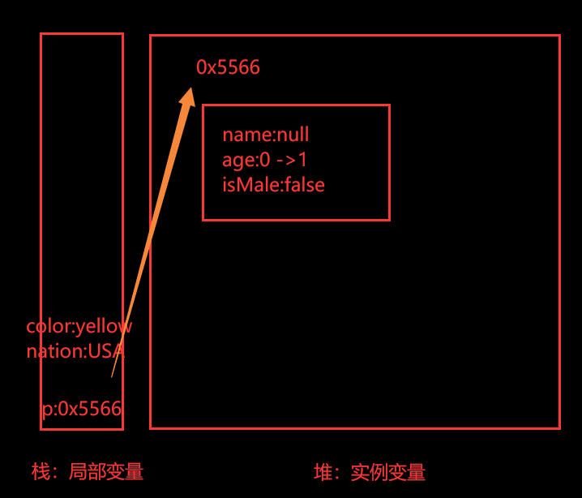
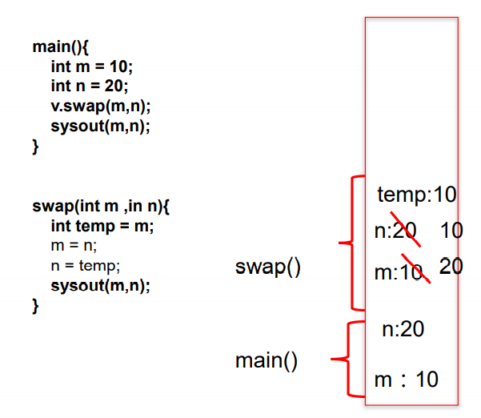

# 面向对象编程

学习面向对象内容的三条主线：

1. Java类及类的成员：属性、方法、构造器;代码块、内部类
2. 面向对象的三大特征：封装性、继承性、多态性、（抽象性）
3. 其它关键字：this、super、static、final、abstract、interface、package、import.....

学习的时候，发现自己可能处于以下几种状态：

1. 我不知道我自己不知道
2. 我知道我自己不知道
3. 我不知道我自己知道
4. 我知道我自己知道

目前第一种和第二种偏多，希望在以后的学习过程中，走向后两种状态。

## 01_面向过程与面向对象

### 什么是面向对象的编程思想？

首先解释一下“思想”。你想做个怎样的人？可能你会回答：我想做个好人，孝敬父母，尊重长辈，关爱亲朋…这就是思想。这是你做人的思想，或者说，是你做人的原则。 做人有做人的原则，编程也有编程的原则。这些编程的原则呢，就 是编程思想。

### 面向过程与面向对象

- 面向过程(POP:`Procedure Oriented Programming`) 与 面向对象(OOP:`Object Oriented Programming`)

  - 二者都是一种思想，面向对象是相对于面向过程而言的。面向过程，强调的是功能行为，以函数为最小单位，考虑怎么做。面向对象，将功能封装进对象，强调具备了功能的对象，以类/对象为最小单位，考虑谁来做。用英文单词来概括的话，面向过程就是**How**，面向对象就是**Who**;
  - 面向对象更加强调运用人类在日常的思维逻辑中采用的思想方法与原则，如 抽象、分类、继承、聚合、多态等。

- 面向对象的三大特征

  - 封装 (Encapsulation)
  - 继承 (Inheritance)
  - 多态 (Polymorphism)

- 举例：人把大象装进冰箱

  - 面向过程：强调的是功能行为，以函数为最小单位，考虑怎么做

    ```java
    1.打开冰箱
    2.把大象装进冰箱
    3.把冰箱门关住
    ```

  - 面向对象

    ````java
    人{
        打开(冰箱){
            冰箱.开门();
        }
        操作(大象){
            大象.进入(冰箱);
        }
        关闭(冰箱){ 
            冰箱.关门(); 
        }
    }
    
    冰箱{
        开门(){}
        关门(){}
    }
    
    大象{
        进入(冰箱){}
    }
    ````

### 面向对象的思想概述

程序员从面向过程的**执行者**转化成了面向对象的**指挥者**

面向对象分析方法分析问题的思路和步骤：

- 根据问题需要，选择问题所针对的**现实世界中的实体**。
- 从实体中寻找解决问题相关的属性和功能，这些属性和功能就形成了**概念世界中的类**。
- 把抽象的实体用计算机语言进行描述，形成**计算机世界中类的定义**。即借助某种程序 语言，把类构造成计算机能够识别和处理的数据结构。
- 将**类实例化成计算机世界中的对象**。对象是计算机世界中解决问题的最终工具。

## 02_Java基本元素：类和对象

### 面向对象的思想概述

- 类(`Class`)和对象(`Object`)是面向对象的核心概念。
  - 类是对一类事物的描述，是**抽象的**、概念上的定义
  - 对象是**实际存在**的该类事物的每个个体，因而也称为**实例**(`instance`)。
-  万事万物皆对象
- 人？比尔盖茨、乔布斯、刘强东、雷军。可以理解为：类 = 抽象概念的人；对象 = 实实在在的某个人
- 面向对象程序设计的重点是**类的设计**
- 类的设计，**其实就是类的成员的设计**

### Java类及类的成员

- 现实世界的生物体，大到鲸鱼，小到蚂蚁，都是由最基本的**细胞**构成的。同理，`Java`代码世界是由诸多个不同功能的**类**构成的。
- 现实生物世界中的细胞又是由什么构成的呢？细胞核、细胞质、… 那么， `Java`中用类`Class`来描述事物也是如此。常见的类的成员有：
  - **属性**：对应类中的成员变量
  - **行为**：对应类中的成员方法
- `Field` = 属性 = 成员变量 = 域  = 字段，`Method` = (成员)方法 = 函数

先初步看下类的构成：

```java
public class Person {
    // 属性，或成员变量
    String name;
    boolean isMarried;

    // 构造器
    public Person() {
    }

    public Person(String name, boolean isMarried) {
        this.name = name;
        this.isMarried = isMarried;
    }

    // 方法，或函数
    public void walk() {
        System.out.println("人走路");
    }

    // 代码块
    {
        name = "宋嘉诚";
        isMarried = false;
    }

    // 内部类
    class Pet{
        String name;
        String age;
    }
}
```

### 类的语法格式

```java
修饰符 class 类名 {
    属性声明;
    方法声明;
}
```

说明：修饰符`public`：类可以被任意访问 类的正文要用`{ }`括起来

1. 定义类（考虑修饰符、类名）
2. 编写类的属性（考虑修饰符、属性类型、属性名、初始化值）
3. 编写类的方法（考虑修饰符、返回值类型、方法名、形参等）

## 03_对象的创建和使用

`Java`类及类的成员已经好了；但是如何使用`Java`类？那就涉及`Java`类的实例化，即创建类的对象；

### 对象的创建和使用

创建对象语法： **类名 对象名 = new 类名();**

使用“**对象名.对象成员**”的方式访问对象成员（包括属性和方法）

```java
public class Zoo{
    public static void main(String args[]){
            // 创建对象
            Animal animal = new Animal();
            animal.legs = 4;// 访问属性
            System.out.println(animal.legs);
            animal.eat();// 访问方法
            animal.move();// 访问方法
    }
}
```

1. 创建类，设计类的成员
2. 创建类对象
3. 通过"对象.属性"或者"对象.方法"调用对象的结构

### 匿名对象

我们也可以不定义对象的句柄，而直接调用这个对象的方法。这的对象叫做匿名对象：例如`new Person().shout();`

使用情况：

1. 匿名对象只能调用一次。
2. 如果对一个对象只需要进行一次方法调用，那么就可以使用匿名对象。
3. 我们经常将匿名对象作为实参传递给一个方法调用。

```java
class Test{
    PhoneMall phoneMall = new PhoneMall();
	phoneMall.show(new Phone());	
}

class PhoneMall{
    public void show(Phone phone){
        phone.sendEmail();
        phone.call();
    }
}
```

### 类和多个对象的关系

如果创建了一个类的多个对象，对于类中定义的属性，每个对象都拥有各自的一套副本，且互不干扰。意味着，如果我们修改一个对象的属性A，不会影响另一个对象属性A的值。

### 类的访问机制

在一个类中的访问机制：类中的方法可以直接访问类中的成员变量。（例外：`static`方法访问非`static`，编译不通过。）

在不同类中的访问机制：先创建要访问类的对象，再用对象访问类中定义的成员。

### 对象的内存解析

先来简单的认识下`Java`内存空间：

我们都知道，`Java`是一门面向对象的高级语言，它不仅语法非常复杂，抽象程度也非常高，并不能直接运行在计算机硬件机器上。`Java`代码是运行在`Java`虚拟机上的。`Java`虚拟机(`Java Virtual Machine `简称`JVM`)是运行所有`Java`程序的抽象计算机，是`Java`语言的运行环境。

`Java`虚拟机在运行`Java`程序时，会管理着一块内存区域：运行时数据区。在运行时数据区里，会根据用途进行划分：

1. `Java`虚拟机栈（栈区）
2. 本地方法栈
3. `Java`堆（堆区）
4. 方法区
5. 程序计数器

 

-  堆（`Heap`），此内存区域的唯一目的 就是**存放对象实例**，几乎所有的对象实例都在这里分配内存。这一点在 `Java`虚拟机规范中的描述是：所有的对象实例以及数组都要在堆上分配。
- 通常所说的栈（`Stack`），是指虚拟机栈。虚拟机栈用于**存储局部变量（方法中的变量都是局部变量）**等。 局部变量表存放了编译期可知长度的各种基本数据类型（`boolean、byte、 char 、 short 、 int 、 float 、 long 、 double`）、对象引用（`reference`类型， 它不等同于对象本身，是对象在堆内存的首地址）。 方法执行完，自动释放。
- 方法区（`Method Area`），用于存储已被虚拟机加载的**类信息、常量、静态变量、即时编译器编译后的代码**等数据。

 

## 04_类的成员之一：属性

### 基本使用

语法格式：修饰符 数据类型 属性名 = 初始化值 ;

- 修饰符：
  - 常用的权限修饰符有：`private`、缺省、`protected`、`public`
  - 其他修饰符：`static`、`final `(暂不考虑)
- 数据类型：
  - 任何基本数据类型或任何引用数据类型。
- 属性名：
  - 属于标识符，符合命名规则和规范即可。

```java
public class Person{
    private int age; 			 // 声明private变量 age
    public String name = “Lila”; // 声明public变量 name
}
```

### 变量的分类

> 成员变量与局部变量

- 在方法体外，类体内声明的变量称为成员变量。
- 在方法体内部声明的变量称为局部变量。

 

- 注意：二者在初始化值方面的异同：
  - 同：都有生命周期，先声明后使用，变量都有其作用域
  - 异：局部变量除形参外，均需显式初始化

> 成员变量（属性）和局部变量的区别？

|              | 成员变量                         | 局部变量                                 |
| ------------ | -------------------------------- | ---------------------------------------- |
| 声明的位置   | 直接声明在类中 ，方法体外        | 方法形参或内部、代码块内、构造器内等     |
| 修饰符       | private、public、static、final等 | 不能用权限修饰符修饰，可以用final修饰    |
| 初始化值     | 有默认初始化值                   | 没有默认初始化值，必须显式赋值，方可使用 |
| 内存加载位置 | 堆空间 或 静态域内               | 栈空间                                   |

对象属性的默认初始化赋值：

当一个对象被创建时，会对其中各种类型的**成员变量**自动进行初始化赋值。除了 基本数据类型之外的变量类型都是引用类型，如上面的Person及前面讲过的数组。

- `byte、short、int:0`
- `float:0.0f`
- `double:0.0`
- `char:0 或写为:’\u0000’(表现为空)`
- `boolean:false`
- `引用类型:null`

> 成员变量vs局部变量的内存位置

属性：加载到堆空间中（`static`修饰的属性在方法区中）

局部变量：加载到栈空间中

```java
class Person{//人类
    //1.属性
    String name;//姓名
    int age = 1;//年龄
    boolean isMale;//是否是男性
    public void show(String nation){
        //nation:局部变量
        String color;//color:局部变量
        color = "yellow";
    }
}
//测试类
class PersonTest{
    public static void main(String[] args){
        Person p = new Person();
        p.show(“USA”);
    }
}
```

 

## 05_类的成员之二：方法

### 什么是方法(`method`、函数):

- 方法是类或对象行为特征的抽象，用来完成某个功能操作。在某些语言中也称为函数或过程。

- 将功能封装为方法的目的是，可以实现代码重用，简化代码

- `Java`里的方法不能独立存在，所有的方法必须定义在类里。

- 举例：

  ```java
  public class Person{
      private int age;
      public int getAge() { //声明方法getAge()
          return age; 
      }
      public void setAge(int i) { //声明方法setAge
          age = i; //将参数i的值赋给类的成员变量age
      }
  }
  ```

### 方法的声明格式

```java
修饰符 返回值类型 方法名（参数类型 形参1, 参数类型 形参2, ….）｛
    方法体程序代码
    return 返回值;
｝
```

- 修饰符：`public`,缺省,`private`,`protected`等
- 返回值类型：
  - 没有返回值：`void`
  - 有返回值，声明出返回值的类型。与方法体中`return 返回值`搭配使用
- 方法名：属于标识符，命名时遵循标识符命名规则和规范，“见名知意”
- 形参列表：可以包含零个，一个或多个参数。多个参数时，中间用`,`隔开
- 返回值：方法在执行完毕后返还给调用它的程序的数据。

### 方法的分类

|        | 无返回值                  | 有返回值                          |
| ------ | ------------------------- | --------------------------------- |
| 无形参 | void 方法名（）{}         | 返回值的类型 方法名（）{}         |
| 有形参 | void 方法名（形参列表）{} | 返回值的类型 方法名（形参列表）{} |

### 方法的基本概念

1. 方法的调用： 方法通过方法名被调用，且只有被调用才会执行。方法被调用一次，就会执行一次

2. 方法调用的过程分析

    

3. 没有具体返回值的情况，返回值类型用关键字`void`表示，那么方法体中可以不必使用``return`语句。如果使用，仅用来结束方法。

4. 定义方法时，方法的结果应该返回给调用者，交由调用者处理。

5. 方法中只能调用方法或属性，特殊的，方法A中又调用方法A，称为递归方法。不可以在方法内部定义方法。

6. `return`的作用：①结束方法②针对有返回值的方法，使用`return data`结束方法的同时返回所要的数据，`return`关键字后面不能再有语句

### 对象数组的内存解析

定义类`Student`，包含三个属性：学号`number(int)`，年级`state(int)`，成绩 `score(int)`。 创建20个学生对象，学号为1到20，年级和成绩都由随机数确定。 

问题一：打印出3年级(state值为3）的学生信息。 

问题二：使用冒泡排序按学生成绩排序，并遍历所有学生信息

提示：

 1) 生成随机数：`Math.random()`，返回值类型`double`; 

 2) 四舍五入取整：`Math.round(double d)`，返回值类型`long`。

```java
public class ObjArrayTest {
    public static void main(String[] args) {
        Student[] students = new Student[20];
        for (int i = 0; i < students.length; i++) {
            students[i] = new Student();
            students[i].number = i + 1;
            // 年级[1,6]
            students[i].state = (int) (Math.random() * (6 - 1 + 1) + 1);
            // 成绩[0,100]
            students[i].score = (int) (Math.random() * 100 + 1);
        }

        // 遍历学生数组
        for (Student student : students) {
            if (student.state == 3) {
                System.out.println("students = " + student);
            }
        }

        // 冒泡排序
        for (int i = 0; i < students.length - 1; i++) {
            for (int j = 0; j < students.length - i - 1; j++) {
                if (students[j].score > students[j + 1].score) {
                    // 如果需要换序，交换的是数组的元素，也就是学生对象
                    Student temp = students[j];
                    students[j] = students[j + 1];
                    students[j + 1] = temp;
                }
            }
        }

        // 再次遍历
        for (Student student : students) {
            System.out.println("students = " + student);
        }
    }
}

class Student {
    int number;
    int state;
    int score;

    @Override
    public String toString() {
        return "Student{" +
            "number=" + number +
            ", state=" + state +
            ", score=" + score +
            '}';
    }
}
```

 

## 06_再谈方法

### 方法的重载

> 为什么有方法重载机制？

业务背景：不同的场景，不同的购买方法，有重复，但是逻辑又明显不一样，怎么办？

> 什么是方法签名？

方法签名∶方法名+依次参数类型。注意，**返回值不属于方法签名**。方法签名是一个方法在一个类中的唯一标识；

为什么返回值不属于方法签名呢？因为返回值不能帮助确定调用哪个方法，例如：

```java
// Java允许直接调用方法不声明返回值
fun(1,2);
fun(1,2);
```

>重载的概念：

一个类中如果定义了名字相同，签名不同的方法，就叫做方法的重载；也就是在同一个类中，允许存在一个以上的同名方法，只要它们的参数个数或者参数类型不同即可。

实际上，像这种补充一些缺省的参数值，然后调用重载的方法，是重载的一个重要的使用场景。使用重载方法，可以为编程带来方便。

```java
public double buy(int count) { 
    return buy(count, false);
}
```

```java
public void println(byte x);
public void println(short x);
public void println(int x);
public void println(long x);
public void println(float x);
public void println(double x);
public void println(char x);
public void println(double x);
public void println();
```

> 重载的特点：

与返回值类型无关，只看参数列表，且参数列表必须不同。(参数个数或参数类型)。调用时，根据方法参数列表的不同来区别。

> 重载的参数匹配规则

1. 方法调用的时候，参数就不必完全类型一样，**对于数字类型的参数，实参数可以自动类型转换成形参类型即可；**

2. 重载的特殊之处是，参数满足自动自动类型转换的方法有好几个，重载的规则是选择最"近"的去调用

   ```java
   public double buy(double count){
       System.out.println("buy(double)被调用了");
   }
   
   public double buy() {
       System.out.println("buy()被调用了");
   }
   
   public double buy(int count) {
       System.out.println("buy(int)被调用了");
   }
   
   public double buy(int count, boolean isVIP) {
       System.out.println("buy(int,boolean)被调用了");
   }
   ```

   ```java
   byte countForOverride  = 1;
   merchandise.buy(countForOverride);
   // buy(int)被调用了
   // buy(int,boolean)被调用了
   
   short countForOverride  = 1;
   merchandise.buy(countForOverride);
   // buy(int)被调用了
   // buy(int,boolean)被调用了
   
   int countForOverride  = 1;
   merchandise.buy(countForOverride);
   // buy(int)被调用了
   // buy(int,boolean)被调用了
   
   long countForOverride  = 1;
   merchandise.buy(countForOverride);
   // buy(double)被调用了
   
   float countForOverride  = 1;
   merchandise.buy(countForOverride);
   // buy(double)被调用了
   
   double countForOverride  = 1;
   merchandise.buy(countForOverride);
   // buy(double)被调用了
   ```

### 可变形参的方法

`JavaSE 5.0` 中提供了`Varargs(variable number of arguments)`机制，允许直接定义能和多个实参相匹配的形参。从而，可以用一种更简单的方式，来传递个数可变的实参。

```JAVA
// JDK 5.0以前：采用数组形参来定义方法，传入多个同一类型变量
public static void test(int a ,String[] books);
// JDK5.0：采用可变个数形参来定义方法，传入多个同一类型变量
public static void test(int a ,String… books);
```

1. 声明格式：方法名(参数的类型名 ...参数名)
2. 可变参数：方法参数部分指定类型的参数个数是可变多个：0个，1个或多个
3. 可变个数形参的方法与同名的方法之间，彼此构成重载
4. 可变参数方法的使用与方法参数部分使用数组是一致的`show(String ... args)`等价于`show(String[] args)`，二者不能共存
5. 方法的参数部分有可变形参，需要放在形参声明的最后
6. 在一个方法的形参位置，最多只能声明一个可变个数形参

### 方法参数的值传递机制（重点）

- 方法，必须由其所在类或对象调用才有意义。若方法含有参数

  - 形参：方法声明时的参数
  - 实参：方法调用时实际传给形参的参数值

- `Java`的实参值如何传入方法呢？

  `Java`里方法的参数传递方式只有一种：值传递。 即将实际参数值的副本 （复制品）传入方法内，而参数本身不受影响。**值传递机制：**

  - 形参是基本数据类型：将实参基本数据类型变量的“数据值”传递给形参
  - 形参是引用数据类型：将实参引用数据类型变量的“地址值”传递给形参

- 内存图解参数为基本数据类型

   

- 内存图解参数为引用数据类型

   

练习：

```java
class Value {
    int i = 15;
}
public class TransferTest {
    public static void main(String args[]) {
        TransferTest test = new TransferTest();
        test.first();
    }
    public void first() {
        int i = 5;
        Value v = new Value();
        v.i = 25;
        second(v, i);
        System.out.println(v.i);		// 20
    }
    public void second(Value v, int i) {
        i = 0;
        v.i = 20;
        Value val = new Value();
        v = val;
        System.out.println(v.i + " " + i);	// 15 0
    }
}
```

  

> 例题一：貌似考查参数传递

```java
public class Test{
    public static void main(String[] args){
        int a = 10;
        int b = 10;
        method(a,b); // 需要在method方法被调用后,仅打印出a = 100,b = 200,请写出method()方法的代码
        System,out.println("a = "+a);
        System,out.println("b = "+b);
    }
}
```

方法一：

```java
public static void method(int a,int b){
    a = a * 10;
    b = b * 20;
    System,out.println("a = "+a);
    System,out.println("b = "+b);
    System.exit(0);
}
```

方法二：

```java
public static void method(int a,int b){
    PrintStream ps = new PrintStream(System.out){
        @Override
        public void println(String x){
            if("a=10".equales(x)){
                x = "a=100";
            }else if("b=10".equales(x)){
                x = "b=100";
            }
            super.printlx(x);
        };
        System.setOut(ps);
    }
}
```

> 例题二：

定义一个`int`型的数组：`int[] arr = new int[]{12,3,3,34,56,77,432}; `让数组的每个位置上的值去除以首位置的元素，得到的结果，作为该位置上的新值。遍历新的数组。

错误写法：这样第一个12/12首元素变为1之后，其他都是除以1

```java
for(int i= 0；i < arr.length;i++){
    arr[i] = arr[i] / arr[0];
}
```

方式一：倒着来

```java
for(int i = arr.length – 1;i >= 0;i--){
    arr[i] = arr[i] / arr[0];
}
```

方式二：取出首元素

```java
int temp = arr[0];
for(int i= 0；i < arr.length;i++){
    arr[i] = arr[i] / temp;
}
```

> 例题三

```java
int[] arr = new int[]{1,2,3};
System.out.println(arr);//地址值? 是 println(Object)
char[] arr1 = new char[]{'a','b','c'};
System.out.println(arr1); //地址值? 否 abc 
```

`println(char[])`方法

### 递归方法

- **递归方法：一个方法体内调用它自身。**

- 方法递归包含了一种隐式的循环，它会重复执行某段代码，但这种重复执行无须循环控制。

- 递归一定要向已知方向递归，否则这种递归就变成了无穷递归，类似于死循环。

- **递归一定要有出口**

- 计算1-100之间所有自然数的和

  ```java
  public int getSum(int num){
      if(num == 1){
          return 1;
      }else{
          return num + getSum(num - 1);
      }
  }
  ```

- 递归求阶乘(n!)的算法

  ```java
  public int getSum(int num){
      if(num == 1){
          return 1;
      }else{
          return num * getSum(num - 1);
      }
  }
  ```

- 已知有一个数列：`f(0) = 1,f(1) = 4,f(n+2)=2*f(n+1) + f(n)`,其中`n`是大于`0 `的整数，求`f(10)`的值。

  ```java
  public int fun(int n){
      if(n==0){
          return 1;
      }else if(n==1){
          return 4;
      }else{
          // return f(n+2)=2*f(n+1); 错误,越来越大，栈溢出
          // 换元法，另n = n - 2
          return 2 * f(n-2+1)+f(n-2);
      }
  }
  ```

- 已知一个数列：`f(20) = 1,f(21) = 4,f(n+2) = 2*f(n+1)+f(n)`, 其中`n`是大于`0`的整数，求`f(10)`的值。

  ```java
  public int fun(int n){
      if(n==20){
          return 1;
      }else if(n==21){
          return 4;
      }else{
          // return f(n+2)=2*f(n+1); 错误,越来越大，栈溢出
          // 换元法，另n = n - 2
          return 2 * f(n-2+1)+f(n-2);
      }
  }
  ```

- 输入一个数据`n`，计算斐波那契数列(`Fibonacci`)的第`n`个值 `1 1 2 3 5 8 13 21 34 55 `规律：一个数等于前两个数之和，要求：计算斐波那契数列(`Fibonacci`)的第n个值，并将整个数列打印出来

  ```java
  public int fun(int n){
      if(n==1 || n==2){
          return 1;
      }else {
          return fun(n-1)+fun(n-2);
      }
  }
  ```

  

## 07_OOP特征一：封装与隐藏

## 08_类的成员之三：构造器

## 09_关键字：this

## 10_关键字：package、import

## 11_OOP特征二：继承性

## 12_方法的重写(override)

## 13_四种访问权限修饰符

## 14_关键字：super

## 15_子类对象实例化过程

## 16_OOP特征三：多态性

## 17_Object类的使用

## 18_包装类的使用

## 19_关键字：static

## 20_理解main方法的语法

## 21_类的成员之四：代码块

## 22_关键字：final

## 23_抽象类与抽象方法

## 24_接口(interface)

## 25_类的成员之五：内部类

