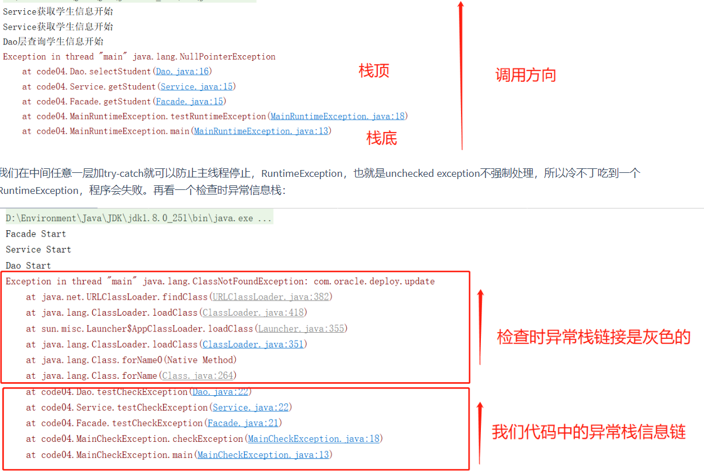

<!-- @import "[TOC]" {cmd="toc" depthFrom=1 depthTo=6 orderedList=false} -->

<!-- code_chunk_output -->

- [异常处理](#异常处理)
  - [1_异常概述与异常体系结构](#1_异常概述与异常体系结构)
    - [异常概述](#异常概述)
    - [异常体系结构](#异常体系结构)
  - [2_常见异常](#2_常见异常)
  - [3_异常处理机制](#3_异常处理机制)
    - [机制一：try-catch-finally](#机制一try-catch-finally)
      - [异常的抛出机制](#异常的抛出机制)
      - [使用try-catch-finally](#使用try-catch-finally)
    - [机制二：throws声明抛出异常](#机制二throws声明抛出异常)
  - [4_手动抛出异常：throw](#4_手动抛出异常throw)
  - [5_用户自定义异常类](#5_用户自定义异常类)
  - [6_自动回收资源的 try 语句](#6_自动回收资源的-try-语句)
  - [7_异常常见问题](#7_异常常见问题)
    - [异常关键字](#异常关键字)
    - [throws和throw的区别](#throws和throw的区别)
    - [final、finally、finalize三者区别](#final-finally-finalize三者区别)
    - [异常栈](#异常栈)
    - [异常处理链](#异常处理链)
    - [异常处理原则](#异常处理原则)
    - [比喻](#比喻)

<!-- /code_chunk_output -->

# 异常处理

## 1_异常概述与异常体系结构

在使用计算机语言进行项目开发的过程中，即使程序员把代码写得尽善尽美， 在系统的运行过程中仍然会遇到一些问题，因为很多问题不是靠代码能够避 免的，比如：**客户输入数据的格式**，**读取文件是否存在**，**网络是否始终保持通畅**等等。

### 异常概述

异常：在`Java`语言中，将程序执行中发生的不正常情况称为"异常" 。 (开发过程中的语法错误和逻辑错误不是异常)。开始学习的时候，经常不清楚异常的概念，后来得知，异常 = `Error+Exception`，这个异常是广义上的异常，也就是不正常的就是异常。后来因为`Error`不在我们的处理范围内，`Exception`就成了狭义上的异常。

`Java`程序在执行过程中所发生的异常事件可分为两类：

- `Error`：Java虚拟机无法解决的严重问题。如：JVM系统内部错误、资源耗尽等严重情况。比如：StackOverflowError和OOM。一般不编写针对性的代码进行处理。
  - StackOverflowError：死循环、递归调用无出口，栈溢出
  - OOM：`Integer[] arr = new Integer[1024*1024*1024];`堆溢出
- `Exception`: 其它因编程错误或偶然的外在因素导致的一般性问题，可以使用针对性的代码进行处理。例如：
  - 空指针访问
  - 试图读取不存在的文件
  - 网络连接中断
  - 数组角标越界

对于这些错误，一般有**两种解决方法：**

1. 一是遇到错误就终止程序的运行。也就是不作为。
2. 另一种方法是由程序员在编写程序时，就考虑到错误的检测、错误消息的提示，以及错误的处理。

捕获错误最理想的是在编译期间，但有的错误只有在运行时才会发生。 比如：除数为0，数组下标越界等。

- 编译时异常
- 运行时异常

### 异常体系结构

`Java`中异常体系是`Java`健壮性的体现，顶级类是`Throwable`，分为`Error`和`Exception`：

```java
java.lang.Throwable
    |-----java.lang.Error:一般不做针对性代码进行处理
    |-----java.lang.Exception
        	|-----编译时异常(checked)
        	|-----运行时异常(unchecked) RuntimeException
```

- Error是仅靠程序本身无法恢复的严重错误，Error不在我们调试代码可以处理的范围中；

- Exception主要分为：

  - 受检查（编译时）异常（checked exception）：语法要求必须要用 try catch 或者 throws 语句处理 的异常 

    是指编译器要求必须处置的异常。即程序在运行时由于外界因素造成的一 般性异常。编译器要求Java程序必须捕获或声明所有编译时异常；

    对于这类异常，如果程序不处理，可能会带来意想不到的结果；

    Java 代码在编译过程中，如果受检查异常没有被 `catch`/`throw` 处理的话，就没办法通过编译 。比如 IO 操作的代码。除了`RuntimeException`及其子类以外，其他的`Exception`类及其子类都属于检查异常。

  - 运行时异常（unchecked exception）：语法不要求一定要用 try catch 或者 throws 语句 处理的异常

    Java 代码在编译过程中，编译器不要求强制处置的异常。一般是指编程时的逻辑错误，是程序员应该积极避免其出现的异常；`java.lang.RuntimeException`类及它的子类都是运行时异常。例如：`NullPointExecrption`、`NumberFormatException`（字符串转换为数字）、`ArrayIndexOutOfBoundsException`（数组越界）、`ClassCastException`（类型转换错误）、`ArithmeticException`（算术错误）等；

    对于这类异常，可以不作处理，因为这类异常很普遍，若全处理可能会对 程序的可读性和运行效率产生影响。

 

## 2_常见异常

 编译过程和运行时过程

- 编译时异常：执行	`javac.exe`命令时，可能出现的异常
- 运行时异常：执行	`java.exe`命令时，可能出现的异常

> 检查时异常

最具代表的检查性异常是用户错误或问题引起的异常，这是程序员无法预见的；检查时异常必须在运行程序前就处理掉。如果不处理，程序就不能编译通过。

- java.io.IOExeption
  - FileNotFoundException
  - EOFException
- java.lang.ClassNotFoundException
- java.lang.InterruptedException
- java.io.FileNotFoundException
- java.sql.SQLException

|       检查时异常       |                     描述                     |
| :--------------------: | :------------------------------------------: |
| ClassNotFoundException | 应用程序试图加载类时，找不到相应的类时的异常 |
| IllegalAccessException |          拒绝访问一个类的时候的异常          |
|      IOException       |                 流操作的异常                 |
|      SQLException      |               数据库操作的异常               |

> 运行时异常

运行时异常是可以被程序员避免的异常。与检查性异常相反，运行时异常可以在编译时被忽略。在程序中可以选择捕获处理，也可以不处理。程序应该从逻辑角度尽可能避免这类异常的发生。

- java.lang.RuntimeException 
  - ClassCastException 
  - ArrayIndexOutOfBoundsException 
  - NullPointerException 
  - ArithmeticException 
  - NumberFormatException 
  - InputMismatchException 

|           运行时异常           |                             描述                             |
| :----------------------------: | :----------------------------------------------------------: |
| ArrayIndexOutOfBoundsException |                  用非法索引访问数组时的异常                  |
|       ClassCastException       |          试图将对象强制转换为不是实例的子类时的异常          |
|      NullPointerException      |       当应用程序试图在需要对象的地方使用 null 时的异常       |
|     NumberFormatException      | 应用程序试图将字符串转换成一种数值类型，但该字符 串不能转换为适当格式时的异常 |
|      ArithmeticException       |                 当出现异常的运算条件时的异常                 |

## 3_异常处理机制

在编写程序时，经常要在可能出现错误的地方加上检测的代码， 如进行`x/y`运算时，要检测分母为0，数据为空，输入的不是数据而是字符等。过多的`if-else`分支会导致程序的代码加长、臃肿， 可读性差。因此采用异常处理机制。

Java采用的异常处理机制，是将异常处理的程序代码集中在一起， 与正常的程序代码分开，使得程序简洁、优雅，并易于维护。

- 方式一：try-catch-finally：自己能解决；生病小感冒
- 方式二：throws + 异常类型：喊人摇人；生病一级一级去大医院


开发中如何选择使用`try-catch-finally`还是使用`throws`?

1. 如果父类中被重写的方法没有throws方式处理异常，则子类重写的方法也不能使用throws，意味着如果子类重写的方法中有异常，必须使用try-catch-finally方式处理。Thread的run方法
2. 执行的方法a中，先后又调用了另外的几个方法，这几个方法是递进（下一个方法用到了上一个方法的执行结果）关系执行的。我们建议这几个方法使用throws的方式进行处理。而执行的方法a可以考虑使用try-catch-finally方式进行处理。因为如果自己try-catch了，以为没有异常继续向下执行，其他的方法需要你的参数，可是你已经提供不了了。

### 机制一：try-catch-finally

#### 异常的抛出机制

- Java提供的是异常处理的**抓抛模型**。
  - 过程一"抛"：Java程序的执行过程中如出现异常，会生成一个**异常类对象**， 该异常对象将被提交给Java运行时系统，这个过程称为**抛出 (throw)异常**。一旦抛出对象后，其后的代码就不再执行。
  - 过程二"抓"：可以理解为异常处理的两种方式，`try-catch-finally`或`throws`
- 异常对象的生成
  - 由虚拟机**自动生成**：程序运行过程中，虚拟机检测到程序发生了问题，如果在当前代码中没有找到相应的处理程序，就会在后台自动创建一个对应异常类的实例对象并抛出——自动抛出
  - 由开发人员**手动创建**：Exception exception = new ClassCastException();创建好的异常对象不抛出对程序没有任何影响，和创建一个普通对象一样。throw new Exception();

 

为保证程序正常执行，代码必须对可能出现的异常进行处理。

- 如果一个方法内抛出异常，该异常对象会被抛给调用者方法中处理。如果异常没有在调用者方法中处理，它继续被抛给这个调用方法的上层方法。这个过程将一直继续下去，直到异常被处理。 这一过程称为捕获(catch)异常。
- 如果一个异常回到main()方法，并且main()也不处理，则程序运行终止。
- 程序员通常只能处理Exception，而对Error无能为力。

#### 使用try-catch-finally

异常处理是通过`try-catch-finally`语句实现的：

```java
try{
    //可能产生异常的代码
}
catch(ExceptionName1 e){
    //当产生ExceptionName1型异常时的处置措施
}
catch(ExceptionName2 e){
    //当产生ExceptionName2型异常时的处置措施
}
[ finally{
    //无论是否发生异常，都无条件执行的语句
} ]
```

- **try**
  
  - 捕获异常的第一步是用`try{…}`语句块选定捕获异常的范围，将可能出现异常的代码放在`try`语句块中。一旦出现异常，就会生成一个对应异常类的对象，根据此对象的类型去`catch`中进行匹配。
  - 一旦`try`中的异常对象匹配到某一个`catch`时，就进入`catch`中进行异常的处理。一旦处理完成，就跳出当前的`try-catch`结构，继续执行其后的代码。
  - `catch`中的异常类型如果没有子父类关系，则谁声明上下无所谓，如果有子父类关系，子上父下，否则报错。
  - 它无法单独使用，必须配合`catch`或`finally`使用
  - 在`try`中声明的变量，出了`try`结构以后就不能再被调用。
- **catch** (Exceptiontype e)
  
  - 在catch语句块中是对**异常对象**进行处理的代码。每个try语句块可以伴随**一个或多个**`catch`语句，用于处理可能产生的**不同类型**的异常对象。
  - 如果明确知道产生的是何种异常，可以用该异常类作为`catch`的参数；也可以用其父类作为`catch`的参数。比如可以用 ArithmeticException 类作为参数的地方，就可以用 RuntimeException类作为参数，或者用所有异常的父类Exception类作为参数。 但不能是与ArithmeticException类无关的异常，如NullPointerException，这样`catch`中的语句将不会执行。
- 捕获异常的有关信息：与其它对象一样，可以访问一个异常对象的成员变量或调用它的方法。
  - `getCause()`：返回抛出异常的原因。如果cause不存在或未知，则返回null
  
  - `String getMessage()`：获取异常信息，返回字符串
  
  - `printStackTrace()`：获取异常类名和异常信息，以及异常出现在程序中的位置。即异常对象的堆栈跟踪输出至错误输出流，作为`System.error`的值，常用。
  
     
- **finally**
  
  - `finally`语句和`catch`语句是可选的
  - `finally`中声明的是一定会被执行的代码。即使`catch`中又出现异常了，`try`中有`return`语句，catch中有`return`语句等情况。
  - 在初始垃圾回收的时候有一句话"对其他物理连接，比如数据库连接、输入流输出流、Socket连接无能为力"，JVM是不能自动回收的，需要我们手动进行资源的释放，就需要声明在`finally`中。
  - 捕获异常的最后一步是通过`finally`语句为异常处理提供一个统一的出口，使得在控制流转到程序的其它部分以前，能够对程序的状态作统一的管理。
  - 不论在try代码块中是否发生了异常事件，catch语句是否执行，catch语句是否有异常，catch语句中是否有return， finally块中的语句都会被执行。除非退出Java虚拟机JVM。

体会一：使用`try-catch-finally`处理编译时异常，使得程序在编译时就不再报错，但是运行时仍肯能报错。相当于我们使用`try-catch-finally`将一个编译时可能出现的异常，延迟到运行时出现。

体会二：开发中，由于运行时异常比较常见，所以我们通常就不针对运行时异常编写`try-catch-finally`了。针对于编译时异常，我们说一定要考虑异常的处理。

正常情况：当程序运行过程中，没有发生异常，不执行catch块中的代码

 

当程序运行过程中，发生异常，且 异常的类型 和 捕获的类型 相同或者是其子类：

 

当程序运行过程中，发生异常，且 异常的类型 和 捕获的类型 不相同或者也不是其子类：

 

### 机制二：throws声明抛出异常

声明抛出异常是Java中处理异常的第二种方式，throws + 异常类型，甩锅模式

1. "throws +异常类型"写在方法的声明处。指明此方法执行时，可能会抛出的异常类型。一旦当方法体执行时，出现异常，仍会在异常代码处生成一个异常类的对象，此对象满足throws后异常类型时，就会被抛出。异常代码后续的代码，就不再执行！（问题是，资源释放不了啊！）
2. `try-catch-finally`:真正的将异常给处理掉了。`throws`的方式只是将异常抛给了方法的调用者。并没有真正将异常处理掉。|
3. 如果一个方法（中的语句执行时）可能生成某种异常，但是并不能确定如何处理这种异常，则此方法应**显示地**声明抛出异常，表明该方法将不对这些异常进行处理， 而由该方法的**调用者**负责处理。
4. 在方法声明中用`throws`语句可以声明抛出异常的列表，throws后面的异常类型可以是方法中产生的异常类型，也可以是它的父类。

声明抛出异常举例：不处理异常，直接抛出，调用这个方法的地方终究要处理异常

```java
public class MustHandle {
    public static void main(String[] args) {
        try {
            new MustHandle().method();
        } catch (ClassNotFoundException e) {
            e.printStackTrace();
        }
    }

    public void method() throws ClassNotFoundException {
        // 此处不处理异常，直接抛出，调用这个方法的地方终究要处理异常
        Class<?> clazz = Class.forName("com.oracle.deploy.update.UpdateCheck");
        System.out.println("clazz = " + clazz);
    }
}
```

> 方法重写声明抛出异常的原则

重写方法不能抛出比被重写方法范围更大的异常类型。在多态的情况下， 对methodA()方法的调用—异常的捕获按父类声明的异常处理。

```java
public class A {
    public void methodA() throws IOException {
        ……
    } }
public class B1 extends A {
    public void methodA() throws FileNotFoundException {
        ……
    } }
public class B2 extends A {
    public void methodA() throws Exception { //报错
        ……
    } }
}
```

为什么呢？因为多态，子类抛出了，父类假如也抛出了，main()中调用父类try-catch了父类异常。此时但是如果子类异常还比父类的大，子类往上抛超过了父类的范围，就不在父类异常对象的范围内了，根本没法处理。

```java
class superClass{
    public void method() throws IOException{

    }
}
class subClass extends superClass{
    public void method ()throws FileNotFoundException{

    }
}

public class OverrideTest {
    public static void main(String[] args) {
        // 多态传入子类 如果大于父类异常,那我刚刚明明处理了,就矛盾了
        OverrideTest test =new OverrideTest();
        test.display(s);
    }

    // 调用父类的方法并处理异常
    public void display(superClass s){
        try {
            s.method();
        } catch (IOException e) {
            e.printStackTrace();
        }
    }
}
```

## 4_手动抛出异常：throw

Java异常类对象除在程序执行过程中出现异常时由系统自动生成并抛出，也可根据需要使用人工创建并抛出。

- 首先要生成异常类对象，然后通过throw语句实现抛出操作(提交给Java运行环境)。

  ```java
  IOException e = new IOException();
  throw e;
  ```

- 可以抛出的异常必须是Throwable或其子类的实例。下面的语句在编译时将 会产生语法错误：

  ```java
  throw new String("want to throw");
  ```

## 5_用户自定义异常类 

如何自定义异常类？

1. 继承于现有的异常结构：RuntimeException，Exception。用户自定义异常类都是RuntimeException的子类。
2. 提供全局常量：serialversionUID
3. 提供重载的构造器

自定义的异常通过`throw`抛出。自定义异常最重要的是异常类的名字，当异常出现时，可以根据名字判断异常类型。

## 6_自动回收资源的 try 语句

为什么会有自动回收资源的 try 语句，因为和资源相关的语句非常容易发生异常，比如说文件找不到、网络连不上，和资源相关的异常处理比较繁复，尤其是有多个资源的时候。

 从 Java 7 build 105 版本开始，Java 7 的编译器和运行环境支持新的 try-with-resources 语句，称为 ARM 块(Automatic Resource Management) ，自动资源管理。

一般我们会编写如下代码来释放资源： 

```java
private static void customBufferStreamCopy(File source, File target) {
    InputStream fis = null;
    OutputStream fos = null;
    try {
        fis = new FileInputStream(source);
        fos = new FileOutputStream(target);

        byte[] buf = new byte[8192];

        int i;
        while ((i = fis.read(buf)) != -1) {
            fos.write(buf, 0, i);
        }
    }
    catch (Exception e) {
        e.printStackTrace();
    } finally {
        close(fis);
        close(fos);
    }
}

private static void close(Closeable closable) {
    if (closable != null) {
        try {
            closable.close();
        } catch (IOException e) {
            e.printStackTrace();
        }
    }
}
```

 代码挺复杂的，异常的管理很麻烦。

而使用 try-with-resources 语句来简化代码如下： 

```java
private static void customBufferStreamCopy(File source, File target) {
    try (InputStream fis = new FileInputStream(source);
        OutputStream fos = new FileOutputStream(target)){
  
        byte[] buf = new byte[8192];
  
        int i;
        while ((i = fis.read(buf)) != -1) {
            fos.write(buf, 0, i);
        }
    }
    catch (Exception e) {
        e.printStackTrace();
    }
}
```

数据流会在 try 执行完毕后自动被关闭，前提是，这些**可关闭的资源必须实现 java.lang.AutoCloseable 接口**。

## 7_异常常见问题

### 异常关键字

 

### throws和throw的区别

**throws是异常处理机制之一，是将方法内抛出的异常进行处理，只是再次抛出给调用者。throw是产生一个异常，是异常对象的生成方式之一。**

- throw

1. throw只会出现在方法体中，当方法在执行过程中遇到异常情况时，将异常信息封装为异常对象，然后throw出去。一般会用于程序出现某种异常时，程序员要主动抛出某种特定类型的异常。throw关键字的一个非常重要的作用就是异常类型转换。
2. 如果抛出了检查型异常，则还应该在方法头部，声明方法可能抛出的异常类型。该方法的调用者也必须检查处理抛出的异常。如果所有方法都层层上抛获取的异常，最终JVM会进行简单处理，就是打印异常消息和堆栈信息。

- throws

1. 在方法的声明中，表示该方法可能会抛出的异常，然后交给上层调用它的方法程序处理，允许throws后面跟着多个异常类型。
2. 仅当抛出了检查时异常，该方法的调用者才必须捕获处理或重新抛出该异常。当方法的调用者无力处理该异常的时候，应该继续抛出，不能处理的异常最终JVM会进行处理，就是打印异常消息和堆栈信息。

### final、finally、finalize三者区别

https://www.cnblogs.com/smart-hwt/p/8257330.html

- final用于声明属性，方法和类，分别表示属性不可交变，方法不可覆盖，类不可继承
- finally是异常处理语句结构的一部分，表示总是执行。
- finalize是Object类的一个方法，在垃圾收集器执行的时候会调用被回收对象的此方法，供垃圾收集时的其他资源回收，例如关闭文件等。

### 异常栈

在JVM中，我们使用的是基于栈而不是基于寄存器的结构，栈通用性更强，指令更简单，但是速度效率不如寄存器快，而且指令偏多。经常提及JVM人们会说到堆栈，堆栈确实是JVM运行时数据区内存结构的两大重要结构，其中堆管存储，栈管运行；每次一个请求进来，我们会用栈进行接收，虚拟机栈中，一个个栈帧对应一个个方法，一个栈桢中又有局部变量表、操作数栈等；

方法一个调一个的层层调用，组成了方法调用栈，而Java 异常在方法调用之间传递；

Java 异常的的归宿：要么沿着方法调栈顺序一路抛，最终造成当前线程出错退出，要么被 catch 住；

线程的英文叫做 Thread 。 我们可以简单的认为是帮我们执行代码的那个东西；

方法的调用链可以总结为：`Main()-->testRuntimeException()-->Facade.getStudent()-->Service.selectStudent()-->Dao.Service()`

```java
public class Dao {
    public void selectStudent(){
        System.out.println("Dao层查询学生信息开始");
        // 模拟发生运行时异常空指针
        String string = null;
        string.toString();
        System.out.println("Dao层查询学生信息结束");
    }
}

public class Service {
    Dao dao = new Dao();
    public void getStudent(){
        System.out.println("Service获取学生信息开始");
        dao.selectStudent();
        System.out.println("Service获取学生信息结束");
    }
}

public class Facade {
    Service service = new Service();
    public void getStudent(){
        System.out.println("Service获取学生信息开始");
        service.getStudent();
        System.out.println("Service获取学生信息结束");
    }
}

public class MainRuntimeException {
    public static void main(String[] args) {
        testRuntimeException();
    }

    public static void testRuntimeException(){
        Facade facade = new Facade();
        facade.getStudent();
    }
}
```

异常看栈顶，最上面：

 

### 异常处理链

1. 底层方法抛出异常
2. 上层方法抛出大于底层方法的异常
3. 最外层统一处理异常

### 异常处理原则

1. 具体明确：指抛出的异常应能通过异常类名和message准确说明异常的类型和产生异常的原因；
2. 提早抛出：指应尽可能早的发现并抛出异常，便于精确定位问题；
3. 延迟捕获：指异常的捕获和处理应尽可能延迟，让掌握更多信息的 作用域来处理异常

### 比喻

世界上最遥远的距离，是我在if里你在else里，似乎一直相伴又永远分离； 

世界上最痴心的等待，是我当case你是switch，或许永远都选不上自己； 

世界上最真情的相依，是你在try我在catch。无论你发神马脾气，我都默默承受，静静处理。到那时，再来期待我们的finally。

## 8_开发疑问

### 开发外层模型

```java
public static void main(String[] args) {
    try {
        fun();
    } catch (RuntimeException e) {
        // 自定义的异常信息
        System.out.println(e.getMessage());
    }
}
public static int fun() {
    if (true) {
        // 内部抛出异常信息
        throw new RuntimeException("自定义的异常信息");
    }
    return 1;
}
```

### for循环内处理异常

一般不建议循环内部使用`try-catch`处理异常，但是对于数据操作性较高的，比如批处理，不可能因为一条数据有问题就整批数据失败

```java
public static void main(String[] args) {
    List<Integer> stringList = new ArrayList<>();
    for (int i = 0; i < 50; i++) {
        stringList.add(i);
    }

    for (Integer integer : stringList) {
        try {
            try {
                System.out.println("integer = " + integer);
                int i = integer;
                int sum = 10 / i;
                System.out.println("sum = " + sum);
            } catch (Exception e) {
                throw new MyRuntimeException("1",e);
            }
        } catch (Exception e) {
            System.out.println("e = " + e);
        }
    }
}
```

依旧会进行其他49次任务的处理

### 吞异常

```java
public void doConsumer() {
    try {
        sendMessage();
    } catch (Exception e) {
        // 执行
        System.out.println("doConsumer出错");
    }
    // 执行
    System.out.println("doConsumer的其他处理逻辑");
}

public void sendMessage() {
    try {
        int i = 1 / 0;
    } catch (Exception e) {
        // 直接抛出
        throw new MyRuntimeException("sendMessage1出错");
    }
    // 不会执行
    System.out.println("sendMessage的其他处理逻辑");
}

// 测试
public static void main(String[] args) {
    FacadeService facadeService = new FacadeService();
    facadeService.doConsumer();
}

// doConsumer出错
// doConsumer的其他处理逻辑
```

```java
public void doConsumer() {
    try {
        sendMessage();
    } catch (Exception e) {
        // 不会执行，因为调用的方法已经处理好异常了
        System.out.println("doConsumer出错");
    }
    // 执行
    System.out.println("doConsumer的其他处理逻辑");
}

public void sendMessage() {
    try {
        int i = 1 / 0;
    } catch (Exception e) {
        // 执行
        System.out.println("sendMessage出错");
    }
    // 执行
    System.out.println("sendMessage的其他处理逻辑");
}

// sendMessage出错
// sendMessage的其他处理逻辑
// doConsumer的其他处理逻辑
```

### 递进方式方法调用出异常

```java
public abstract class Father {
    public void fun() {
        fun1();
        fun2();
        fun3();
    }

    abstract void fun1();

    abstract void fun2();

    abstract void fun3();
}
```

```java
public class Son extends Father {
    @Override
    void fun1() {
        System.out.println("Son.fun1");
    }

    @Override
    void fun2() {
        System.out.println("Son.fun2");
        // 调用的方法出现异常并抛出
        fun0();

    }

    @Override
    void fun3() {
        System.out.println("Son.fun3");
    }

    void fun0(){
        try {
            int a = 1/0;
        } catch (Exception e) {
            throw new MyRuntimeException("抛出");
        }
    }
}
```

```java
public static void main(String[] args) {
    Son son = new Son();
    son.fun();
}
Son.fun1
Son.fun2
Exception in thread "main" com.turning.exception.MyRuntimeException: 抛出
```

