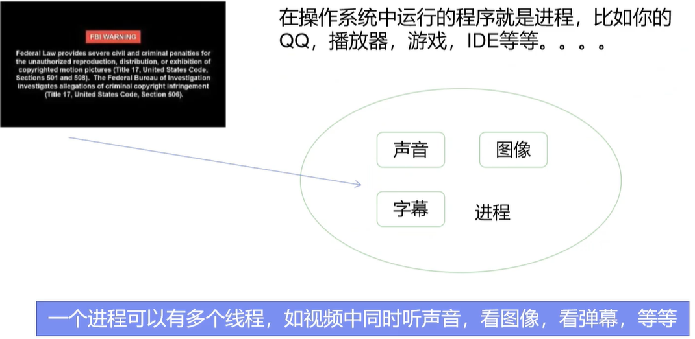
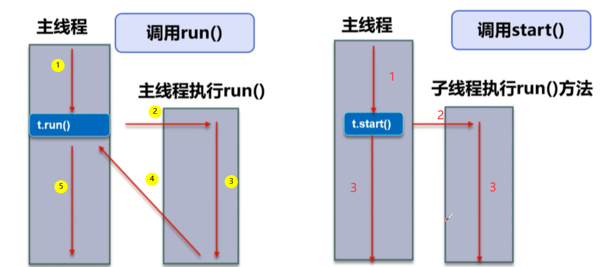
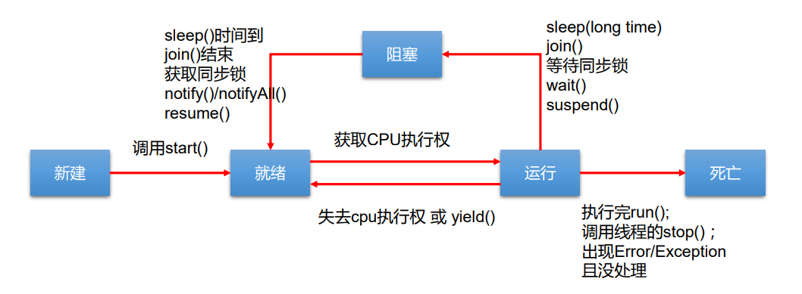
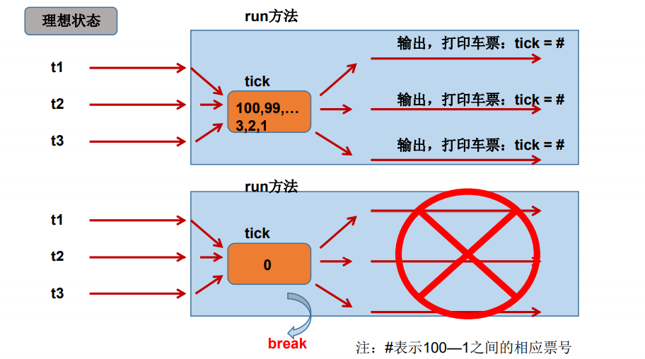
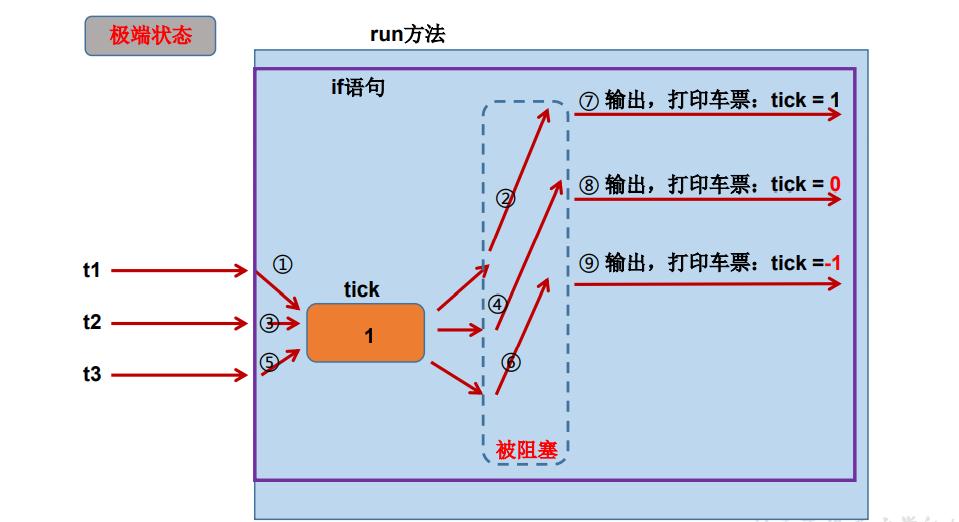
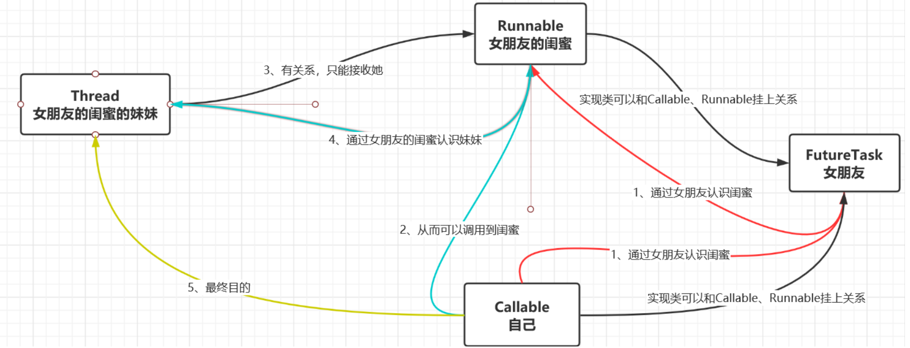

# 多线程

重点：线程的创建和使用、线程同步

## 01_基本概念：程序、进程、线程

### 什么是程序、进程、线程

- 程序（program）：是为完成特定任务、用某种语言编写的一组指令的集合。即指一 段**静态的代码**，静态对象。
- 进程（process）：是程序的一次执行过程，或是**正在运行的一个程序**。是一个动态的过程：有它自身的产生、存在和消亡的过程（即生命周期）。
  - 如：运行中的QQ，运行中的IDEA
  - 程序是静态的，进程是动态的
  - **进程作为资源分配的基本单位**，系统在运行时会为每个进程分配不同的内存区域
- 线程（thread）：进程可进一步细化为线程，是一个程序内部的一条执行路径。
  - 线程是一个比进程更小的执行单位，一个进程在其执行过程中可以产生多个线程。与进程不同的是同类的多个线程共享进程的堆和方法区资源，但是每个线程拥有自己独立的程序计数器、虚拟机栈、本地方法栈。所以系统在产生一个线程或是在各个线程之间切换工作时，负担会比进程小得多，正因如此，线程也被称之为轻量级进程。
  - 若一个进程同一时间**并行**执行多个线程，就是支持多线程的
  - 一个进程中的多个线程共享相同的内存单元/内存地址空间，它们从同一堆中分配对象，可以访问相同的变量和对象。这就使得线程间通信更简便、高效。但多个线程操作共享的系统资源可能就会带来**安全的隐患**。


JVM执行程序过程：

1. 加载.class文件
2. 管理并分配内存
3. 执行垃圾收集

JVM = 类加载器 + 执行引擎 + 运行时数据区

运行时数据区：

- 程序计数器，程序计数器主要有下面两个作用：
  - 字节码解释器通过改变程序计数器来依次读取指令，从而实现代码的流程控制，如：顺序执行、选择、循环、异常处理。
  - 在多线程的情况下，程序计数器用于记录当前线程执行的位置，从而当线程被切换回来的时候能够知道该线程上次运行到哪儿了。
- 虚拟机栈：
  -  **每个** Java 方法在**执行**的同时会创建一个栈帧用于存储局部变量表、操作数栈、常量池引用等信息。从方法调用直至执行完成的过程，就对应着一个栈帧在 Java 虚拟机栈中入栈和出栈的过程。
- 本地方法栈：
  - 和虚拟机栈所发挥的作用非常相似，区别是： 虚拟机栈为虚拟机执行 Java 方法 （也就是字节码）服务，而本地方法栈则为虚拟机使用到的 Native 方法服务。 
- 堆和方法区
  - 堆和方法区是**所有线程共享的资源**，其中堆是进程中最大的一块内存，主要用于存放新创建的对象 （所有对象都在这里分配内存），方法区主要用于存放已被加载的类信息、常量、静态变量、即时编译器编译后的代码等数据。

### 进程和线程的区别与联系

进程是程序的一次执行过程，是系统运行程序的基本单位，因此进程是动态的，系统运行一个程序就是一个进程从创建、运行、消亡的过程。在Java中，当我们启动main函数时，其实就是启动了一个JVM进程，而main函数所在的线程就是这个进程中的一个线程，也称主线程。

 


1. 进程是资源分配的最小单位，线程是程序执行的最小单位
2. 一个程序运行至少有一个进程，一个进程中至少包含一个线程，线程是进程的组成部分
3. 进程在执行过程中拥有独立的内存单元，每启动一个进程，系统就会为它分配地址空间，这种操作非常昂贵。而线程共享内存资源使用相同的地址空间。因此cpu切换一个线程花费远比进程要小的多，创建一个线程的开销也比进程要小的多。

### 单核CPU和多核CPU

单核CPU，其实是一种假的多线程，因为在一个时间单元内，也只能执行一个线程的任务。例如：虽然有多车道，但是收费站只有一个工作人员在收费，只有收了费才能通过，那么CPU就好比收费人员。如果有某个人不想交钱，那么收费人员可以把他“挂起”（晾着他，等他想通了，准备好了钱，再去收费）。但是因为CPU时间单元特别短，因此感觉不出来。

如果是多核的话，才能更好的发挥多线程的效率。（现在的服务器都是多核的）。

一个Java应用程序java.exe，其实至少有三个线程：main()主线程，gc() 垃圾回收线程，异常处理线程。当然如果发生异常，会影响主线程。


思考点：

1. 多核CPU和多CPU不是一个概念，多核CPU指一个CPU具有多个核心
2. CPU的核心数是指物理上，也就是硬件上存在有几个核心。举个例子，双核就是包括2个相对独立的CPU核心单元组，四核就包含4个相对独立的CPU核心单元组
3. 线程数是一种逻辑的概念，也就是模拟出的CPU核心数。 例如，可以通过一个CPU核心数模拟出2线程的CPU，也就是说，这个单核心的CPU被模拟成了一个类似双核心CPU的功能
4. 双核四线程就是采用超线程（通过在一枚处理器上整合两个逻辑处理器单元，使得具有这种技术的新型CPU，有能同时执行多个线程的能力，这就是我们所说的超线程）的技术，比四核四线程性能差60%左右。

### 并行与并发

- **并发：** 同一时间段，多个任务都在执行 (单位时间内不一定同时执行)；表示多个任务交替执行；一个CPU(采用时间片)同时执行多个任务。比如：秒杀、多个人做同一件事。罗志祥？打篮球：多个场地为并行，单个场地为并发。
- **并行：** 单位时间内即某个时刻，多个任务同时执行。表示多个任务一起执行；多个CPU同时执行多个任务。比如：多个人同时做不同的事。

### 线程的分类

Java中的线程分为两类：一种是**守护线程**，一种是**用户线程**。

- 它们在几乎每个方面都是相同的，唯一的区别是判断JVM何时离开。
- 守护线程是用来服务用户线程的，通过在start()方法前调用 thread.setDaemon(true)可以把一个用户线程变成一个守护线程。
- Java垃圾回收就是一个典型的守护线程。
- 若JVM中都是守护线程，当前JVM将退出。
- 形象理解：兔死狗烹，鸟尽弓藏

### 多线程优点

 


**背景：**以单核CPU为例，只使用单个线程先后完成多个任务（调用多个方法），肯定比用多个线程来完成用的时间更短（因为多个线程之间需要不停的切换，但是多核确实快），但是为何仍需多线程呢？

多线程程序的优点： 

1. 提高应用程序的响应。对图形化界面更有意义，可增强用户体验，让人感觉都在做。
2. 提高计算机系统CPU的利用率 。这个如何理解呢，例如我们需要把A盘1G复制到B盘，C盘1G复制到D盘，我们采用第一种方式先后完成多个任务，还需要我们手动看见第一个刚复制完就去提交第二个任务，CPU利用率没有完全利用起来。
3. 改善程序结构。将既长又复杂的进程分为多个线程，独立运行，利于理解和修改。不同的事用不同的线程去体现。

 

先从总体上来说：

- **从计算机底层来说：** 线程可以比作是轻量级的进程，是程序执行的最小单位，线程间的切换和调度的成本远远小于进程。另外，多核 CPU 时代意味着多个线程可以同时运行，这减少了线程上下文切换的开销。
- **从当代互联网发展趋势来说：** 现在的系统动不动就要求百万级甚至千万级的并发量，而多线程并发编程正是开发高并发系统的基础，利用好多线程机制可以大大提高系统整体的并发能力以及性能。

再深入到计算机底层来探讨：

- **单核时代：** 在单核时代多线程主要是为了提高 CPU 和 IO 设备的综合利用率。举个例子：当只有一个线程的时候会导致 CPU 计算时，IO 设备空闲；进行 IO 操作时，CPU 空闲。我们可以简单地说这两者的利用率目前都是 50%左右。但是当有两个线程的时候就不一样了，当一个线程执行 CPU 计算时，另外一个线程可以进行 IO 操作，这样两个的利用率就可以在理想情况下达到 100%了。
- **多核时代:** 多核时代多线程主要是为了提高 CPU 利用率。举个例子：假如我们要计算一个复杂的任务，我们只用一个线程的话，CPU 只会一个 CPU 核心被利用到，而创建多个线程就可以让多个 CPU 核心被利用到，这样就提高了 CPU 的利用率。

### 什么时候使用多线程

1. 程序需要同时执行两个或多个任务。例如垃圾回收和主线程。
2. 程序需要实现一些需要等待的任务时，如用户输入、文件读写操作、网络操作、搜索等。例如小程序首页图片服务肯定是用一个线程从下载中心读取图片。
3. 需要一些后台运行的程序时。

## 02_线程的创建和使用

通过上面对线程的了解，来看看`Java`语言中对线程的支持。

`public class Thread extends Object implements Runnable：A thread is a thread of execution in a program. The Java Virtual Machine allows an application to have multiple threads of execution running concurrently. `

`There are two ways to create a new thread of execution. One is to declare a class to be a subclass of Thread. This subclass should override the run method of class Thread. An instance of the subclass can then be allocated and started.The other way to create a thread is to declare a class that implements the Runnable interface. That class then implements the run method. An instance of the class can then be allocated, passed as an argument when creating Thread`

这是来自官网的一些话，大概意思是Java语言的JVM允许程序运行多个线程，它通过`java.lang.Thread `类来体现。并且JDK1.5之前API中创建新的线程的方式有两种：

1. 继承Thread类的方式：继承Thread类，重写run()方法，创建线程对象调用start()开启线程
2. 实现Runnable接口的方式

### 认识Thread类

首先先来认识一下`Thread`类：

> Thread类的特性：

1. 每个线程都是通过某个特定Thread对象的run()方法来完成操作的，经常 把run()方法的主体称为线程体
2. 通过该Thread对象的start()方法来启动这个线程，而非直接调用run()

> Thread类构造器：

1. Thread()：创建新的Thread对象
2. Thread(String threadname)：创建线程并指定线程实例名
3. Thread(Runnable target)：指定创建线程的目标对象，它实现了Runnable接口中的run方法
4. Thread(Runnable target, String name)：创建新的Thread对象

> Thread类的有关方法：

1. **void start()：**启动线程，并执行对象的run()方法
2. **run()：**线程在被调度时执行的操作
3. **String getName()：**返回线程的名称
4. **void setName(String name)：**设置该线程名称
5. **static Thread currentThread()：**返回当前线程。在Thread子类中就 是this，通常用于主线程和Runnable实现类
6. **static void yield()：**线程让步
   1. 暂停当前正在执行的线程，把执行机会让给优先级相同或更高的线程
   2. 若队列中没有同优先级的线程，忽略此方法
7. **join() ：**当某个程序a执行流中调用其他线程b的 join() 方法时，调用线程a将被阻塞，直到 join() 方法加入的 join 线程b执行完为止
   1. 低优先级的线程也可以获得执行
8. **static void sleep(long millis)：**(指定时间:毫秒)
   1. 令当前活动线程在指定时间段内放弃对CPU控制，使其他线程有机会被执行，当前线程是阻塞状态，时间到后重排队。
   2. 抛出InterruptedException异常
9. stop()：强制线程生命期结束，不推荐使用，已过时
10. boolean isAlive()：返回boolean，判断线程是否还活着

> yield和join的区别

yield就是我放弃了但是我不给你，我们再次公平竞争。

yield()就是争球，join()就是球权转换。

礼让与插队。

join()指定继承人，yield()放出来一起争抢。

> 线程的调度

调度策略：

- 时间片 
- 抢占式：高优先级的线程抢占CPU

Java的调度方法：

- 同优先级线程组成先进先出队列（先到先服务），使用时间片策略
- 对高优先级，使用优先调度的抢占式策略

> 线程的优先级

线程的优先等级：

- MAX_PRIORITY：10
- MIN _PRIORITY：1
- NORM_PRIORITY：5

涉及的方法：

- getPriority() ：返回线程优先值
- setPriority(int newPriority) ：改变线程的优先级

说明：

- 线程创建时继承父线程的优先级
- 低优先级只是获得调度的概率低，并非一定是在高优先级线程之后才被调用

### 创建多线程方式一：继承Thread类

> 创建一个新的线程执行打印100以内的偶数

1. 定义子类继承Thread类。
2. 子类中重写Thread类中的run方法。（重要：将此线程的操作放在run方法中）
3. 创建Thread子类对象，即创建了线程对象。
4. 调用线程对象start方法：启动线程，调用run方法。

```java
// 1.自定义线程类继承Thread具备多线程能力
public class MyThread1 extends Thread {
    // 2.子类中重写Thread类中的run方法(重要:将此线程的操作放在run方法中)即子线程打印100以内的偶数
    @Override
    public void run() {
        for (int i = 0; i < 100; i++) {
            if (i % 2 == 0) {
                System.out.println("sub-thread" + i);
            }
        }
    }
}

public class Test{
    public static void main(String[] args) {
        // 3.创建Thread子类对象，即创建了线程对象。
        MyThread1 myThread1 = new MyThread1();
        // 4.调用线程对象start方法：启动线程，调用run方法。
        myThread1.start();
        
        // 为了感受多线程在某时间内切换执行,主线程也打印1-100的数字
        for (int i = 0; i < 100; i++) {
            System.out.println("main-thread" + i);
        }
    }
}
```

交替执行结果：

```
main-thread0
sub-thread0
sub-thread2
sub-thread4
main-thread1
sub-thread6
```

> start()方法的作用：

` Causes this thread to begin execution; the Java Virtual Machine calls the run method of this thread.`

1. 启动当前线程
2. 调用当前线程的`run()`方法
3. 当用`start()`开始一个线程后，线程就进入就绪状态，使线程所代表的虚拟处理机处于可运行状态，这意味着它可以由JVM调度并执行。但是这并不意味着线程就会立即运行。只有当`run()`分配时间片时，这个线程获得时间片时，才开始执行`run()`方法。`start()`是方法，它调用`run()`方法.而`run()`方法是你必须重写的。`run()`方法中包含的是线程的主体(真正的逻辑)。

> 注意：

1. 如果自己手动调用run()方法，那么就只是普通方法，没有启动多线程模式。我们不能通过直接调用`run()`的方式启动线程。可以使用`Thread.currentThread().getName()`获取当前线程名称来看到底都是谁执行的

2. run()方法由JVM调用，什么时候调用，执行的过程控制都有操作系统的CPU 调度决定。

3. 想要启动多线程，必须调用start方法。

4. 一个线程对象只能调用一次start()方法启动，如果重复调用了，则将抛出以上 的异常`IllegalThreadStateException`。我们需要重新创建一个线程实例。

   ```java
   public synchronized void start() {
       // 如果线程状态不等于NEW
       if (threadStatus != 0)
           throw new IllegalThreadStateException();
   }
   ```

> 创建Thread类的匿名子类的方式

创建两个子线程分别实现打印100以内的偶数和奇数，因为我们上面创建出来的子类对象只用了一次，所以我们创建匿名子类的方式：

```java
public static void main(String[] args) {
    new Thread() {
        @Override
        public void run() {
            for (int i = 0; i < 100; i++) {
                if (i % 2 == 0) {
                    System.out.println("sub-thread" + Thread.currentThread().getName() + i);
                }
            }
        }
    }.start();

    new Thread() {
        @Override
        public void run() {
            for (int i = 0; i < 100; i++) {
                if (i % 2 != 0) {
                    System.out.println("sub-thread" + Thread.currentThread().getName() + i);
                }
            }
        }
    }.start();
}
```

又因为我们创建的匿名子类也就实现了`run()`方法，所以我们可以使用`lambda`的方式简化：并且可以将线程名称自定义写入

```java
public static void main(String[] args) {
    new Thread(() -> {
        for (int i = 0; i < 100; i++) {
            if (i % 2 == 0) {
                System.out.println(Thread.currentThread().getName() + i);
            }
        }
    },"sub-thread01").start();

    new Thread(() -> {
        for (int i = 0; i < 100; i++) {
            if (i % 2 != 0) {
                System.out.println(Thread.currentThread().getName() + i);
            }
        }
    },"sub-thread02").start();
}
```

> 实例：下载图片

1、导入依赖

```xml
<!-- 导入commons-io依赖：针对开发io流功能的工具类库 -->
<dependency>
    <groupId>commons-io</groupId>
    <artifactId>commons-io</artifactId>
    <version>2.6</version>
</dependency>
```

2、自定义下载器类

```java
/**
 * 下载器
 */
class WebDownloader{
    /**
     *
     * @param url 参数一：网络图片地址
     * @param name 参数二：保存的文件名称
     */
    public void downloader(String url,String name){
        try {
            FileUtils.copyURLToFile(new URL(url),new File(name));
        } catch (IOException e) {
            e.printStackTrace();
            System.out.println("IO异常,downloader方法出现问题");
        }
    }
}
```

3、自定义线程类并继承Thread类

```java
public class ThreadExample1 extends Thread{
    /**
     * 网络图片地址
     */
    private String url;
    /**
     * 保存的文件名称
     */
    private String name;

    /**
     * 构造方法
     */
    public ThreadExample1(String url,String name){
        this.url = url;
        this.name = name;
    }

    /**
     * 下载图片线程的执行体
     */ 
    @Override
    public void run() {
        WebDownloader webDownloader = new WebDownloader();
        webDownloader.downloader(url,name);
        System.out.println("下载的文件名为："+name);
    }
}
```

4、创建线程对象并启动线程

```java
public static void main(String[] args) {
    // 创建线程对象
    ThreadExample1 thread1 = new ThreadExample1("https://img-s-msn-com.akamaized.net/tenant/amp/entityid/BB14cOxg.img?h=536&w=799&m=6&q=60&o=f&l=f","photo1.jpg");
    ThreadExample1 thread2 = new ThreadExample1("https://img-s-msn-com.akamaized.net/tenant/amp/entityid/BB13MBuz.img?h=266&w=799&m=6&q=60&o=f&l=f","photo2.jpg");
    ThreadExample1 thread3 = new ThreadExample1("http://inews.gtimg.com/newsapp_bt/0/11718908077/1000","photo3.jpg");

    // 启动线程:理想是先下载1、2、3,结果是3、1、2,证明了同时执行的概念
    thread1.start();
    thread2.start();
    thread3.start();
}
```

### 创建多线程方式二：实现Runnable接口

1. 创建一个实现了`Runnable`接口的类
2. 实现类去实现`Runnable`中的抽象方法`run()`
3. 创建实现类的对象
4. 将此对象作为参数传递到`Thread`类的构造器中，创建`Thread`类的对象
5. 通过`Thread`类的对象调用`start()`

```java
// 1.创建一个实现了Runnable接口的类
public class MyThread4 implements Runnable {
    // 2.实现类去实现Runnable中的抽象方法run()
    @Override
    public void run() {
        for (int i = 0; i < 100; i++) {
            if (i % 2 == 0) {
                System.out.println(Thread.currentThread().getName() + ":" + i);
            }
        }
    }
}

public class Test {
    public static void main(String[] args) {
        // 3.创建实现类的对象
        MyThread4 myThread4 = new MyThread4();
        // 4.将此对象作为参数传递到Thread类的构造器中，创建Thread类的对象
        Thread thread = new Thread(myThread4);
        // 5.通过Thread类的对象调用start()
        thread.start();
    }
}
```

实际上这两种启动线程的方式原理是一样的。首先都是调用本地方法启动一个线程，其次是在这个线程里执行目标对象的`run()`方法。那么这个目标对象是什么呢？为了弄明白这个问题，我们来看看`Thread`类的`run()`方法的实现：

当我们采用实现`Runnable`接口的方式来实现线程的情况下，在调用`new Thread(Runnable target)`构造器时，将实现`Runnable`接口的类的实例设置成了线程要执行的主体所属的目标对象`target`，当线程启动时，这个实例的 `run()`方法就被执行了。

当我们采用继承`Thread`的方式实现线程时，线程的这个`run()`方法被重写了，所以当线程启动时，执行的是这个对象自身的` run()`方法。

**总结起来**：如果我们采用的是继承`Thread`类的方式，那么这个`target`就是线程对象自身，如果我们采用的是实现`Runnable`接口的方式，那么这个`target`就是实现了`Runnable`接口的类的实例。

```java
public class Thread implements Runnable {
    /* What will be run. */
    private Runnable target;

    // 适配器模式
    public Thread(Runnable target) {
        init(null, target, "Thread-" + nextThreadNum(), 0);
    }

    @Override
    public void run() {
        if (target != null) {
            target.run();
        }
    }
}
```

### 初识并发问题

> 继承Thread的方式

案例：全国有北京、上海、西安三个窗口卖周杰伦演唱会门票，共100张，存在线程安全问题，待解决。使用继承

```java
public class Window extends Thread {
    private static int ticket = 100;

    @Override
    public void run() {
        while (true) {
            if (ticket > 0) {
                System.out.println(Thread.currentThread().getName() + "卖票，票号为：" + ticket);
                ticket--;
            } else {
                break;
            }

        }
    }
}

public class Test {
    public static void main(String[] args) {
        Window window1 = new Window();
        Window window2 = new Window();
        Window window3 = new Window();

        window1.setName("窗口1");
        window2.setName("窗口2");
        window3.setName("窗口3");

        window1.start();
        window2.start();
        window3.start();
    }
}
```

结果中我们看到：窗口1、2、3竟然都卖出了票号100的票，线程不安全的问题出现了！

```java
窗口1卖票，票号为：100
窗口3卖票，票号为：100
窗口3卖票，票号为：98
窗口3卖票，票号为：97
窗口3卖票，票号为：96
窗口3卖票，票号为：95
窗口3卖票，票号为：94
窗口3卖票，票号为：93
窗口3卖票，票号为：92
窗口2卖票，票号为：100
```

> 实现Runnable方式

通过上面的初识并发问题，我们用`static`修饰了票数，如果不用这个关键字修饰呢？

```java
public class Window implements Runnable {
    private int ticket = 100;

    @Override
    public void run() {
        while (true) {
            if (ticket > 0) {
                System.out.println(Thread.currentThread().getName() + "卖票，票号为：" + ticket);
                ticket--;
            } else {
                break;
            }
        }
    }
}

public class Test {
    public static void main(String[] args) {
        Window window = new Window();
        Thread window1 = new Thread(window);
        Thread window2 = new Thread(window);
        Thread window3 = new Thread(window);

        window1.setName("窗口1");
        window2.setName("窗口2");
        window3.setName("窗口3");

        window1.start();
        window2.start();
        window3.start();
    }
}
```

结果中我们看到：窗口1、2、3竟然都卖出了票号100的票，线程不安全的问题虽然依然存在，但是票不用加`static`关键字修饰了

```java
窗口1卖票，票号为：100
窗口3卖票，票号为：100
窗口2卖票，票号为：100
```

因为只`new`了一个，三个代理，一个对象。同一个对象地址，三个线程操作。

### 两种创建方式的对比

开发中，优先选择实现`Runnable`接口的方式（其实后续也不这么用，资源类应该与线程调用解耦）

区别：

1. 继承Thread：线程代码存放Thread子类run方法中。
2.  实现Runnable：线程代码存在接口的子类的run方法。

原因：

1. 实现的方式没有类的单继承的局限性
2. 实现的方式更适合来处理多个线程有共享数据的情况。多个线程可以共享同一个接口实现类的对象，非常适合多个相同线 程来处理同一份资源。

联系：`public class Thread implements Runnable`，典型的代理模式

相同点：两种方式都需要重写`run()`，将线程需要执行的逻辑声明在`run()`中

## 03_线程的生命周期

JDK中用Thread.State类定义了线程的几种状态，要想实现多线程，必须在主线程中创建新的线程对象。Java语言使用Thread类 及其子类的对象来表示线程，在它的一个完整的生命周期中通常要经历如下的五种状态：

- 新建（New）： 当一个Thread类或其子类的对象被声明并创建时，新生的线程对象处于新建状态
- 就绪（Runnable）：处于新建状态的线程被start()后，将进入线程队列等待CPU时间片，此时它已具备了运行的条件，只是没分配到CPU资源
- 运行（Running）：当就绪的线程被调度并获得CPU资源时，便进入运行状态， run()方法定义了线程的操作和功能
- 阻塞（Blocked）：在某种特殊情况下，被人为挂起或执行输入输出操作时，让出 CPU 并临时中止自己的执行，进入阻塞状态
  - 等待阻塞：运行状态中的线程执行wait()方法，使本线程进入到等待阻塞状态；
  - 同步阻塞：线程在获取synchronized同步锁失败(因为锁被其它线程所占用)，它会进入同步阻塞状态；
  - 其他阻塞：通过调用线程的sleep()或join()或发出了I/O请求时，线程会进入到阻塞状态。当sleep()状态超时、join()等待线程终止或者超时、或者I/O处理完毕时，线程重新转入就绪状态；
- 死亡（Dead）：线程完成了它的全部工作或线程被提前强制性地中止或出现异常导致结束

 

### 线程停止

- 不推荐使用JDK提供的stop()、destory()方法（已经废弃）
- 推荐线程自己停下来
- 建议使用一个标志位进行终止变量，当flag = false，则终止线程运行

```java
public class TestStop implements Runnable {x
    // 1.设置一个标志位
    private boolean flag = true;

    @Override
    public void run() {
        int i = 0 ;
        while(flag){
            System.out.println("run...Thread"+i++);
        }
    }

    // 设置一个公开的方法停止线程，转换标志位
    public void stop(){
        this.flag = false;
    }

    public static void main(String[] args) {
        TestStop testStop = new TestStop();
        new Thread(testStop).start();
        for (int i = 0; i < 1000; i++) {
            System.out.println("main"+i);
            if(i == 900){
                // 调用stop方法切换标志位，让线程停止
                testStop.stop();
                System.out.println("线程该停止了");
            }
        }
    }
}
```

### 线程休眠

- sleep（时间）指定当前线程阻塞的毫秒数；
- sleep存在异常InterruptedException；
- sleep时间达到后线程进入到就绪状态；
- sleep可以模仿网络延时，倒计时等；
- 每一个对象都有一个锁，sleep不会释放锁

> 模拟倒计时

```java
public class TestSleep2 {
    public static void main(String[] args) {
        try {
            tenDown();
        } catch (InterruptedException e) {
            e.printStackTrace();
        }
    }
    public static void tenDown() throws InterruptedException {
        int num = 10;
        while(true){
            Thread.sleep(1000);
            System.out.println(num--);
            if (num <= 0){
                break;
            }
        }
    }
}
```

> 打印当前系统时间

```java
public class TestSleep3 {
    public static void main(String[] args) throws InterruptedException {
        Date startTime = new Date(System.currentTimeMillis());  // 获取系统当前时间
        while(true){
            Thread.sleep(1000);
            System.out.println(new SimpleDateFormat("HH:mm:ss").format(startTime)); //格式化时间
            startTime = new Date(System.currentTimeMillis());   //更新当前时间
        }
    }
}
```

### 线程礼让

- 礼让线程，让当前正在执行的线程暂停，但不阻塞
- 将线程从运行状态转换为就绪状态
- 让CPU重新调度，礼让不一定成功！看CPU的心情

>AABB-->ABAB

```java
public class TestYield {
    public static void main(String[] args) {
        MyYield myYield = new MyYield();
        new Thread(myYield,"A").start();
        new Thread(myYield,"B").start();
    }
}

class MyYield implements Runnable{
    @Override
    public void run() {
        System.out.println(Thread.currentThread().getName()+"线程开始执行");
        Thread.yield(); //礼让
        System.out.println(Thread.currentThread().getName()+"线程停止执行");
    }
}
```

### 线程插队

- Join合并线程，待插入线程执行完之后，再执行当前线程，当前线程阻塞
- 可以想象成插队

```java
public class TestJoin implements Runnable{
    @Override
    public void run() {
        for (int i = 0; i < 100; i++) {
            System.out.println("线程VIP来了"+i);
        }
    }

    public static void main(String[] args) throws InterruptedException {
        // 启动线程
        TestJoin testJoin = new TestJoin();
        Thread thread = new Thread(testJoin);
        thread.start();

        // 主线程
        for (int i = 0; i < 1000; i++) {
            if(i == 200){
                thread.join();  // 插队
            }
            System.out.println("main"+i);
        }
    }
}
```

### 守护线程daemon

核心概念中有：在程序运行时，即使没有自己创建线程，后台也会有多个线程，如main主线程（用户线程），gc线程（守护线程）；

- 线程分为用户线程和守护线程
- 虚拟机必须确保用户线程执行完毕
- 虚拟机不用等待守护线程执行完毕
- 守护线程有：后台记录操作日志、监控内存、垃圾回收等待 

> 代码测试：上帝是守护线程，你是用户线程

```java
public class TestDaemon {
    public static void main(String[] args) {
        God god = new God();
        You you = new You();

        Thread thread = new Thread(god);
        // 默认是false,表示是用户线程，正常的线程都是用户线程
        thread.setDaemon(true);
        // 上帝：守护线程启动
        thread.start();

        // 你：用户线程启动
        new Thread(you).start();
    }
}

// 上帝
class God implements Runnable{
    @Override
    public void run() {
        while (true){
            System.out.println("上帝保佑着你");
        }
    }
}

// 你
class You implements Runnable{
    @Override
    public void run() {
        for (int i = 0; i < 500; i++) {
            System.out.println("你一生都开心的活着");
        }
        System.out.println("=====GoodBy，World！=====");
    }
}
```

## 04_线程的同步

临界资源（线程之间的共享数据）才会出现线程安全问题

多个线程操作同一个资源就叫做并发（上万人同时抢100张票，两个银行同时取钱）

### 抢票案例

还是上面的抢票案例，如果我们将`Thread.sleep(100)`这条语句放在指定位置，那么超卖的现象会加重，为什么呢？

```java
public class Window implements Runnable {
    private int ticket = 100;

    @Override
    public void run() {
        while (true) {
            if (ticket > 0) {
                // 睡眠100ms
                Thread.sleep(100);
                System.out.println(Thread.currentThread().getName() + "卖票，票号为：" + ticket);
                ticket--;
            } else {
                break;
            }
        }
    }
}

public class Test {
    public static void main(String[] args) {
        Window window = new Window();
        Thread window1 = new Thread(window);
        Thread window2 = new Thread(window);
        Thread window3 = new Thread(window);

        window1.setName("窗口1");
        window2.setName("窗口2");
        window3.setName("窗口3");

        window1.start();
        window2.start();
        window3.start();
    }
}
```

理想状态下最后一张票：
 

极端状态下最后一张票：

​	 

1. 多线程出现了安全问题（买票的过程中出现了重票、错票）
2. 问题的原因：当多条语句在操作同一个线程共享数据时，一个线程对多条语句只执行了一部分，还没有执行完（我们刚刚用sleep模拟），另一个线程参与进来执行。导致共享数据的错误。
3. 解决方法：对多条操作共享数据的语句，只能让一个线程都执行完，在执行过程中，其他线程不可以参与执行。（知道a线程操作完ticket时，其他线程才可以开始操作ticket，这种情况即使a出现了阻塞，也不能被改变）
4. 在Java中我们通过同步机制，来解决线程安全的问题。

### 线程的同步机制：synchronized

1. 临界资源（线程之间的共享数据）才会出现线程安全问题
2. 只有对临界资源进行修改的时候才需要同步机制
3. 多个线程操作同一个资源就叫做并发（上万人同时抢100张票，两个银行同时取钱）
4. 线程同步：
   1. 现实生活中我们会遇到"同一个资源，多个人都想使用"的问题，比如食堂排队打饭，每个人都想吃饭，最天然的解决办法就是排队，一个个来。
   2. 处理多线程问题时，多个线程访问同一个对象，并且某些线程还想修改这个对象。这时候我们就需要线程同步，线程同步其实就是一种等待机制，多个需要同时访问此对象的线程进入这个对象的等待池形成队列，等待前面线程使用完毕，下一个线程再使用
5. 线程同步形成条件：队列+锁
6. 线程同步的概念：由于同一进程的多个线程共享同一块存储空间，在带来方便的同时，也带来了访问冲突的问题，为了保证数据在方法中被访问时的正确性，在访问时加入锁机制synchronized，当一个线程获得对象的排它锁，独占资源，其他线程必须等待，使用后释放锁。存在以下问题：
   1. 一个线程持有锁会导致其他所有需要此锁的线程挂起；
   2. 在多线程竞争下，加锁、释放锁会导致比较多的上下切换和调度延时，引起性能问题；
   3. 如果一个优先级高的线程等待一个优先级低的线程释放锁，会导致优先级倒置，引起性能问题

上面我们说到，在Java中我们通过同步机制，来解决线程安全的问题：

#### 方法一：同步代码块

```java
synchronized(同步监视器){
	// 需要被同步的代码
}
```

1. 需要被同步的代码：即为操作共享数据的代码。（不能包含代码多了也不能包含代码少了）
2. 共享数据：多个线程共同操作的变量，比如上述卖票案例中，ticket就是共享数据
3. 同步监视器：**俗称"锁"。任何一个类的对象，都可以充当锁。要求：多个线程必须要共用一把锁（火车上厕所的指示灯，多个人看见的是一个灯）**
4. 补充：在实现`Runnable`接口创建多线程的方式中，我们可以考虑使用this充当同步监视器。在继承`Thread`类创建多线程的方式中，慎用this充当同步监视器，可以考虑使用当前类充当同步监视器。

> 使用同步代码块解决实现`Runnable`的线程安全问题：

```java
public class Window implements Runnable {
    private int ticket = 100;

    /**
     * 线程的共享对象
     */
    Object object = new Object();
    @Override
    public void run() {
        while (true) {
            synchronized (object){		// 方式二:synchronized (this) this代表调用这个run方法的对象window
                if (ticket > 0) {
                    try {
                        Thread.sleep(100);
                    } catch (InterruptedException e) {
                        e.printStackTrace();
                    }
                    System.out.println(Thread.currentThread().getName() + "卖票，票号为：" + ticket);
                    ticket--;
                } else {
                    break;
                }
            }
        }
    }
}

public class Test {
    public static void main(String[] args) {
        Window window = new Window();
        Thread window1 = new Thread(window);
        Thread window2 = new Thread(window);
        Thread window3 = new Thread(window);

        window1.setName("窗口1");
        window2.setName("窗口2");
        window3.setName("窗口3");

        window1.start();
        window2.start();
        window3.start();
    }
}
```

> 使用同步代码块解决继承`Thread`的线程安全问题：

```java
public class Window extends Thread {
    private static int ticket = 100;

     /**
     * 线程的共享对象也要是静态的
     */
    private static Object object = new Object();

    @Override
    public void run() {
        synchronized (object) {		// 错误的方式:synchronized (this) this代表window1,window2,window3,对象不唯一锁也不唯一
            // 方式二: synchronized (Window.class),代表类也是对象,反射会讲。Window类只会加载一次
            while (true) {
                if (ticket > 0) {
                    try {
                        Thread.sleep(100);
                    } catch (InterruptedException e) {
                        e.printStackTrace();
                    }
                    System.out.println(Thread.currentThread().getName() + "卖票，票号为：" + ticket);
                    ticket--;
                } else {
                    break;
                }
            }
        }
    }
}

public class Test {
    public static void main(String[] args) {
        Window window1 = new Window();
        Window window2 = new Window();
        Window window3 = new Window();

        window1.setName("窗口1");
        window2.setName("窗口2");
        window3.setName("窗口3");

        window1.start();
        window2.start();
        window3.start();
    }
}
```

#### 方法二：同步方法

如果操作共享数据的代码完整的声明在一个方法中，我们不妨将此方法声明为同步方法。

1. 同步方法仍然涉及到同步监视器，只是不需要显示的声明

2. 对于实现`Runnable`的线程，非静态的同步方法，同步监视器是当前对象：this

   对于继承`Thread`的线程，静态的同步方法，同步监视器是当前类本身

> 使用同步方法解决实现`Runnable`的线程安全问题：

```java
public class Window implements Runnable {
    private int ticket = 100;

    @Override
    public void run() {
        while (true) {
            fun();
        }
    }

    public synchronized void fun() {
        if (ticket > 0) {
            try {
                Thread.sleep(100);
            } catch (InterruptedException e) {
                e.printStackTrace();
            }
            System.out.println(Thread.currentThread().getName() + "卖票，票号为：" + ticket);
            ticket--;
        }
    }
}

public class Test {
    public static void main(String[] args) {
        Window window = new Window();
        Thread window1 = new Thread(window);
        Thread window2 = new Thread(window);
        Thread window3 = new Thread(window);

        window1.setName("窗口1");
        window2.setName("窗口2");
        window3.setName("窗口3");

        window1.start();
        window2.start();
        window3.start();
    }
}
```

> 使用同步方法解决继承`Thread`的线程安全问题：

```java
public class Window extends Thread {
    private static int ticket = 100;

    @Override
    public void run() {
        while (true) {
            fun();
        }
    }

    public static synchronized void fun(){
        if (ticket > 0) {
            try {
                Thread.sleep(100);
            } catch (InterruptedException e) {
                e.printStackTrace();
            }
            System.out.println(Thread.currentThread().getName() + "卖票，票号为：" + ticket);
            ticket--;
        }
    }
}

public class Test {
    public static void main(String[] args) {
        Window window1 = new Window();
        Window window2 = new Window();
        Window window3 = new Window();

        window1.setName("窗口1");
        window2.setName("窗口2");
        window3.setName("窗口3");

        window1.start();
        window2.start();
        window3.start();
    }
}
```

#### 总结：同步机制中的锁

同步锁机制：

在《Thinking in Java》中，是这么说的：对于并发工作，你需要某种方式来防止两个任务访问相同的资源（其实就是共享资源竞争）。 防止这种冲突的方法就是当资源被一个任务使用时，在其上加锁。第一个访问某项资源的任务必须锁定这项资源，使其他任务在其被解锁之前，就无法访问它了，而在其被解锁之时，另一个任务就可以锁定并使用它了。

 synchronized的锁是什么？

1. 任意对象都可以作为同步锁。所有对象都自动含有单一的锁（监视器）。
2. 同步方法的锁：静态方法（类名.class）、非静态方法（this）
3.  同步代码块：自己指定，很多时候也是指定为this或类名.class

注意：

1. 必须确保使用同一个资源的**多个线程共用一把锁**，这个非常重要，否则就无法保证共享资源的安全
2. 一个线程类中的所有静态方法共用同一把锁（类名.class），所有非静态方法共用同一把锁（this），同步代码块（指定需谨慎）

同步监视器的监视过程：

1. 第一个线程访问，锁定同步监视器，执行其中代码
2. 第二个线程访问，发现同步监视器被锁定，无法访问
3. 第一个线程访问完毕，解锁同步监视器
4. 第二个线程访问，发现同步监视器没有锁，然后锁定并访问

如何找问题，即代码是否存在线程安全？（非常重要）

1. 明确哪些代码是多线程运行的代码
2. 明确多个线程是否有共享数据
3. 明确多线程运行代码中是否有多条语句操作共享数据

如何解决呢？（非常重要）

1. 对多条操作共享数据的语句，只能让一个线程都执行完，在执行过程中，其他线程不可以参与执行。
2. 即所有操作共享数据的这些语句都要放在同步范围中

切记：

1. 同步的方式，解决了线程的安全问题。
2. 操作同步代码时，只能有一个线程参与，其他线程等待。相当于是一个单线程的过程，效率低。
3. 范围太小：没锁住所有有安全问题的代码
4. 范围太大：没发挥多线程的功能。

释放锁的操作：

1. 当前线程的同步方法、同步代码块执行结束。
2. 当前线程在同步代码块、同步方法中遇到break、return终止了该代码块、 该方法的继续执行。
3. 当前线程在同步代码块、同步方法中出现了未处理的Error或Exception，导致异常结束。
4. 当前线程在同步代码块、同步方法中执行了线程对象的**wait()**方法，当前线程暂停，并释放锁。

不会释放锁的操作：

1. 线程执行同步代码块或同步方法时，程序调用**Thread.sleep()**、 **Thread.yield()**方法暂停当前线程的执行
2. 线程执行同步代码块时，其他线程调用了该线程的suspend()方法将该线程 挂起，该线程不会释放锁（同步监视器）。应尽量避免使用suspend()和resume()来控制线程

### 线程安全的懒汉式单例模式

```java
public class Bank {
    // 私有化构造器
    private Bank() {
    }

    private static Bank instance = null;

    // 提供共有的获取实例的静态方法
    public static Bank getInstance() {
        if (instance == null) {
            // 可能会有多个线程进入
            instance = new Bank();
        }
        return instance;
    }
}
```

上面的懒汉式单例模式有什么问题呢？

线程不安全，在判断实例是否为null的时候，线程可能会出现阻塞，就像我们刚刚使用sleep()来模拟线程的阻塞，可能会创建两个实例，不符合单例模式。于是我们使用线程的同步机制，使用`synchronized`来讲代码块进行同步：

```java
public class Bank {
    private Bank() {
    }

    private static Bank instance = null;

    // 同步代码块
    public static Bank getInstance() {
        synchronized (Bank.class) {
            if (instance == null) {
                instance = new Bank();
            }
            return instance;
        }
    }
    
    // 同步方法
    public static synchronized Bank getInstance() {
        if (instance == null) {
            instance = new Bank();
        }
        return instance;
    }
}
```

但是这两种效率都不高，为什么不高呢？因为真正意义上我们只需要锁住一次就行，第一个线程实例化对象之后，其他线程以后进来就不要去争抢锁了，直接拿着第一个抢到锁的线程实例化好的对象就好，就像是10个黄牛抢一个苹果手机，第一个抢到的黄牛抢到之后，其他黄牛没必要再去抢了。双重检查的方式诞生：

```java
public class Bank {
    private Bank() {
    }

    private static Bank instance = null;

    public static Bank getInstance() {
        if (instance == null) {
            synchronized (Bank.class) {
                if (instance == null) {
                    instance = new Bank();
                }
            }
        }
        return instance;
    }
}
```

看样子已经达到了要求，除了第一次创建对象之外，其它的访问在第一个`if`中就返回了，因此不会走到同步块中，已经完美了吗？

如上代码段中的注释：假设线程一执行到`instance = new Singleton()`这句，这里看起来是一句话，但实际上其被编译后在JVM执行的对应会变代码就发现，这句话被编译成8条汇编指令，就是说他不是一个原子性操作，他大致做了三件事情：

1. 给instance实例分配内存；（分配内存空间`memory=allocate();`）
2. 初始化instance的构造器；（执行构造方法，初始化对象`ctorInstanc(memory)`）
3. 将instance对象指向分配的内存空间（注意到这步时instance就非null了`instance = memory`）（把这个对象指向这个空间）

如果指令按照顺序执行倒也无妨，但JVM为了优化指令，提高程序运行效率，允许指令重排序。如此，在程序真正运行时以上指令执行顺序可能是这样的：

1. 给instance实例分配内存；
2. 将instance对象指向分配的内存空间；
3. 初始化instance的构造器；

这时候，当线程一执行2完毕，在执行3之前，被切换到线程二上，这时候`instance`判断为非空，此时线程二直接来到`return instance`语句，拿走`instance`然后使用，接着就顺理成章地报错（对象尚未初始化）。

具体来说就是`synchronized`虽然保证了线程的原子性（即`synchronized`块中的语句要么全部执行，要么一条也不执行），但单条语句编译后形成的指令并不是一个原子操作（即可能该条语句的部分指令未得到执行，就被切换到另一个线程了）。

根据以上分析可知，解决这个问题的方法是：禁止指令重排序优化，即使用`volatile`修饰变量：

```java
public class Bank {
    private Bank() {
    }

    private static volatile Bank instance = null;

    public static Bank getInstance() {
        if (instance == null) {
            synchronized (Bank.class) {
                if (instance == null) {
                    instance = new Bank();
                }
            }
        }
        return instance;
    }
}
```

### 死锁

产生死锁的四个必要条件：下面列出了出现死锁的四个必要条件，我们只要想办法破坏其中的任意一个或多个条件，就可以避免死锁的发生。

1. 互斥条件：一个资源每次只能被一个进程使用
2. 请求与保持条件：一个进程因请求资源而阻塞时，对已经获得的资源保持不放
3. 不可剥夺条件：进程已经获得的资源，在未使用完之前，不能强行剥夺
4. 循环等待条件：若干进程之间形成一种头尾相接的循环等待资源关系

死锁的现象：

1. 不同的线程分别占用对方需要的同步资源不放弃，都在等待对方放弃 自己需要的同步资源，就形成了线程的死锁
2. 出现死锁后，不会出现异常，不会出现提示，只是所有的线程都处于阻塞状态，无法继续

解决方法：

1. 专门的算法（银行家算法）、原则
2. 尽量减少同步资源的定义
3. 尽量避免嵌套同步

手写一个死锁：

```java
public class DeadLock {
    public static void main(String[] args) {
        StringBuilder sb1 = new StringBuilder();
        StringBuilder sb2 = new StringBuilder();

        new Thread(() -> {
            synchronized (sb1) {
                sb1.append("a");
                sb2.append("1");
                try {
                    Thread.sleep(100);
                } catch (InterruptedException e) {
                    e.printStackTrace();
                }
                synchronized (sb2) {
                    sb1.append("b");
                    sb2.append("2");
                    System.out.println(sb1);
                    System.out.println(sb2);
                }
            }
        }).start();

        new Thread(() -> {
            synchronized (sb2){
                sb1.append("c");
                sb2.append("3");
                try {
                    Thread.sleep(100);
                } catch (InterruptedException e) {
                    e.printStackTrace();
                }
                synchronized (sb1){
                    sb1.append("d");
                    sb2.append("4");
                    System.out.println(sb1);
                    System.out.println(sb2);
                }
            }
        }).start();
    }
}
```

再写一个死锁：灰姑娘和白雪公主手持口红和镜子，分别想要对方手里的镜子和口红

```java
// 口红
class Lipstick{
}
// 镜子
class Mirror{
}

// 化妆
class MakeUp extends Thread{
    // 需要的资源只有一份：用static来保证只有一份
    static Lipstick lipstick = new Lipstick();
    static Mirror mirror = new Mirror();

    int choice; // 选择
    String girlName; // 使用化妆品的人

    MakeUp(int choice,String girlName){
        this.choice = choice;
        this.girlName = girlName;
    }

    @Override
    public void run() {
        // 化妆
        try {
            makeup();
        } catch (InterruptedException e) {
            e.printStackTrace();
        }
    }

    // 化妆：互相持有对方的锁，就是需要拿到对方的资源
    private void  makeup() throws InterruptedException {
        if (choice == 0){
            synchronized (lipstick){    // 获得口红的锁
                System.out.println(this.girlName+"获得口红的锁");
                Thread.sleep(1000);
                synchronized (mirror){  // 一秒钟后想要获得镜子
                    System.out.println(this.girlName+"获得镜子的锁");
                }
            }
        }else {
            synchronized (mirror){    // 获得镜子的锁
                System.out.println(this.girlName+"获得镜子的锁");
                Thread.sleep(2000);
                synchronized (lipstick){  // 二秒钟后想要获得口红
                    System.out.println(this.girlName+"获得口红的锁");
                }
            }
        }
    }
}

public class DeadLock {
    public static void main(String[] args) {
        MakeUp makeUp1 = new MakeUp(0,"灰姑娘");
        MakeUp makeUp2 = new MakeUp(1,"白雪公主");
        makeUp1.start();
        makeUp2.start();
    }
}

// 执行结果死锁,程序一直在僵持
```

解决方案：两个人不要同时抱一把锁：

```java
// 化妆：互相持有对方的锁，就是需要拿到对方的资源
private void  makeup() throws InterruptedException {
    if (choice == 0){
        synchronized (lipstick){    // 获得口红的锁之后，把口红的锁放下
            System.out.println(this.girlName+"获得口红的锁");
            Thread.sleep(1000);
        }
        synchronized (mirror){  // 一秒钟后想要获得镜子，再获得镜子的锁
            System.out.println(this.girlName+"获得镜子的锁");
        }
    }else {
        synchronized (mirror){    // 获得镜子的锁之后，把镜子的锁放下
            System.out.println(this.girlName+"获得镜子的锁");
            Thread.sleep(2000);
        }
        synchronized (lipstick){  // 二秒钟后想要获得口红，再获得口红的锁
            System.out.println(this.girlName+"获得口红的锁");
        }
    }
}
```

不要以为自己写不了上面的代码，真实开发环境中，业务繁琐后，死锁非常难以排查。

### 线程的同步机制：Lock锁

1. 从JDK 5.0开始，Java提供了更强大的线程同步机制：通过显式定义同步锁对象来实现同步。同步锁使用Lock对象充当。
2. ` java.util.concurrent.locks.Lock`**接口是控制多个线程对共享资源进行访问的工具。**锁提供了对共享资源的独占访问，每次只能有一个线程对Lock对象 加锁，线程开始访问共享资源之前应先获得Lock对象。
3. ReentrantLock 类实现了 Lock ，它拥有与 synchronized 相同的并发性和内存语义，在实现线程安全的控制中，比较常用的是ReentrantLock，可以显式加锁、释放锁。

代码案例：

```java
public class Window implements Runnable {
    private int ticket = 100;
    // 实例化ReentrantLock锁,为了保证是同一把锁并且后续不篡改锁,使用final关键字修饰
    private final ReentrantLock lock = new ReentrantLock();

    @Override
    public void run() {
        while (true) {
            // 加锁
            lock.lock();
            try {
                if (ticket > 0) {
                    try {
                        Thread.sleep(100);
                    } catch (InterruptedException e) {
                        e.printStackTrace();
                    }
                    System.out.println(Thread.currentThread().getName() + "卖票，票号为：" + ticket);
                    ticket--;
                } else {
                    break;
                }
            } finally {
                // 解锁
                lock.unlock();
            }
        }
    }
}
```

synchronized 与 Lock 的对比：

1. Lock是显式锁（手动开启和关闭锁，别忘记关闭锁），synchronized是隐式锁，出了作用域自动释放
2. Lock只有代码块锁，synchronized有代码块锁和方法锁
3. 使用Lock锁，JVM将花费较少的时间来调度线程，性能更好。并且具有 更好的扩展性（提供更多的子类）
4. 优先使用顺序：Lock > 同步代码块（已经进入了方法体，分配了相应资源） > 同步方法 （在方法体之外）

### 同步机制例题

银行有一个账户，有两个储户分别向同一个账户存3000元，每次存1000，存3次。每次存完打印账户余额。

问题：该程序是否有安全问题，如果有，如何解决？

1. 是否是多线程问题？是，两个储户线程
2. 是否有共享数据？有，账户（账户余额）
3. 是否有线程安全问题？有，多个线程操作了共享数据
4. 如何解决线程安全问题？同步机制：synchronized、Lock

在考虑并发带来的线程安全问题下，可以从以上几个角度分析：

1. 明确哪些代码是多线程运行代码，须写入run()方法
2. 明确什么是共享数据
3. 明确多线程运行代码中哪些语句是操作共享数据的

```java
@Data
public class Account {
    private Double money;

    public Account(Double money) {
        this.money = money;
    }

    public void deposit(double money) {
        if (money > 0) {
            this.money += money;
            try {
                Thread.sleep(1000);
            } catch (InterruptedException e) {
                e.printStackTrace();
            }
            System.out.println(Thread.currentThread().getName() + "存入" + money + ",存钱成功余额：" + this.money);
        }
    }
}
```

```java
public class Customer extends Thread {
    private Account account;

    public Customer(Account account) {
        this.account = account;
    }

    @Override
    public void run() {
        for (int i = 0; i < 3; i++) {
            account.deposit(1000);
        }
    }
}
```

```java
public class Test {
    public static void main(String[] args) {
        Account account = new Account(0.0);

        Customer customer1 = new Customer(account);
        Customer customer2 = new Customer(account);
        customer1.setName("甲");
        customer2.setName("乙");

        customer1.start();
        customer2.start();
    }
}
```

- 在存钱的方法`deposit`上修饰`synchronized`关键字即可

  - 问题：为什么我们使用继承的方式创建线程，方法是`this`级别的，不是应该慎用吗，好歹加个`static`全局的标识才能证明是一把锁。
  - 分析：我们在测试类只创建了一个`Account`对象，传入了两个客户仲，用的是同一把锁

  ```java
  public synchronized void deposit(double money) {
      if (money > 0) {
          this.money += money;
          try {
              Thread.sleep(1000);
          } catch (InterruptedException e) {
              e.printStackTrace();
          }
          System.out.println(Thread.currentThread().getName() + "存入" + money + ",存钱成功余额：" + this.money);
      }
  }
  ```

- 在存钱的方法`deposit`前后加`ReentranLock`锁

  ```java
  public void deposit(double money) {
      lock.lock();
      try {
          if (money > 0) {
              this.money += money;
              try {
                  Thread.sleep(1000);
              } catch (InterruptedException e) {
                  e.printStackTrace();
              }
              System.out.println(Thread.currentThread().getName() + "存入" + money + ",存钱成功余额：" + this.money);
          }
      } finally {
          lock.unlock();
      }
  }
  ```

- 同步代码块

  ```java
  public void deposit(double money) {
      synchronized (this){
          if (money > 0) {
              this.money += money;
              try {
                  Thread.sleep(1000);
              } catch (InterruptedException e) {
                  e.printStackTrace();
              }
              System.out.println(Thread.currentThread().getName() + "存入" + money + ",存钱成功余额：" + this.money);
          }
      }
  }
  ```


## 05_线程的通信

### 初探线程协作

线程的通信没有那么难，无非就是几个方法的调用。

例题：使用两个线程打印 1-100。线程1，线程2交替打印

```java
public class PrintNumber implements Runnable {
    private int number = 1;

    @Override
    public void run() {
        while (true) {
            synchronized (this) {
                // 后进入的线程通知阻塞的线程
                notify();
                if (number <= 100) {
                    System.out.println(Thread.currentThread().getName() + ":" + number);
                    number++;
                    try {
                        // 先进入的线程等待，并释放锁
                        wait();
                    } catch (InterruptedException e) {
                        e.printStackTrace();
                    }
                } else {
                    break;
                }
            }
        }
    }
}
```

```java
public class TestPrintNumber {
    public static void main(String[] args) {
        PrintNumber printNumber = new PrintNumber();

        Thread thread1 = new Thread(printNumber);
        Thread thread2 = new Thread(printNumber);

        thread1.setName("线程1");
        thread2.setName("线程2");

        thread1.start();
        thread2.start();
    }
}
```

-  wait() 与 notify() 和 notifyAll()
  - wait()：令**当前线程挂起并放弃CPU、同步资源并等待**，使别的线程可访问并修改共享资源，而当前线程排队等候其他线程调用notify()或notifyAll()方法唤醒，唤醒后等待重新获得对监视器的所有权后才能继续执行。
  - notify()：唤醒正在排队等待同步资源的线程中优先级最高者结束等待
  - notifyAll ()：唤醒正在排队等待资源的所有线程结束等待
- 这三个方法只有在synchronized方法或synchronized代码块中才能使用，否则会报 java.lang.IllegalMonitorStateException异常。
- 因为这三个方法必须有锁对象调用，而任意对象都可以作为synchronized的同步锁， 因此这三个方法只能在Object类中声明


wait() 方法：

- 在当前线程中调用方法： 对象名.wait()
- 使当前线程进入等待（某对象）状态 ，直到另一线程对该对象发出 notify  (或notifyAll) 为止。
- 调用方法的必要条件：当前线程必须具有对该对象的监控权（加锁）
- 调用此方法后，当前线程将释放对象监控权 ，然后进入等待
- 在当前线程被notify后，要重新获得监控权，然后从断点处继续代码的执行。


notify()/notifyAll()：

- 在当前线程中调用方法： 对象名.notify()
- 功能：唤醒等待该对象监控权的一个/所有线程。
- 调用方法的必要条件：当前线程必须具有对该对象的监控权（加锁）

### 线程wait和线程sleep的区别

相同点：

1. 一旦执行方法都可以使得当前线程进入阻塞状态

不同点：

1. 两个方法声明的位置不同：sleep()方法声明在Thread类中，wait()方法声明在Obeject类中
2. 调用的要求不同：sleep()方法可以在任何需要的场景下使用，wait()方法必须使用在同步方法或者同步代码块中
3. 关于是否释放同步监视器：如果两个方法都使用在同步方法或者同步代码块中，sleep()不释放锁，wait()方法会释放锁

### 初识生产者消费者

> 经典例题：

生产者(Productor)将产品交给店员(Clerk)，而消费者(Customer)从店员处取走产品，店员一次只能持有固定数量的产品(比如20），如果生产者试图生产更多的产品，店员会叫生产者停一下，如果店中有空位放产品了再通知生产者继续生产；如果店中没有产品了，店员会告诉消费者等一下，如果店中有产品了再通知消费者来取走产品。

这里可能出现两个问题：

1. 生产者比消费者快时，消费者会漏掉一些数据没有取到
2. 消费者比生产者快时，消费者会取相同的数据


分析：

1. 是否有多线程问题？是，生产者线程，消费者线程
2. 是否有共享数据？是，店员（或产品）
3. 是否有线程安全问题？有，多个线程操作了共享数据
4. 如何解决线程安全问题？同步机制，有三种方法
5. 是否涉及线程之间的通信？是


生产者：就只管调用生产

```java
public class Producer extends Thread {
    /**
     * 共享数据 联想银行存取款的帐号类
     */
    private Clerk clerk;

    public Producer(Clerk clerk) {
        this.clerk = clerk;
    }

    @Override
    public void run() {
        System.out.println(getName() + "生产者开始生产....");
        while (true) {
            try {
                Thread.sleep(500);
            } catch (InterruptedException e) {
                e.printStackTrace();
            }
            clerk.productProduct();
        }
    }
}
```

消费者：就只管调用消费

```java
public class Customer extends Thread {
    /**
     * 共享数据 联想银行存取款的帐号类
     */
    private Clerk clerk;

    public Customer(Clerk clerk) {
        this.clerk = clerk;
    }

    @Override
    public void run() {
        System.out.println(getName() + "消费者开始消费......");
        while (true){
            try {
                Thread.sleep(1000);
            } catch (InterruptedException e) {
                e.printStackTrace();
            }
            clerk.consumeProduct();
        }
    }
}
```

共享数据：控制自身共享资源的生产与消费

```java
public class Clerk {
    public int productNumber = 0;

    /**
     * 生产的方法
     */
    public synchronized void productProduct() {
        if (productNumber < 20) {
            productNumber++;
            System.out.println(Thread.currentThread().getName() + "生产第" + productNumber + "件产品");
            notify();
        } else {
            // 等待
            try {
                wait();
            } catch (InterruptedException e) {
                e.printStackTrace();
            }
        }
    }

    /**
     * 消费的方法
     */
    public synchronized void consumeProduct() {
        if (productNumber > 0) {
            productNumber--;
            System.out.println(Thread.currentThread().getName() + "消费第" + productNumber + "件产品");
            notify();
        } else {
            // 等待
            try {
                wait();
            } catch (InterruptedException e) {
                e.printStackTrace();
            }
        }
    }
}
```

测试类：

```java
public class Test {
    public static void main(String[] args) {
        Clerk clerk = new Clerk();
        Producer producer = new Producer(clerk);
        Customer customer = new Customer(clerk);

        producer.setName("生产者1");
        customer.setName("消费者1");

        producer.start();
        customer.start();
    }
}
```

### 再剖析生产消费问题

生产者与消费者的问题不仅仅涉及线程安全的问题，线程安全的问题用同步机制即可处理，还涉及了线程通信问题

所以生产者与消费者问题是一个并发协作的模型

### 管程法解决生产消费

并发协作模型"生产者消费者"之管程法：生产者将生产好的数据放入缓冲区，消费者从缓冲区拿出数据

- 生产者：负责生产数据的模块（可能是方法， 对象，线程，进程） ;
- 消费者：负责处理数据的模块（可能是方法， 对象，线程，进程） ;
- 缓冲区：消费者不能直接使用生产者的数据，他们之间有个"缓冲区"

 

需要的对象：生产者、消费者、产品、缓冲区


生产者：只顾着往缓冲区中生产

```java
public class Producer extends Thread {
    private SynContainer synContainer;

    public Producer(SynContainer synContainer) {
        this.synContainer = synContainer;
    }

    @Override
    public void run() {
        for (int i = 0; i < 100; i++) {
            try {
                Thread.sleep(300);
            } catch (InterruptedException e) {
                e.printStackTrace();
            }
            synContainer.push(new Chicken(i));
            System.out.println("生产了第" + i + "只鸡");
        }
    }
}
```

消费者：只顾着从缓冲区拿出消费

```java
public class Consumer extends Thread {
    private SynContainer synContainer;

    public Consumer(SynContainer synContainer) {
        this.synContainer = synContainer;
    }

    @Override
    public void run() {
        for (int i = 0; i < 100; i++) {
            try {
                Thread.sleep(300);
            } catch (InterruptedException e) {
                e.printStackTrace();
            }
            System.out.println("消费了第" + synContainer.pop().chickenId + "只鸡");
        }
    }
}
```

产品：共享数据

```java
public class Chicken {
    /**
     * 产品编号
     */
    public int chickenId;

    public Chicken(int chickenId) {
        this.chickenId = chickenId;
    }
}
```

缓冲区：拥有进入和出去的方法

```java
public class SynContainer {
    /**
     * 需要一个容器大小
     */
    Chicken[] chickens = new Chicken[10];

    /**
     * 容器大小计数器
     */
    int count;

    /**
     * 生产者放入产品
     */
    public synchronized void push(Chicken chicken) {
        // 不能无脑生产 生产前先看下当前容器满了没
        if (count == 10) {
            // 通知消费者消费，生产者等待
            try {
                wait();
            } catch (InterruptedException e) {
                e.printStackTrace();
            }
        }
        // 如果容器没有满，就需要丢入产品
        chickens[count] = chicken;
        count++;

        this.notify();
    }

    /**
     * 消费者取出产品
     */
    public synchronized Chicken pop() {
        // 不能无脑取 判断当前容器是否有产品
        if (count == 0) {
            try {
                wait();
            } catch (InterruptedException e) {
                e.printStackTrace();
            }
        }
        // 如果可以消费，那就消费
        count--;
        // 吃完了，通知生产者进行生产
        this.notifyAll();
        return chickens[count];
    }
}
```

测试类：

```java
public class Test {
    public static void main(String[] args) {
        SynContainer synContainer = new SynContainer();
        Producer producer = new Producer(synContainer);
        Consumer consumer = new Consumer(synContainer);

        producer.setName("生产者1");
        consumer.setName("消费者1");

        producer.start();
        consumer.start();
    }
}
```

### 信号灯法解决生产消费

标志位解决：演员在录制节目的时候，观众无事可做只能等待；观众观看节目的时候，演员进行等待。

生产者：

```java
public class Player extends Thread {
    private Tv tv;

    public Player(Tv tv) {
        this.tv = tv;
    }

    @Override
    public void run() {
        for (int i = 0; i < 20; i++) {
            if (i % 2 == 0) {
                this.tv.play("快乐大本营");
            } else {
                this.tv.play("抖音：记录美好生活");
            }
        }
    }
}
```

消费者：

```java
public class Watcher extends Thread {
    private Tv tv;

    public Watcher(Tv tv) {
        this.tv = tv;
    }
    @Override
    public void run() {
        for (int i = 0; i < 20; i++) {
            tv.watch();
        }
    }
}
```

产品：共享数据与操作行为

```java
public class Tv {
    /**
     * 录制的节目
     */
    String voice;
    /**
     * 默认是演员录制，观众等待 即先生产后消费
     * 演员录制 观众等待 T
     * 观众观看 演员等待 F
     */
    boolean flag = true;


    public synchronized void play(String voice) {
        if (!flag) {
            try {
                wait();
            } catch (InterruptedException e) {
                e.printStackTrace();
            }
        }

        System.out.println("演员开始录制了：" + voice);
        // 通知观众观看
        this.notifyAll();   // 通知唤醒
        this.voice = voice;
        this.flag = !this.flag;
    }

    public synchronized void watch() {
        if (flag) {
            try {
                this.wait();
            } catch (InterruptedException e) {
                e.printStackTrace();
            }
        }
        System.out.println("观众观看了：" + voice);
        // 通知演员录制
        this.notifyAll();
        this.flag = !this.flag;
    }
}
```

测试类：

```java
public class Test {
    public static void main(String[] args) {
        Tv tv = new Tv();
        Player player = new Player(tv);
        Watcher watcher = new Watcher(tv);

        player.setName("player");
        watcher.setName("watcher");

        player.start();
        watcher.start();
    }
}
```

## 06_JDK5.0新增线程创建方式

### 新增方式一：实现Callable接口

与使用Runnable相比， Callable功能更强大些：

1. call()方法相比run()方法，可以有返回值
2. call()方法可以抛出异常
3. 支持泛型的返回值
4. 需要借助FutureTask类，比如获取返回结果

> 实操

自定义的新开辟的线程要执行的任务类：

```java
// 1.创建一个实现Callable的实现类
public class GetSum implements Callable<Integer> {
    // 2.实现call方法,将此线程需要执行的操作声明在call()中
    @Override
    public Integer call() throws Exception {
        int sum = 0;
        for (int i = 0; i < 100; i++) {
            if (i % 2 == 0) {
                sum += i;
            }
        }
        return sum;
    }
}
```

使用：

```java
public class TestCallable {
    public static void main(String[] args) {
        // 3.创建自定义的Callable接口实现类对象
        GetSum getSum = new GetSum();
        // 4.将此自定义的Callable接口实现类对象作为传递到FutureTask构造器中,创建FutureTask对象
        FutureTask<Integer> integerFutureTask = new FutureTask<Integer>(getSum);
        // 5.将FutureTask对象作为参数传递到Thread的构造器中,创建Thread对象,并调用start()
        Thread thread = new Thread(integerFutureTask);
        thread.start();

        try {
            // 6.获取Callable中call的返回值:get()返回值即为FutureTask构造器参数 Callable的实现类重新call()的返回值,可能会阻塞。
            
            Integer integer = integerFutureTask.get();
            System.out.println("integer = " + integer);
        } catch (InterruptedException e) {
            e.printStackTrace();
        } catch (ExecutionException e) {
            e.printStackTrace();
        }
    }
}
```

在以上的实际操作中，第一次使用的话一定会懵，其实就是相比Runnable多套了一次娃，个人来看，Java5是一个里程碑，出现了很多创造性的东西，Java8是一个优化，出现了很多规范化的东西。万变不离其宗，用Callable的时候，终究要与Thread打上交道，设计者设计之初，很少直接去废除之前的源码，都是做兼容和增强。他是怎么打上交道的，先认识几个组件：


FutureTask类：

当我们使用自己的任务类实现Callable接口时，做完了我们想做的操作后，应该如何使用呢？这时候出现了FutureTask类，FutureTask类有两个构造方法，分别可以传入实现Callable的类和实现Runnable的类。所以可以将我们自己的任务类传到FutureTask类中进行初始化。

```java
public FutureTask(Callable<V> callable){}
public FutureTask(Runnable runnable, V result) {}
```


Future接口：

- 可以对具体Runnable、Callable任务的执行结果进行取消、查询是否完成、获取结果等。
- FutrueTask是Futrue接口的唯一的实现类
- FutureTask 同时实现了Runnable，Future接口。它既可以作为 Runnable被线程执行，又可以作为Future得到Callable的返回值


再来个通俗的例子：

 

最终目的：Callable与Thread进行联系

1. 我们为了使用带返回值的多线程处理方法，使用我们自己的任务类实现Callable接口，类比实现Runnable接口
2. 使用时，我们依旧创建Callable接口实现类的实例，类比创建Runnable接口实现类的实例
3. Runnable实现类在使用一层代理，将实例丢入Thread中时，Callable实例应该丢到哪里去？
4. 而Thread构造方法只接收实现Runnable接口的子类对象，所以Callable首先要和Runnable打上交道
5. 这时出现了FutureTask类，FutureTask类和Callable简直成对出现，因为FutureTask类构造方法可以接收Callable和Runnable。FutureTask实现了RunnableFuture，RunnableFuture扩展了Runnable和Future，也就是说FutureTask实现了Runnable和Future
6. 第四步：而Thread构造方法只接收实现Runnable接口的子类对象，那FutureTask已经是Runnable接口的子类对象，多态，所以可以传入Thread构造方法中


通过代码与代理模式认识下这个套娃：

```java
// 1 原始写法
new Thread(new Runnable()).start
// 2 FutureTask是Runnable的实现类,所以与1式等价
new Thread(new FutureTask<V>()).start    
// 3 FutureTask构造方法中可以初始化Callable
new Thread(new FutureTask<V>(Callable callable)).start
// 实例   
new Thread(new FutureTask<String>(new MyTask())).start();    
```

细节：

1、获取Callable的返回结果的get方法可能会产生阻塞，因为要等待结果的返回，所以一般放在代码的最后一行，或者使用异步通信来处理

2、结果会被缓存，效率高

```java
public class TestCallable {
    public static void main(String[] args) {
        // 3.创建自定义的Callable接口实现类对象
        GetSum getSum = new GetSum();
        // 4.将此自定义的Callable接口实现类对象作为传递到FutureTask构造器中,创建FutureTask对象
        FutureTask<Integer> integerFutureTask = new FutureTask<Integer>(getSum);
        // 5.将FutureTask对象作为参数传递到Thread的构造器中,创建Thread对象,并调用start()
        Thread thread1 = new Thread(integerFutureTask);
        thread1.start();

        // 结果会被缓存，效率高
        Thread thread2 = new Thread(integerFutureTask);
        thread2.start();
        try {
            // 结果可能需要等待,会阻塞
            Integer integer = integerFutureTask.get();
            System.out.println("integer = " + integer);
        } catch (InterruptedException e) {
            e.printStackTrace();
        } catch (ExecutionException e) {
            e.printStackTrace();
        }
    }
}
```

### 新增方式二：使用线程池

1、背景：

经常创建和销毁、使用量特别大的资源，比如并发情况下的线程，对性能影响很大

2、思路：

提前创建好多个线程，放入线程池中，使用时随时获取，使用完放回池中。可以避免频繁创建销毁、实现重复利用。类似生活中的交通工具（共享单车）。

3、好处：

- 提高响应速度（减少了创建新线程的时间）
- 降低资源消耗（重复利用线程池中的线程，不需要每次都创建）
- 便于线程管理（可以控制最大连接数）
  - int corePoolSize：核心池的大小
  - int maximumPoolSize：最大线程数
  - long keepAliveTime：线程没有任务时最多保持多长时间后会终止
  - TimeUnit unit：超时单位
  - BlockingQueue<Runnable> workQueue：阻塞队列
  - ThreadFactory threadFactory 线程工厂：创建线程的,一般不用动 
  - RejectedExecutionHandler handler：拒绝策略

4、线程池相关API

- JDK 5.0起提供了线程池相关API：ExecutorService 和 Executors
- ExecutorService：真正的线程池接口。常见子类ThreadPoolExecutor
  -  `void execute(Runnable command) :`执行任务/命令，没有返回值，一般用来执行 Runnable
  -  ` <T> Future<T> submit(Callable<T> task):`执行任务，有返回值，一般又来执行 Callable
  - `void shutdown() :`关闭连接池
- Executors：工具类、线程池的工厂类，用于创建并返回不同类型的线程池
  - Executors.newCachedThreadPool()：创建一个可根据需要创建新线程的线程池
  - Executors.newFixedThreadPool(n); 创建一个可重用固定线程数的线程池
  - Executors.newSingleThreadExecutor() ：创建一个只有一个线程的线程池
  - Executors.newScheduledThreadPool(n)：创建一个线程池，它可安排在给定延迟后运 行命令或者定期地执行。
- 如果要指定线程池参数，使用接口是无法设置的，因为接口中定义的全都是常量，所以还是需要接口的实现类去设置：ThreadPoolExecutor

案例：

```java
// 自定义任务类
public class CreateThread3 implements Callable<Boolean> {
    private String url;
    private String name;
    public CreateThread3(String url,String name){
        this.url = url;
        this.name = name;
    }
    // 下载图片线程的执行体
    @Override
    public Boolean call() {
        WebDownloader webDownloader = new WebDownloader();
        webDownloader.downloader(url,name);
        System.out.println("下载的文件名为："+name);
        return true;
    }

}
// 下载器
public class WebDownloader{
    /**
     * @param url 网络图片地址
     * @param name 保存的文件名称
     */
    public void downloader(String url,String name){
        try {
            FileUtils.copyURLToFile(new URL(url),new File(name));
        } catch (IOException e) {
            e.printStackTrace();
            System.out.println("IO异常,downloader方法出现问题");
        }
    }
}

public class Test{
    public static void main(String[] args) throws ExecutionException, InterruptedException {
        // 创建线程对象
        CreateThread3 thread1 = new CreateThread3("https://img-s=6&q=60&o=f&l=f","photo1.jpg");
        CreateThread3 thread2 = new CreateThread3("https://img-s&m=6&q=60&o=f&l=f","photo2.jpg");
        CreateThread3 thread3 = new CreateThread3("http://inews.gtimg.1000","photo3.jpg");

        // 4、创建执行服务：
        ExecutorService ser = Executors.newFixedThreadPool(3);

        // 5、提交执行：
        Future<Boolean> result1 = ser.submit(thread1);
        Future<Boolean> result2 = ser.submit(thread2);
        Future<Boolean> result3 = ser.submit(thread3);

        // 6、获取结果：
        boolean  b1 = result1.get();
        boolean  b2 = result2.get();
        boolean  b3 = result3.get();

        // 7、关闭服务：
        ser.shutdownNow();
    }
}
```


