# Java常用类

## 01_字符串相关的类

### String类及常用方法

> String的特性

- String类：代表字符串。Java 程序中的所有字符串字面值（如 "abc" ）都作为此类的实例实现。
- String是一个final类，代表**不可变的字符序列**。简称不可变性，也就是不可被继承。
  - 体现1：当对字符串重新赋值时，需要重新指定内存区域赋值，不能使用原有的value进行赋值。
  - 体现2：当对现有的字符串进行连接操作时，也需要重新指定内存区域赋值，不能使用原有的value进行赋值。
  - 体现3：当调用String的replace()方法修改字符或字符串时，也需要重新指定内存区域赋值，不能使用原有的value进行赋值。
- 字符串是常量，用双引号引起来表示。它们的值在创建之后不能更改。
- String对象的字符内容是存储在一个字符数组final char value[]中的。
- String实现了Serializable接口：表示字符串是支持序列化的、实现了Comparable接口：表示String可以比较大小
- 通过字面量的方式（区别于new）给一个字符串赋值，此时字符串之声明在字符串常量池中
- 常量池中不会存储内容相同的字符串

```java
public final class String
    implements java.io.Serializable, Comparable<String>, CharSequence {
    /** The value is used for character storage. */
    private final char value[];
}
```

内存解析：

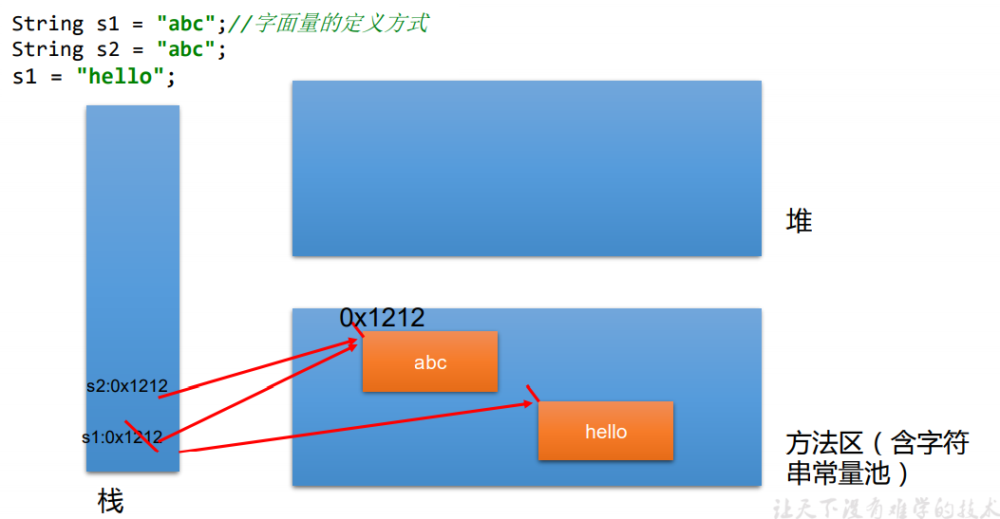 

 最直观感受下String不可变：

```java
// 案例一
String str1 = "abc";
String str2 = "abc";
str2+="def";

sout(s1);	// abc
sout(s2);	// abcdef

// 案例二
String content = "01234567aAbBcCdD";

// 其实是生成了一个新的String对象
// 全部大写
System.out.println(content.toUpperCase());
// 全部小写
System.out.println(content.toLowerCase());

// content指向对象的内容并没有变化
System.out.println(content);
```

> String对象的创建

```java
String str = "hello";

//本质上this.value = new char[0];
String s1 = new String(); 

//this.value = original.value;
String s2 = new String(String original); 

//this.value = Arrays.copyOf(value, value.length);
String s3 = new String(char[] a); 

String s4 = new String(char[] a,int startIndex,int count);
```

`String str1 = "abc";与String str2 = new String("abc");`的区别？

String的实例化方式：

方式一：通过字面量定义的方式：此时的s1和s2的数据javaEE声明在方法区中的字符串常量池中。

方式二：通过new +构造器的方式：此时的s3和s4保存的地址值，是数据在堆空间中开辟空间以后对应的地址。

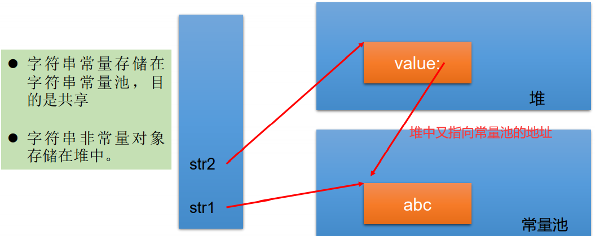  

> 字符串对象是如何存储的

例一：

```java
String s1 = "javaEE";
String s2 = "javaEE";
String s3 = new String("javaEE");
String s4 = new String("javaEE");
System.out.println(s1 == s2);//true
System.out.println(s1 == s3);//false
System.out.println(s1 == s4);//false
System.out.println(s3 == s4);//false
```

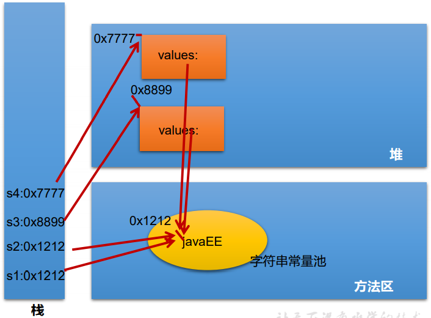 

例二：

```java
Person p1 = new Person();
p1.name = "atguigu";
Person p2 = new Person();
p2.name = "atguigu";

System.out.println(p1.name .equals( p2.name)); // true
System.out.println(p1.name == p2.name); // true
System.out.println(p1.name == "atguigu"); // true

String s1 = new String("bcde");
String s2 = new String("bcde");
System.out.println(s1==s2); // false
```

例三：

```java
Person p1 = new Person("Tom",12);
Person p2 = new Person("Tom",12);
System.out.println(p1.name == p2.name);// true 
```

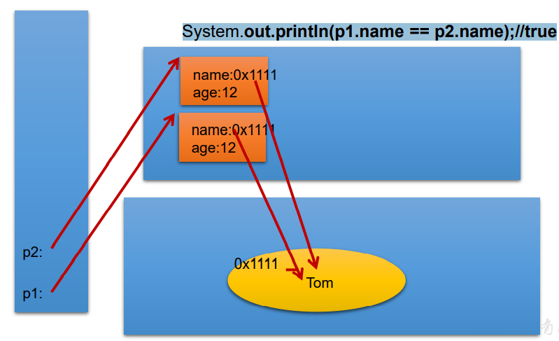 

> 面试题：String s = new String("abc");一共创建了几个对象？

两个：一个是堆空间中new结构，另一个是char[]对应的常量池中的数据: "abc"

> String不同拼接操作的对比

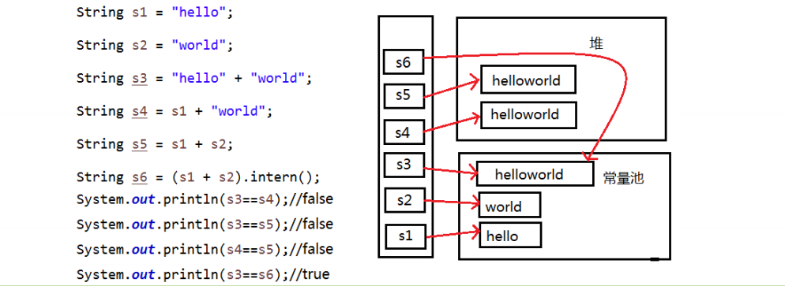 

结论：

1. 常量与常量的拼接结果在常量池。且常量池中不会存在相同内容的常量。
2. 只要其中有一个是变量，结果就在堆中
3. 只要其中有一个是变量，结果就在堆中


- String s1 = "a";   说明：在字符串常量池中创建了一个字面量为"a"的字符串。
- s1 = s1 + "b";  说明：实际上原来的“a”字符串对象已经丢弃了，现在在堆空间中产生了一个字符串s1+"b"（也就是"ab")。如果多次执行这些改变串内容的操作，会导致大量副本字符串对象存留在内存中，降低效率。如果这样的操作放到循环中，会极大影响程序的性能。
- String s2 = "ab";  说明：直接在字符串常量池中创建一个字面量为"ab"的字符串。
- String s3 = "a" + "b"; 说明：s3指向字符串常量池中已经创建的"ab"的字符串。
- String s4 = s1.intern(); 说明：堆空间的s1对象在调用intern()之后，会将常量池中已经存在的"ab"字符串 赋值给s4。
- final修饰的字符串即为常量，固然在常量池中

> String使用陷阱

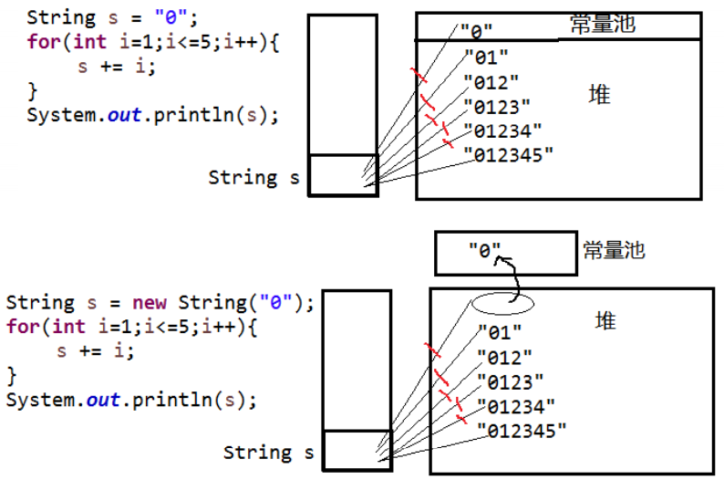 

以下程序运行结果：

数组是引用类型、字符串虽然是引用数据类型，但由于其不可变特性，引用传过去也没用

```java
public class StringTest {
    String str = new String("good");
    char[] ch = { 't', 'e', 's', 't' };
    public void change(String str, char ch[]) {
        str = "test ok";
        ch[0] = 'b';
    }
    public static void main(String[] args) {
        StringTest ex = new StringTest();
        ex.change(ex.str, ex.ch);
        System.out.print(ex.str); // good
        System.out.println(ex.ch); // best
    }
}
```

> JVM中涉及字符串的内存结构

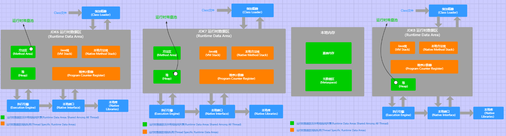 

- Java6 运行时常量池在方法方法区中
- Java7 运行时常量池在堆中
- Java8 运行时常量池在堆中

> String常用方法

- int length()：返回字符串的长度： return value.length 
- char charAt(int index)： 返回某索引处的字符return value[index] 
- boolean isEmpty()：判断是否是空字符串：return value.length == 0
- String toLowerCase()：使用默认语言环境，将 String 中的所有字符转换为小写
- String toUpperCase()：使用默认语言环境，将 String 中的所有字符转换为大写
- String trim()：返回字符串的副本，忽略前导空白和尾部空白
- boolean equals(Object obj)：比较字符串的内容是否相同
- boolean equalsIgnoreCase(String anotherString)：与equals方法类似，忽略大 小写
- String concat(String str)：将指定字符串连接到此字符串的结尾。 等价于用“+”
- int compareTo(String anotherString)：比较两个字符串的大小，例如"abc".compareTo("abe") = -2，可用于字符串排序
- String substring(int beginIndex)：返回一个新的字符串，它是此字符串的从 beginIndex开始截取到最后的一个子字符串。
- String substring(int beginIndex, int endIndex) ：返回一个新字符串，它是此字符串从beginIndex开始截取到endIndex(不包含)的一个子字符串。左闭右开。


- boolean endsWith(String suffix)：测试此字符串是否以指定的后缀结束
- boolean startsWith(String prefix)：测试此字符串是否以指定的前缀开始
- boolean startsWith(String prefix, int toffset)：测试此字符串从指定索引开始的子字符串是否以指定前缀开始


- boolean contains(CharSequence s)：当且仅当此字符串包含指定的 char 值序列时，返回 true。kmp算法
- int indexOf(String str)：返回指定子字符串在此字符串中第一次出现处的索引
- int indexOf(String str, int fromIndex)：返回指定子字符串在此字符串中第一次出现处的索引，从指定的索引开始
- int lastIndexOf(String str)：返回指定子字符串在此字符串中最右边出现处的索引
- int lastIndexOf(String str, int fromIndex)：返回指定子字符串在此字符串中最后 一次出现处的索引，从指定的索引开始反向搜索注：indexOf和lastIndexOf方法如果未找到都是返回-1

替换：

- String replace(char oldChar, char newChar)：返回一个新的字符串，它是通过用 newChar 替换此字符串中出现的所有 oldChar 得到的。
- String replace(CharSequence target, CharSequence replacement)：使用指定的字面值替换序列替换此字符串所有匹配字面值目标序列的子字符串。
- String replaceAll(String regex, String replacement) ： 使用给定的 replacement 替换此字符串所有匹配给定的正则表达式的子字符串。 
- String replaceFirst(String regex, String replacement) ： 使用给定的 replacement 替换此字符串匹配给定的正则表达式的第一个子字符串。

```java
String str = "12hello34world5java7891mysql456";
//把字符串中的数字替换成,，如果结果中开头和结尾有，的话去掉
String string = str.replaceAll("\\d+", ",").replaceAll("^,|,$", "");
```

匹配：

- boolean matches(String regex)：告知此字符串是否匹配给定的正则表达式。

```java
String str = "12345";
//判断str字符串中是否全部由数字组成，即有1-n个数字组成
boolean matches = str.matches("\\d+");
String tel = "0571-4534289";
//判断这是否是一个杭州的固定电话
boolean result = tel.matches("0571-\\d{7,8}");
```

切割：

- String[] split(String regex)：根据给定正则表达式的匹配拆分此字符串。

- String[] split(String regex, int limit)：根据匹配给定的正则表达式来拆分此字符串，最多不超过limit个，如果超过了，剩下的全部都放到最后一个元素中。

```java
String str = "hello|world|java";
String[] strs = str.split("\\|");
for (int i = 0; i < strs.length; i++) {
    System.out.println(strs[i]);
}
System.out.println();
String str2 = "hello.world.java";
String[] strs2 = str2.split("\\.");
for (int i = 0; i < strs2.length; i++) {
    System.out.println(strs2[i]);
}
```

> String与基本数据类型转换

- 字符串 → 基本数据类型、包装类
  - Integer包装类的public static int parseInt(String s)：可以将由“数字”字 符组成的字符串转换为整型。
  - 类似地，使用java.lang包中的Byte、Short、Long、Float、Double类调相应的类方法可以将由"数字"字符组成的字符串，转化为相应的基本数据类型。
- 基本数据类型、包装类 → 字符串
  - 调用String类的public String valueOf(int n)可将int型转换为字符串
  - 相应的valueOf(byte b)、valueOf(long l)、valueOf(float f)、valueOf(double  d)、valueOf(boolean b)可由参数的相应类型到字符串的转换

> String与字符数组转换

- 字符数组 → 字符串
  - String 类的构造器：String(char[]) 和 String(char[]，int offset，int length) 分别用字符数组中的全部字符和部分字符创建字符串对象。
-  字符串 → 字符数组
  - public char[] toCharArray()：将字符串中的全部字符存放在一个字符数组中的方法。
  - public void getChars(int srcBegin, int srcEnd, char[] dst,  int dstBegin)：提供了将指定索引范围内的字符串存放到数组中的方法。

> String与字节数组转换：编码与解码

- 字节数组 →  字符串
  - String(byte[])：通过使用平台的默认字符集解码指定的 byte 数组，构造一个新的 String。
  - String(byte[]，int offset，int length) ：用指定的字节数组的一部分， 即从数组起始位置offset开始取length个字节构造一个字符串对象。
- 字符串 → 字节数组
  - public byte[] getBytes() ：使用平台的默认字符集将此 String 编码为 byte 序列，并将结果存储到一个新的 byte 数组中。
  - public byte[] getBytes(String charsetName) ：使用指定的字符集将 此 String 编码到 byte 序列，并将结果存储到新的 byte 数组。

UTF-8一个汉字占用3字节：全世界的体量大

GBK一个汉字占用2字节：中国定义

US-ASCII一个汉字占用2字节

编码：字符串转换为字节String-byte[]（能看懂的转换为看不懂的二进制数据）

解码：字节转换为字符串byte[]-String（看不懂的二进制数据转换为能看懂的）


为什么我们日常中会出现乱码呢？编码集和解码集不一样。要求解码时使用的字符集必须与编码时使用的字符集一致，否则会出现乱码。

```java
String name = "宋嘉诚";
byte[] bytes = name.getBytes("UTF-16");
System.out.println("Arrays.toString(bytes) = " + Arrays.toString(bytes));

String s = new String(bytes,"UTF-16");
System.out.println("s = " + s);	//宋嘉诚
String s1 = new String(bytes); // 不指定字符集,用默认的UTF-8就会乱码 s = ��[�V	��
```

### String常见面试题（todo）

- 模拟一个trim方法，去除字符串两端的空格
- 将一个字符串进行反转。将字符串中指定部分进行反转。比如“abcdefg”反 转为”abfedcg”

- 获取一个字符串在另一个字符串中出现的次数。 比如：获取“ ab”在 “abkkcadkabkebfkabkskab” 中出现的次数

- 获取两个字符串中最大相同子串。比如： str1 = "abcwerthelloyuiodef“;str2 = "cvhellobnm" 提示：将短的那个串进行长度依次递减的子串与较长的串比较。

> String为什么设计为不可变的？

1. 不可变类天然线程安全
2. String经常作为HashMap的键，可以缓存，Hash值
3. 常量池的需要，节省内存空间
4. String如果可变.就可以继承，而String的很多方法是本地方法，如果进行重写，写一段死循环，岂不是向操作系统植入病毒

### StringBuffer与StringBuilder

> StringBuffer

- java.lang.StringBuffer代表可变的字符序列，JDK1.0中声明，可以对字符串内容进行增删，此时不会产生新的对象。
- 很多方法与String相同
- 作为参数传递时，方法内部可以改变值。

```java
public final class StringBuffer extends AbstractStringBuilder
abstract class AbstractStringBuilder implements Appendable, CharSequence {
    /**
     * The value is used for character storage.
     */
    char[] value;

    /**
     * The count is the number of characters used.
     */
    int count;
}
```

value没有final声明，value可以不断扩容。

count记录有效字符的个数。

- StringBuffer类不同于String，其对象必须使用构造器生成。有三个构造器：
  - StringBuffer()：初始容量为16的字符串缓冲区
  - StringBuffer(int size)：构造指定容量的字符串缓冲区
  - StringBuffer(String str)：将内容初始化为指定字符串内容

>StringBuffer类的常用方法

- StringBuffer append(xxx)：提供了很多的append()方法，用于进行字符串拼接 
- StringBuffer delete(int start,int end)：删除指定位置的内容 
- StringBuffer replace(int start, int end, String str)：把[start,end)位置替换为str 
- StringBuffer insert(int offset, xxx)：在指定位置插入xxx 
- StringBuffer reverse() ：把当前字符序列逆转
- public int indexOf(String str) ：返回指定字符串首次出现的下标位置
- public String substring(int start,int end)：前闭后开区间，注意返回值是String
- public int length()
- public char charAt(int n )：返回指定下标的字符
- public void setCharAt(int n ,char ch)：将指定位置的字符换成新的字符

当append和insert时，如果原来value数组长度不够，可扩容。

如上这些方法支持方法链操作。

方法链的原理：

```java
@Override
public synchronized StringBuffer append(String str) {
    toStringCache = null;
    super.append(str);
    return this;
}
```

> StringBuilder类

StringBuilder 和 StringBuffer 非常类似，均代表可变的字符序列，而且 提供相关功能的方法也一样

> 对比String、StringBuffer、StringBuilder

|                        | 可变性         | 效率、线程安全                                             | 相同点             |
| ---------------------- | -------------- | ---------------------------------------------------------- | ------------------ |
| String(JDK1.0)         | 不可变字符序列 |                                                            | 底层使用char[]存储 |
| StringBuffer(JDK1.0)   | 可变字符序列   | 效率低（加锁串行执行）线程安全。多线程操作共享数据时使用。 | 底层使用char[]存储 |
| StringBuilder(JDK 5.0) | 可变字符序列   | 效率高、线程不安全                                         | 底层使用char[]存储 |

注意：作为参数传递的话，方法内部String不会改变其值，StringBuffer和StringBuilder 会改变其值。

源码分析：

```java
String str = new String();			char[] value = new char[0]
String str = new String("abc");		char[] value = new char[]{’a‘，’b‘，’c‘}

StringBUffer sb = new StringBuffer(); char[] value = new char[16];	// 底层创建了一个长度是16的数组
sb.append('a');  value[0] = 'a';
sb.append('b');  value[1] = 'b';

StringBuffer sb = new StringBuffer("abc"); char[] value = new char["abc".length()+16];
// 问题一:sb的长度,3,取的是有效存储的长度
// 问题二:扩容问题:如果要添加的元素底层数组盛不下,那就需要扩容底层的数组,默认情况下扩容为原来的2倍+2,同时将原数组元素复制到新数组中。
```

> 与String的相互转换

String-StringBuffer、StringBuilder：调用StringBuffer、StringBuilder的构造器

StringBuffer、StringBuilder-String：调用String构造器或toString

> 与null的关联

```java
String str = null;
StringBuffer sb1 = new StringBuffer();
sb1.append(str);
System.out.println(sb1.length());	// 4
System.out.println(sb1);			// "null"

StringBuffer sb2 = new StringBuffer(str);	// npe
```

## 02_JDK 8之前的日期时间API

如何看是否已经过期呢？`@Deprecated`注解标识的就是，但是一般在注解的上方会给出`replace`替代者。

### System 静态方法 

`System`类提供的`public static long currentTimeMillis()`用来返回当前时 间与1970年1月1日0时0分0秒之间以毫秒为单位的时间差。此方法适于计算时间差。称之为时间戳。

计算世界时间的主要标准有：

- UTC（Coordinated Universal Time）
- GMT（Greenwich Mean Time）欧洲
- CST（Central Standard Time）美国

```java
long l = System.currentTimeMillis();
```

### Date类

```java
java.util.Date
    	|---java.sql.Date
```

表示特定的瞬间，精确到毫秒；

1、两个构造器：

- Date()：使用无参构造器创建的对象可以获取本地当前时间。
- Date(long date)：创建指定时间：`Date date = new Date(1624547596945L);`输出指定时间：`date2.toString();`

2、两个常用方法：

- getTime()：返回自 1970 年 1 月 1 日 00:00:00 GMT 以来此 Date 对象表示的毫秒数（时间戳）。`1624547596945`
- toString()：显示当前的年、月、日、时、分、秒；把此 Date 对象转换为以下形式的 String： dow mon dd hh:mm:ss zzz yyyy 其中： dow 是一周中的某一天 (Sun, Mon, Tue,  Wed, Thu, Fri, Sat)，zzz是时间标准。`Thu Jun 24 23:11:19 CST 2021`

3、java.sql.Date对应着数据库中的日期类型的变量，数据库date：实体类Date

- 创建java.sql.Date对象：`java.sql.Date date = new java.sql.Date(1624547596945L);`

- 调用toString：`2021-06-24`

- 如何将`java.util.Date`转换为`java.sql.Date`：

  `java.sql.Date sqlDate = new java.sql.Date(new java.util.Date().getTime())`

### SimpleDateFormat日期格式化与解析类

`java.text.SimpleDateFormat`

Date类的API不易于国际化，大部分被废弃了，java.text.SimpleDateFormat 类是一个不与语言环境有关的方式来格式化和解析日期的具体类。

1、两大操作，格式化和解析

- 格式化：日期→字符串文本
  - SimpleDateFormat() ：默认的模式和语言环境创建对象
  - public SimpleDateFormat(String pattern)：该构造方法可以用参数pattern 指定的格式创建一个对象，该对象调用：
  - public String format(Date date)：方法格式化时间对象date
- 解析：字符串文本→日期
  - public Date parse(String source)：从给定字符串的开始解析文本，以生成一个日期。

2、SimpleDateFormat的实例化

使用默认构造器：日常我们都不会使用默认的构造器

```java
@Test
public void test() throws ParseException {
    SimpleDateFormat sdf = new SimpleDateFormat();
    String dateStr = sdf.format(new Date());	 // 21-6-25 上午12:35
    System.out.println("dateStr = " + dateStr);
    Date date = sdf.parse("21-6-25 上午12:34");	// 要按照指定的日期,否则会抛出异常
    System.out.println("date = " + date);		  // Fri Jun 25 00:34:00 CST 2021
}
```

调用带参的构造器：按照指定的方式格式化和解析（去官方API文档搜SimpleDateFormat的使用，可以看到有许多示例内容）

```java
@Test
public void test() throws ParseException {
    SimpleDateFormat sdf = new SimpleDateFormat("yyyy-MM-dd HH:mm:ss");
    String dateStr = sdf.format(new Date());
    System.out.println("dateStr = " + dateStr);	// 2021-06-25 00:40:13
    Date date = sdf.parse("2021-06-25 00:39:57");
    System.out.println("date = " + date);	// Fri Jun 25 00:39:57 CST 2021
}
```

一定要注意解析的时候，要求字符串必须是符合SimpleDateFormat识别的格式（通过构造器参数体现）

3、练习，字符串"2020-09-08"转换为java.sql.Date

```java
@Test
public void test3() throws ParseException {
    String birth = "1998-04-29";
    SimpleDateFormat sdf = new SimpleDateFormat("yyyy-MM-dd");
    Date date = sdf.parse(birth);
    java.sql.Date sqlDate = new java.sql.Date(date.getTime());
    System.out.println("sqlDate = " + sqlDate);	// 1998-04-29
}
```

4、练习，三天打鱼两天晒网，1990-01-01 xxxx-xx-xx打鱼还是晒网？

举例：2020-09-08 计算出总天数

总天数 % 5 = 1，2，3：打鱼

总天数 % 5 = 4，0：晒网

总天数计算：(date2.getTime()-date1.getTime()) / (1000 * 60 * 60 *24) + 1

### Calendar日历类

` java.util.Calendar(日历)`类

- Calendar是一个抽象基类，主用用于完成日期字段之间相互操作的功能。

- 获取Calendar实例的方法

  - 调用其静态方法Calendar.getInstance()
  - 创建其子类GregorianCalendar的对象

- 一个Calendar的实例是系统时间的抽象表示，常用方法：

  - public int get(int field)：通过get(int field)方法来取得想要的时间信息。比如YEAR、MONTH、DAY_OF_WEEK、HOUR_OF_DAY 、 MINUTE、SECOND，比如获取当前时间是当年第几天、本周第几天...

    ```java
    Calendar calendar = Calendar.getInstance();
    calendar.get(Calendar.DAY_OF_MONTH);
    calendar.get(Calendar.DAY_OF_WEEK);
    ```

  - public void set(int field,int value)：修改calendar本身，设置

    ```java
    calendar.set(Calendar.DAY_OF_MONTH, 3);
    ```

  - public void add(int field,int amount)：修改calendar本身，增加

    ```java
    calendar.add(Calendar.DAY_OF_MONTH,1);
    ```

  - public final Date getTime()：把日历类转换为Date，`Date time = calendar.getTime();`

  -  public final void setTime(Date date)：把Date转换为日历类，`calendar.setTime(time);`

- 注意：

  - 获取月份时：一月是0，二月是1，以此类推，12月是11
  - 获取星期时：周日是1，周二是2 ， 。。。。周六是7

## 03_JDK 8中新日期时间API

### 新日期时间API出现的背景

如果我们可以跟别人说：“我们在1502643933071见面，别晚了！”那么就再简单不 过了。但是我们希望时间与昼夜和四季有关，于是事情就变复杂了。JDK 1.0中包含了 一个java.util.Date类，但是它的大多数方法已经在JDK 1.1引入Calendar类之后被弃用 了。而Calendar并不比Date好多少。它们面临的问题是：

- 可变性：像日期和时间这样的类应该是不可变的。
- 偏移性：Date中的年份是从1900开始的，而月份都从0开始。
- 格式化：格式化只对Date有用，Calendar则不行。
- 此外，它们也不是线程安全的；不能处理闰秒等。

对日期和时间的操作一直是Java程序员最痛苦的地方之一。

### 新日期API

第三次引入的API是成功的，并且Java 8中引入的java.time API 已经纠正了 过去的缺陷，将来很长一段时间内它都会为我们服务。

Java 8 吸收了 Joda-Time 的精华，以一个新的开始为 Java 创建优秀的 API。 新的 java.time 中包含了所有关于**本地日期（LocalDate）**、**本地时间 （LocalTime）**、**本地日期时间（LocalDateTime）**、**时区（ZonedDateTime）** 和**持续时间（Duration）**的类。历史悠久的 Date 类新增了 toInstant() 方法， 用于把 Date 转换成新的表示形式。这些新增的本地化时间日期 API 大大简 化了日期时间和本地化的管理。

- java.time – 包含值对象的基础包
- java.time.chrono – 提供对不同的日历系统的访问
- java.time.format – 格式化和解析时间和日期
- java.time.temporal – 包括底层框架和扩展特性
- java.time.zone – 包含时区支持的类

说明：大多数开发者只会用到基础包和format包，也可能会用到temporal包。因此，尽 管有68个新的公开类型，大多数开发者，大概将只会用到其中的三分之一。

`LocalDate`、`LocalTime`、`LocalDateTime` 类是其中较重要的几个类，它们的实例是**不可变的对象**，分别表示使用 ISO-8601日历系统的日期、时间、日期和时间。 它们提供了简单的本地日期或时间，并不包含当前的时间信息，也不包含与时区相关的信息。

- LocalDate代表IOS格式（yyyy-MM-dd）的日期,可以存储生日、纪念日等日期。
- LocalTime表示一个时间，而不是日期。
- LocalDateTime是用来表示日期和时间的，**这是一个最常用的类之一**。

注：ISO-8601日历系统是国际标准化组织制定的现代公民的日期和时间的表示 法，也就是公历

### LocalDate、LocalTime、LocalDateTime

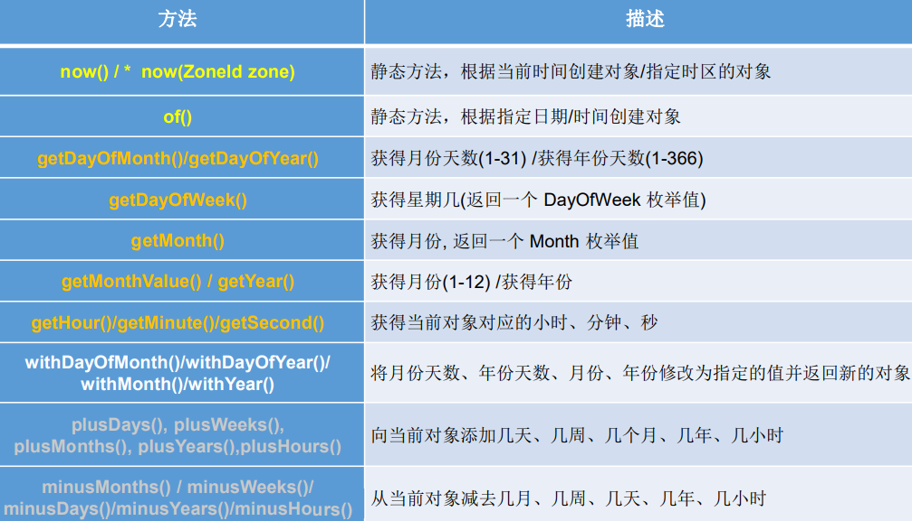 

- LocalDateTime相较于LocalDate、LocalTime使用频率要高
- 类似于Calendar

now()：获取当前的日期、时间、日期+时间

```java
@Test
public void test(){
    LocalDate localDate = LocalDate.now();		// localDate = 2021-06-25
    LocalTime localTime = LocalTime.now();		// localTime = 01:50:24.210
    LocalDateTime localDateTime = LocalDateTime.now();	// localDateTime = 2021-06-25T01:50:24.210
}
```

of()：设置指定的年、月、日、时、分、秒。没有偏移量

```java
@Test
public void test() {
    LocalDateTime localDateTime = LocalDateTime.of(2021, 6, 25, 1, 54, 23);// 2021-06-25T01:54:23
}
```

getXxx：获取相关的属性

```java
@Test
public void test3() {
    LocalDateTime localDateTime = LocalDateTime.now();
    System.out.println(localDateTime.getDayOfYear());
    System.out.println(localDateTime.getDayOfMonth());
    System.out.println(localDateTime.getDayOfWeek());	// FRIDAY
    System.out.println(localDateTime.getMonth());		// JUNE
    System.out.println(localDateTime.getMonthValue());	// 6
    System.out.println(localDateTime.getHour());
    System.out.println(localDateTime.getMinute());
    System.out.println(localDateTime.getSecond());
}
```

withXxx：设置相关的属性，体现不可变性

```java
@Test
public void test() {
    LocalDateTime localDateTime = LocalDateTime.now();
    LocalDateTime localDateTime1 = localDateTime.withDayOfMonth(3);
    System.out.println("localDateTime = " + localDateTime);		// 2021-06-25T02:06:50.457
    System.out.println("localDateTime1 = " + localDateTime1);	// 2021-06-03T02:06:50.457
}
```

plus、minus增加或减少

```java
@Test
public void test5() {
    LocalDateTime localDateTime = LocalDateTime.now();
    LocalDateTime localDateTime1 = localDateTime.plusDays(16);
    System.out.println("localDateTime = " + localDateTime);		// 2021-06-25T02:08:48.805
    System.out.println("localDateTime1 = " + localDateTime1);	// 2021-07-11T02:08:48.805
    LocalDateTime localDateTime2 = localDateTime.minusHours(3);
    System.out.println("localDateTime2 = " + localDateTime2);	// 2021-06-24T23:08:48.805
}
```

### 瞬时Instant

类似于`java.util.Date`类

- Instant：时间线上的一个瞬时点。 这可能被用来记录应用程序中的事件时间戳。
- 在处理时间和日期的时候，我们通常会想到年,月,日,时,分,秒。然而，这只是 时间的一个模型，是面向人类的。第二种通用模型是面向机器的，或者说是连 续的。在此模型中，时间线中的一个点表示为一个很大的数，这有利于计算机 处理。**在UNIX中，这个数从1970年开始，以秒为的单位；同样的，在Java中， 也是从1970年开始，但以毫秒为单位。**
- **java.time包通过值类型Instant提供机器视图，不提供处理人类意义上的时间单位。**Instant表示时间线上的一点，而不需要任何上下文信息，例如，时区。 概念上讲，**它只是简单的表示自1970年1月1日0时0分0秒（UTC）开始的秒数**。因为java.time包是基于纳秒计算的，所以Instant的精度可以达到纳秒级。
- (1 ns = 10-9 s) 1秒 = 1000毫秒 =10^6微秒=10^9纳秒

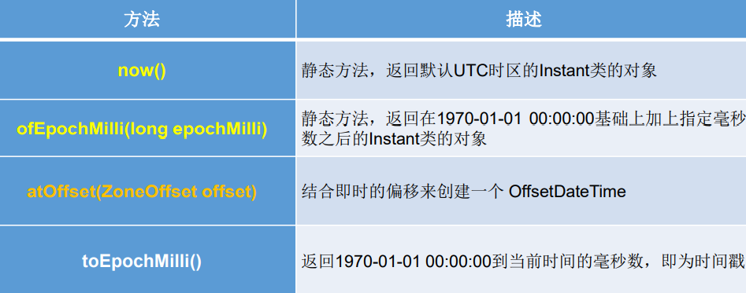 

```java
@Test
public void test() {
    // 获取本初子午线对应的标准时间
    Instant instant = Instant.now();
    System.out.println("instant = " + instant);					// 2021-06-24T18:17:53.531Z

    // 添加时间的偏移量
    OffsetDateTime offsetDateTime = instant.atOffset(ZoneOffset.ofHours(8));
    System.out.println("offsetDateTime = " + offsetDateTime);	// 2021-06-25T02:17:53.531+08:00

    // 获取自1970年1月1日0时0分0秒（UCT）开始的毫秒数    
    long milli = instant.toEpochMilli();
    System.out.println("milli = " + milli);						// 1624559175413

    // 通过给定的毫秒数,获取Instant示例,类比Date类的getTime()方法
    Instant instant1 = Instant.ofEpochMilli(1624559034133L);
    System.out.println("instant1 = " + instant1);				// 2021-06-24T18:23:54.133Z
}
```

时间戳是指格林威治时间1970年01月01日00时00分00秒(北京时间1970年01月01 日08时00分00秒)起至现在的总秒数。

### DateTimeFormatter格式化与解析日期或时间

类似于SimpleDateFormat类

java.time.format.DateTimeFormatter 类，该类提供了三种格式化方法：	

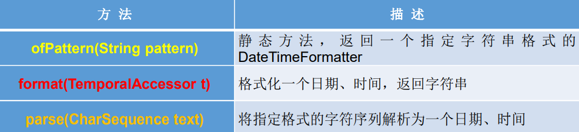 

- 方式一：预定义的标准格式。如：ISO_LOCAL_DATE_TIME；ISO_LOCAL_DATE；ISO_LOCAL_TIME

  ```java
  @Test
  public void test1() {
      DateTimeFormatter formatter = DateTimeFormatter.ISO_LOCAL_DATE_TIME;
      // 格式化:日期--字符串
      String format = formatter.format(LocalDateTime.now());
      System.out.println("format = " + format);	// 2021-06-25T02:38:11.867
  
      // 解析:字符串--日期
      TemporalAccessor parse = formatter.parse("2021-06-25T02:37:40.97");
      System.out.println("parse = " + parse);		// {},ISO resolved to 2021-06-25T02:37:40.970
  }
  ```

- 方式二：本地化相关的格式。

  - 本地化相关的格式。如: ofLocalizedDateTime()，FormatStyLe.LONG / FormatStyLe.MEDIUM /FormatStyle.SHORT ，适用于LocalDateTime

    ```java
    @Test
    public void test2() {
        DateTimeFormatter formatter = DateTimeFormatter.ofLocalizedDateTime(FormatStyle.LONG);
        // 格式化:日期--字符串
        String format = formatter.format(LocalDateTime.now());
        System.out.println("format = " + format);		// 2021年6月25日 上午02时43分22秒
    
        // 解析:字符串--日期
        TemporalAccessor parse = formatter.parse("2021年6月25日 上午02时43分22秒");
        System.out.println("parse = " + parse);			// {},ISO resolved to 2021-06-25T02:43:22
    }
    ```

  - 本地化相关的格式。如: ofLocalizedDate()，FormatStyLe.FULL / FormatStyLe.LONG / FormatStyLe.MEDIUM / FormatStyLe.SHORT，适用于LocalDate

    ```java
    @Test
    public void test3() {
        DateTimeFormatter formatter = DateTimeFormatter.ofLocalizedDate(FormatStyle.FULL);
        // 格式化:日期--字符串
        String format = formatter.format(LocalDateTime.now());
        System.out.println("format = " + format);		// 2021年6月25日 星期五
    
        // 解析:字符串--日期
        TemporalAccessor parse = formatter.parse("2021年6月25日 星期五");
        System.out.println("parse = " + parse);			// {},ISO resolved to 2021-06-25
    }
    ```

- 方式三（重要）：**自定义的格式。如：ofPattern("yyyy-MM-dd hh:mm:ss")**

  ```java
  @Test
  public void test4() {
      DateTimeFormatter formatter = DateTimeFormatter.ofPattern("yyyy-MM-dd hh:mm:ss");
      // 格式化:日期--字符串
      String format = formatter.format(LocalDateTime.now());
      System.out.println("format = " + format);	// 2021-06-25 02:48:58
  
      // 解析:字符串--日期
      TemporalAccessor parse = formatter.parse("2021-06-25 02:48:49");
      System.out.println("parse = " + parse);
      // {SecondOfMinute=49, HourOfAmPm=2, NanoOfSecond=0, MicroOfSecond=0, MinuteOfHour=48, MilliOfSecond=0},ISO resolved to 2021-06-25
  }
  ```

### 其它类

- ZoneId：该类中包含了所有的时区信息，一个时区的ID，如 Europe/Paris
- ZonedDateTime：一个在ISO-8601日历系统时区的日期时间，如 2007-12- 03T10:15:30+01:00 Europe/Paris。
  - 其中每个时区都对应着ID，地区ID都为“{区域}/{城市}”的格式，例如： Asia/Shanghai等
- Clock：使用时区提供对当前即时、日期和时间的访问的时钟。
- 持续时间：Duration，用于计算两个“时间”间隔
- 日期间隔：Period，用于计算两个“日期”间隔
- TemporalAdjuster : 时间校正器。有时我们可能需要获取例如：将日期调整 到“下一个工作日”等操作。
- TemporalAdjusters : 该类通过静态方法 (firstDayOfXxx()/lastDayOfXxx()/nextXxx())提供了大量的常用 TemporalAdjuster 的实现。

```java
// ZoneId:类中包含了所有的时区信息
// ZoneId的getAvailableZoneIds():获取所有的ZoneId
Set<String> zoneIds = ZoneId.getAvailableZoneIds();
for (String s : zoneIds) {
    System.out.println(s);
}
// ZoneId的of():获取指定时区的时间
LocalDateTime localDateTime = LocalDateTime.now(ZoneId.of("Asia/Tokyo"));
System.out.println(localDateTime);
//ZonedDateTime:带时区的日期时间
// ZonedDateTime的now():获取本时区的ZonedDateTime对象
ZonedDateTime zonedDateTime = ZonedDateTime.now();
System.out.println(zonedDateTime);
// ZonedDateTime的now(ZoneId id):获取指定时区的ZonedDateTime对象
ZonedDateTime zonedDateTime1 = ZonedDateTime.now(ZoneId.of("Asia/Tokyo"));
System.out.println(zonedDateTime1);


// Duration:用于计算两个“时间”间隔，以秒和纳秒为基准
LocalTime localTime = LocalTime.now();
LocalTime localTime1 = LocalTime.of(15, 23, 32);
//between():静态方法，返回Duration对象，表示两个时间的间隔
Duration duration = Duration.between(localTime1, localTime);
System.out.println(duration);
System.out.println(duration.getSeconds());
System.out.println(duration.getNano());
LocalDateTime localDateTime = LocalDateTime.of(2016, 6, 12, 15, 23, 32);
LocalDateTime localDateTime1 = LocalDateTime.of(2017, 6, 12, 15, 23, 32);
Duration duration1 = Duration.between(localDateTime1, localDateTime);
System.out.println(duration1.toDays());


// Period:用于计算两个“日期”间隔，以年、月、日衡量
LocalDate localDate = LocalDate.now();
LocalDate localDate1 = LocalDate.of(2028, 3, 18);
Period period = Period.between(localDate, localDate1);
System.out.println(period);
System.out.println(period.getYears());
System.out.println(period.getMonths());
System.out.println(period.getDays());
Period period1 = period.withYears(2);
System.out.println(period1);

// TemporalAdjuster:时间校正器
// 获取当前日期的下一个周日是哪天？
TemporalAdjuster temporalAdjuster = TemporalAdjusters.next(DayOfWeek.SUNDAY);
LocalDateTime localDateTime = LocalDateTime.now().with(temporalAdjuster);
System.out.println(localDateTime);
// 获取下一个工作日是哪天？
LocalDate localDate = LocalDate.now().with(new TemporalAdjuster() {
    @Override
    public Temporal adjustInto(Temporal temporal) {
        LocalDate date = (LocalDate) temporal;
        if (date.getDayOfWeek().equals(DayOfWeek.FRIDAY)) {
            return date.plusDays(3);
        } else if (date.getDayOfWeek().equals(DayOfWeek.SATURDAY)) {
            return date.plusDays(2);
        } else {
            return date.plusDays(1);
        }
    }
});
System.out.println("下一个工作日是：" + localDate);
```

> 与传统日期处理的转换

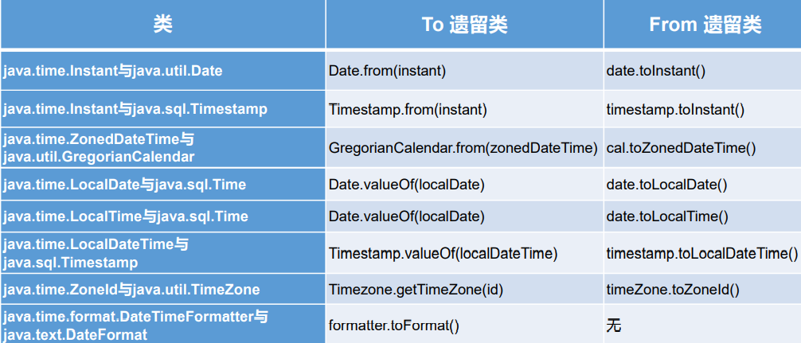 

### 一些积累

https://mp.weixin.qq.com/s/X-Jotzc_nbKaWiD321yRXA

https://mp.weixin.qq.com/s/dgsoX2Nlf3o8Af4Tpmim4w

> Java 8中判断两个日期是否相等

```java
@Test
public void test() {
    LocalDate date1 = LocalDate.now();
    LocalDate date2 = LocalDate.of(2018,2,5);
    if(date1.equals(date2)){
        System.out.println("时间相等");
    }else{
        System.out.println("时间不等");
    }
}
```

> Java 8中检查像生日这种周期性事件

只要当天的日期和生日匹配，无论是哪一年都会打印出祝贺信息。

```java
@Test
public void test() {
    LocalDate date1 = LocalDate.now();
    LocalDate date2 = LocalDate.of(2018,2,6);
    MonthDay birthday = MonthDay.of(date2.getMonth(),date2.getDayOfMonth());
    MonthDay currentMonthDay = MonthDay.from(date1);

    if(currentMonthDay.equals(birthday)){
        System.out.println("是你的生日");
    }else{
        System.out.println("你的生日还没有到");
    }
}
```

> 如何在Java 8中检查闰年

```java
@Test
public void test() {
    LocalDate today = LocalDate.now();
    if(today.isLeapYear()){
        System.out.println("This year is Leap year");
    }else {
        System.out.println("2018 is not a Leap year");
    }
}
```

## 04_Java比较器

在我们之前的学习中，比较运算符的学习都是针对基本数据类型。Java中的对象，正常情况下只能进行比较==或者!=，不能使用>或者<，那日常开发中对于Java对象想要比较大小，应该怎么办呢？就像下面这样：

 

在Java中经常会涉及到对象数组的排序问题，那么就涉及到对象之间的比较问题。使用以下两个接口中的任意一个，即可解决对象排序问题。

其实我们自定义类的排序还是根据类中的属性进行排序的，只不过可以由我们定制化。

Java实现对象排序的方式有两种：

- 自然排序：java.lang.Comparable
- 定制排序：java.util.Comparator

### Comparable自然排序接口

自然而然的排序，就是排序的数据类本身去实现排序的接口。

```java
@Test
public void test() {
    String[] arr = new String[]{"AA", "LL", "CC", "ZZ", "PP", "WW"};
    Arrays.sort(arr);
    System.out.println(Arrays.toString(arr));	// [AA, CC, LL, PP, WW, ZZ]
}
```

因为String、包装类内部实现了Comparable 接口并重写了compareTo(Object obj) 方法，所以String具有从小到大排序的能力。

```java
public final class String
    implements java.io.Serializable, Comparable<String>, CharSequence {
    public int compareTo(String anotherString) {
        int len1 = value.length;
        int len2 = anotherString.value.length;
        int lim = Math.min(len1, len2);
        char v1[] = value;
        char v2[] = anotherString.value;

        int k = 0;
        while (k < lim) {
            char c1 = v1[k];
            char c2 = v2[k];
            if (c1 != c2) {
                return c1 - c2;
            }
            k++;
        }
        return len1 - len2;
    }
}
```

1、Comparable接口强行对实现它的每个类的对象进行整体排序。这种排序被称为类的自然排序。

2、实现 Comparable 的类必须实现 compareTo(Object obj) 方法，两个对象即通过 compareTo(Object obj) 方法的返回值来比较大小。

- 如果当前对象this大 于形参对象obj，则返回正整数
- 如果当前对象this小于形参对象obj，则返回 负整数
- 如果当前对象this等于形参对象obj，则返回零。

3、实现Comparable接口的对象列表（和数组）可以通过 Collections.sort 或 Arrays.sort进行自动排序。实现此接口的对象可以用作有序映射中的键或有 序集合中的元素，无需指定比较器。

4、对于类 C 的每一个 e1 和 e2 来说，当且仅当 e1.compareTo(e2) == 0 与 e1.equals(e2) 具有相同的 boolean 值时，类 C 的自然排序才叫做与 equals  一致。建议（虽然不是必需的）**最好使自然排序与 equals 一致。**

5、对于自定义类来说，如果需要排序，我们可以让自定义类实现Comparable接口，重写compareTo(obj)方法，在compareTo(obj)中指明如何排序。


Comparable 的典型实现：**(默认都是从小到大排列的)**

- String：按照字符串中字符的Unicode值进行比较
- Character：按照字符的Unicode值来进行比较
- 数值类型对应的包装类以及BigInteger、BigDecimal：按照它们对应的数值大小进行比较
- Boolean：true 对应的包装类实例大于 false 对应的包装类实例
- Date、Time等：后面的日期时间比前面的日期时间大


案例：对商品对象数组进行排序

```java
@Data
@AllArgsConstructor
@NoArgsConstructor
public class Goods {
    private String name;
    private double price;
}

 @Test
    public void test() {
        Goods[] goodsArr = new Goods[5];
        goodsArr[0] = new Goods("iphone", 5860);
        goodsArr[1] = new Goods("iPad", 6850);
        goodsArr[2] = new Goods("iWatch", 3265);
        goodsArr[3] = new Goods("mac", 13333);
        goodsArr[4] = new Goods("mac1", 13333);
        Arrays.sort(goodsArr);
        // java.lang.ClassCastException: com.turning.comparable.Goods cannot be cast to java.lang.Comparable
        // 第五点规则
    }
```

改写：double不能相减的原因是精度会缺失，因为十进制小数转换为二进制数时可能会转换不尽。

```java
@Data
@AllArgsConstructor
@NoArgsConstructor
public class Goods2 implements Comparable {	// 重写支持传入泛型
    private String name;
    private double price;

    @Override
    public int compareTo(Object o) {
        if (o instanceof Goods2) {
            // 方式一
            Goods2 goods2 = (Goods2) o;
            if (this.price > goods2.price) {
                return 1;
            } else if (this.price < goods2.price) {
                return -1;
            } else {
                // 还可以在price相同的情况下再按照名称进行比较,因为name是String类型本身实现了Comparable接口所以不需要我们手动再像price那样自定义方法。
                return this.name.compareTo(goods2.name);
            }
            // 方式二
            return Double.compare(this.price, goods2.price);
        }
        throw new RuntimeException("");
    }
}

//[Goods2(name=iWatch, price=3265.0), Goods2(name=iphone, price=5860.0), Goods2(name=iPad, price=6850.0), Goods2(name=mac, price=13333.0)]
```

### Comparator定制排序接口

比如String已经实现了Comparble接口了并且是从小到大排序，那我们现在不想让他从小到大排序，想从大到小排序，就是定制。

1、**当元素的类型没有实现java.lang.Comparable接口而又不方便修改代码， 或者实现了java.lang.Comparable接口的排序规则不适合当前的操作，那 么可以考虑使用 Comparator 的对象来排序**，强行对多个对象进行整体排序的比较。（比如JDK自带的类，我们无法修改代码，但是又想让其按照我们的意愿进行排序）

2、重写compare(Object o1,Object o2)方法，比较o1和o2的大小：

- 如果方法返 回正整数，则表示o1大于o2；
- 如果返回0，表示相等；
- 返回负整数，表示 o1小于o2。

3、可以将 Comparator 传递给 sort 方法（如 Collections.sort 或 Arrays.sort）， 从而允许在排序顺序上实现精确控制。

4、还可以使用 Comparator 来控制某些数据结构（如有序 set或有序映射）的 顺序，或者为那些没有自然顺序的对象 collection 提供排序。


案例：让JDK自带的String从大到小排序

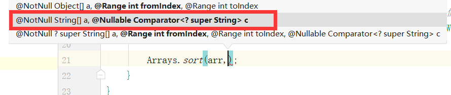 

```java
// String默认实现了Comparable接口完成从小到大的排序，现在我们想让String从大到小排序
String[] arr = new String[]{"AA", "LL", "CC", "ZZ", "PP", "WW"};

// 匿名实现类类的匿名对象,后期还可以用lambda表达式简化,这里泛型帮我们简化了很多
Arrays.sort(arr, new Comparator<String>() {
    @Override
    public int compare(String o1, String o2) {
        if (o1 != null && o2 != null) {
            return -o1.compareTo(o2);
        }
        throw new RuntimeException("输入的数据类型不一致");
    }
}); 
```

工作中：对距离排序

```java
private void sortList(List<MerchantSalepointVo> dataList) {
    dataList.sort((o1, o2) -> {
        if (o1 != null && o2 != null && o1.getDistance() != null && o2.getDistance() != null) {
            return o1.getDistance().compareTo(o2.getDistance());
        } else {
            return 0;
        }
    });
}
```

### Comparable与Comparator的对比

1. Comparable属于一劳永逸型的，Comparator只是当次使用。
2. Comparable接口的方式一旦指定，保证Comparable接口实现类的对象在任何位置都可以比较大小
3. Comparator接口属于临时性的比较
4. 工作中为了解耦，考虑使用Comparator

## 05_System类

- System类代表系统，系统级的很多属性和控制方法都放置在该类的内部。 该类位于java.lang包。

- 由于该类的构造器是private的，所以无法创建该类的对象，也就是无法实 例化该类。其内部的成员变量和成员方法都是static的，所以也可以很方便 的进行调用。

- 成员变量

  - System类内部包含in、out和err三个成员变量，分别代表标准输入流 (键盘输入)，标准输出流(显示器)和标准错误输出流(显示器)。

- 成员方法

  - native long currentTimeMillis()：该方法的作用是返回当前的计算机时间，时间的表达格式为当前计算机时 间和GMT时间(格林威治时间)1970年1月1号0时0分0秒所差的毫秒数。

  - void exit(int status)：该方法的作用是退出程序。其中status的值为0代表正常退出，非零代表 异常退出。使用该方法可以在图形界面编程中实现程序的退出功能等。

  - void gc()：该方法的作用是请求系统进行垃圾回收。至于系统是否立刻回收，则 取决于系统中垃圾回收算法的实现以及系统执行时的情况。

  - String getProperty(String key)：该方法的作用是获得系统中属性名为key的属性对应的值。系统中常见 的属性名以及属性的作用如下表所示：

    | 属性名       | 属性说明         |
    | ------------ | ---------------- |
    | java.version | Java运行时版本   |
    | java.home    | Java安装目录     |
    | os.name      | 操作系统的名称   |
    | os.version   | 操作系统的版本   |
    | user.name    | 用户的账户名称   |
    | user.home    | 用户的主目录     |
    | user.dir     | 用户当前工作目录 |

## 06_Math类

java.lang.Math提供了一系列静态方法用于科学计算。其方法的参数和返回 值类型一般为double型。

1. abs 绝对值
2.  acos,asin,atan,cos,sin,tan 三角函数
3.  sqrt 平方根
4.  pow(double a,doble b) a的b次幂 
5. log 自然对数
6.  exp e为底指数 
7. max(double a,double b)
8.  min(double a,double b) 
9. random() 返回0.0到1.0的随机数 
10. long round(double a) double型数据a转换为long型（四舍五入）
11.  toDegrees(double angrad) 弧度—>角度
12.  toRadians(double angdeg) 角度—>弧度

## 07_BigInteger与BigDecimal

>BigInteger

- Integer类作为int的包装类，能存储的最大整型值为2 31-1，Long类也是有限的， 最大为2 63-1。如果要表示再大的整数，不管是基本数据类型还是他们的包装类 都无能为力，更不用说进行运算了。
- java.math包的**BigInteger可以表示不可变的任意精度的整数（距离）**。BigInteger 提供所有 Java 的基本整数操作符的对应物，并提供 java.lang.Math 的所有相关方法。 另外，BigInteger 还提供以下运算：模算术、GCD 计算、质数测试、素数生成、 位操作以及一些其他操作。
- 构造器
  - BigInteger(String val)：根据字符串构建BigInteger对象
- 常用方法
  - public BigInteger abs()：返回此 BigInteger 的绝对值的 BigInteger。
  - BigInteger add(BigInteger val) ：返回其值为 (this + val) 的 BigInteger 
  - BigInteger subtract(BigInteger val) ：返回其值为 (this - val) 的 BigInteger 
  -  BigInteger multiply(BigInteger val) ：返回其值为 (this * val) 的 BigInteger
  - BigInteger divide(BigInteger val) ：返回其值为 (this / val) 的 BigInteger。整数相除只保留整数部分。 
  - BigInteger remainder(BigInteger val) ：返回其值为 (this % val) 的 BigInteger。 
  - BigInteger[] divideAndRemainder(BigInteger val)：返回包含 (this / val) 后跟 (this % val) 的两个 BigInteger 的数组。 
  - BigInteger pow(int exponent) ：返回其值为 (this ^ exponent) 的 BigInteger。

```java
@Test
public void test() {
    BigInteger b0 = new BigInteger("464641316486461544546546464646");
    System.out.println("b0 = " + b0);
    
    BigInteger b1 = new BigInteger("99");
    BigInteger b2 = new BigInteger("21");
    BigInteger[] bigIntegers = b1.divideAndRemainder(b2);
    System.out.println(Arrays.toString(bigIntegers));	// [4, 15]
}
```

>BigDecimal（金额）

- 一般的Float类和Double类可以用来做科学计算或工程计算，但在**商业计算中， 要求数字精度比较高，故用到java.math.BigDecimal类**。

- BigDecimal类支持不可变的、任意精度的有符号十进制定点数。

- 构造器

  - public BigDecimal(double val)
  - public BigDecimal(String val)

- 常用方法

  - public BigDecimal add(BigDecimal augend)

  - public BigDecimal subtract(BigDecimal subtrahend)

  - public BigDecimal multiply(BigDecimal multiplicand)

  - public BigDecimal divide(BigDecimal divisor, int scale, int roundingMode) 第一个参数是除数，第二个参数代表保留几位小数，第三个代表的是使用的模式（进位规则）。

    

