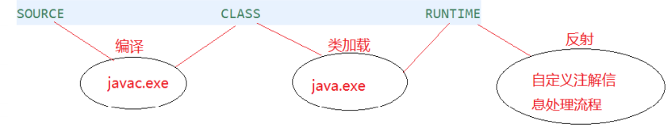
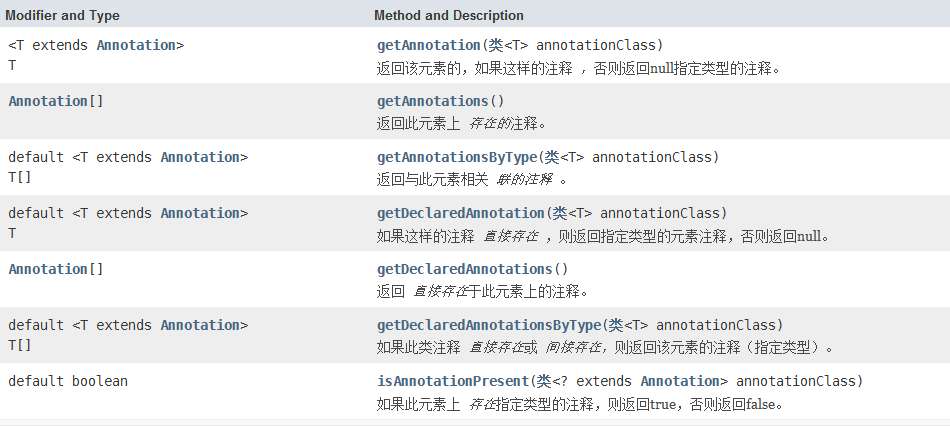

# 枚举类与注解

## JDK5三大特性之枚举类的使用

JDK1.5引入了新的类型——枚举。它是一种特殊的数据类型，之所以特殊是因为它既是一种类(class)类型却又比类类型多了些特殊的约束，但是这些约束的存在也造就了枚举类型的简洁性、安全性以及便捷性。

### 认识枚举

1. 枚举类的理解：类的对象只有有限个，确定的。我们称此类为枚举类；
2. 当需要定义**一组常量（相互之间要相关，生产中之前犹豫常量要不要都用枚举，是没必要的）**时，强烈建议使用枚举类；
3. 如果枚举类中只有一个对象，则可以作为单例模式的实现方式；

例如：

- 星期：Monday(星期一)、......、Sunday(星期天)
- 性别：Man(男)、Woman(女) 
- 季节：Spring(春节)......Winter(冬天) 
- 支付方式：Cash（现金）、WeChatPay（微信）、Alipay(支付宝)、BankCard(银行卡)、CreditCard(信用卡) 
- 就职状态：Busy、Free、Vocation、Dimission 
- 订单状态：Nonpayment（未付款）、Paid（已付款）、Delivered（已发货）、 Return（退货）、Checked（已确认）Fulfilled（已配货）、 
- 线程状态：创建、就绪、运行、阻塞、死亡

### 如何自定义枚举类

**JDK5.0之前，自定义枚举类：**

在看枚举之前来回顾一个概念：多例设计模式，构造方法私有化，之后在类的内部存在若干个指定的对象，通过一个方法返回指定对象。

单例设计模式只留有一个类的一个实例化对象，而多例设计模式，会定义出多个对象，例如：定义一个表示星期X的类，这个类的对象只有7个取值，定义一个表示性别的类，只有2个取值，定义一个表示颜色基色的操作类，颜色只有三个：红、绿、蓝，这种情况下，这样的类就不应该由用户无限制的去创造实例化对象，应该只使用有限的几个，这个就属于多例设计，但不管是单例设计还是多例设计，有一个核心不可动摇 —— 构造方法私有化。

自定义枚举类步骤：

1. 私有化类的构造器，保证不能在类的外部创建其对象
2. 在类的内部创建枚举类的实例。声明为：public static final
3. 对象如果有实例变量，应该声明为private final，并在构造器中初始化

```java
public class Color {
	// 1.枚举类对象的属性不应允许被改动, 所以应该使用 private final 修饰;声明Color对象的属性:private final修饰
    private final String title;

    // 2.私有化构造器,并给对象属性赋值(之前我们说final必须初始化且只能初始化一次,初始化可以显示赋值、构造器赋值、代码块赋值)
    private Color(String title) {
        this.title = title;
    }

    // 3.提供当前枚举类的多个对象:可以定义为public static final的
    private static final Color RED = new Color("红色");
    private static final Color YELLOW = new Color("黄色");
    private static final Color BLUE = new Color("黄色");
    
    @Override
    public String toString() {
        return this.title;
    }

    public static Color getInstance(int ch) {
        switch (ch) {
            case 0:
                return RED;
            case 1:
                return YELLOW;
            case 2:
                return BLUE;
            default:
                return null;
        }
    }
}

public class Test {
    public static void main(String[] args) {
        Color color = Color.getInstance(0);
        System.out.println("color = " + color);
    }
}
```

### 如何使用关键字enum定义枚举类

**JDK5.0开始，可以使用关键字enum定义枚举类**

 实际上在JDK 1.5之后对于多例设计模式有了一些新的改进，使用了一个新的关键字来进行定义 —— 枚举（就是一个简化了的多例设计模式），枚举使用enum关键字来进行定义。

```java
// 如何定义
public enum Color {
    // 1.提供当前枚举类的对象(必须在枚举类的第一行声明枚举类对象),多个对象之间用","隔开,末尾用";"
    RED("红色"),
    YELLOW("黄色"),
    BLUE("黄色");

    // 2.属性依然用pricate final修饰
    private final String title;

    // 3.构造器本来就是私有
    Color(String title) {
        this.title = title;
    }
    
    // 4.toString()方法使用父类Enum的方法
}
// 如何使用
public class Test {
    public static void main(String[] args) {
        // 直接引用
        Color red = Color.RED;
        System.out.println("red = " + red);	// RED
    }
}
```

###  Enum类的主要方法

比如，之前要想表示一周七天：

```java
public class Day {
    public static final int MONDAY =1;
    public static final int TUESDAY=2;
    public static final int WEDNESDAY=3;
    public static final int THURSDAY=4;
    public static final int FRIDAY=5;
    public static final int SATURDAY=6;
    public static final int SUNDAY=7;
}
```

上述的常量定义常量的方式称为int枚举模式，这样的定义方式并没有什么错，但它存在许多不足，如在类型安全和使用方便性上并没有多少好处，如果存在定义int值相同的变量，容易混淆，因此这种方式在枚举出现后并不提倡，现在我们利用枚举类型来重新定义上述的常量，定义周一到周日的常量：

```java
enum Day {
    MONDAY, TUESDAY, WEDNESDAY,THURSDAY, FRIDAY, SATURDAY, SUNDAY
}
```

很明显，现在可以发现，利用枚举实现的多例设计模式会更加的简单直白一些，但是在Java之中，枚举并不是一个新的类型，严格来讲，每一个使用enum定义的类实际上都属于一个类继承了Enum父类而已，面试会问请解释一下enum和Enum的关系？enum是JDK 1.5之后定义的新关键字，主要用于定义枚举类型，在Java之中每一个使用enum定义的枚举类型实际上都表示一个类默认继承了Enum类而已。

而java.lang.Enum类定义：

```java
public abstract class Enum<E extends Enum<E>> extends Object implements Comparable<E>, Serializable
```

 而在Enum类之中的方法：

1. 返回该枚举中定义的所有的枚举：枚举类.values()：
2. 根据名字获取枚举：枚举类.valueOf("")，返回枚举类中对象名是objName的对象。如果没有objName的枚举类对象，则抛异常: IllegalArgumentException
3. 返回当前枚举类对象常量的名称，toString()
4. 取得枚举的序号：public final int ordinal()；
5. 取得枚举的名称：public final String name()；
6. 直接引用：枚举类.枚举对象

```java
public class EnumMethodTest {
    // 获取所有枚举
    for (Color color : Color.values()) {
        System.out.println("枚举序号" + color.ordinal());
        System.out.println("枚举名称" + color.name());
        System.out.println(color.toString());	// Color{memo='红色'}
    }

    // 直接引用
    Coloe yellow = Color.YELLOW;
    System.out.println(yellowed);	// Color{memo=‘黄色’}

    // 根据名字获取枚举
    Color red = Color.valueOf("RED");
    System.out.println(red);		// Color{memo='红色'}

    // 枚举的比较
    Scanner input = new Scanner(System.in);
    System.out.println("请输入枚举的名字：");
    String enumStr = input.next();
    Color enumInput = Color.valueOf(enumStr.trim().toUpperCase());
    System.out.println("枚举的信息：" + enumInput.toString());

    System.out.println("请输入要比较的枚举的名字：");
    String enumStr2 = input.next();
    Color enumInput2 = Color.valueOf(enumStr2.trim().toUpperCase());
    System.out.println("第二次输入的枚举的信息：" + enumInput2.toString());

    System.out.println(enumInput == enumInput2);	// true
}
```

### 枚举的规则

按照之前所理解，枚举就属于多例设计模式，那么既然是多例设计模式，对于类之中就肯定有多种组成，包括属性、方法、构造方法，在枚举之中也同样可以定义以上的内容，不过需要注意的是：

1. 枚举最大的区别可以认为，他就只有这么多对象，就列在这里，并且不能重名。
2. 枚举实例已经列出了，不允许我们去私自再去创建枚举类的实例，所以枚举类之中定义的构造方法绝对不能是public，必须私有化，并且已经默认私有化，不用写private访问修饰符
3. 除了这些要求之外，枚举之中的每一个定义的对象，必须写在第一行
4. 枚举常量在类型安全性和便捷性都很有保证，如果出现类型问题编译器也会提示我们改进，务必记住枚举表示的类型其取值是必须有限的，也就是说每个值都是可以枚举出来的，比如一周共有七天

### 使用enum关键字定义的枚举实现接口

- 情况一：实现接口，在枚举类中整体实现接口的抽象方法
- 情况二：让枚举类的对象分别实现接口中的抽象方法

所有的枚举都继承自java.lang.Enum类。由于Java 不支持多继承，所以枚举对象不能再继承其他类。

情况一：实现接口，在枚举类中整体实现接口的抽象方法

```java
public interface ColorEnumInterface {
    void print();
    String getInfo();
    void common();
}

public enum ColorEnum implements ColorEnumInterface {
    RED(1, "红色"),
    BLUE(2, "蓝色"),
    YELLOW(3, "黄色"),
    ;
    private final int index;
    private final String name;

    ColorEnum(int index, String name) {
        this.index = index;
        this.name = name;
    }

    @Override
    public void print() {
        System.out.println(this.index + ":" + this.name);
    }

    @Override
    public String getInfo() {
        return this.name;
    }

    @Override
    public String common() {
        return "所有枚举的公共是实现的方法";
    }
}

public class Test {
    public static void main(String[] args) {
        String info = ColorEnum.BLUE.getInfo();
        System.out.println("info = " + info);		// info = 蓝色
        main.RED.print();							// 1:红色
    }
}
```

情况二：让枚举类的对象分别实现接口中的抽象方法

```java
public interface ColorEnumInterface {
    void ali();
}

@Getter
public enum ColorEnum {
    RED(1, "红色") {
        @Override
        public String ali() {
            return "枚举RED的特定实现";
        }
    },
    BLUE(2, "蓝色") {
          @Override
        public String ali() {
            return "枚举BLUE的特定实现";
        }
    },
    BLUE(3, "黄色") {
          @Override
        public String ali() {
            return "枚举BLUE的特定实现";
        }
    };
    private final int index;
    private final String name;

    AbstractMethodEnum(int index, String name) {
        this.index = index;
        this.name = name;
    }

}

public class Test {
    public static void main(String[] args) {
        System.out.println(ColorEnum.BLUE.ali());		// 枚举BLUE的特定实现
    }
}
```

### 枚举的常见用法

> 常量

最常用的，不用多说

```java
public enum ConstantEnum {
    // 此处省略JavaDoc注释
    RED,GREEN,BLANK,YELLOW;
}
public class TestConstantEnum {
    public static void main(String[] args) {
        ConstantEnum blank = ConstantEnum.BLANK;
        System.out.println("blank = " + blank);	 // blank = BLANK
    }
}
```

> Switch

- 在JDK 1.5之前，switch只能够操作int或char型数据；
- 在JDK 1.5之后，switch可以操作enum型；
- 在JDK 1.7之后，switch可以操作String型。

```java
public enum SwitchEnum {
    // 此处省略JavaDoc注释
    RED,GREEN,BLANK,YELLOW;
    
    // 提供一个根据属性返回枚举的getByType方法
}
public class TestSwitchEnum {
    public static void main(String[] args) {
        SwitchEnum yellow = SwitchEnum.getByType(1);
        switch (yellow){
            case YELLOW:
                System.out.println("黄色");
                break;
            case RED:
                System.out.println("红色");
                break;
            case BLANK:
                System.out.println("黑色");
                break;
            case GREEN:
                System.out.println("绿色");
                break;
            default:
                System.out.println("无色");
        }
    }
}
```

> 向枚举中添加新方法

如果打算自定义自己的方法，那么必须在enum实例序列的最后添加一个分号。而且 Java 要求必须先定义 enum 实例。

```java
@Getter
public enum AddMethodEnum {
    RED(1,"红色"),
    BLUE(2,"蓝色"),
    YELLOW(3,"黄色"),
    ;
    private final int index;
    private final String name;

    AddMethodEnum(int index, String name) {
        this.index = index;
        this.name = name;
    }

    public static String getName(int index) {
        for (AddMethodEnum value : AddMethodEnum.values()) {
            if (value.getIndex() == index) {
                return value.name;
            }
        }
        return null;
    }
}

public class TestAddMethodEnum {
    public static void main(String[] args) {
        String name = AddMethodEnum.getName(1);
        System.out.println("name = " + name);	// name = 红色
    }
}
```

>覆盖枚举的方法

下面给出一个toString()方法覆盖的例子

```java
@Getter
public enum  OverrideMethodEnum {
    RED(1,"红色"),
    BLUE(2,"蓝色"),
    YELLOW(3,"黄色"),
    ;
    private final int index;
    private final String name;

    OverrideMethodEnum(int index, String name) {
        this.index = index;
        this.name = name;
    }

    @Override
    public String toString() {
        return "OverrideMethodEnum{" +
            "index=" + index +
            ", name='" + name + '\'' +
            '}';
    }
}

public class TestOverrideMethodEnum {
    public static void main(String[] args) {
        System.out.println(OverrideMethodEnum.BLUE);	// OverrideMethodEnum{index=2, name='蓝色'}
    }
}
```

> 让枚举实现接口

前面拎出来说了

>使用接口组织枚举

没太常用过

```java
public interface Food {
    enum Coffee implements Food{
        BLACK_COFFEE,
        DECAF_COFFEE,
        LATTE,
        CAPPUCCINO
    }
    enum Dessert implements Food{
        FRUIT, 
        CAKE
    }
}
```

>在枚举中定义抽象方法

```java
@Getter
public enum AbstractMethodEnum {
    RED(1, "红色") {
        @Override
        public String getColor() {
            return this.toString();
        }
    },
    BLUE(2, "蓝色") {
        @Override
        public String getColor() {
            return this.toString();
        }
    },
    YELLOW(3, "黄色") {
        @Override
        public String getColor() {
            return this.toString();
        }
    };
    private final int index;
    private final String name;

    AbstractMethodEnum(int index, String name) {
        this.index = index;
        this.name = name;
    }

    public abstract String getColor(); // 抽象方法
}

public class TestAbstractMethodEnum {
    public static void main(String[] args) {
        System.out.println(AbstractMethodEnum.BLUE.getColor());		// BLUE
    }
}
```

## JDK5三大特性之注解的使用

一直困惑，注解的作用是什么，如何实现自己的逻辑作用呢？

注解是为了让其他的对象可以通过反射拿到对应信息，执行相应代码。

自定义注解必须配上注解的信息处理流程（这里的信息处理流程就是使用反射）才有意义。

### 注解(Annotation)概述

- 从 JDK 5.0 开始, Java 增加了对元数据(MetaData) 的支持, 也就是 Annotation(注解)
- Annotation 其实就是代码里的**特殊标记**, 这些标记可以在编译，类加载，运行时被读取，并执行相应的处理。通过使用 Annotation，程序员 可以在不改变原有逻辑的情况下， 在源文件中嵌入一些补充信息。代码分析工具、开发工具和部署工具可以通过这些补充信息进行验证或者进行部署。
- Annotation 可以像修饰符一样被使用，可用于**修饰包，类，构造器，方法，成员变量，参数，局部变量的声明**，这些信息被保存在 Annotation  的 "name=value" 对中。
- 在JavaSE中，注解的使用目的比较简单，例如标记过时的功能， 忽略警告等。在JavaEE/Android中注解占据了更重要的角色，例如 用来配置应用程序的任何切面，代替JavaEE旧版中所遗留的繁冗 代码和XML配置等。
- 未来的开发模式都是基于注解的，JPA是基于注解的，Spring2.5以 上都是基于注解的，Hibernate3.x以后也是基于注解的，现在的 Struts2有一部分也是基于注解的了，注解是一种趋势，一定程度上 可以说：**框架 = 注解 + 反射 + 设计模式**。

### 常见的Annotation示例

使用 Annotation 时要在其前面增加 @ 符号，并把该 Annotation 当成 一个修饰符使用。用于修饰它支持的程序元素

#### 示例一：在编译时进行格式检查（JDK内置的三个基本注解）

- @Override: 限定重写父类方法, 该注解只能用于方法
- @Deprecated: 用于表示所修饰的元素(类, 方法等)已过时。通常是因为 所修饰的结构危险或存在更好的选择
- @SuppressWarnings: 抑制编译器警告

```java
public class AnnotationTest{
    public static void main(String[] args) {
        @SuppressWarnings("unused")
        int a = 10;
    }
    @Deprecated
    public void print(){
        System.out.println("过时的方法");
    }
    @Override
    public String toString() {
        return "重写的toString方法()";
    }
}
```

> **准确的覆写：@Override**

如果在进行方法的覆写过程之中，那么要求是：方法名称、参数的类型及个数完全相同，而在开发之中有可能会由于手误导致方法不能被正确的覆写。

```java
class Message {
    public String tostring() {  // 原本打算覆写toString()
        return "Hello World ." ;   
    }
}
public class TestDemo {
    public static void main(String[] args) throws Exception {
        System.out.println(new Message());  // 错误
    }
}
```

 而这个时候没有出现任何的语法错误，因为JDK会认为tostring()是一个新的方法，所以不会出现编译的错误，可是从实际上来讲，这个方法应该是被覆写的，所以为了保证这种错误的问题在程序编译的时候可以正常解决，那么在方法覆写时可以增加上“@Override”定义。

```java
package cn.mldn.demo;
class Message {
    @Override
    public String toString() {  // 原本打算覆写toString()
        return "Hello World ." ;   
    }
}
public class TestDemo {
    public static void main(String[] args) throws Exception {
        System.out.println(new Message());  // 错误
    }
}
```

> **声明过期操作：@Deprecated**

 对于程序开发而言，往往一些使用的类要进行修改或者是维护，那么如果说现在一个类之中的某个方法，可能一开始推出的时候就存在了一些问题，在修改之后不希望人再去使用这些方法，那么肯定不能直接删除，因为如果直接删除了，那么之前的程序就会出现问题了，所以最好的做法是告诉用户：这个方法存在了问题，不建议再使用了，这个时候就使用“@Deprecated”声明。

```java
class Message {
    @Deprecated
    public void print(){}
}
public class TestDemo {
    public static void main(String[] args) throws Exception {
        new Message().print();
    }
}
```

如果日后在文档之中发现存在了“Deprecated”，就表示这个方法不建议用户继续使用了，就别用了。找这个类上面的注释，看看替换类或者对现有过期类是如何兼容的

> **压制警告信息：@SuppressWarnings**

程序在编译的时候如果存在了某些安全隐患，肯定会提示用户，所以不想让其显示的话，就增加压制警告的信息。

```java
class Message<T> {
}
public class TestDemo {
    @SuppressWarnings({ "rawtypes", "unused" })
    public static void main(String[] args) throws Exception {
        Message msg = new Message() ;
    }
}
```

#### 示例二：生成文档相关的注解

- @author 标明开发该类模块的作者，多个作者之间使用,分割 
- @version 标明该类模块的版本 
- @see 参考转向，也就是相关主题 
- @since 从哪个版本开始增加的
- @param 对方法中某参数的说明，如果没有参数就不能写 
- @return 对方法返回值的说明，如果方法的返回值类型是void就不能写 
- @exception 对方法可能抛出的异常进行说明 ，如果方法没有用throws显式抛出的异常就不能写

其中：

1. @param @return 和 @exception 这三个标记都是只用于方法的。
2. @param的格式要求：@param 形参名 形参类型 形参说明 
3. @return 的格式要求：@return 返回值类型 返回值说明 
4. @exception的格式要求：@exception 异常类型 异常说明
5. @param和@exception可以并列多个

```java
package com.annotation.javadoc;
/**
* @author jiacheng.song
* @version 1.0
* @see Math.java
*/
public class JavadocTest {
    /**
	  * 程序的主方法，程序的入口
	  * @param args String[] 命令行参数
      */
    public static void main(String[] args) {
    }
    /**
	  * 求圆面积的方法
	  * @param radius double 半径值
	  * @return double 圆的面积
	  */
    public static double getArea(double radius){
        return Math.PI * radius * radius;
    }
}
```

#### 示例三：跟踪代码依赖性，实现替代配置文件功能

- Servlet3.0提供了注解(annotation)，使得不再需要在web.xml文件中进行Servlet的部署。

  ```xml
  <servlet>
      <servlet-name>LoginServlet</servlet-name>
      <servlet-class>com.servlet.LoginServlet</servlet-class>
  </servlet>
  <servlet-mapping>
      <servlet-name>LoginServlet</servlet-name>
      <url-pattern>/login</url-pattern>
  </servlet-mapping>
  ```

  ```java
  @WebServlet("/login")
  public class LoginServlet extends HttpServlet {
      private static final long serialVersionUID = 1L;
      protected void doGet(HttpServletRequest request, HttpServletResponse response) throws
          ServletException, IOException { }
      protected void doPost(HttpServletRequest request, HttpServletResponse response) throws
          ServletException, IOException {
          doGet(request, response);
      }
  }
  ```

- spring框架中关于"事务"的管理

  ```XML
  <!-- 配置事务属性 -->
  <tx:advice transaction-manager="dataSourceTransactionManager" id="txAdvice">
      <tx:attributes>
          <!-- 配置每个方法使用的事务属性 -->
          <tx:method name="buyBook" propagation="REQUIRES_NEW"
                     isolation="READ_COMMITTED" read-only="false" timeout="3" />
      </tx:attributes>
  </tx:advice>
  ```

  ```java
  @Transactional(propagation=Propagation.REQUIRES_NEW,
                 isolation=Isolation.READ_COMMITTED,readOnly=false,timeout=3)
  public void buyBook(String username, String isbn) {
      //1.查询书的单价
      int price = bookShopDao.findBookPriceByIsbn(isbn);
      //2. 更新库存
      bookShopDao.updateBookStock(isbn);
      //3. 更新用户的余额
      bookShopDao.updateUserAccount(username, price);
  }
  ```

### 自定义Annotation

参照@SuppressWarnings

- 定义新的 Annotation 类型使用 **@interface** 关键字
- 自定义注解自动继承了**java.lang.annotation.Annotation**接口
- Annotation 的成员变量在 Annotation 定义中以无参数方法的形式来声明。其方法名和返回值定义了该成员的名字和类型。我们称为配置参数。类型只能是**八种基本数据类型、String类型、Class类型、enum类型、Annotation类型、 以上所有类型的数组**。（看着像方法，其实是成员变量）
- 可以在定义 Annotation 的成员变量时为其指定初始值，指定成员变量的初始值可使用 **default 关键字**
- 如果只有一个参数成员，建议使用**参数名为value**
- 如果定义的注解含有配置参数，那么使用时必须指定参数值，除非它有默认值。格式是"参数名 = 参数值" ，如果只有一个参数成员，且名称为value， 可以省略"value="
- 没有成员定义的 Annotation 称为**标记**，比如@Override注解；包含成员变量的 Annotation 称为元数据 Annotation

注意：**自定义注解必须配上注解的信息处理流程（这里的信息处理流程就是使用反射）才有意义。**

### JDK中的元注解

JDK 的元 Annotation 用于修饰其他 Annotation 定义，元注解就是修饰注解的注解。

JDK5.0提供了4个标准的meta-annotation类型，分别是：

- Retention（常用）
- Target（常用）
- Documented
- Inherited

元数据的理解：`String name = “数据”;`这里的String修饰了数据是字符串类型，name修饰了数据的名称，而数据是核心

#### @Retention生命周期

@Retention: 指定所修饰的 Annotation的生命周期。 @Rentention 包含一个 **RetentionPolicy** 类型的成员变量, 使用 @Rentention 时必须为该 value 成员变量指定值：

- **RetentionPolicy.SOURCE**：在源文件中有效（即源文件保留，编译后的class文件不会保留），编译器直接丢弃这种策略的注释。
- **RetentionPolicy.CLASS**：在class文件中有效（即class保留） ， 当运行 Java 程序时, JVM  不会保留注解。 这是默认值。不会加载到内存。
- **RetentionPolicy.RUNTIME**：在运行时有效（即运行时保留），当运行 Java 程序时, JVM 会保留注释。程序才可以通过反射获取该注释。

 

```java
public enum RetentionPolicy{
    SOURCE,
    CLASS,
    RUNTIME
}
```

比如我们使用的压制警告信息：@SuppressWarnings的声明周期就是RetentionPolicy.SOURCE

#### @Target使用限定

@Target: 用于修饰 Annotation 定义, 用于指定被修饰的 Annotation 能用于修饰哪些程序元素。 @Target 也包含一个名为 value 的成员变量。

| 取值（ElementType） | 作用                                       |
| ------------------- | ------------------------------------------ |
| CONSTRUCTOR         | 用于描述构造器                             |
| FIELD               | 用于描述域                                 |
| LOCAL_VARIALBLE     | 用于描述局部变量                           |
| METHOD              | 用于描述方法                               |
| PACKAGE             | 用于描述包                                 |
| PARAMETER           | 用于描述参数                               |
| TYPE                | 用于描述类、接口（包括注解类型）或enum声明 |

可以理解为：限定

#### @Documented文档说明

用于指定被该元 Annotation 修饰的 Annotation 类将被 javadoc 工具提取成文档。默认情况下，javadoc是不包括注解的。

定义为Documented的注解必须设置Retention值为RUNTIME。

比如注解声明过期操作：@Deprecated，就使用了该元注解。

#### @Inherited继承性

 被它修饰的 Annotation 将具有**继承性**。如果某个类使用了被 @Inherited 修饰的 Annotation, 则其子类将自动具有该注解。

- 比如：如果把标有@Inherited注解的自定义的注解标注在类级别上，子类则可以继承父类类级别的注解
- 实际应用中，使用较少

如何验证呢，父类使用该元注解后，子类也会具有该注解，可以利用反射进行验证：

```java
Class clazz  = Student.class;
Annotations[] annotations = clazz.getAnnotations();
```

### 利用反射获取注解信息（在反射部分涉及）

- JDK 5.0 在 java.lang.reflect 包下新增了 **AnnotatedElement** 接口，该接口代表程序中可以接收注解的程序元素

- **当一个 Annotation 类型被定义为运行时 Annotation 后**, 该注解才是运行时 可见, 当 class 文件被载入时保存在 class 文件中的 Annotation 才会被虚拟机读取

- 程序可以调用 AnnotatedElement对象的如下方法来访问 Annotation 信息

   

### JDK 8中注解的新特性

Java 8对注解处理提供了两点改进：**可重复的注解**及**可用于类型的注解**。此外， 反射也得到了加强，在Java8中能够得到方法参数的名称。这会简化标注在方法参数上的注解。

#### 可重复注解

JDK8以前，这样写重复注解编译是不通过的

```java
public @interface MyAnnotation {
    String value();
}

@MyAnnotation(value = "1")
@MyAnnotation(value = "2")	// 编译不通过
public class Test {
}
```

只能这样写：

```java
public @interface MyAnnotation {
    String value();
}
public @interface MyAnnotations {
    MyAnnotation[] value();
}
@MyAnnotations({@MyAnnotation(value = "1"), @MyAnnotation(value = "2")})
public class Test {
}
```

JDK8以后：

1. 在MyAnnotation上声明@Repeatable，成员值为MyAnnotations.class
2. MyAnnotation的Target和Retention等元注解和MyAnnotatior相同。

```java
@Retention(RetentionPolicy.RUNTIME)
@Target({PARAMETER, PACKAGE,TYPE})
@Repeatable(MyAnnotations.class)
public @interface MyAnnotation {
    String value();
}

@Retention(RetentionPolicy.RUNTIME)
@Target({PARAMETER, PACKAGE,TYPE})
public @interface MyAnnotations {
    MyAnnotation[] value();
}

@MyAnnotation("1")
@MyAnnotation("2")
public class Test {
}
```

#### 类型注解

- JDK1.8之后，关于元注解@Target的参数类型ElementType枚举值多了两个： **TYPE_PARAMETER**，**TYPE_USE**。
- 在Java 8之前，注解只能是在声明的地方所使用，Java8开始，注解可以应用在任何地方。
  - ElementType.TYPE_PARAMETER 表示该注解能写在类型变量的**声明语句**中（如：泛型声明）。
  - ElementType.TYPE_USE 表示该注解能写在使用类型的任何语句中。（也就是可以修饰任何类型）

```java
@Target({ElementType.TYPE_PARAMETER})
@interface TypeDefine{
}

public class TestTypeDefine<@TypeDefine() U> {
    private U u;
    public <@TypeDefine() T> void test(T t){
    }
}
```

```java
@Target(ElementType.TYPE_USE)
@interface MyAnnotation {
}

@MyAnnotation
public class AnnotationTest<U> {
    @MyAnnotation
    private String name;
    public static void main(String[] args) {
        AnnotationTest<@MyAnnotation String> t = null;
        int a = (@MyAnnotation int) 2L;
        @MyAnnotation
        int b = 10;
    }
    public static <@MyAnnotation T> void method(T t) {
    }
    public static void test(@MyAnnotation String arg) throws @MyAnnotation Exception {
    }
}
```

