# Java集合

## 01_Java集合框架概述

### 集合框架概述

集合、数组都是对多个数据进行存储操作的结构，简称Java容器。

说明：此时的存储，主要指的是内存层面的存储，不涉及到持久化的存储（.txt，.jpg，.avi，数据库中）

Java 集合类可以用于存储数量不等的多个对象

### 数据在存储多个数据方面的特点

- 一旦初始化以后，其长度就确定了。

- 数组一旦定义好，其元素的类型也就确定了。我们也就只能操作指定类型的数据了。比如: String[]arr；int[]arr1；object[ ] arr2；

### 数组在存储数据方面的弊端

- 数组初始化以后，长度就不可变了，不便于扩展
- 数组中提供的属性和方法少，不便于进行添加、删除、插入等操作，且效率不高。 
- 获取数组中实际元素的个数的需求，数组没有现成的属性或方法可用。length是数组长度，而不是放了多少个元素进去
- 数组存储数据的特点:有序、可重复。对于无序、不可重复的需求，不能满足。也就是存储数据的特点单一。

### 集合的使用场景

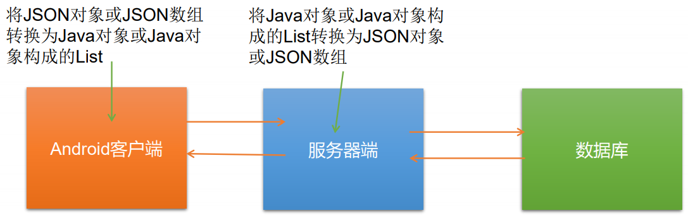 

### 集合框架

JDK提供的集合API位于java.util包内

- Collection接口：单列集合，用来存储一个一个的对象
  - List接口：存储有序的、可重复的数据；动态数组
    - ArrayList实现类：
    - LinkedList实现类：
    - Vector实现类：
  - Set：存储无序的、不可重复的数据
    - HashSet实现类：
      - LinkedHashSet实现类：
    - TreeSet实现类：
- Map接口：双列集合，用来存储一对（key-value）一对的数据，map翻译过来叫映射
  - HashMap实现类：
  - LinkedHashMap实现类：
  - TreeMap实现类：
  - HashTable实现类：
  - Properties实现类：

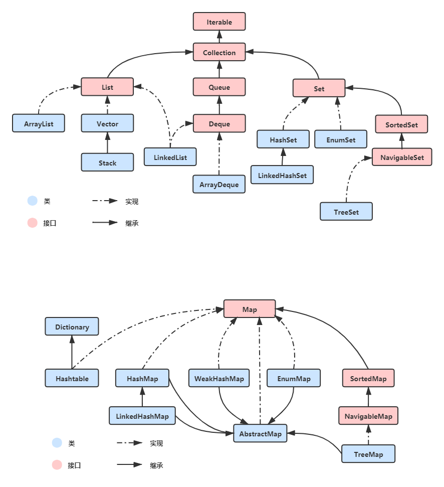 

## 02_Collection接口方法

Collection 接口是 List、Set 和 Queue 接口的父接口，该接口里定义的方法既可用于操作 List 集合，也可用于操作Set  和 Queue 集合。

JDK不提供此接口的任何直接实现，而是提供更具体的子接口(如：Set和List) 实现。

在 Java5 之前，Java 集合会丢失容器中所有对象的数据类型，把所有对象都 当成 Object 类型处理；从 JDK 5.0 增加了泛型以后，Java 集合可以记住容 器中对象的数据类型。

常用方法：

- 添加
  - add(Object obj)
  - addAll(Collection coll)
- 获取有效元素的个数
  -  int size()
- 清空集合
  - void clear()
- 是否是空集合
  - boolean isEmpty()：在集合存在的情况下，只会判断集合的个数，不会判断集合是否为null
- 是否包含某个元素
  - boolean contains(Object obj)：是通过元素的equals方法来判断是否是同一个对象
  - boolean containsAll(Collection c)：也是调用元素的equals方法来比较的。拿两个集合的元素挨个比较。
- 删除
  - boolean remove(Object obj) ：通过元素的equals方法判断是否是要删除的那个元素。只会删除找到的第一个元素
  - boolean removeAll(Collection coll)：取当前集合的差集
- 取两个集合的交集
  - boolean retainAll(Collection c)：把交集的结果存在当前集合中（即当前集合的元素会变化），不影响c。当两个集合中的元素相同或者集合没有变化时，结果为false，因此不能用返回值来判断两个集合中是否有交集，作交集运算后，可以使用集合的长度是否 `>0`来进行判断交集是否有。
- 集合是否相等：List集合比较的时候顺序也要相等。
  - boolean equals(Object obj)
- 转成对象数组
  - Object[] toArray()
- 数组转集合
  - Arrays.asList(T ... t)
- 获取集合对象的哈希值
  - hashCode()
- 遍历
  - iterator()：返回迭代器对象，用于集合遍历

结论:

向Collection接口的实现类的对象中添加数据obj时，要求obj所在类要重写equals().

## 03_Iterator迭代器接口

Iterator对象称为迭代器(设计模式的一种)，主要用于遍历 Collection 集合中的元素。（不会遍历Map）

**GOF给迭代器模式的定义为：提供一种方法访问一个容器(container)对象中各个元素，而又不需暴露该对象的内部细节。迭代器模式，就是为容器而生。**类似于"公交车上的售票员"、"火车上的乘务员"、"空姐"。

Collection接口继承了java.lang.Iterable接口，该接口有一个iterator()方法，那么所有实现了Collection接口的集合类都有一个iterator()方法，用以返回一个实现了 Iterator接口的对象。

**Iterator 仅用于遍历集合**，Iterator 本身并不提供承装对象的能力。如果需要创建 Iterator 对象，则必须有一个被迭代的集合。

**集合对象每次调用iterator()方法都得到一个全新的迭代器对象**，默认游标都在集合的第一个元素之前。

### 使用Iterator遍历Collection

建议使用内部的方法：hasNext()和next()

```java
@Test
public void test() {
    List<String> list = new ArrayList<>();
    list.add("1");
    list.add("2");
    list.add("3");
    list.add("3");

    Iterator<String> iterator = list.iterator();
    while (iterator.hasNext()){
        System.out.println(iterator.next());
    }
}
```

### 迭代器Iterator的执行原理

在调用it.next()方法之前必须要调用it.hasNext()进行检测。若不调用，且 下一条记录无效，直接调用it.next()会抛出NoSuchElementException异常。

```java
// hasNext():判断是否还有下一个元素
while(iterator.hasNext()){
    // next():①指针下移 ②将下移以后集合位置上的元素返回
    System.out.println(iterator.next());
}
```

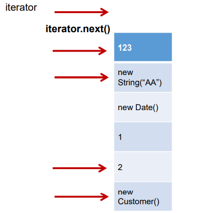 指针下移，将下移后的集合位置上的元素返回


### Iterator迭代器遍历集合的两种错误写法

>不要想着省略hasNext()

```java
Iterator<String> iterator = list.iterator();
while (iterator.next() != null){
    System.out.println(iterator.next());
}
```

集合元素少一半，因为一次执行取到两次当前元素

>集合对象每次调用iterator()方法都得到一个全新的迭代器对象

```java
while (list.iterator().next() != null){
    System.out.println(iterator.next());
}
```

死循环，每次都拿到一个新的迭代器对象

### Iterator迭代器remove()的使用

遍历时要删除元素不能使用集合的remove()方法，要使用迭代器的，这个不注意真的很容易错。

```java
Iterator iter = coll.iterator();//回到起点
while(iter.hasNext()){
    Object obj = iter.next();
    if(obj.equals("Tom")){
        iter.remove();
    }
}
```

注意：

1. Iterator可以删除集合的元素，但是是遍历过程中通过迭代器对象的remove方 法，不是集合对象的remove方法。
2. 如果还未调用next()或在上一次调用 next 方法之后已经调用了 remove 方法， 再调用remove都会报IllegalStateException。

```java
Iterator iter = coll.iterator();
while(iter.hasNext()){
    // 错误一:指针还没下来
    iter.remove();
    Object obj = iter.next();
    if(obj.equals("Tom")){
        // 错误二:重复删除
        iter.remove();
        iter.remove();
    }
}
```

### 使用 foreach 循环遍历集合元素

- Java 5.0 提供了 foreach 循环迭代访问 Collection和数组。
- 遍历操作不需获取Collection或数组的长度，无需使用索引访问元素。
-  **遍历集合的底层调用Iterator完成操作。**
- foreach还可以用来遍历数组。

```java
for (String s : list) {
    System.out.println("s = " + s);
}
```

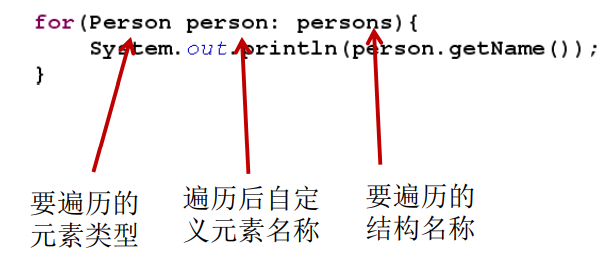 

> 练习题

```java
// 使用普通for循环
@Test
public void test() {
    String[] str = new String[]{"MM","MM","MM"};
    for (int i = 0; i < str.length; i++) {
        str[i] = "GG";
    }

    for (int i = 0; i < str.length; i++) {
        System.out.println(str[i]); // GG GG GG 
    }
}

// 使用增强for循环,取str中的元素赋给myStr,其中有一个赋值的操作
@Test
public void test() {
    String[] str = new String[]{"MM","MM","MM"};
    for (String myStr : str) {
        myStr = "GG";	
    }

    for (int i = 0; i < str.length; i++) {
        System.out.println(str[i]); // MM MM MM String不可变
    }
}
```

## 04_Collection子接口一：List

### List接口概述

1. 鉴于Java中数组用来存储数据的局限性，我们通常使用List替代数组
2. List集合类中**元素有序、且可重复**，集合中的每个元素都有其对应的顺序索引
3. List容器中的元素都对应一个整数型的序号记载其在容器中的位置，可以根据序号存取容器中的元素。
4. JDK API中List接口的实现类常用的有：ArrayList、LinkedList和Vector。

### List接口方法

List除了从Collection集合继承的方法外，List 集合里添加了一些根据索引来操作集合元素的方法。

- `void add(int index, Object ele)`：在index位置插入ele元素
- boolean addAll(int index, Collection eles)：从index位置开始将eles中 的所有元素添加进来
- `Object get(int index)`：获取指定index位置的元素
- int indexOf(Object obj)：返回obj在集合中首次出现的位置
- int lastIndexOf(Object obj)：返回obj在当前集合中末次出现的位置
- `Object remove(int index)`：移除指定index位置的元素，并返回此元素
- `Object set(int index, Object ele)`：设置指定index位置的元素为ele
- List subList(int fromIndex, int toIndex)：返回从fromIndex到toIndex 位置的子集合
- 遍历：迭代器、增强for循环、普通循环

### ArrayList、LinkedList、Vector异同

- 相同点：三个类都是实现了List接口，存储数据的特点相同：存储有序的、可重复的数据
- 不同点：
  - ArrayList：作为List接口的主要实现类；线程不安全的，效率高；底层使用object[] elementData存储
  - LinkedList：对于频繁的插入、删除操作，使用此类效率比ArrayList高；底层使用双向链表存储
  - Vector：作为List接口的古老实现类；线程安全的，效率低；底层使用Object[] elementData存储

还有底层源码，比如扩容机制

### List实现类之一：ArrayList

- ArrayList 是 List 接口的典型实现类、主要实现类
- 本质上，ArrayList是对象引用的一个”变长”数组
- ArrayList的JDK1.8之前与之后的实现区别？
  - JDK1.7：ArrayList像饿汉式，直接创建一个初始容量为10的数组
  - JDK1.8：ArrayList像懒汉式，一开始创建一个长度为0的数组，当添加第一个元 素时再创建一个始容量为10的数组
- Arrays.asList(…) 方法返回的 List 集合，既不是 ArrayList 实例，也不是 Vector 实例。 Arrays.asList(…) 返回值是一个固定长度的 List 集合


看源码，调方法之前首先关注的应该是构造器

#### JDK1.7饿汉式

构造方法：

```java
public ArrayList() {
    this(10);
}

public ArrayList(int initialcapacity) {
    super();
    if (initialcapacity < e){
        throw new IllegalArgumentException("Illegal Capacity: "+initialcapacity );
    }
    this.elementData = new 0bject[initialcapacity];
}
```

#### JDK1.8懒汉式

构造方法：

```java
// 不指定初始容量的构造方法
public ArrayList() {
    this.elementData = DEFAULTCAPACITY_EMPTY_ELEMENTDATA;
}

private static final Object[] DEFAULTCAPACITY_EMPTY_ELEMENTDATA = {};

// 指定初始容量的构造方法
public ArrayList(int initialCapacity) {
    if (initialCapacity > 0) {
        this.elementData = new Object[initialCapacity];
    } else if (initialCapacity == 0) {
        // private static final Object[] EMPTY_ELEMENTDATA = {};
        this.elementData = EMPTY_ELEMENTDATA;
    } else {
        throw new IllegalArgumentException("Illegal Capacity: "+initialCapacity);
    }
}
```

添加元素（扩容）方法：

1、懒汉式初始化容器容量，10

````java
public boolean add(E e) {
    // 确认list容量,如果不够,容量加1,注意:只加1,保证资源不被浪费
    // size:ArrayList 的大小(它包含的元素数)
    ensureCapacityInternal(size + 1); 
    elementData[size++] = e;
    return true;
}

private void ensureCapacityInternal(int minCapacity) {
    ensureExplicitCapacity(calculateCapacity(elementData, minCapacity));
}

private static int calculateCapacity(Object[] elementData, int minCapacity) {
    if (elementData == DEFAULTCAPACITY_EMPTY_ELEMENTDATA) {
        // private static final int DEFAULT_CAPACITY = 10;
        return Math.max(DEFAULT_CAPACITY, minCapacity);
    }
    return minCapacity;
}
````

2、扩容：0-10-15....

```java
private void ensureExplicitCapacity(int minCapacity) {
    modCount++;

    // 如果提交上来的扩容量够
    if (minCapacity - elementData.length > 0){
        grow(minCapacity);
    }
}

private void grow(int minCapacity) {
    // 获取当前数组的容量
    int oldCapacity = elementData.length;
    // 扩容。新的容量=当前容量+当前容量/2.即将当前容量增加一半（当前容量增加1.5倍）。
    int newCapacity = oldCapacity + (oldCapacity >> 1);
    // 如果扩容后的容量还是小于想要的最小容量
    if (newCapacity - minCapacity < 0){
        // 将扩容后的容量再次扩容为想要的最小容量
        newCapacity = minCapacity;
    }

    // 如果扩容后的容量大于临界值,则进行大容量分配
    if (newCapacity - MAX_ARRAY_SIZE > 0){
        newCapacity = hugeCapacity(minCapacity);
    }
    // copyof(原数组，新的数组长度)
    elementData = Arrays.copyOf(elementData, newCapacity);
}
```

####  总结

- JDK7情况下

  List<T> list = new ArrayList<T>();  // 底层创建了长度是10的Object[]数组elementData

  list.add(1); // elementData[0] = new Integer(123);

  ...

  list.add(11); //  如果此次的添加导致底层elementData数组容量不够，则扩容。

  默认情况下，扩容为原来的容量的1.5倍，同时需要将原有数组中的数据复制到新的数组中。

  结论：建议开发中使用带参的构造器：ArrayList list = new ArrayList(int capacity)

  10-15...

- JDK8情况下

  ArrayList list = new ArrayList()；//底层Object[] elementData初始化为{}.并没有创建长度为10的数组

  list.add(1)；//第一次调用add()时，底层才创建了长度10的数组，并将数据1添加到 elementData[0] 
  ...
  后续的添加和扩容操作与jdk 7无异。

  0-10-15...

### List实现类之二：LinkedList

- 对于频繁的插入或删除元素的操作，建议使用LinkedList类，效率较高

- 常见方法：
  - void addFirst(Object obj) 
  - void addLast(Object obj) 
  - Object getFirst() 
  - Object getLast() 
  - Object removeFirst() 
  - Object removeLast()

Node就是LinkedList数据存储的基本单位 

```java
public class LinkedList<E> extends AbstractSequentialList<E> implements List<E>, Deque<E>, Cloneable, java.io.Serializable
{
    transient int size = 0;

  	// 指向第一个节点的指针
    transient Node<E> first;

    // 指向最后一个节点的指针
    transient Node<E> last;
}
```

看看`Node<E>` 的内部结构：是一个私有的静态内部类，体现了LinkedList是一个双向链表的说法

```java
// 当前元素
private static class Node<E> {
    // 核心数据
    E item;
    // 下一个元素
    Node<E> next;
    // 上一个元素
    Node<E> prev;

    Node(Node<E> prev, E element, Node<E> next) {
        this.item = element;
        this.next = next;
        this.prev = prev;
    }
}
```

尾插方法：

```java
// 将指定的元素附加到此列表的末尾
public boolean add(E e) {
    linkLast(e);
    return true;
}

void linkLast(E e) {
    final Node<E> l = last;
    // 创建一个新节点,上一个节点是原链表的尾,当前节点,下一个节点为空
    final Node<E> newNode = new Node<>(l, e, null);
    last = newNode;
    if (l == null)
        // 从没添加过的场景,新添加的节点作为first
        first = newNode;
    else
        l.next = newNode;
    size++;
    modCount++;
}
```

### List实现类之三：Vector

- Vector 是一个古老的集合，JDK1.0就有了。大多数操作与ArrayList 相同，区别之处在于Vector是线程安全的。
- 在各种list中，最好把ArrayList作为缺省选择。当插入、删除频繁时， 使用LinkedList；Vector总是比ArrayList慢，所以尽量避免使用。
- 常用方法：
  - void addElement(Object obj) 
  -  void insertElementAt(Object obj,int index) 
  - void setElementAt(Object obj,int index) 
  - void removeElement(Object obj) 
  - void removeAllElements()
- Vector中有一个子类是栈：Stack

构造方法：JDK7和JDK8中通过空参构造方法创建对象时，底层都创建了长度为10的数组

```java
public Vector() {
    this(10);
}

public Vector(int initialCapacity) {
    this(initialCapacity, 0);
}

public Vector(int initialCapacity, int capacityIncrement) {
    super();
    if (initialCapacity < 0){
        throw new IllegalArgumentException("Illegal Capacity: "+initialCapacity);
    }
    this.elementData = new Object[initialCapacity];
    this.capacityIncrement = capacityIncrement;
}
```

扩容：默认扩容为原来数组的2倍，	10-20-40....

```java
public synchronized boolean add(E e) {
    modCount++;
    ensureCapacityHelper(elementCount + 1);
    elementData[elementCount++] = e;
    return true;
}

private void ensureCapacityHelper(int minCapacity) {
    // 1-10 > 0
    if (minCapacity - elementData.length > 0)
        grow(minCapacity);
}

// minCapacity = 10
private void grow(int minCapacity) {
    int oldCapacity = elementData.length;
    // 每次扩容为旧集合的2倍
    int newCapacity = oldCapacity + ((capacityIncrement > 0) ? capacityIncrement : oldCapacity);
    if (newCapacity - minCapacity < 0)
        newCapacity = minCapacity;
    if (newCapacity - MAX_ARRAY_SIZE > 0)
        newCapacity = hugeCapacity(minCapacity);
    elementData = Arrays.copyOf(elementData, newCapacity);
}
```

### List常见面试题

>以下输出结果：考察List的remove()方法

```java
@Test
public void testListRemove() {
    List list = new ArrayList();
    list.add(1);
    list.add(2);
    list.add(3);
    updateList(list);
    System.out.println(list);
}
private static void updateList(List list) {
    // 此处删除的是索引为2的元素
    list.remove(2);
    
    // 此处删除的是值为2的元素
    list.remove(Integer.valueOf(2));
    list.remove(new Integer(2));
}
```

## 05_Collection子接口二：Set

### Set接口概述

1. Set接口是Collection的子接口，set接口没有提供额外的方法，使用的都是Collection声明过的方法。
2. Set 集合不允许包含相同的元素，如果试把两个相同的元素加入同一个 Set 集合中，则添加操作失败。
3. Set 判断两个对象是否相同不是使用 == 运算符，而是根据 equals() 方法

### HashSet、LinkedHashSet、TreeSet异同

Collection接口：单列集合，用来存储一个一个的对象

- Set：存储无序的、不可重复的数据
  - HashSet实现类：作为Set接口的主要实现类；线程不安全；可以存储null值
    
    - LinkedHashSet实现类：作为HashSet的子类；遍历其内部数据时，可以按照添加的顺序遍历（即可以做到存储有序）
    
      对于频繁的遍历操作，LinkedHashSet效率高于HashSet
  - TreeSet实现类：可以按照添加对象的指定属性，进行排序

### Set无序性和不可重复性的理解

> 无序性

无序性不等于随机性。

以HashSet为例说明：存储的数据在底层数组中并非按照数据索引的顺序添加，即无序性指的是存储位置的无序。而是根据你要往数组中添加的数据的hash值决定的。

> 不可重复性

保证添加的元素按照equals()判断时，不能返回true，即：相同的元素只能添加一个；

我们在测试的时候，只给类重写了equals()方法，没有重写hashcode()，依旧可以添加两个，证明了先判断hash值才走equals()方法，所以重写equals()方法时必须重写hashcode()方法，这也是原因之一。


向HashSet中添加元素的过程：

如果是我们设计一个Set容器，无序性都是很好实现的，问题是不可重复性如何实现？

我们可能会这样：

1. 首先添加第一个元素，此时容器中没有任何元素，不用做特殊的逻辑判断处理
2. 添加第二个元素时，与第一个元素进行equals比较，结果为false时添加进容器
3. 添加第三个元素时，分别与前两个元素进行equals比较，结果全部为false时添加进容器
4. ....
5. 添加第10000个元素时，分别与前9999个元素进行equals比较，结果全部为false的时候添加进容器

这么做确实是实现了不可重复性，但是效率也大大的折损，来看看HashSet是如何保证不可重复性的：

前置知识：

1. HashSet的底层存储结构是HashMap
2. HashSet中的元素实际上是作为HashMap中的key存放在HashMap中的
3. 利用HashMap中key的唯一性来保证HashSet中不出现重复值
4. HashMap的底层存储结构是数组+链表+红黑树

我们向HashSet中添加元素a，首先调用元素a所在类的hashCode()方法，计算元素a的哈希值，用这个hash值通过某种算法计算出在HashSet底层数组中的存放位置（即索引位置），判断此位置上是否已经有元素：

- 如果此位置上没有其他元素，则元素a添加成功
- 如果此位置上存在其他元素b或以链表的形式存在其他元素，则比较a与b的hash值：
  - 如果hash值不相同，则元素a添加成功
  - 如果hash值相同，则需要调用元素a所在类的equals()方法：
    - 如果equals()方法返回false，则元素a添加成功
    - 如果equals()方法返回true，则元素a添加失败

对于添加成功的情况而言，元素a与已经存在指定索引位置上的数据以链表的方式存储：

- JDK7中：新添加的元素a放在数组中，指向原来的元素
- JDK8中：原来的元素在数组中，指向新添加的元素a
- 总结：七上八下

### 重写hashCode()和equals()方法的基本原则

> 重写 hashCode() 方法的基本原则

1. 在程序运行时，同一个对象多次调用 hashCode() 方法应该返回相同的值。
2. 当两个对象的 equals() 方法比较返回 true 时，这两个对象的 hashCode()  方法的返回值也应相等。
3. 对象中用作 equals() 方法比较的 Field，都应该用来计算 hashCode 值。

>重写 equals() 方法的基本原则

以自定义的Student类为例，何时需要重写equals()？

1. 当一个类有自己特有的"逻辑相等"概念，当改写equals()的时候，总是要改写hashCode()，根据一个类的equals方法（改写后），两个截然不同的实例有可能在逻辑上是相等的，但是，根据Object.hashCode()方法， 它们仅仅是两个对象。
2. 因此，违反了"**相等的对象必须具有相等的散列码**"。
3. 结论：复写equals方法的时候一般都需要同时复写hashCode方法。通常参与计算hashCode的对象的属性也应该参与到equals()中进行计算。

> Eclipse/IDEA工具里hashCode()的重写

以Eclipse/IDEA为例，在自定义类中可以调用工具自动重写equals和hashCode。 

问题：为什么用Eclipse/IDEA复写hashCode方法，有31这个数字？

1. 选择系数的时候要选择尽量大的系数。因为如果计算出来的hash地址越大，所谓的 “冲突”就越少，查找起来效率也会提高。（减少冲突）
2. 并且31只占用5bits,相乘造成数据溢出的概率较小。
3. 31可以由i * 31 == (i<<5)-1来表示，现在很多虚拟机里面都有做相关优化。（提高算法效率）
4. 31是一个素数，素数作用就是如果我用一个数字来乘以这个素数，那么最终出来的结果只能被素数本身和被乘数还有1来整除！(减少冲突)

### Set实现类之一：HashSet

- HashSet 是 Set 接口的典型实现，大多数时候使用 Set 集合时都使用这个实现类。
- HashSet 按 Hash 算法来存储集合中的元素，因此具有很好的存取、查找、删除性能。
- HashSet 具有以下特点：
  - 不能保证元素的排列顺序
  - HashSet 不是线程安全的
  - 集合元素可以是 null且只能有一个
- HashSet 集合判断两个元素相等的标准：两个对象通过 hashCode() 方法比较相等，并且两个对象的 equals() 方法返回值也相等。
- 对于存放在Set容器中的对象，对应的类一定要重写equals()和hashCode(Object  obj)方法，以实现对象相等规则。即："相等的对象必须具有相等的散列码"。


向HashSet中添加元素的过程：

1. 当向 HashSet 集合中存入一个元素时，HashSet 会调用该对象的 hashCode() 方法 来得到该对象的 hashCode 值，然后根据 hashCode 值，通过某种散列函数决定该对象 在 HashSet **底层数组中**的存储位置。（这个散列函数会与底层数组的长度相计算得到在数组中的下标，并且这种散列函数计算还尽可能保证能均匀存储元素，越是散列分布， 该散列函数设计的越好）
2. 如果两个元素的hashCode()值相等，会再继续调用equals方法，如果equals方法结果 为true，添加失败；如果为false，那么会保存该元素，但是该数组的位置已经有元素了， 那么会通过**链表的方式**继续链接。
3. 如果两个元素的 equals() 方法返回 true，但它们的 hashCode() 返回值不相 等，hashSet 将会把它们存储在不同的位置，但依然可以添加成功。


看一下HashSet的底层存储图解：

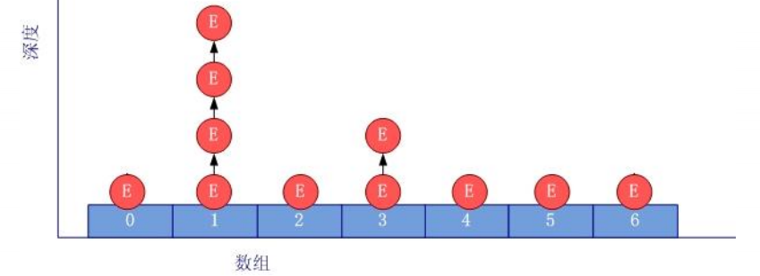 

底层也是数组，初始容量为16，当如果使用率超过0.75，（16*0.75=12） 就会扩大容量为原来的2倍。（16扩容为32，依次为64，128....等）

### Set实现类之二：HashSet的子类LinkedHashSet

LinkedHashSet作为HashSet的子类，在添加数据的同时，每个数据还维护了两个引用，记录此数据的前一个数据和后一个数据，所以在遍历的时候是按照我们添加进容器的顺序遍历的。

1. LinkedHashSet 是 HashSet 的子类
2. LinkedHashSet 根据元素的 hashCode 值来决定元素的存储位置， 但它同时使用双向链表维护元素的次序，这使得元素**看起来是以插入顺序保存的**。
3. LinkedHashSet插入性能略低于 HashSet，但在迭代访问 Set 里的全 部元素时有很好的性能。对于频繁的遍历操作，LindkedHashSet效率高于HashSet。
4. LinkedHashSet 不允许集合元素重复。

LinkedHashSet底层结构：

```java
Set set = new LinkedHashSet();
set.add(new String("AA"));
set.add(456);
set.add(456);
set.add(new Customer("刘德华", 1001));
```

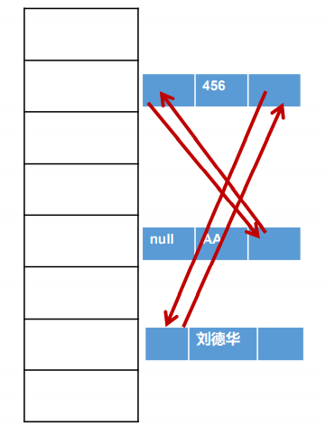 

### Set实现类之三：TreeSet

> 总结

1. 向TreeSet中添加的数据，要求是相同类的对象
2. 两种排序方式：默认自然排序（泛型类实现Comparable接口重写compareTo方法）和定制接口（构造函数中填入实现Comparator接口重写compare方法`Set<Student> set = new TreeSet<>(Comparator.comparingInt(Student::hashCode));`）
3. 自然排序中，比较两个对象是否相同的方法的标准为compareTo()返回0，不再是equals()
4. 定制排序中，比较两个对象是否相同的方法的标准为compare返回0，不再是equals()
5. TreeSet 是 SortedSet 接口的实现类，TreeSet 可以确保集合元素处于排序状态。
6. TreeSet底层使用**红黑树**结构存储数据
7. TreeSet对于相等这个概念**更严格**了，因为树没有相同的节点，相同时不会插入

> 自然排序

1. 使用自然排序：TreeSet 会调用集合元素的 compareTo(Object obj) 方法来比较元素之间的大小关系，再将集合元素按升序(默认情况)排列
2. 如果试图把一个对象添加到 TreeSet 时，则该对象的类必须实现 Comparable  接口。实现 Comparable 的类必须实现 compareTo(Object obj) 方法，两个对象即通过 compareTo(Object obj) 方法的返回值来比较大小。
3. Comparable 的典型实现：
   1. BigDecimal、BigInteger 以及所有的数值型对应的包装类：按它们对应的数值大小进行比较
   2. Character：按字符的 unicode值来进行比较
   3. Boolean：true 对应的包装类实例大于 false 对应的包装类实例
   4. String：按字符串中字符的 unicode 值进行比较
   5. Date、Time：后边的时间、日期比前面的时间、日期大
4. 向 TreeSet 中添加元素时，只有第一个元素无须比较compareTo()方法，后面添 加的所有元素都会调用compareTo()方法进行比较
5. 因为只有相同类的两个实例才会比较大小，所以向 TreeSet 中添加的应该是同 一个类的对象。
6. 对于 TreeSet 集合而言，它判断两个对象是否相等的唯一标准是：两个对象通 过 compareTo(Object obj) 方法比较返回值。
7. 当需要把一个对象放入 TreeSet 中，重写该对象对应的 equals() 方法时，应保证该方法与 compareTo(Object obj) 方法有一致的结果：如果两个对象通过 equals() 方法比较返回 true，则通过 compareTo(Object obj) 方法比较应返回 0。 **否则，让人难以理解。**

> 定制排序

1. TreeSet的自然排序要求元素所属的类实现Comparable接口，如果元素所属的类没有实现Comparable接口，或不希望按照升序(默认情况)的方式排列元素或希望按照 其它属性大小进行排序，则考虑使用定制排序。定制排序，通过Comparator接口来实现。需要重写compare(T o1,T o2)方法。
2. 利用int compare(T o1,T o2)方法，比较o1和o2的大小：如果方法返回正整数，则表 示o1大于o2；如果返回0，表示相等；返回负整数，表示o1小于o2。
3. 要实现定制排序，需要将实现Comparator接口的实例作为形参传递给TreeSet的构造器。
4. 此时，仍然只能向TreeSet中添加类型相同的对象。否则发生ClassCastException异 常。
5. 使用定制排序判断两个元素相等的标准是：通过Comparator比较两个元素返回了0。

### Set常见面试题

> 在List内去除重复数字值，要求尽量简单

如果是自定义对象，需要重写equals()和hashcode()方法

```java
public static List duplicateList(List list) {
    HashSet set = new HashSet();
    set.addAll(list);
    return new ArrayList(set);
}
public static void main(String[] args) {
    List list = new ArrayList();
    list.add(new Integer(1));
    list.add(new Integer(2));
    list.add(new Integer(2));
    list.add(new Integer(4));
    list.add(new Integer(4));
    List list2 = duplicateList(list);
    for (Object integer : list2) {
        System.out.println(integer);
    }
}
```

> 非常经典的考察

```java
HashSet set = new HashSet();
Person p1 = new Person(1001,"AA");
Person p2 = new Person(1002,"BB");
set.add(p1);
set.add(p2);
System.out.println(set); 	// 此时输出set,set中有几个元素? 2个,很明显


p1.name = "CC";
set.remove(p1);
System.out.println(set);	// CC BB  为什么呢?修改p1的属性后hash值也变化了,所以删除p1并非原有AA所在位置的hashcode

set.add(new Person(1001,"CC"));
System.out.println(set);	// CC BB CC 添加成功,此时添加到真正hash对应位置上的CC

set.add(new Person(1001,"AA"));
System.out.println(set);	// 添加成功,虽然和第一个元素hashcode值相同,但是equals进行比较时,AA被改为CC,本次AA没问题
```

## 06_Map接口

### Map接口概述

1. Map与Collection并列存在。用于保存具有映射关系的数据:key-value
2. Map 中的 key 和 value 都可以是任何引用类型的数据
3. Map 中的 key 用Set来存放，不允许重复，即同一个 Map 对象所对应的类，须重写hashCode()和equals()方法
4. 常用String类作为Map的"键"
5. key 和 value 之间存在单向一对一关系，即通过指定的 key 总能找到 唯一的、确定的 value
6. Map接口的常用实现类：HashMap、TreeMap、LinkedHashMap和 Properties。其中，HashMap是 Map 接口使用频率最高的实现类

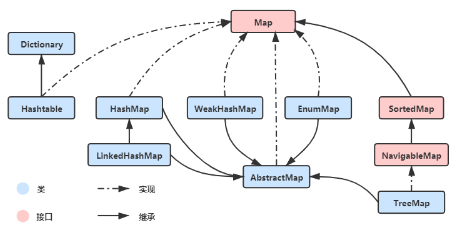 


- Map：双列数据，存储key - value 对的数据

  - HashMap：作为Map的主要实现类，线程不安全的，效率高，可以存储null的key和value，只能有一个null键

    - LinkedHashMap：保证在遍历Map的时候，可以按照添加的顺序实现遍历

      原因：在原有的 HashMap 底层结构基础上，添加了一对指针即引用，指向前一个和后一个元素，对于频繁的遍历操作，此类执行效率高于HashMap

      底层结构：JDK7之前采用数组+链表，JDK8采用数组+链表+红黑树

  - HashTable：作为古老的实现类，线程安全的，效率低，不能存储 null 的 key 和 value

    - Properties：常用来处理配置文件，key 和 value 都是 String 类型

  - TreeMap：保证按照添加的key-value对进行排序，实现排序遍历。此时考虑key的自然排序或者定制排序即可，底层采用红黑树。

### Map结构键值对的特点

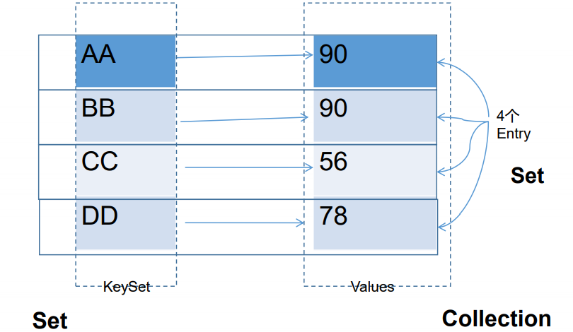 

1. Map中的key：无序的、不可重复的，使用Set存储所有的 key，意味着key所在的类要重写equals()和hashcode()方法（以HashMap为例）
2. Map中的value：无序的、可重复的，使用Collection存储所有的value，containsValue()方法意味着value所在的类要重写equals()
3. Map中的键值对：key-value构成了一个Entry对象
4. Map中的entry，无序的、不可重复的，使用Set存储所有的entry

### Map常用方法

#### 添加操作

- Object put(Object key,Object value)：将指定key-value添加到(或修改)当前map对象中
- void putAll(Map m):将m中的所有key-value对存放到当前map中

#### 删除操作

- Object remove(Object key)：移除指定key的key-value对，并返回value
- void clear()：清空当前map中的所有数据

#### 修改操作

- Object put(Object key,Object value)：将指定key-value添加到(或修改)当前map对象中

#### 查询操作

- Object get(Object key)：获取指定key对应的value 
- boolean containsKey(Object key)：是否包含指定的key 
- boolean containsValue(Object value)：是否包含指定的value 
- int size()：返回map中key-value对的个数 
- boolean isEmpty()：判断当前map是否为空 
- boolean equals(Object obj)：判断当前map和参数对象obj是否相等

#### 遍历

- Set keySet()：返回所有key构成的Set集合
- Collection values()：返回所有value构成的Collection集合
- Set entrySet()：返回所有key-value对构成的Set集合

### Map实现类之一：HashMap

1. HashMap是 Map 接口使用频率最高的实现类。
2. 允许使用null键和null值，与HashSet一样，不保证映射的顺序。
3. 所有的key构成的集合是Set:无序的、不可重复的。所以，key所在的类要重写： equals()和hashCode()
4. 所有的value构成的集合是Collection:无序的、可以重复的。所以，value所在的类 要重写：equals()
5. 一个key-value构成一个entry
6. 所有的entry构成的集合是Set:无序的、不可重复的
7. HashMap 判断两个 key 相等的标准是：两个 key 通过 equals() 方法返回 true， hashCode 值也相等。
8. HashMap 判断两个 value相等的标准是：两个 value 通过 equals() 方法返回 true。

> HashMap源码中的重要常量

`DEFAULT_INITIAL_CAPACITY` : HashMap的默认容量，16 

`MAXIMUM_CAPACITY `： HashMap的最大支持容量，2^30 

`DEFAULT_LOAD_FACTOR`：HashMap的默认加载因子 

`TREEIFY_THRESHOLD`：Bucket中链表长度大于该默认值，转化为红黑树 

`UNTREEIFY_THRESHOLD`：Bucket中红黑树存储的Node小于该默认值，转化为链表 

`MIN_TREEIFY_CAPACITY`：桶中的Node被树化时最小的hash表容量。（当桶中Node的数量大到需要变红黑树时，若hash表容量小于

MIN_TREEIFY_CAPACITY时，此时应执行 resize扩容操作这个MIN_TREEIFY_CAPACITY的值至少是TREEIFY_THRESHOLD的4 倍。） 

`table`：存储元素的数组，总是2的n次幂 

`entrySet`：存储具体元素的集 

`size`：HashMap中存储的键值对的数量 

`modCount`：HashMap扩容和结构改变的次数

`threshold`：扩容的**临界值**，=容量*填充因子 

`loadFactor`：填充因子

#### JDK7

> 底层实现原理

`Map<K,V> map  = new HashMap<K,V>();` 

在实例化以后，底层创建了长度是16的一维`Entry[] table`数组

当进行`map.put(key1,value1)`操作时：

首先调用key1所在类的hashCode()计算key1的哈希值，此哈希值经过某种算法计算以后，得到在Entry数组中的存放位置：

- 如果此位置数据为空，此时key1-value1添加成功
- 如果此位置数据不为空（意味着此位置上存在一个或者多个数据，并且以链表的方式存在），比较key1与已经存在的多个数据的哈希值
  - 如果key1的哈希值与链表中所有key的哈希值比较都不相同，此时key1-value1添加到数组成功
  - 如果key1的哈希值与链表中已经存在的某一个数据（key2-value2）的哈希值相同，继续比较，调用key1所在类的equals(key2)
    - 如果equals()返回false，此时key1-value1添加成功
    - 如果equals()返回true，使用value1替换value2

在不断添加的过程中，会涉及到扩容问题，当超出临界值（且要存放的位置为空）时，默认的扩容方式：扩容为原来的2倍，并将原有的数据复制到新数组中

> 底层存储结构：JDK 7及以前版本：HashMap是数组+链表结构（即为链地址法）

Entry[] table

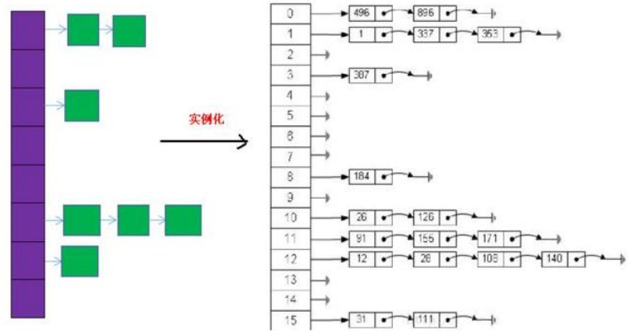 

> 源码

从构造方法看起：

```java
public HashMap() {
    // static final int DEFAULT_INITIAL_CAPACITY = 16; 默认初始容量 - 必须是 2 的幂。
    // static final float DEFAULT_LOAD_FACTOR = 0.75f; 在构造函数中未指定时使用的负载因子。
    this(DEFAULT_INITIAL_CAPACITY, DEFAULT_LOAD_FACTOR);
}
```

使用this关键字调用本类构造器：

```java
// initialCapacity = 16
// loadFactor = 0.75f
public HashMap(int initialCapacity, float loadFactor) {
    // 初次不会进入
    if (initialCapacity < 0){
        throw new IllegalArgumentException("Illegal initial capacity: " + initialCapacity);
    }

    // static final int MAXIMUM_CAPACITY = 1 << 30; The maximum capacity 不会进入
    if (initialCapacity > MAXIMUM_CAPACITY){
        initialCapacity = MAXIMUM_CAPACITY;
    }

    // 负载因子不会小于0 不会进入
    if (loadFactor <= 0 || Float.isNaN(loadFactor)){
        throw new IllegalArgumentException("Illegal load factor: " + loadFactor);
    }


    // 此处对容量进行第一次处理,如果我们自定义传入的初始化容量initialCapacity = 15,底层并不会给我们创建一个长度为15的Map
    // 而是会先从1-2-4-8-16扩容到16
    int capacity = 1;
    while (capacity < initialCapacity){
        capacity <<= 1;
    }

    // 将负载因子赋值给当前对象的负载因子
    this.loadFactor = loadFactor;
    // 计算出扩容的临界值 = 容量 * 负载因子 = 16 * 0.75 = 12
    threshold = (int)Math.min(capacity * loadFactor, MAXIMUM_CAPACITY + 1);
    // 初始化一个长度为16的Entry数组
    table = new Entry[capacity];
    useAltHashing = sun.misc.VM.isBooted() && (capacity >= Holder.ALTERNATIVE_HASHING_THRESHOLD);
    init();
}
```

构造方法看完了，下面看看向 HashMap 中添加元素的put方法：

```java
public V put(K key, V value) {
    if (key == null){
        // 针对于null键,HashMap给出了特殊处理的方法
        return putForNullKey(value);
    }
    
    // 计算出当前key的hash值
    int hash = hash(key);
    
    // 根据hash值和当前数组的长度计算出该元素应该存放在数组的索引位置
    int i = indexFor(hash, table.length);
    // 取出数组当前位置的元素,可能是链表,如果元素不为空就进行比对
    for (Entry<K,V> e = table[i]; e != null; e = e.next) {
        Object k;
        // 如果哈希相等并且key相等,进行替换,新加入的元素替换老元素
        if (e.hash == hash && ((k = e.key) == key || key.equals(k))) {
            V oldValue = e.value;
            e.value = value;
            e.recordAccess(this);
            return oldValue;
        }
    }

    // 取出数组当前位置的元素,如果为空,直接进行元素的添加
    modCount++;
    // 将元素添加到数组的核心方法
    addEntry(hash, key, value, i);
    return null;
}
```

计算出当前key的hash值：

```java
final int hash(Object k) {
    int h = 0;
    // 默认为false
    if (useAltHashing) {
        if (k instanceof String) {
            return sun.misc.Hashing.stringHash32((String) k);
        }
        h = hashSeed;
    }

    h ^= k.hashCode();

    h ^= (h >>> 20) ^ (h >>> 12);
    return h ^ (h >>> 7) ^ (h >>> 4);
}
```

根据hash值和当前数组的长度计算出该元素应该存放在数组的索引位置：

```java
static int indexFor(int h, int length) {
    return h & (length-1);
}
```

将元素添加到数组的核心方法：

```java
// 当前key的hash值、K-V、要添加到数组的位置
void addEntry(int hash, K key, V value, int bucketIndex) {
    // 判断是否需要扩容 长度>=扩容临界值 并且 当前位置上的元素不为空,也就是即将形成链表的时候
    if ((size >= threshold) && (null != table[bucketIndex])) {
        // 扩容为原来的2倍
        resize(2 * table.length);
        hash = (null != key) ? hash(key) : 0;
        bucketIndex = indexFor(hash, table.length);
    }

    // 未扩容的正常方式
    createEntry(hash, key, value, bucketIndex);
}
```

为扩容添加元素的方法：

```java
void createEntry(int hash, K key, V value, int bucketIndex) {
    // 取出当前位置的元素
    Entry<K,V> e = table[bucketIndex];
    // 原来的元素变成链表的下一个节点,当前元素放在数组中
    table[bucketIndex] = new Entry<>(hash, key, value, e);
    size++;
}

Entry(int h, K k, V v, Entry<K,V> n) {
    value = v;
    // 原来的元素变成链表的下一个节点
    next = n;
    key = k;
    hash = h;
}
```

> 总结

1、HashMap的内部存储结构其实是**数组和链表的结合**。当实例化一个HashMap时， 系统会创建一个长度为Capacity的Entry数组，这个长度在哈希表中被称为容量 (Capacity)，在这个数组中可以存放元素的位置我们称之为"桶"(bucket)，每个 bucket都有自己的索引，系统可以根据索引快速的查找bucket中的元素。

2、每个bucket中存储一个元素，即一个Entry对象，但每一个Entry对象可以带一个引 用变量，用于指向下一个元素，因此，在一个桶中，就有可能生成一个Entry链。 **而且新添加的元素作为链表的head。**

添加元素的过程：

3、向HashMap中添加entry1(key，value)，需要首先计算entry1中key的哈希值(根据 key所在类的hashCode()计算得到)，此哈希值经过处理以后，得到在底层Entry[]数 组中要存储的位置i。如果位置i上没有元素，则entry1直接添加成功。如果位置i上 已经存在entry2(或还有链表存在的entry3，entry4)，则需要通过循环的方法，依次 比较entry1中key和其他的entry。如果彼此hash值不同，则直接添加成功。如果 hash值不同，继续比较二者是否equals。如果返回值为true，则使用entry1的value 去替换equals为true的entry的value。如果遍历一遍以后，发现所有的equals返回都 为false,则entry1仍可添加成功。entry1指向原有的entry元素。

4、HashMap的扩容

当HashMap中的元素越来越多的时候，hash冲突的几率也就越来越高，因为数组的 长度是固定的。所以为了提高查询的效率，就要对HashMap的数组进行扩容，**而在 HashMap数组扩容之后，最消耗性能的点就出现了：原数组中的数据必须重新计算其在新数组中的位置，并放进去，这就是resize。**

5、那么HashMap什么时候进行扩容呢？

当HashMap中的元素个数超过数组大小（数组总大小length，不是数组中个数 size）`*`loadFactor 时 ， 就会进行数组扩容 ， loadFactor 的默认值 (DEFAULT_LOAD_FACTOR)为0.75，这是一个折中的取值。也就是说，默认情况 下，数组大小(DEFAULT_INITIAL_CAPACITY)为16，那么当HashMap中元素个数 超过`16*0.75=12`（这个值就是代码中的threshold值，也叫做临界值）的时候，就把 数组的大小扩展为 `2*16=32`，即扩大一倍，然后重新计算每个元素在数组中的位置， 而这是一个非常消耗性能的操作，所以如果我们已经预知HashMap中元素的个数， 那么预设元素的个数能够有效的提高HashMap的性能

#### JDK8

> 底层实现原理

JDK8相较于JDK7在底层实现方面的不同：

1. `Map<K,V> map  = new HashMap<K,V>()`：默认情况下，先不创建长度为16的数组

2. JDK8底层的数组是:Node[]，而非Entry[ ]，在JDK7中称为Entry类型

3. 首次调用put()方法时，底层创建长度为16的数组

4. 形成链表结构时，新添加的key-value对在链表的尾部（七上八下）

5. JDK7底层结构只有：数组+链表。JDK8中底层结构：数组+链表+红黑树

   当数组的某一个索引位置上的元素以链表形式存在的数据个数>8且当前数组的长度>64时，此时此索引位置上的所有数据改为使用红黑树存储。链表的查询时间复杂度为O(N)，树的为O(Log2 N)

>底层存储结构：JDK 8版本发布以后：HashMap是数组+链表+红黑树实现

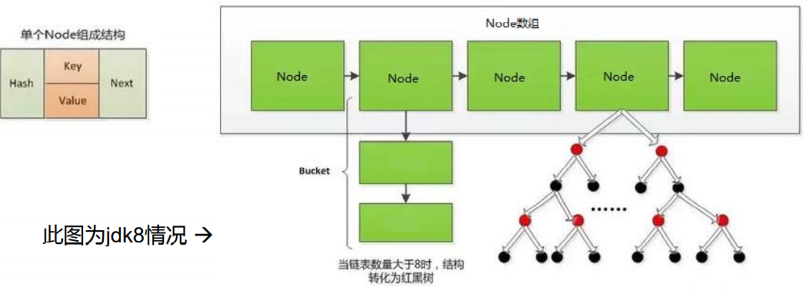 

> 源码

依旧从构造方法看起：我们看到构造方法仅仅是将负载因子初始化为0.75，并没有初始化数组的容量

```java
public HashMap() {
    // static final float DEFAULT_LOAD_FACTOR = 0.75f;
    this.loadFactor = DEFAULT_LOAD_FACTOR;
}
```

构造方法看完了，下面看看向 HashMap 中添加元素的put方法：

```java
public V put(K key, V value) {
    // 当前key的哈希值,K-V,false,true
    return putVal(hash(key), key, value, false, true);
}
```

真正put值的putVal方法：

```java
final V putVal(int hash, K key, V value, boolean onlyIfAbsent,boolean evict) {
    Node<K,V>[] tab; 
    Node<K,V> p; 
    int n, i;
    // 如果当前数组为null或者长度为0,也就是未初始化状态
    if ((tab = table) == null || (n = tab.length) == 0){
        // 进行首次扩容（扩容的方法是通用的）
        n = (tab = resize()).length;
    }

    // 如果用入参总经过计算的哈希得到当前数组的位置的元素为空,那么简单了,直接创建Node
    if ((p = tab[i = (n - 1) & hash]) == null)
        tab[i] = newNode(hash, key, value, null);

    // else 也就是当前位置上有元素,是单个元素呢还是链表呢还是红黑树呢？
    else {
        Node<K,V> e; K k;
        // 情况一:当前数组索引位置的元素是单个元素
        // 如果哈希值或者key都相同,证明重复了不能添加,将该元素拿到准备做后续处理
        if (p.hash == hash && ((k = p.key) == key || (key != null && key.equals(k)))){
            e = p;
        }

        // 情况二:当前数组索引位置的元素是树结构
        // 如果当前位置存在的已经是红黑树的形式,盲猜应该要与树中的元素一一进行比对
        else if (p instanceof TreeNode){
            e = ((TreeNode<K,V>)p).putTreeVal(this, tab, hash, key, value);
        }

        // 情况三:当前数组索引位置的元素是链表还未形成树
        else {
            for (int binCount = 0; ; ++binCount) {
                // 这里相当于是for循环的条件:如果链表的下一个节点为null
                if ((e = p.next) == null) {
                    // 创建下一个节点,也就是链在链表尾部
                    p.next = newNode(hash, key, value, null);
                    // 判断链表中的长度 = 8时候转换为红黑树
                    if (binCount >= TREEIFY_THRESHOLD - 1) // -1 for 1st
                        treeifyBin(tab, hash);
                    break;
                }

                // 常规循环体:如果与链表中任意一个节点相等,别循环了你进不来,breake
                if (e.hash == hash &&
                    ((k = e.key) == key || (key != null && key.equals(k)))){
                    break;
                }
                // 记录重复的元素准备做后续处理
                p = e;
            }
        }

        // 将本次添加的相同key的元素与之前的key的value进行替换
        if (e != null) { // existing mapping for key
            V oldValue = e.value;
            if (!onlyIfAbsent || oldValue == null)
                e.value = value;
            afterNodeAccess(e);
            return oldValue;
        }
    }
    ++modCount;
    if (++size > threshold)
        resize();
    afterNodeInsertion(evict);
    return null;
}
```

扩容的resize方法：

```java
final Node<K,V>[] resize() {
    Node<K,V>[] oldTab = table;
    // 容量 oldCap = 0
    int oldCap = (oldTab == null) ? 0 : oldTab.length;
    // 扩容临界值 oldThr = 0
    int oldThr = threshold;
    int newCap, newThr = 0;
    // 这段不会执行
    if (oldCap > 0) {
        if (oldCap >= MAXIMUM_CAPACITY) {
            threshold = Integer.MAX_VALUE;
            return oldTab;
        }
        else if ((newCap = oldCap << 1) < MAXIMUM_CAPACITY &&
                 oldCap >= DEFAULT_INITIAL_CAPACITY)
            newThr = oldThr << 1; // double threshold
    }
    // 这段不会执行
    else if (oldThr > 0) // initial capacity was placed in threshold
        newCap = oldThr;
    // 新的容量 = 16
    // 新的扩容临界值 = 12
    else {               // zero initial threshold signifies using defaults
        newCap = DEFAULT_INITIAL_CAPACITY;
        newThr = (int)(DEFAULT_LOAD_FACTOR * DEFAULT_INITIAL_CAPACITY);
    }
    if (newThr == 0) {
        float ft = (float)newCap * loadFactor;
        newThr = (newCap < MAXIMUM_CAPACITY && ft < (float)MAXIMUM_CAPACITY ?
                  (int)ft : Integer.MAX_VALUE);
    }
    threshold = newThr;
    
    // 初始化一个长度为16的Node数组
    @SuppressWarnings({"rawtypes","unchecked"})
    Node<K,V>[] newTab = (Node<K,V>[])new Node[newCap];
    table = newTab;
    if (oldTab != null) {
        for (int j = 0; j < oldCap; ++j) {
            Node<K,V> e;
            if ((e = oldTab[j]) != null) {
                oldTab[j] = null;
                if (e.next == null)
                    newTab[e.hash & (newCap - 1)] = e;
                else if (e instanceof TreeNode)
                    ((TreeNode<K,V>)e).split(this, newTab, j, oldCap);
                else { // preserve order
                    Node<K,V> loHead = null, loTail = null;
                    Node<K,V> hiHead = null, hiTail = null;
                    Node<K,V> next;
                    do {
                        next = e.next;
                        if ((e.hash & oldCap) == 0) {
                            if (loTail == null)
                                loHead = e;
                            else
                                loTail.next = e;
                            loTail = e;
                        }
                        else {
                            if (hiTail == null)
                                hiHead = e;
                            else
                                hiTail.next = e;
                            hiTail = e;
                        }
                    } while ((e = next) != null);
                    if (loTail != null) {
                        loTail.next = null;
                        newTab[j] = loHead;
                    }
                    if (hiTail != null) {
                        hiTail.next = null;
                        newTab[j + oldCap] = hiHead;
                    }
                }
            }
        }
    }
    return newTab;
}
```

当发现指定数组位置的元素为null，直接创建Node

```java
Node<K,V> newNode(int hash, K key, V value, Node<K,V> next) {
    return new Node<>(hash, key, value, next);
}
```

链表中的长度 = 8时候转换为红黑树

```java
final void treeifyBin(Node<K,V>[] tab, int hash) {
    int n, index; Node<K,V> e;
    // 这里并不是直接就转换为了红黑树,而是当前数组长度小于64的时候才会转换
    // 看到这里的时候不禁感叹,一切操作都是为了减少链表转向红黑树
    // 当数组长度为16的时候,其中某个节点链表长度超过8的时候不直接转换的原因是,可能因为某个原因只有这个节点的冲突较多,所以先把数组长度进行添加后,增长后会触发重hash操作,这时候链表的长度可能会缩短就不用转换为红黑树了
    if (tab == null || (n = tab.length) < MIN_TREEIFY_CAPACITY)
        resize();
    else if ((e = tab[index = (n - 1) & hash]) != null) {
        TreeNode<K,V> hd = null, tl = null;
        do {
            TreeNode<K,V> p = replacementTreeNode(e, null);
            if (tl == null)
                hd = p;
            else {
                p.prev = tl;
                tl.next = p;
            }
            tl = p;
        } while ((e = e.next) != null);
        if ((tab[index] = hd) != null)
            hd.treeify(tab);
    }
}
```

负载因子的作用：为什么不像ArrayList那样，满了再扩容，HashMap会满吗？可能一直满不了，链表已经足够长了，所以要扩容，并且负载因子过小扩容太多，浪费数组空间，过大hash冲突会变高。

> 总结

1、HashMap的内部存储结构其实是**数组+链表+树**的结合。当实例化一个 HashMap时，会初始化initialCapacity和loadFactor，在put第一对映射关系 时，系统会创建一个长度为initialCapacity的Node数组，这个长度在哈希表 中被称为容量(Capacity)，在这个数组中可以存放元素的位置我们称之为 "桶"(bucket)，每个bucket都有自己的索引，系统可以根据索引快速的查找bucket中的元素。桶里可以装单个元素、链表、红黑树

2、每个bucket中存储一个元素，即一个Node对象，但每一个Node对象可以带 一个引用变量next，用于指向下一个元素，因此，在一个桶中，就有可能 生成一个Node链。也可能是一个一个TreeNode对象，每一个TreeNode对象 可以有两个叶子结点left和right，因此，在一个桶中，就有可能生成一个 TreeNode树。而新添加的元素作为链表的last，或树的叶子结点。

3、那么HashMap什么时候进行扩容和树形化呢？

当HashMap中的元素个数超过数组大小（数组总大小length，不是数组中个数 size） `*`loadFactor 时 ， 就会进行数组扩容 ， loadFactor 的默认 值 (DEFAULT_LOAD_FACTOR)为0.75，这是一个折中的取值。也就是说，默认情况下，数组大小(DEFAULT_INITIAL_CAPACITY)为16，那么当HashMap中 元素个数超过`16*0.75=12`（这个值就是代码中的threshold值，也叫做临界值） 的时候，就把数组的大小扩展为 `2*16=32`，即扩大一倍，然后重新计算每个元 素在数组中的位置，而这是一个非常消耗性能的操作，所以如果我们已经预知 HashMap中元素的个数，那么预设元素的个数能够有效的提高HashMap的性能。

当HashMap中的其中一个链的对象个数如果达到了8个，此时如果capacity没有 达到64，那么HashMap会先扩容解决，如果已经达到了64，那么这个链会变成 树，结点类型由Node变成TreeNode类型。当然，如果当映射关系被移除后， 下次resize方法时判断树的结点个数低于6个，也会把树再转为链表。

4、负载因子值的大小，对HashMap有什么影响

负载因子的大小决定了HashMap的数据密度。

负载因子越大密度越大，发生碰撞的几率越高，数组中的链表越容易长, 造成查询或插入时的比较次数增多，性能会下降。

负载因子越小，就越容易触发扩容，数据密度也越小，意味着发生碰撞的几率越小，数组中的链表也就越短，查询和插入时比较的次数也越小，性能会更高。但是会浪费一定的内容空间。而且经常扩容也会影响性能，建议初始化预设大一点的空间。

按照其他语言的参考及研究经验，会考虑将负载因子设置为0.7~0.75，此时平均检索长度接近于常数。

### Map实现类之二：LinkedHashMap

1. LinkedHashMap 是 HashMap 的子类
2. 在HashMap存储结构的基础上，使用了一对双向链表来记录添加元素的顺序
3. 与LinkedHashSet类似，LinkedHashMap 可以维护 Map 的迭代顺序：迭代顺序与 Key-Value 对的插入顺序一致

LinkedHashMap保证了添加到Map容器中的顺序，看下源码：

我们在查询LinkedHashMap的添加元素的源码put方法时候发现直接使用父类HashMap的put方法：

```java
final V putVal(int hash, K key, V value, boolean onlyIfAbsent,boolean evict) {
    Node<K,V>[] tab; Node<K,V> p; int n, i;
    if ((tab = table) == null || (n = tab.length) == 0)
        n = (tab = resize()).length;
    if ((p = tab[i = (n - 1) & hash]) == null)
        tab[i] = newNode(hash, key, value, null);
}
```

在newNode方法中，我们看到LinkedHashMap重写了newNode

```java
Node<K,V> newNode(int hash, K key, V value, Node<K,V> e) {
    LinkedHashMap.Entry<K,V> p = new LinkedHashMap.Entry<K,V>(hash, key, value, e);
    linkNodeLast(p);
    return p;
}
```

LinkedHashMap.Entry<K,V>：不但是链表，在链表中每个节点增加了前驱和后继

```java
static class Entry<K,V> extends HashMap.Node<K,V> {
    Entry<K,V> before, after;	// 能够记录添加元素的先后顺序
    Entry(int hash, K key, V value, Node<K,V> next) {
        super(hash, key, value, next);
    }
}
```

HashMap.Node<K,V>是一个Entry链表

```java
static class Node<K,V> implements Map.Entry<K,V> {
    final int hash;
    final K key;
    V value;
    Node<K,V> next;

    Node(int hash, K key, V value, Node<K,V> next) {
        this.hash = hash;
        this.key = key;
        this.value = value;
        this.next = next;
    }
}
```

### Map实现类之三：TreeMap

1. TreeMap存储 Key-Value 对时，需要根据 key-value 对进行排序。TreeMap 可以保证所有的 Key-Value 对处于**有序**状态。
2. TreeSet底层使用**红黑树**结构存储数据
3. TreeMap 的 Key 的排序：
   1. **自然排序**：TreeMap 的所有的 Key 必须实现 Comparable 接口，而且所有的 Key 应该是同一个类的对象，否则将会抛出 ClasssCastException
   2. **定制排序**：创建 TreeMap 时，传入一个 Comparator 对象，该对象负责对 TreeMap 中的所有 key 进行排序。此时不需要 Map 的 Key 实现 Comparable 接口
4. TreeMap判断两个key相等的标准：两个key通过compareTo()方法或 者compare()方法返回0。

### Map实现类之四：Hashtable

1. Hashtable是个古老的 Map 实现类，JDK1.0就提供了。不同于HashMap， Hashtable是线程安全的。
2. Hashtable实现原理和HashMap相同，功能相同。底层都使用哈希表结构，查询 速度快，很多情况下可以互用。
3. 与HashMap不同，Hashtable 不允许使用 null 作为 key 和 value
4. 与HashMap一样，Hashtable 也不能保证其中 Key-Value 对的顺序
5. Hashtable判断两个key相等、两个value相等的标准，与HashMap一致。

### Map实现类之五：Properties

1. Properties 类是 Hashtable 的子类，该对象用于处理属性文件
2. 由于属性文件里的 key、value 都是字符串类型，所以 **Properties 里的 key  和 value 都是字符串类型**
3. 存取数据时，建议使用setProperty(String key,String value)方法和 getProperty(String key)方法

```java
Properties pros = new Properties();
pros.load(new FileInputStream("jdbc.properties"));
String user = pros.getProperty("user");
System.out.println(user);
```

## 07_Collections工具类

操作数组的工具类：Arrays

- Collections 是一个操作 Set、List 和 Map 等集合的工具类

- Collections 中提供了一系列静态的方法对集合元素进行排序、查询和修改等操作， 还提供了对集合对象设置不可变、对集合对象实现同步控制等方法

- 排序操作：（均为static方法）

  - reverse(List)：反转 List 中元素的顺序 
  - shuffle(List)：对 List 集合元素进行随机排序 
  - sort(List)：根据元素的自然顺序对指定 List 集合元素按升序排序 
  - sort(List，Comparator)：根据指定的 Comparator 产生的顺序对 List 集合元素进行排序 
  - swap(List，int， int)：将指定 list 集合中的 i 处元素和 j 处元素进行交换

- 查找、替换

  - Object max(Collection)：根据元素的自然顺序，返回给定集合中的最大元素

  - Object max(Collection，Comparator)：根据 Comparator 指定的顺序，返回 给定集合中的最大元素

  - Object min(Collection) 

  - Object min(Collection，Comparator) 

  - int frequency(Collection，Object)：返回指定集合中指定元素的出现次数

  - void copy(List dest,List src)：将src中的内容复制到dest中 （有坑）

  - boolean replaceAll(List list，Object oldVal，Object newVal)：使用新值替换 List 对象的所有旧值

    ```java
    @Test
    public void test1(){
        List<String> src = new ArrayList<>();
        src.add("1");
        src.add("2");
        src.add("3");
        List<String> dest = new ArrayList<>();
        Collections.copy(dest,src);
        // java.lang.IndexOutOfBoundsException: Source does not fit in dest
        System.out.println("dest = " + dest);
    }
    
    if (srcSize > dest.size()){
        throw new IndexOutOfBoundsException("Source does not fit in dest");
    }
    
    // 改为
    List<String> dest = Arrays.asList(new String[src.size()]);
    ```

Collections常用方法：同步控制

Collections 类中提供了多个 synchronizedXxx() 方法，该方法可使将指定集合包装成线程同步的集合，从而可以解决多线程并发访问集合时的线程安全 问题。也就是说，多线程存在并发安全的情况下，我们也不会去使用古老的Hashtable、Vector等，而是将指定集合包装成线程同步的集合或者使用JUC下的安全容器。

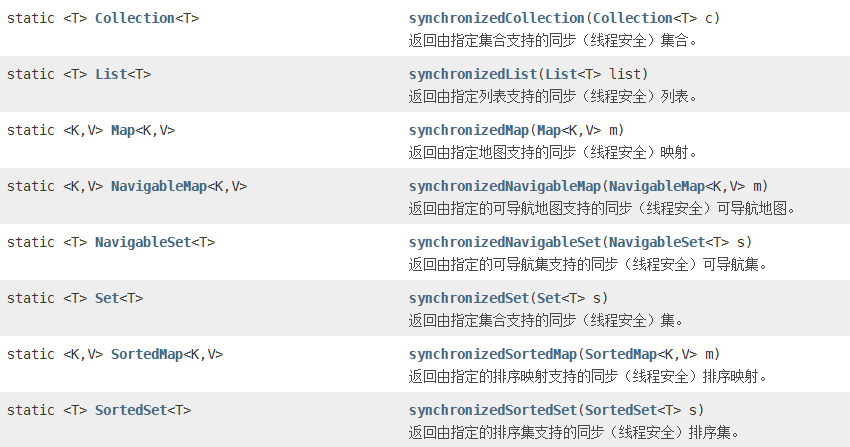 

## 08_Java版数据结构简述

数据结构：数据的逻辑关系、数据的存储结构、排序算法、查找

程序能否高效完成预定任务，取决于是否选对了数据结构，程序能否清除而正确的把问题解决，取决于算法。

Algorithms + Data Structures = Programs

总结：算法是为了解决实际问题而设计的，数据结构是算法需要处理的问题载体。

线性表描述一对一的关系：顺序表：真实结构（ArrayList）、链表：真实结构（LinkedList）、栈：抽象结构、队列：抽象结构

 