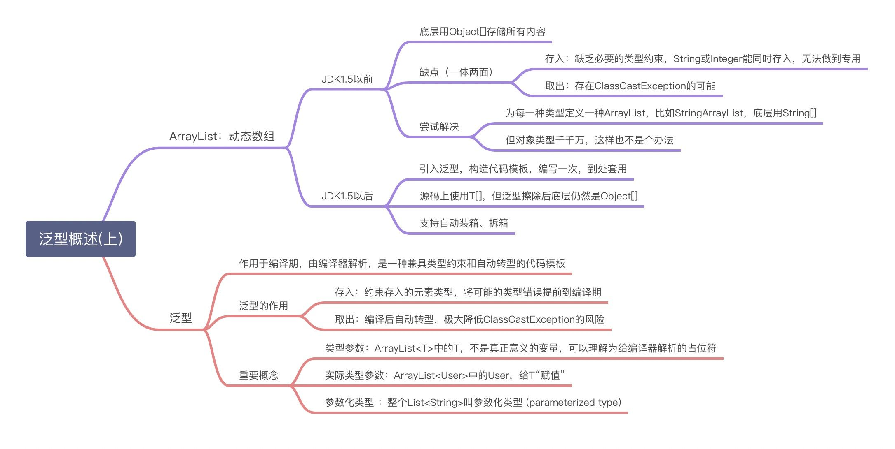
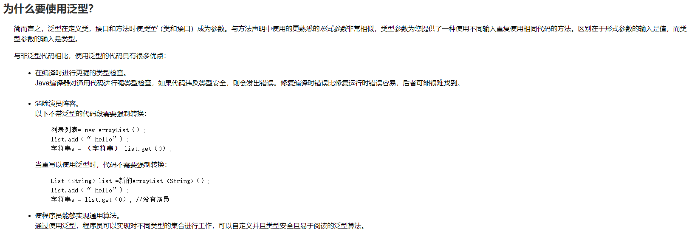

# 泛型

`Java`泛型是`JDK 5`中引入的一个新特性，允许在定义类和接口的时候使用类型参数`<type parameter>`。声明的类型参数在使用时用具体的类型来替换。泛型的本质是参数化类型，也就是说所操作的数据类型被指定为一个参数。

## 01_为什么要有泛型

> 什么是泛型？

在要了解为什么要有泛型（`Generic`）之前，首先应该知道什么是泛型？

其实在日常使用集合的时候，我们早已经接触到了泛型，我们可以查看`Collection`的源码进行查看：

```java
public interface Collection<E> extends Iterable<E> {}
```

可以看到，`<E>`就是泛型，泛型就像是一个**标签**，举例：

- 中药店，每个抽屉外面贴着标签
- 超市购物架上很多瓶子，每个瓶子装的是什么，有标签

可以联想到，中药店里的抽屉，超市购物架上的瓶子，这些都是一个个的容器，这些容器上面写着标签，我们看到标签，就知道容器里面装的是什么。

泛型的设计背景：

集合容器类在设计阶段/声明阶段不能确定这个容器到底实际存的是什么类型的对象，所以在`JDK1.5`之前只能把元素类型设计为`Object`，这样真的好吗？记得学习集合的时候有这么一个问题，`ArrayList`和`Array`到底有什么区别呢？回答是数组只能放单一数据类型，声明的是`String`就只能放`String`类型的元素，声明为`int`就只能放`int`类型的参数，这其实是数组的优点，因为数组非常严格，这样会让语言更加严密。而`JDK1.5`之前没有引入泛型的`ArrayList`是不太严密的，比如我要存入一个班学生的学习成绩，我们调用`add(Object)`方法，但是没有泛型限制可能会装进去其他数据类型的数据，什么类型都可以装进去，没有限制。 

`JDK1.5`的时候加了一个新特性，就叫泛型，就像是往中药店的抽屉里加元素的时候，我给这个容器上给一个类型，也就是贴一个标签，比如是金银花，那么我往抽屉里放元素的时候，就只能装金银花，更加严格。

再比如小区中的垃圾桶，不贴标签，任何垃圾都可以扔进去，不符合我们当代垃圾分类的好习惯，贴上标签，各个垃圾进行分类有助于管理，这就跟我们的集合是一个道理，没有类型标签的时候什么都可以存进去，可能会出现一些问题，贴上标签后，只存储一类的元素，更加严谨。

为什么可以使用泛型来解决。因为这个时候除了元素的类型不确定，其他的部分是确定的，例如关于这个元素如何保存，如何管理等是确定的，因此此时**把元素的类型设计成一个参数，这个类型参数叫做泛型。**`Collection<E>，List<E>，ArrayList<E> `这个就 是类型参数，即泛型。

这时候，`add()`方法中的参数不再是`Object`，而是`boolean add(E e);`

> 泛型的概念

所谓泛型，就是允许在定义**类**、**接口**时**通过一个标识**表示**类中某个属性的类型**或者是**某个方法的返回值**及**参数类型**。这个类型参数将在使用时（例如， 继承或实现这个接口，用这个类型声明变量、创建对象时）确定（即传入实际的类型参数，也称为类型实参）。

从JDK1.5以后，Java引入了“参数化类型（`Parameterized type`）”的概念， 允许我们在创建集合时再指定集合元素的类型，正如：`List<String>`，这表明该`List<String>`只能保存字符串类型的对象。

JDK1.5改写了集合框架中的全部接口和类，为这些接口、类增加了泛型支持， 从而可以在**声明集合变量**、**创建集合对象时**传入类型实参。

> 那么为什么要有泛型呢，直接Object不是也可以存储数据吗？

1. 解决元素存储的安全性问题，好比商品、药品标签，不会弄错。
2. 解决获取数据元素时，需要类型强制转换的问题，好比不用每回拿商品、药品都要辨别。

当`JDK1.5`之前，集合中没有泛型的时候：

```java
@Test
public void test() {
    // JDK1.5之前，没有使用泛型的集合
    ArrayList arrayList = new ArrayList();
    // 需求：存放学生成绩
    arrayList.add(78);
    arrayList.add(79);
    arrayList.add(80);
    arrayList.add(81);
    // 问题一：类型不安全
    arrayList.add("Tom");
    for (Object score : arrayList) {
        // 问题二：强转时，可能出现ClassCastException
        int stuScore = (int) score;
    }
}
```

 

我们不希望当前`ArrayList`中混进来其他类型的变量，我们需要在添加的时候中做一些类型的检查，这个检查就是考虑在集合中使用泛型。

 

`Java`泛型可以保证如果程序在编译时没有发出警告，运行时就不会产生` ClassCastException`异常。同时，代码更加简洁、健壮。

体会：**使用泛型的主要优点是能够在编译时而不是在运行时检测错误。**泛型的好处就是在编译的时候能够检查类型安全，并且所有的强制转换都是自动和隐式的。

## 02_在集合中使用泛型

首先在`ArrayList`中使用泛型：

```java
@Test
public void test() {
    // 类型推断
    List<Integer> list = new ArrayList<>();
    list.add(78);
    list.add(88);
    list.add(77);
    list.add(66);
    // 编译时，就会进行类型检查，保证数据的安全
    list.add("11");  // 次语句会报错
    
    // 遍历方式一
    for (Integer integer : list) {
        // 不需要强转
        System.out.println("integer = " + integer);
    }

    // 遍历方式二
    Iterator<Integer> iterator = list.iterator();
    while (iterator.hasNext()) {
        System.out.println(iterator.next());
    }
}
```

在`Map`中使用泛型：

```java
@Test
public void test() {
    Map<String, Integer> map = new HashMap<String, Integer>();
    map.put("Tom1", 34);
    map.put("Tom2", 44);
    map.put("Tom3", 33);
    map.put("Tom4", 32);
    //添加失败
    //map.put(33, "Tom")

    Set<Map.Entry<String, Integer>> entries = map.entrySet();
    for (Map.Entry<String, Integer> entry : entries) {
        String key = entry.getKey();
        Integer value = entry.getValue();
    }

    Iterator<Map.Entry<String, Integer>> iterator1 = entries.iterator();
    while (iterator1.hasNext()){
        Map.Entry<String, Integer> next = iterator1.next();
        String key = next.getKey();
        Integer value = next.getValue();
    }
}
```

1. 集合接口或集合类在`JDK1.5`时都修改为带泛型的结构；
2. 在实例化集合的时候，或者声明集合的时候，可以指明具体的泛型类型；
3. 指明完以后，在集合接口或集合类中凡是定义类或接口时，内部结构使用到类的泛型的位置（比如方法、构造器、属性），都指定为实例化时的泛型类型，比如`add(E e)`实例化为`add(Integer e)`；
4. 注意点：泛型的类型必须是类，不能是基本数据类型，需要用到基本数据类型的位置，拿包装类替换；
5. 如果实例化时，没有指明泛型类型，默认类型为`java.lang.Object`类型；
6. 在`JDK1.7`中，退出新特性类型推断，`TreeSet<Student> set = new TreeSet<>();`

## 03_自定义泛型结构

泛型结构中包括泛型类、泛型接口；泛型方法

1. 泛型的声明

   `interface List` 和 `class GenTest ` 其中，`T,K,V`不代表值，而是表示类型。这里使用任意字母都可以。 常用`T`表示，是`Type`的缩写。`E`是`Element`的缩写，`K,V`则是`Key`和`Value`的缩写

2. 泛型的实例化

   一定要在类名后面指定类型参数的值（类型）。如：`List strList = new ArrayList();`

   `Iterator<Customer> iterator = customers.iterator();`

   `T`只能是类，不能用基本数据类型填充。但可以使用包装类填充。

   把一个集合中的内容限制为一个特定的数据类型，这就是`generics`背后的核心思想。

### 自定义泛型类举例

> 泛型类前言

一个类提供了很多种方法，方法返回值类型也是固定死的，这样真的好吗？容器类应该算得上最具重用性的类库之一。先来看一个没有泛型的情况下的容器类如何定义：

```java
@Data
public class Container {
    private String key;
    private String value;
    ...
}
```

`Container`类保存了一对`key-value`键值对，但是类型是定死的，也就说如果我想要创建一个键值对是`String-Integer`类型的，当前这个`Container`是做不到的，必须再自定义。那么这明显重用性就非常低。

当然，我可以用Object来代替String，并且在Java SE5之前，我们也只能这么做，由于Object是所有类型的基类，所以可以直接转型。但是这样灵活性还是不够，因为还是指定类型了，只不过这次指定的类型层级更高而已，有没有可能不指定类型？有没有可能**在运行时才知道具体的类型**是什么？

所以，就出现了泛型：

```java
public class Container<K, V> {
    private K key;
    private V value;
    ...
}
```

在编译期，是无法知道K和V具体是什么类型，只有在运行时才会真正根据类型来构造和分配内存。

>进一步了解

首先来看下自定义泛型类，因为泛型类和泛型接口是类似的，不同之处无非就是类与接口的区别：**在程序设计中，类中有的属性类型是固定的一开始就知道，但是还有的属性类型不确定，于是使用泛型，一般用T、E、K、V来标识泛型**

```java
public class Order<T> {
    String orderName;
    int orderId;
    // 类的内部结构可以使用类的泛型
    T orderT;

    public Order() {
    }

    //  // 类的内部结构可以使用类的泛型
    public Order(String orderName, int orderId, T orderT) {
        this.orderName = orderName;
        this.orderId = orderId;
        this.orderT = orderT;
    }

    // 类的内部结构可以使用类的泛型
    public T getOrderT() {
        return orderT;
    }

    public void setOrderT(T orderT) {
        this.orderT = orderT;
    }

    // 类的内部结构可以使用类的泛型
    @Override
    public String toString() {
        return "Order{" +
            "orderName='" + orderName + '\'' +
            ", orderId=" + orderId +
            ", orderT=" + orderT +
            '}';
    }
}
```

上面定义了泛型，那么使用泛型的时候：

1. 如果定义了泛型类，实例化没有指明类的泛型，则认为此泛型类型为Object类型
2. 要求：如果定义了类是带泛型的，建议在实例化时要指明类的泛型

```java
@Test
public void test() {
    // 如果定义了泛型类，实例化没有指明类的泛型，则认为此泛型类型为Object类型
    // 要求：如果定义了类是带泛型的，建议在实例化时要指明类的泛型
    Order order = new Order();
    order.setOrderT("ABC");
    order.setOrderT(123);

    // 建议实例化时指明类的泛型
    Order<String> order1 = new Order<>("OrderAA", 11, "订单1");
    order1.setOrderT("订单2");
}
```

再来看看泛型在继承中的体现，先看第一种情况：

```java
public class SubOrder1 extends Order<Integer> { // SubOrder1不是泛型类

}

@Test
public void testSubOrder1(){
    SubOrder1 subOrder1 = new SubOrder1();
    // 由于子类在继承带泛型的父类时，指明了泛型类型。则实例化子类时候，不再需要指明泛型。
    subOrder1.setOrderT(1122);
}
```

第二种情况：子类也带泛型，例如`ArrayList`源码中，`public class ArrayList<E> extends AbstractList<E> implements List<E>`，可以看到子类和父类都带泛型，因为父类中和子类中同时都使用到了泛型

```java
public class SubOrder2<T> extends Order<T>{  // SubOrder2<T>仍然是一个泛型类
}

@Test
public void testSubOrder2(){
    Order<String> order = new SubOrder2<>();
    order.setOrderT("String");
}
```

### 自定义泛型类和泛型接口注意点

-  泛型类可能有多个参数，此时应将多个参数一起放在尖括号内。比如：`<E1,E2,E3>`，参考`Map`源码`public interface Map<K,V>{}`

-  泛型类的构造器如：`public GenericClass(){}`。 这样是错误的：`public GenericClass(){}`

- 实例化后，操作原来泛型位置的结构必须与指定的泛型类型一致。

- 泛型不同的引用不能相互赋值。

  ```java
  @Test
  public void test(){
      Person p1 = null;
      Person p2 = null;
      // 编译通过
      p1 = p2;
      
      
      List<Integer> list1 = null;
      List<String> list2 = null;
      // 泛型不同的引用不能相互赋值,以下语句编译不能通过
      list1 = list2;
  }
  ```

  尽管在编译时`List<Integer>`和`List<String>`是两种类型，虽然在运行时只有 一个`ArrayList`被加载到`JVM`中，但是现在编译过不了。

- 泛型如果不指定，将被擦除，泛型对应的类型均按照Object处理，但不等价于Object。经验：泛型要使用一路都用。要不用，一路都不要用。

  ```java
  public class GenericEraseTest {
      public static void main(String[] args) {
          // 使用时：类似于Object，不等同于Object
          ArrayList arrayList = new ArrayList();
          arrayList.add(new Date());
          arrayList.add("ABC");
          // 泛型擦除，编译不会类型检查,运行时出错
          test(arrayList);
  
          // ArrayList<Object> list2 = new ArrayList<Object>();
          // test(list2);//一旦指定Object，编译会类型检查，必须按照Object处理
      }
  
      public static void test(ArrayList<String> arrayList) {
          String str = "";
          for (String s : arrayList) {
              str += s + ",";
          }
          System.out.println("元素" + str);
      }
  }
  ```

- 如果泛型结构是一个接口或抽象类，则不可创建泛型类的对象。老知识了，接口和抽象类不能实例化；

- `JDK1.7`，泛型的简化操作：`ArrayList flist = new ArrayList<>();`

- 泛型的指定中不能使用基本数据类型，可以使用包装类替换。

- 在类/接口上声明的泛型，在本类或本接口中即代表某种类型，可以作为非静态属性的类型、非静态方法的参数类型、非静态方法的返回值类型。**但在静态方法中不能使用类的泛型。**这一点也很好理解，从面向对象的角度来看，类的泛型指定是在实例化时，但是静态结构早于对象的创建。

  ```java
  public class StaticMethodNotUseGeneric<T> {
      public static void test(T t){
          System.out.println("t = " + t);
      }
  }
  ```

- 异常类不能是泛型的

  ```JAVA
  public class ExceptionNotExtendsGeneric<T> extends Exception{
  }
  ```

- `try-catch`中不能是泛型的

  ```java
  public class TryCatchNotUseGeneric<T> {
      public static void main(String[] args) {
          try {
              System.out.println("1");
          } catch (T t) {
          }
      }
  }
  ```

- 不能使用`new E[]`。但是可以：`E[] elements = (E[])new Object[capacity]`; 参考：`ArrayList`源码中声明：`Object[] elementData`，而非泛型参数类型数组。

  ```java
  public class ArrayGenericTest<T> {
      public ArrayGenericTest() {
          // 编译不通过 
          T[] arr = new T[];
          // 编译通过
          T[] arr = (T[]) new Object[10];
      }
  }
  ```

- 父类有泛型，子类可以选择保留泛型也可以选择指定泛型类型：

  -  子类不保留父类的泛型：按需实现
    - 没有类型 擦除
    - 具体类型
  - 子类保留父类的泛型：泛型子类
    - 全部保留
    - 部分保留

  结论：子类除了指定或保留父类的泛型，还可以增加自己的泛型

  ```java
  class Father<T1, T2> {
  }
  // 子类不保留父类的泛型
  // 1)没有类型 擦除
  class Son1 extends Father {// 等价于class Son extends Father<Object,Object>{
  }
  // 2)具体类型
  class Son2 extends Father<Integer, String> {
  }
  // 子类保留父类的泛型
  // 1)全部保留
  class Son3<T1, T2> extends Father<T1, T2> {
  }
  // 2)部分保留
  class Son4<T2> extends Father<Integer, T2> {
  }
  ```

  ```java
  class Father<T1, T2> {
  }
  // 子类不保留父类的泛型
  // 1)没有类型 擦除
  class Son<A, B> extends Father{//等价于class Son extends Father<Object,Object>{
  }
  // 2)具体类型
  class Son2<A, B> extends Father<Integer, String> {
  }
  // 子类保留父类的泛型
  // 1)全部保留
  class Son3<T1, T2, A, B> extends Father<T1, T2> {
  }
  // 2)部分保留
  class Son4<T2, A, B> extends Father<Integer, T2> {
  }
  ```

### 自定义泛型方法

先看看`Collection`源码，不是说你这个方法使用了类的泛型或者接口的泛型就是泛型方法，比如`boolean add(E e);`就不是一个泛型方法。并且泛型方法所属的类或者接口是不是泛型类或者泛型接口是无所谓的，泛型方法只看自己，`<T> T[] toArray(T[] a);`就是一个泛型方法。

**泛型方法：在方法中出现了泛型的结构，泛型参数和类的泛型参数没有任何关系，换句话说，泛型方法所属的类是不是泛型类都没有关系。**

```java
public class GenericMethod01<T> {
    private T name;

    public GenericMethod01() {
    }

    // 以下三个方法都不是泛型方法
    public GenericMethod01(T name) {
        this.name = name;
    }

    public T getName() {
        return name;
    }

    public void setName(T name) {
        this.name = name;
    }
}
```

泛型方法的演进：

```java
public class GenericMethod01<T> {
    // 这样容易被编译器认为E是一个未被声明的类，编译不通过
    public List<E> copyFromArrayToList(E[] arr){
        return null;
    }
}
```

看看正儿八经的泛型方法：

```java
public class GenericMethod<T>{
    public <E> List<E> copyFromArrayToList(E[] arr){
        List<E> list = new ArrayList<>();
        for (E e : arr) {
            list.add(e);
        }
        return list;
    }
}
```

测试泛型方法：可以看到，泛型方法和类的泛型一点关系都没有。

```java
@Test
public void testSubOrder2(){
    GenericMethod01<String> test = new GenericMethod01<>();
    Integer[] arr = new Integer[]{1,2,3};
    // 泛型方法在调用时，指明泛型参数的类型
    List<Integer> list = test.copyFromArrayToList(arr);
    System.out.println("list = " + list);
}
```

**泛型方法是可以声明为静态的**，原因：泛型参数是在调用方法时确定的，并非在实例化类的时确定。注意区分上面的静态方法中不能使用类的泛型。

> 泛型方法

-  `public `与 返回值中间`<T>`非常重要，可以理解为声明此方法为泛型方法。
- 只有声明了`<T>`的方法才是泛型方法，泛型类中的使用了泛型的成员方法并不是泛型方法。
- `<T>`表明该方法将使用泛型类型`T`，此时才可以在方法中使用泛型类型T。
- 与泛型类的定义一样，此处T可以随便写为任意标识，常见的如`T、E、K、V`等形式的参数常用于表示泛型。

一个基本的原则是：无论何时，只要你能做到，你就应该尽量使用泛型方法。也就是说，如果使用泛型方法可以取代将整个类泛化，那么应该有限采用泛型方法。下面来看一个简单的泛型方法的定义：

```JAVA
public class Main {
    public static <T> void out(T t) {
        System.out.println(t);
    }

    public static void main(String[] args) {
        out("findingsea");
        out(123);
        out(11.11);
        out(true);
    }
}
```

可以看到方法的参数彻底泛化了，这个过程涉及到编译器的类型推导和自动打包，也就说原来需要我们自己对类型进行的判断和处理，现在编译器帮我们做了。这样在定义方法的时候不必考虑以后到底需要处理哪些类型的参数，大大增加了编程的灵活性。

### 泛型类和泛型方法的使用场景

> 泛型类的使用场景

未来学习项目分层架构的时候，三层架构是非常经典的架构，控制层（负责请求接收、请求转发）、逻辑处理层（业务逻辑编写）、数据访问层（负责与数据库交互），其中数据访问层又称`DAO`全称是`database access object`。按照我们面向对象的思想，一切皆对象，数据库中的一张表对应我们的一个对象，后面会学到`ORM`对象关系模型，`DAO`层操作数据库，与数据库交互，一些通用的可以抽取出来，后期`MyBatis-Plus`框架就使用到了这点。

1、创建泛型类，作用是通用处理一些每个`DAO`都会做的事情

```java
public class BaseDAO<T> {
    // 添加一条记录
    public void add(T t) {
    }

    // 删除一条记录
    public boolean remove(int index) {
        return true;
    }

    // 修改一条记录
    public int update(T t){
        return 1;
    }

    // 查询一条记录
    public T getIndex(int index){
        return null;
    }

    // 查询多条记录
    public List<T> getForList(int index){
        return null;
    }
}
```

2、实体类：对应数据库中的一张表

```java
// 只代表一张表
public class Student {
    
}
// 只代表一张表
public class Emp {
    
}
```

3、各个实体类的数据访问层

```java
// 只能操作某一个表的DAO
public class StudentDAO extends BaseDAO<Student> {

}
// 只能操作某一个表的DAO
public class EmpDAO extends BaseDAO<Emp>{
    
}
```

4、测试

```java
@Test
public void testSubOrder2(){
    StudentDAO studentDAO = new StudentDAO();
    studentDAO.add(new Student());

    EmpDAO empDAO = new EmpDAO();
    boolean remove = empDAO.remove(1);
}
```

> 泛型方法的使用场景

还是上述的案例，我们对数据访问时还有一些通用的逻辑，比如返回整个表的行数、返回表中最大的记录的行数等等，这些都可以使用泛型方法：

```java
public <E> E getValue(T t) {
    return null;
}
```

## 04_泛型在继承上的体现

> 重点：虽然`A`是`B`的父类，但是`G<A>`和`G<B>`不具备子父类关系，二者是并列关系。例如`String`是`Object`的子类，但是`List<String>`并不是`List<Object>` 的子类

在我们之前学习多态的时候，我们知道父类的引用可以指向子类的对象，这也是`Java`面向对象的三大特性之一，比如下面这样：

```java
Object object = null;
String string = null;
object = string;

Object[] objects = null;
String[] strings = null;
objects = strings;
```

在泛型上还适用吗？

```java
List<String> stringList = null;
List<Object> objectList = null;
objectList = stringList; // 编译不通过
```

这也证实了上面泛型类注意点中的泛型不同的引用不能相互赋值，我们可以适用反证法来进行证明：

假设`objectList = stringList;`，那么`List<String> stringList = new ArrayList<>();`，此时`stringList.add(123)`应该也是可以编译通过的，要把123元素添加到`String`类型的集合中，但是这样要泛型还有什么用呢？

>类`A`是类`B`的父类，`A<G>`和`B<G>`的父类

这个就是我们最常见的，`List<String> list = new ArrayList<>();`

## 05_通配符的使用

### 什么是通配符

我们在定义泛型类，泛型方法，泛型接口的时候经常会碰见很多不同的通配符，比如` T，E，K，V `等等，这些通配符又都是什么意思呢？

本质上这些个都是通配符，没啥区别，只不过是编码时的一种约定俗成的东西。比如上述代码中的 `T` ，我们可以换成 `A-Z `之间的任何一个 字母都可以，并不会影响程序的正常运行，但是如果换成其他的字母代替` T` ，在可读性上可能会弱一些。通常情况下，`T，E，K，V，？`是这样约定的：

- ？表示不确定的 java 类型
- T (type) 表示具体的一个java类型
- K V (key value) 分别代表java键值中的Key Value
- E (element) 代表Element

类型通配符：`?`比如：`List<?> ,Map<?,?> List<?>`是`List<String>、List<Object>`等各种泛型`List`的父类。

### 通配符的使用

上篇中，说到：虽然`A`是`B`的父类，但是`G<A>`和`G<B>`不具备子父类关系，二者是并列关系。例如`String`是`Object`的子类，但是`List<String>`并不是`List<Object>` 的子类。但是两者的共同父类是：`G<?>`

但是现在有一个方法，就是打印集合中的元素，这个集合的类型可能是`List<String>`或者`List<Object>`，使用通配符：

```java
@Test
public void test1() {
    List<Object> objectList = null;
    List<String> stringList = null;
    List<?> list = null;
    list = stringList;
    list = objectList;

    print(objectList);
    print(stringList);
}

public void print(List<?> list){
    Iterator<?> iterator = list.iterator();
    while (iterator.hasNext()){
        Object next = iterator.next();
        System.out.println("next = " + next);
    }
}
```

这时候我有之前的一个疑问，我用泛型方法不是一样可以实现吗，后来想了想：

- 通配符相当于一个集合，这里表示`Object`及其子类，泛型小集合可以给泛型大集合赋值
- 泛型方法中的泛型要求要完全相同，不可以说是父子类关系
- 使用泛型方法，可能就不一定是List类了

```java
public static <E> void printList(List<E> list){
    System.out.println("list = " + list);
}

public static void main(String[] args) {
    List<String> stringList = new ArrayList<>();
    stringList.add("song");
    stringList.add("jia");
    stringList.add("cheng");
    printList(stringList);
    List<Long> longList = new ArrayList<>();
    longList.add(1L);
    longList.add(2L);
    longList.add(3L);
    printList(longList);
}
```

>通配符？的具体使用

1、读取`List<?>`的对象`list`中的元素时，永远是安全的，因为不管`list`的真实类型 是什么，它包含的都是`Object`。

2、写入`list`中的元素时，不行。因为我们不知道`c`的元素类型，我们不能向其中添加对象。唯一的例外是`null`，它是所有类型的成员。

```java
Collection<?> c = new ArrayList<String>();
c.add(new Object()); // 编译时错误
```

因为我们不知道`c`的元素类型，我们不能向其中添加对象。`add`方法有类型参数`E`作为集 合的元素类型。我们传给`add`的任何参数都必须是一个未知类型的子类。因为我们不知道那是什么类型，所以我们无法传任何东西进去。

### 通配符使用注意点

注意点1：编译错误：不能用在泛型方法声明上，返回值类型前面<>不能使用?

```java
public static <?> void test(ArrayList<?> list){
}
```

注意点2：编译错误：不能用在泛型类的声明上

```java
class GenericTypeClass<?>{
}
```

注意点3：编译错误：不能用在创建对象上，右边属于创建集合对象

```java
ArrayList<?> list2 = new ArrayList<?>();
```

### 有限制的通配符

先来看一段程序：前提是`Student`是`Person`的子类

```java
@Test
public void test1() {
    List<Student> studentList = null;
    List<Person> personList = null;
    List<Object> objectList = null;

    List<? extends Person> list1 = null;
    List<? super Person> list2 = null;

    list1 = studentList; 
    list1 = personList;
    list1 = objectList;  // 编译不通过

    list2 = studentList;
    list2 = personList;
    list2 = objectList; // 编译不通过
}
```

可以得出结论：

- 通配符指定上限，上限`extends`：使用时指定的类型必须是继承某个类，或者实现某个接口，即`<= `
- 通配符指定下限，下限`super`：使用时指定的类型不能小于操作的类，即`>=`
- 举例：
  - ` <? extends Number> (无穷小 , Number]`只允许泛型为`Number`及`Number`子类的引用调用。写入数据编译不通过，父类不能当子类。
  - ` <? super Number> [Number , 无穷大]`只允许泛型为`Number`及`Number`父类的引用调用。写入数据编译可以通过。
  - ` <? extends Comparable>`只允许泛型为实现Comparable接口的实现类的引用调用

## 06_泛型应用举例

> 案例一

定义个泛型类 DAO<T>，在其中定义一个 Map 成员变量，Map 的键为 String 类型，值为 T 类型。分别创建以下方法：

- public void save(String id,T entity)： 保存 T 类型的对象到 Map 成员变量中
- public T get(String id)：从 map 中获取 id 对应的对象
- public void update(String id,T entity)：替换 map 中 key 为 id 的内容,改为 entity 对象
- public List<T> list()：返回 map 中存放的所有 T 对象
- public void delete(String id)：删除指定 id 对象

定义一个 User 类：该类包含：private 成员变量（int 类型） id，age；（String 类型）name。

定义一个测试类：创建 DAO 类的对象， 分别调用其 save、get、update、list、delete 方法来操作 User 对象，使用 Junit 单元测试类进行测试

```java
public class DAO<T> {
    private Map<String, T> map;

    public DAO(Map<String, T> map) {
        this.map = map;
    }

    public Map<String, T> getMap() {
        return map;
    }

    public void setMap(Map<String, T> map) {
        this.map = map;
    }

    /**
     * 保存 T 类型的对象到 Map 成员变量中
     */
    public void save(String id, T entity) {
        this.map.put(id, entity);
    }

    /**
     * 从 map 中获取 id 对应的对象
     */
    public T get(String id) {
        return this.map.get(id);
    }

    /**
     * 替换 map 中 key 为 id 的内容,改为 entity 对象
     */
    public void update(String id, T entity) {
        if (this.map.containsKey(id)) {
            this.map.put(id, entity);
        }
    }

    /**
     * 返回 map 中存放的所有 T 对象
     */
    public List<T> list() {
        // 错误的 Collection不可能墙砖为List
        // Collection<T> values = map.values();
        // return (List<T>) values;
        List<T> list = new ArrayList<>();
        for (T value : map.values()) {
            list.add(value);
        }
        return list;
    }

    /**
     * 删除指定 id 对象
     */
    public void delete(String id) {
        this.map.remove(id);
    }
}
```

```java
@Data
@NoArgsConstructor
@AllArgsConstructor
@EqualsAndHashCode
@ToString
public class User {
    private int id;
    private int age;
    private String name;
}
```

```java
public class ExampleTest {
    @Test
    public void test() {
        DAO<User> userDAO = new DAO<>(new HashMap<>());
        userDAO.save("001",new User(1,22,"宋嘉诚"));

        User user = userDAO.get("001");
        System.out.println("user = " + user);
    }
}
```

> 案例二

用户在设计类的时候往往会使用类的关联关系，例如，一个人中可以定义一个信息的属性，但是一个人可能有各种各样的信息（如联系方式、基本信息等），所以此信息属性的类型就可以通过泛型进行声明，然后只要设计相应的信息类即可。

```java
public interface Info {
}
```

```java
@Data
@AllArgsConstructor
@NoArgsConstructor
@ToString
public class Contact implements Info {
    // 联系地址
    private String address;
    // 联系方式
    private String telephone;
    // 邮政编码
    private String zipcode;
}
```

```java
@Data
@AllArgsConstructor
@NoArgsConstructor
@ToString
public class Introduction implements Info {
    // 姓名
    private String name;
    // 性别
    private String sex;
    // 年龄
    private int age;
}
```

```java
@Data
@AllArgsConstructor
@ToString
public class Person<T extends Info> {
    private T info;
}
```

```java
public class GenericPerson {
    public static void main(String[] args) {
        // 声明Person对象
        Person<Contact> per;
        per = new Person<>(new Contact("北京市", "01088888888", "102206"));
        System.out.println(per);

        // 声明Person对象
        Person<Introduction> per2;
        per2 = new Person<>(new Introduction("李雷", "男", 24));
        System.out.println(per2);
    }
}
```

## 07_面试题

### 关于泛型，可以把`List<String>`赋值给`List<Object>`吗？如果需要怎么做？

不能赋值，泛型不同的引用不能相互赋值。如果需要，可以引入通配符，`String`是`Object`的子类，但是`List<String>`并不是`List<Object>` 的子类。但是两者的共同父类是：`G<?>`。

### 泛型方法怎么使用？为什么要有泛型方法？

-  `public `与 返回值中间`<T>`非常重要，可以理解为声明此方法为泛型方法。
-  只有声明了`<T>`的方法才是泛型方法，泛型类中的使用了泛型的成员方法并不是泛型方法。
-  `<T>`表明该方法将使用泛型类型`T`，此时才可以在方法中使用泛型类型T。
-  泛型方法和该方法所在的类是不是泛型类没有任何关系

泛型类和泛型方法同时具备可重用性、类型安全和效率，这是非泛型类和非泛型方法无法具备的。 泛型通常用与集合以及作用于集合的方法一起使用。

一个基本的原则是：无论何时，只要你能做到，你就应该尽量使用泛型方法。也就是说，如果使用泛型方法可以取代将整个类泛化，那么应该有限采用泛型方法。

### 泛型类型擦除

**Java 的泛型是伪泛型，这是因为 Java 在编译期间，所有的泛型信息都会被擦掉，这也就是通常所说类型擦除 。**

Java的泛型基本上都是在编译器这个层次上实现的，在生成的字节码中是不包含泛型中的类型信息的，使用泛型的时候加上类型参数，在编译器编译的时候会去掉，这个过程成为类型擦除。

```java
public static void main(String[] args) throws NoSuchMethodException, InvocationTargetException, IllegalAccessException {
    List<Integer> list = new ArrayList<>();
    list.add(12);
    //这里直接添加会报错 
    // list.add("a");
    Class<? extends List> clazz = list.getClass();
    Method add = clazz.getDeclaredMethod("add", Object.class);
    //但是通过反射添加，是可以的
    add.invoke(list, "kl");
    System.out.println(list);
}
```

重点看：

[《Java 泛型类型擦除以及类型擦除带来的问题》](https://www.cnblogs.com/wuqinglong/p/9456193.html) 

## 08_更好的理解泛型

[《泛型概述上》](https://zhuanlan.zhihu.com/p/240003959)

[《泛型概述下》](https://zhuanlan.zhihu.com/p/255264414)

### 泛化与特定

#### 模板代码与泛型

泛型，可以看做一种“模板代码”。“模板代码”其实并不是一种时髦技术，很多语言都有自己的“模板代码”，比如C++也有“泛型”，不过人家叫类模板。

什么是“模板代码”呢？

以`ArrayList`为例。我们在学习Java基础时，先学了数组，再接触集合。它们的分类是这样的：

- Array
- Collection
  - List
    - ArrayList
    - LinkedList
  - Set
    - HashSet
    - TreeSet

我们太习惯于把`Array`(数组)与`Collection`(集合)对立，以至于到最后甚至不知道`Array`(数组)和`ArrayList`有什么关联。

实际上，在`List`一脉中`ArrayList`是比较特殊的，`ArrayList`又称为“可变数组”，原因是`ArrayList`底层**其实就是数组，**只不过它会自动扩容。

也就是说：`ArrayList`= 数组 + 自动扩容

在JDK1.5引入泛型之前，`ArrayList`采取的方式是：在内部塞入一个`Object[] array`：

```java
public class ArrayList {
    private Object[] array;
    private int size;
    public void add(Object e) {...}
    public void remove(int index) {...}
    public Object get(int index) {...}
}
```

如果用JDK1.5以前的`ArrayList`存储`String`类型，会有这么2个缺点（其实是问题的一体两面）：

- 需要强制转型
- 不方便，易出错

例如，代码必须这么写：

```java
ArrayList list = new ArrayList();
list.add("Hello");
// 获取到Object，必须强制转型为String:
String first = (String) list.get(0);
```

为什么要强制转型？因为`String`是真正的类型，转型后有更多的方法可用，比如`replace()`。

OK，在确认必须强转的前提下，我们继续讨论。

强转会带来一个问题：很容易出现`ClassCastException`：

```java
// JDK1.4可以这样做
list.add(new Integer(123));
// ERROR: ClassCastException:
String second = (String) list.get(1);
```

作为一种解决方法，JDK1.5之前的程序员可以为`String`类型单独编写一种`ArrayList`：

```java
public class StringArrayList {
    // 因为这种ArrayList只存String，所以不需要用Object[]兼容所有类型，只要String[]即可
    private String[] array;
    private int size;
    public void add(String e) {...}
    public void remove(int index) {...}
    public String get(int index) {...}
}
```

这样一来，存入和取出都被限定为`String`，且不需要强制转型，因为编译器会强制检查放入的类型：

```java
StringArrayList list = new StringArrayList();
list.add("Hello");
String first = list.get(0);
// 编译错误: 不允许放入非String类型:
list.add(new Integer(123));
```

问题暂时解决。

然而，新的问题是，如果要存储`Integer`，还需要为`Integer`单独编写一种`ArrayList`：

```java
public class IntegerArrayList {
    private Integer[] array;
    private int size;
    public void add(Integer e) {...}
    public void remove(int index) {...}
    public Integer get(int index) {...}
}
```

如果还有其他类型，就要编写各种各样**特定类型**的`ArrayList`：

- LongArrayList
- DoubleArrayList
- PersonArrayList
- ...

这是不可能的，光JDK的class就有成千上万个，而且还不算普通Java用户编写的类。

为了解决新的问题，我们必须把`ArrayList`变成一种**模板。**

什么是模板呢？以设计模式中的模板方法模式为例：

```java
/**
 * 验证码发送器
 */
public abstract class AbstractValidateCodeSender {
    /**
     * 生成并发送验证码
     */
    public void sendValidateCode() {
        // 1.生成验证码
        String code = generateValidateCode();
        // 2.把验证码存入Session
        // ....
        // 3.发送验证码
        sendCode();
    }
    /**
     * 具体发送逻辑，留给子类实现：发送邮件、或发送短信都行
     */
    protected abstract void sendCode();
    /**
     * 生成验证码
     */
    public String generateValidateCode() {
        return "123456";
    }
}
```

对于上面的模板，我们可以有多种实现方式：

```java
/**
 * 短信验证码发送
 */
public class SmsValidateCodeSender extends AbstractValidateCodeSender {
    @Override
    protected void sendCode() {
        // 通过阿里云短信发送
    }
}


/**
 * QQ邮箱验证码发送
 */
public class EmailValidateCodeSender extends AbstractValidateCodeSender {
    @Override
    protected void sendCode() {
        // 通过QQ邮箱发送
    }
}
```

**所谓模板，就是“我能做的都给你做了，少量易变动的东西我留出来，你自己DIY去”。**

同理，`ArrayList<T>`也是一种模板，能写的方法都给你写了，但**变量类型**我定不了，于是抽成**类型变量：**

```java
public class ArrayList<T> {
    private T[] array;
    private int size;
    public void add(T e) {...}
    public void remove(int index) {...}
    public T get(int index) {...}
}
```

`T`可以是任何class。

这样一来，我们就实现了：只需编写一次模版，可以创建任意类型的`ArrayList`：

```java
// 创建可以存储String的ArrayList:
ArrayList<String> strList = new ArrayList<>();
// 创建可以存储Float的ArrayList:
ArrayList<Float> floatList = new ArrayList<>();
// 创建可以存储Person的ArrayList:
ArrayList<Person> personList = new ArrayList<>();
```

因此，**泛型类就是一种模板类，**例如`ArrayList<T>`，然后使用者可以自己选择将模板填充为什么类型：

```java
// 嘿嘿，我想把ArrayList<T>填充为ArrayList<String>，专门收纳String类型
ArrayList<String> strList = new ArrayList<>();
```

你可以理解为此时ArrayList内部自动被赋值成这样（编译器层面）：

```java
public class StringArrayList {
    private String[] array;
    private int size;
    public void add(String e) {...}
    public void remove(int index) {...}
    public String get(int index) {...}
}
```

由**编译器**针对类型作检查：

```java
strList.add("hello"); // OK
String s = strList.get(0); // OK
strList.add(new Integer(123)); // compile error!
Integer n = strList.get(0); // compile error!
```

这样一来，既实现了编写一次万能匹配，又能通过编译器保证类型安全：这就是泛型。

#### 类型参数与实际类型参数

值得注意的是，泛型是一种技术，也可以理解为**对泛型类和泛型接口的统称，**类似`ArrayList<T>`中的T不叫泛型，而叫**类型参数(Type Parameter)，也叫形式类型参数。**

使用泛型时，`比如ArrayList<String>`，T被替换为String，可以看做是对T的“赋值”，这里的String称为**实际类型参数(actual type parameter)。**

**实际类型参数**用来为**类型参数**赋值，把`ArrayList<T>`由泛化**通用**的模板变为**特定**类型的类。

你还可以把泛型理解为：**变量是对数据的抽取，而泛型是对变量类型的抽取，抽取成类型参数，抽象层次更高。**

下面用伪代码举个例子。

假设有个根据id查询用户的方法getUser()：

```java
public User getUserBy1(){
    return userDao.get(1);
}
    
public User getUserBy2(){
    return userDao.get(2);
}
```

对1、2这些具体的**数据进行抽取，**得到Integer id：

```java
public User getUser(Integer id){
    return userDao.get(id);
}
```

如果我们还希望通过name、age获取用户，就要另外写多个方法：

```java
public User getUser(String name){...}
public User getUser(Date birthday){...}
```

于是可以使用泛型**对变量类型进行抽取：**

```java
public User getUser(T t){...}
```

把类型变量抽取为T构造出模板代码，再通过继承泛型类等方式确定T（类型参数赋值），把类型特定化，最后配合编译器在编译期对变量类型进行约束，这就是泛型。

抽取变量，我们早就习以为常，但抽取变量类型，却从未听说。这也是初学者觉得泛型抽象的根本原因。

最后，强调一下，**泛型是对引用类型的抽取，基本类型是无法抽取的，**必须是确定的。IntegerArrayList/StringArrayList内部是Integer对象数组/String对象数组，所以可以抽取成`ArrayList<T>`。

 


### 泛型实现机制

上篇提到泛型可以看做是对变量类型的抽取，**它把原本必须确定的对象类型也弄成了变量，最终得到代码模板**。

但是，敏感的读者马上就会发现这tm是个悖论啊：对象类型不确定，JVM怎么创建对象啊！

要回答这个问题，我们必须了解Java的两个阶段：编译期、运行期。你可以理解为Java代码运行有4个要素：

- 源代码
- **编译器**
- 字节码
- **虚拟机**


也就是说，Java有两台很重要的机器，编译器和虚拟机。

**在代码编写阶段，**我们确实引入了泛型对**变量类型**进行泛化抽取，让类型是不特定的（不特定的即通用的），从而创造了通用的代码模板，比如ArrayList<T>：

```java
public class ArrayList<T> {
    private T[] array;
    private int size;
    public void add(T e) {...}
    public void remove(int index) {...}
    public T get(int index) {...}
}
```

模板定好后，如果我们希望这个ArrayList只处理String类型，就传入类型参数，把T“赋值为”String，比如`ArrayList<String>`，此时你可以理解为代码变成了这样：

```java
public class StringArrayList {
    private String[] array;
    private int size;
    public void add(String e) {...}
    public void remove(int index) {...}
    public String get(int index) {...}
}
```

所以add(1)会编译报错。

**但事实真的如此吗？**

我们必须去了解泛型的底层机制。

#### 泛型擦除与自动类型转换

我们来研究以下代码：

```java
public class GenericDemo {

    public static void main(String[] args) {
        UserDao userDao = new UserDao();
        User user = userDao.get(new User());
        List<User> list = userDao.getList(new User());
    }

}

class BaseDao<T> {

    public T get(T t){
        return t;
    }

    public List<T> getList(T t){
        return new ArrayList<>();
    }
}


class UserDao extends BaseDao<User> {

}

class User{

}
```

编译得到字节码后通过反编译工具，反编译字节码得到：

```java
public class GenericDemo {
	// 编译器会为我们自动加上无参构造器
    public GenericDemo() {}

    public static void main(String args[]) {
        UserDao userDao = new UserDao();
        /**
         * 两点变化：
         * 1.原先代码是 User user = userDao.get(new User());
         *   编译器根据泛型类型User，帮我们强转了
         * 2.List<User>的泛型被擦除了，只剩下List
         */
        User user = (User)userDao.get(new User());
        java.util.List list = userDao.getList(new User());
    }
}

class BaseDao {

    BaseDao() {}
    
	// 编译器编译后的字节码中，其实是没有泛型的，泛型T其实底层还是JDK1.5的Object
    public Object get(Object t) {
        return t;
    }

    public List getList(Object t) {
        return new ArrayList();
    }
}

// BaseDao<User>泛型没了
class UserDao extends BaseDao {
    UserDao(){}
}

class User {
    User() {}
}
```

其实这两点变化也是问题的一体两面。

我们先观察UserDao。它从BaseDao继承两个方法，整个类相当于这样：

```java
class UserDao extends BaseDao {
    UserDao(){}
    
    // 编译器编译后的字节码中，其实是没有泛型的，泛型T其实底层还是JDK1.5的Object
    public Object get(Object t) {
        return t;
    }

    public List getList(Object t) {
        return new ArrayList();
    }
}
```

也就是说，为了兼容各种类型，泛型底层还是采用Object接收所有类型。

ArrayList<T>也一样，虽然在源码上看确实从原先的Object[]变成了T[]，但编译后其实还是Object[]：

```java
public class ArrayList {
    private Object[] array;
    private int size;
    public void add(Object e) {...}
    public void remove(int index) {...}
    public Object get(int index) {...}
}
```

这也是Java的泛型被称为“假泛型”的原因，因为存在“编译后泛型擦除”

而编译器自动类型转换也和“泛型擦除”有关：**因为底层还是Object接收，要想返回实际类型，只能强转。**

既然底层用Object接收，比如Object obj = new User()，那么对于obj，编译器怎么知道最终强转成User呢？

```java
public class GenericDemo {
	// 编译器会为我们自动加上无参构造器
    public GenericDemo() {}

    public static void main(String args[]) {
        UserDao userDao = new UserDao();
        /**
         * 两点变化：
         * 1.原先代码是 User user = userDao.get(new User());
         *   编译器根据泛型类型User，帮我们强转了
         * 2.List<User>的泛型被擦除了，只剩下List
         */
        User user = (User)userDao.get(new User());
        java.util.List list = userDao.getList(new User());
    }
}
```

其实就是根据泛型的实际类型参数，你填什么我就在编译时帮你转成什么。比如`ArrayList<Integer>`，我就帮你转成Integer，`ArrayList<String>`则转成String。

基于上面的实验，我们可以得到以下4个结论：

- 泛型是JDK专门为**编译器**创造的语法糖，只在编译期，由编译器负责解析，**虚拟机不知情**

- 存入：普通类继承泛型类并给变量类型T赋值后，就能强制让**编译器**帮忙进行类型校验

   

- 取出：代码编译时，**编译器**底层会根据实际类型参数自动进行类型转换，无需程序员在外部手动强转

  ```java
  public class GenericDemo {
      // 编译器会为我们自动加上无参构造器
      public GenericDemo() {}
  
      public static void main(String args[]) {
          UserDao userDao = new UserDao();
          /**
           * 两点变化：
           * 1.原先代码是 User user = userDao.get(new User());
           *   编译器根据泛型类型User，帮我们强转了
           * 2.List<User>的泛型被擦除了，只剩下List
           */
          User user = (User)userDao.get(new User());// <--这里
          java.util.List list = userDao.getList(new User());
      }
  }
  ```

- 实际上，编译后的Class文件还是JDK1.5以前的样子，虚拟机看到的仍然是Object

举个例子：

- 某小区有两个垃圾桶，原本两个桶无差别的，干湿垃圾可以随便放
- 后来进行垃圾分类了，居委会主任规定：1号桶放干垃圾，2号桶放湿垃圾。但总有人会记错，把湿垃圾放入1号桶，导致垃圾工人收垃圾时被溅了一身
- 后来主任搞了一台湿度检测仪，丢进去之前检测一下垃圾湿度，不符合的就不让放进去
- 本质上1、2号垃圾桶的内部结构没有任何变化，我们只是被湿度检测仪拦截了

垃圾桶就是Object，它本身不限制你往里面扔什么，但为了倒出来时不犯错，搞了个湿度检测仪（编译器）做限定。

有兴趣的同学可以在本地执行下面的案例，体会一下如何利用反射绕过编译器对泛型的检查：

```java
public class GenericClassDemo {

    public static void main(String[] args) throws Exception {

        List<String> list = new ArrayList<>();
        list.add("aaa");
        list.add("bbb");
        // 编译器会阻止
        // list.add(333);

        // 但泛型约束只存在于编译期，底层仍是Object，所以运行期可以往List存入任何类型的元素
        Method addMethod = list.getClass().getDeclaredMethod("add", Object.class);
        addMethod.invoke(list, 333);

        // 打印输出观察是否成功存入Integer（注意用Object接收）
        for (Object obj : list) {
            System.out.println(obj);
        }
    }
}
```

#### 泛型与多态

经过上面的介绍，大家开始慢慢觉得泛型只和编译器有关，但实际上泛型的成功离不开多态。

上一篇我们已经解释了为什么需要代码模板（通用），现在我们来聊聊**为什么能实现代码模板。**

代码模板的定义是，整个类框架都搭建好了，只是不确定这些方法和规则是用来操作什么类型的对象。但它必须做到：无论你传什么类型，这套规则都能接收。

也就是说，JDK本质是想编写一套代码模板，泛型是实现代码模板的一种手段，而多态则是代码模板的底层支持。要实现代码模板，编译期的泛型约束和运行期的多态支持缺一不可。如果Java本身不支持多态，那么即使语法层面做的再好，无法利用多态接收和强转都是白搭。

**所以代码模板的本质就是：用Object接收一切对象，用泛型+编译器限定特定对象，用多态支持类型强转。**

大家拷贝下方代码本地运行一下：

```java
public class ObjectArray {
    public static void main(String[] args) {
        // ArrayList<T>底层还是Object[]数组
        Object[] objects = new Object[4];
        
        // 引入泛型后的两个作用：

        // 1. 在编译期把元素类型限制为指定的类型，比如ArrayList<Integer>
        objects[0] = 1;
        objects[1] = 2;

        // 1. 在编译期把元素类型限制为指定的类型，比如ArrayList<String>
        objects[2] = "3";
        objects[3] = "4";

        // 2. 编译期编译后，会根据类型参数自动转换，不用我们操心。转为Integer
        Integer zero = (Integer) objects[0];
        Integer one = (Integer) objects[1];
        
        // 2. 编译期编译后，会根据类型参数自动转换，不用我们操心。转为String
        String two = (String) objects[2];
        String three = (String) objects[3];

        System.out.println(zero + " " + one + " " + two + " " + three);
    }
}
```

上面的代码是对泛型底层运作的模拟。

所以当泛型完成了“编译时检查”和“编译时自动类型转换”的作用后，底层还是要多态来支持。

你可以理解为泛型有以下作用：

- 抽取代码模板：代码复用并且可以通过指定类型参数与编译器**达成约定**
- 类型校验：**编译时**阻止不匹配元素进入Object[]
- 类型强转：根据泛型自动强转（多态，向下转型）

 

但实际运行时，Object[]接收特定类型的元素，体现了多态，取出Object[]元素并强转，也体现了多态。

在编程界有一句话：**如果一段代码注定要报错，那么应该尽量提前到编译期**，而且编译器自动转型比手动转型安全得多。

所以，泛型只是程序员和编译器的约定，程序员告诉编译器，我假定这个List只能存String，你帮我盯着点。**对于存入的方法，**如果不小心放错类型，就编译报错提醒我。**对于取出的方法，**编译时你根据我给的实际类型参数自动帮我类型转换吧~

#### 一切其实都是确定的

对于初学者来说，他们惧怕泛型是因为泛型给人一种不确定的感觉。

我们一起再来看看文章开头的问题：对象类型不确定，JVM怎么创建对象啊！

其实，就我目前为止学习Java的感受来说，除了方法的晚绑定，似乎没有什么是不确定的。

#### 泛型真把对象类型弄成了变量吗

并没有，通过反编译大家也看到了，其实根本没有所谓的**泛型类型T**，底层还是Object，所以当我们new一个ArrayList时，JVM根本不会傻傻等着T被确定。T作为参数类型，只作用于编译阶段，用来限制存入和强转取出，JVM是感知不到的，它不关心这个对象将来是`ArrayList<Integer>`还是`ArrayList<String>`，仍然还是按JDK1.4以前的做法，底层准备Object[]，以便利用多态特性接收任意类型的对象。

更何况JVM实际new对象是在运行期，编译期的小把戏和它有什么关系？

所以对于泛型类本身来说，它的类型是确定的，就是Object或Object[]数组。

#### 对象类型不确定导致JVM无法创建对象？

如果你指的是泛型类内部的对象类型，上面已经解释了，它的类型是确定的，就是Object或Object[]数组。

如果你指的是存入的元素类型，这个就更荒谬了：

```java
List<User> list = new ArrayList<>();
list.add(new User());
```

我就是踏踏实实new了一个User对象，怎么会是不确定的呢？

所以泛型有什么是不确定的吗？没有。

实在要说的话，泛型的不确定性在于程序员要求编译器检查的类型是不确定的：

- `ArrayList<Integer>`：编译器，帮我限制为Integer类型
- `ArrayList<String>`：编译器，帮我限制为String类型
- ...

大家可以暂时把Java的运行环境理解为一颗双层巧克力球，第一层是编译器，第二层是JVM，泛型可以暂时简单理解为一种约束性过滤，但JVM本身在JDK1.5前后是没有太大区别。

泛型是对变量类型的抽取，从而让变量类型变成一种参数（type parameter），最终得到通用的代码模板，但这种所谓的类型不确定，只是为了方便套用各种对象类型进行语法校验，都是编译期的。

而编译期的不确定并不影响运行期对象的创建，因为容器的对象类型始终是Object，元素的类型是用户自己指定的，比如new User()，也是确定的。

#### 一点补充

为什么泛型不支持基本类型，我觉得角度挺好的，特别在这里补充。老实说，我一开始也没考虑过这个问题，因为太习惯泛型只能用于引用类型了。

后来我自己查了Oracle官方文档，官方解释了为什么要用泛型，但没解释为什么不支持基本类型：

 

[Why Use Generics?](https://link.zhihu.com/?target=https%3A//docs.oracle.com/javase/tutorial/java/generics/why.html)

JDK1.0开始就有基本数据类型和引用类型，直到JDK1.5才引入泛型。而引用类型存在多态，基本数据类型没有多态，因为多态是面向对象的特征。

多态极大地扩展了Java的可玩性，但也有一些弊端。还是以`ArrayList`为例：

```java
/* @author  Josh Bloch
 * @author  Neal Gafter
 * @see     Collection
 * @see     List
 * @see     LinkedList
 * @see     Vector
 * @since   1.2
 */

public class ArrayList<E> extends AbstractList<E>
    implements List<E>, RandomAccess, Cloneable, java.io.Serializable
{
```

ArrayList是JDK1.2出来的，那会儿还没有泛型，而ArrayList想什么都能存，于是内部用的是Object[]。一个Object[]存了具体类型的元素，**本身就构成多态，**那么取出时就会面临类型强转的问题（不转就用不了实际类型的很多方法）。

存进去时Object obj = new User()，取出来没记住，转成(Cat)obj了，就强转异常了，于是JDK1.5引入了泛型，在编译期进行约束并帮我们自动强转。

可以说，本身泛型的引入就是为了解决**引用类型**强转易出错的问题，也就自然不会去考虑**基本类型**。

当然，网上也有这样解释的，说JDK1.5不仅引入泛型，还同时发布自动拆装箱特性，所以int完全可以用Integer代替，也就无需支持int。

大家猜猜Integer、Long这些包装类啥时候出来的？是不是和我一样以为是JDK1.5出来的？

```java
/* @author  Lee Boynton
 * @author  Arthur van Hoff
 * @author  Josh Bloch
 * @author  Joseph D. Darcy
 * @since   JDK1.0
 */
public final class Long extends Number implements Comparable<Long> {
```

也就是说，其实即使本身JDK1.5没有引入自动拆装箱，用Integer这些包装类也能勉强糊弄事，手动把基本类型包装后丢进去就好了。

但是大家有没有想过，JDK1.5发布泛型的同时为什么还发布了自动拆装箱特性？虽然真实原因已经无法考究，但我猜测自动拆装箱引入的目的有两个：

- 简化代码
- 从某种意义上让泛型支持基本类型

Java泛型是依赖 编译器+泛型擦除 实现的，它底层还是用Object去接收各类数据。即使编译器在语法上让`ArrayList<int>`过去了，泛型擦除后int可就要被Object接收了。

所以问题就变成了，Java能不能做到`Object obj = 666;`?

很显然，不能。 引入了自动拆装箱后还真能！

```java
public class IntTest{
    public IntTest(){}
    main(){
        Object obj = Integer.valueOf(666);
    }
}
```

所以JDK1.5以后，只要你敢把基本类型数据赋值给引用类型，JDK就毫不留情地帮你转成包装类，到头来还是引用类型。

从这个层面来讲，JDK1.5以后基本类型也“变成了”引用类型（基本运算除外），泛型写成`ArrayList<int>`还是`ArrayList<Integer>`已经没有什么差别，甚至从语义上来讲`ArrayList<Integer>`**似乎**比`ArrayList<int>`更自洽，坚持了“泛型是对引用类型变量的抽取”这一信条。

我个人观点是，Java已经尽自己最大的努力让泛型支持基本类型了。只不过它不是从**语法上**支持，而是从**功能上**支持。拒绝`ArrayList<int>`保证语义自洽的同时，通过list.add(1)配合自动拆装箱新特性，**从功能上**实现对基本类型的支持 。

但归根结底，Java泛型之所以无法支持基本类型，还是因为存在泛型擦除，底层仍是Object，而基本类型无法直接赋值给Object类型，导致JDK只能用自动拆装箱特性来弥补，**而自动拆装箱会带来性能损耗。**

只能说JDK也是不得已而为之吧。

 