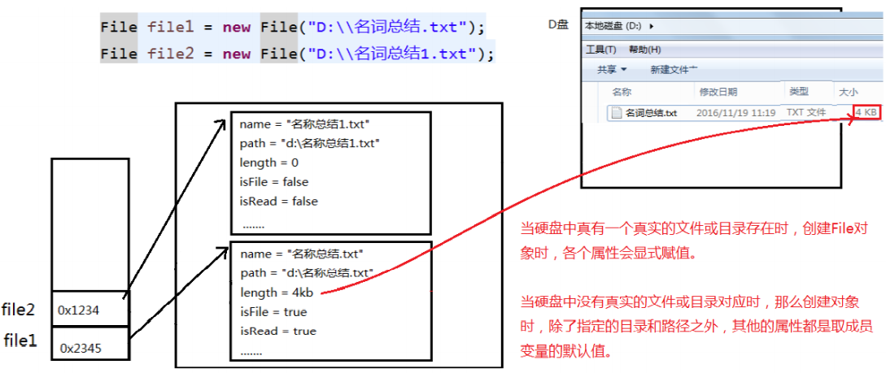
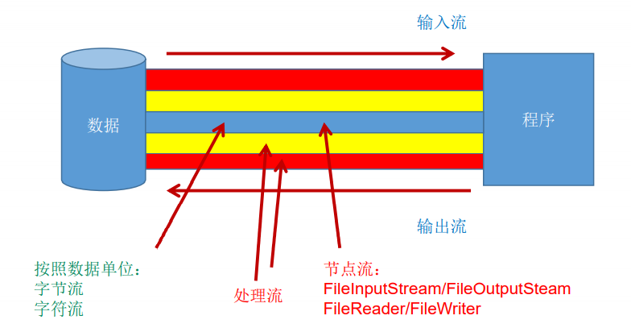
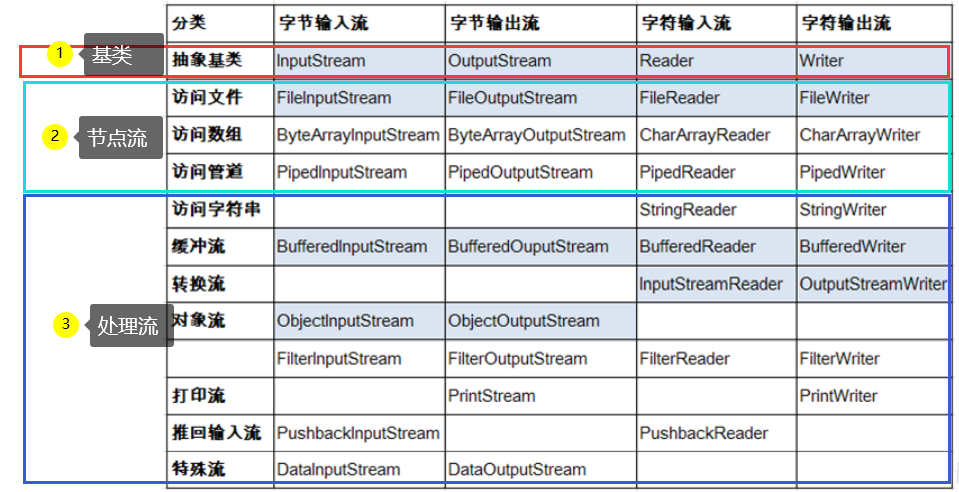
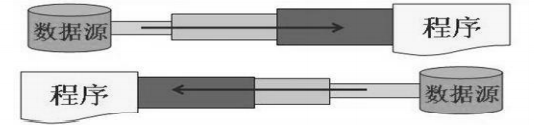
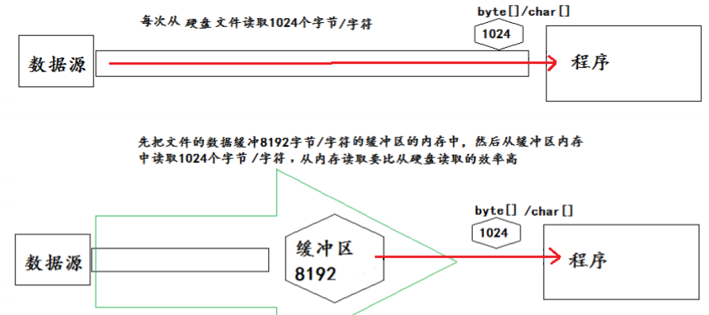
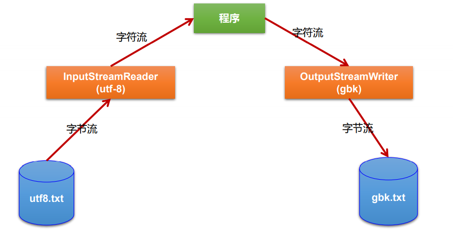
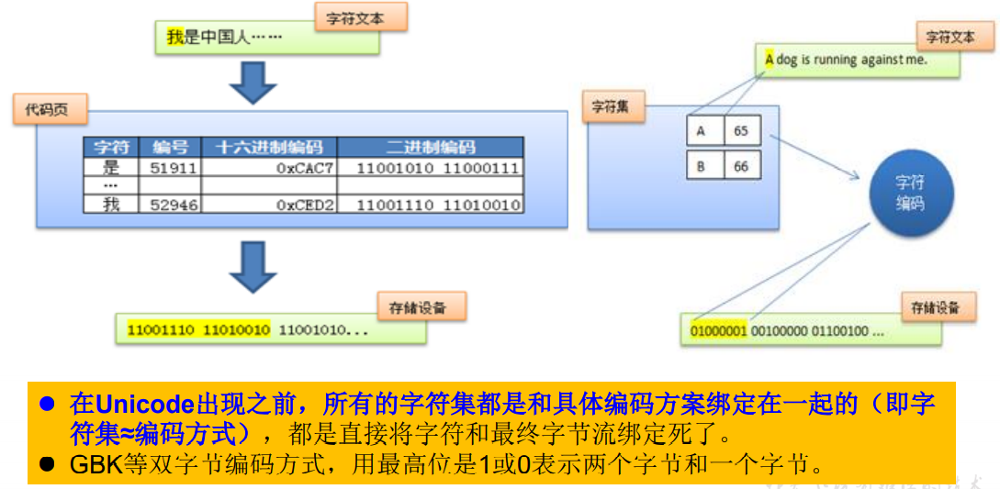
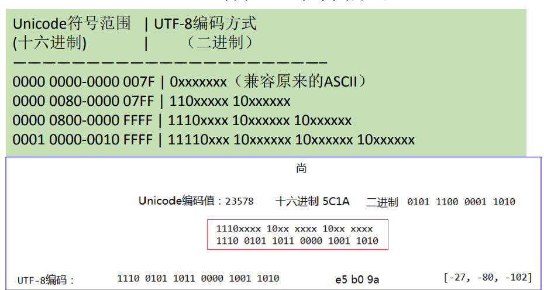
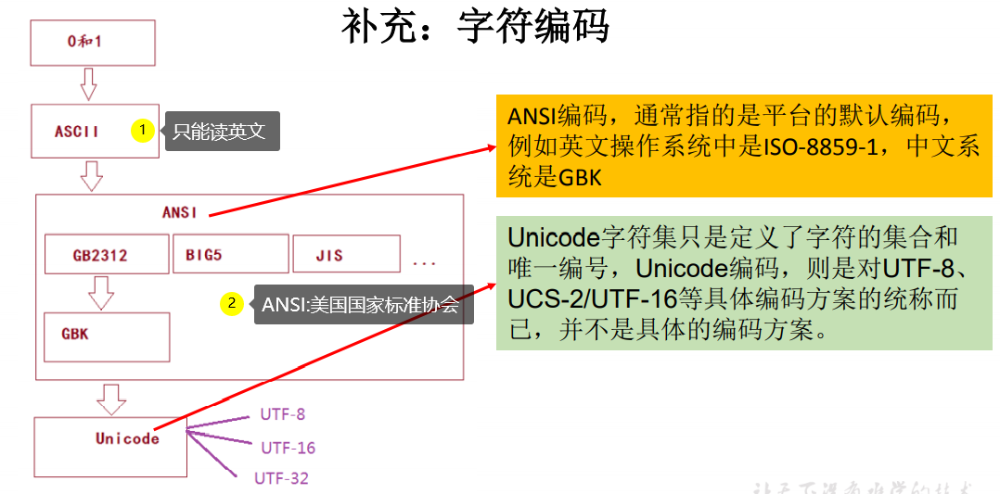

# IO流

流是用来处理数据的。

处理数据时，一定要先明确数**据源**，与**数据目的地**

- 数据源可以是文件，可以是键盘。
- 数据目的地可以是文件、显示器或者其他设备。

而流只是在帮助数据进行传输，并对传输的数据进行处理，比如过滤处理、 转换处理等。

## 01_File类的使用

### File类的理解

- java.io.File类：**文件和文件目录路径**的抽象表示形式，与平台无关
- File 能新建、删除、重命名文件和目录，但 File 不能访问文件内容本身。 如果需要访问文件内容本身，则需要使用输入/输出流。
- **想要在Java程序中表示一个真实存在的文件或目录，那么必须有一个File对象，但是Java程序中的一个File对象，可能没有一个真实存在的文件或目录。**
- File对象可以作为参数传递给流的构造器

### File的实例化

#### 常用构造器

- public File(String pathname)：以pathname为路径创建File对象，可以是**绝对路径或者相对路径**，如果 pathname是相对路径，则默认的当前路径在系统属性user.dir中存储。
- public File(String parent,String child)：以parent为父路径，child为子路径创建File对象。
- public File(File parent,String child)：根据一个父File对象和子文件路径创建File对象

#### 路径的分类

绝对路径：是一个固定的路径,从盘符开始

相对路径：是相对于某个位置开始

如果开发使用JUnit中的单元测试方法测试，相对路径即为当前Module下。

如果开发使用main()测试，相对路径即为当前的Project下。

#### 路径分隔符

- 路径中的每级目录之间用一个**路径分隔符**隔开。
- 路径分隔符和系统有关：
  - windows和DOS系统默认使用"`\`"来表示
  - UNIX和URL使用`"/"`来表示
- Java程序支持跨平台运行，因此路径分隔符要慎用。
- 为了解决这个隐患，File类提供了一个常量：public static final String separator。根据操作系统，动态的提供分隔符。

```java
File file1 = new File("d:\\atguigu\\info.txt");
File file2 = new File("d:" + File.separator + "atguigu" + File.separator + "info.txt");
File file3 = new File("d:/atguigu");
```

/是根目录

./是当前目录

../是父级目录

### File类的常用方法

> File类的获取功能

- **public String getAbsolutePath()：获取绝对路径** 

- public String getPath() ：获取路径

- public String getName() ：获取名称 

- **public String getParent()：获取上层文件目录路径。若无，返回null** 

- public long length() ：获取文件长度（即：字节数）。不能获取目录的长度。 

- public long lastModified() ：获取最后一次的修改时间，毫秒值 

  

- public String[] list() ：获取指定目录下的所有文件或者文件目录的名称数组 

- public File[] listFiles() ：获取指定目录下的所有文件或者文件目录的File数组

> File类的重命名功能

- public boolean renameTo(File dest):把文件重命名为指定的文件路径

> File类的判断功能

- **public boolean isDirectory()：判断是否是文件目录** 
- **public boolean isFile() ：判断是否是文件**
- **public boolean exists() ：判断是否存在**
- public boolean canRead() ：判断是否可读
- public boolean canWrite() ：判断是否可写
- public boolean isHidden() ：判断是否隐藏

> File类的创建功能

- **public boolean createNewFile() ：创建文件。若文件存在，则不创建，返回false** 
- public boolean mkdir() ：创建文件目录。如果此文件目录存在，就不创建了。 如果此文件目录的上层目录不存在，也不创建。
- **public boolean mkdirs() ：创建文件目录。如果上层文件目录不存在，一并创建**

注意事项：如果你创建文件或者文件目录没有写盘符路径，那么，默认在项目路径下。

> File类的删除功能

- **public boolean delete()：删除文件或者文件夹**

删除注意事项： Java中的删除不走回收站。 要删除一个文件目录，请注意该文件目录内不能包含文件或者文件目录

### File类的使用（TODO）

 

>练习一

利用File构造器，new 一个文件目录file

1. 在其中创建多个文件和目录
2. 编写方法，实现删除file中指定文件的操作


> 练习二：判断指定目录下是否有后缀名为.jpg的文件，如果有，就输出该文件名称

````JAVA
import java.io.File;
import java.io.FileFilter;
import java.io.FilenameFilter;

import org.junit.Test;
/**
 * 课后练习2：判断指定目录下是否有后缀名为.jpg的文件，如果有，就输出该文件名称
 * @author shkstart 邮箱：shkstart@126.com
 * @version  创建时间：2019年2月23日  上午1:55:59
 *
 */
public class FindJPGFileTest {

    @Test
    public void test1(){
        File srcFile = new File("d:\\code");

        String[] fileNames = srcFile.list();
        for(String fileName : fileNames){
            if(fileName.endsWith(".jpg")){
                System.out.println(fileName);
            }
        }
    }
    @Test
    public void test2(){
        File srcFile = new File("d:\\code");

        File[] listFiles = srcFile.listFiles();
        for(File file : listFiles){
            if(file.getName().endsWith(".jpg")){
                System.out.println(file.getAbsolutePath());
            }
        }
    }
    /*
	 * File类提供了两个文件过滤器方法
	 * public String[] list(FilenameFilter filter)
	 * public File[] listFiles(FileFilter filter)、
	 */
    @Test
    public void test3(){
        File srcFile = new File("d:\\code");

        File[] subFiles = srcFile.listFiles(new FilenameFilter() {

            @Override
            public boolean accept(File dir, String name) {
                return name.endsWith(".jpg");
            }
        });

        for(File file : subFiles){
            System.out.println(file.getAbsolutePath());
        }
    }
}
````

> 练习三：

遍历指定目录所有文件名称，包括子文件目录中的文件。

1. 拓展1：并计算指定目录占用空间的大小
2. 拓展2：删除指定文件目录及其下的所有文件

```JAVA
import java.io.File;
/**
 * 3. 遍历指定目录所有文件名称，包括子文件目录中的文件。
	拓展1：并计算指定目录占用空间的大小
	拓展2：删除指定文件目录及其下的所有文件
 *
 */
public class ListFilesTest {

    public static void main(String[] args) {
        // 递归:文件目录
        /** 打印出指定目录所有文件名称，包括子文件目录中的文件 */

        // 1.创建目录对象
        File dir = new File("E:\\teach\\01_javaSE\\_尚硅谷Java编程语言\\3_软件");

        // 2.打印目录的子文件
        printSubFile(dir);
    }

    public static void printSubFile(File dir) {
        // 打印目录的子文件
        File[] subfiles = dir.listFiles();

        for (File f : subfiles) {
            if (f.isDirectory()) {// 文件目录
                printSubFile(f);
            } else {// 文件
                System.out.println(f.getAbsolutePath());
            }

        }
    }

    // 方式二：循环实现
    // 列出file目录的下级内容，仅列出一级的话
    // 使用File类的String[] list()比较简单
    public void listSubFiles(File file) {
        if (file.isDirectory()) {
            String[] all = file.list();
            for (String s : all) {
                System.out.println(s);
            }
        } else {
            System.out.println(file + "是文件！");
        }
    }

    // 列出file目录的下级，如果它的下级还是目录，接着列出下级的下级，依次类推
    // 建议使用File类的File[] listFiles()
    public void listAllSubFiles(File file) {
        if (file.isFile()) {
            System.out.println(file);
        } else {
            File[] all = file.listFiles();
            // 如果all[i]是文件，直接打印
            // 如果all[i]是目录，接着再获取它的下一级
            for (File f : all) {
                listAllSubFiles(f);// 递归调用：自己调用自己就叫递归
            }
        }
    }

    // 拓展1：求指定目录所在空间的大小
    // 求任意一个目录的总大小
    public long getDirectorySize(File file) {
        // file是文件，那么直接返回file.length()
        // file是目录，把它的下一级的所有大小加起来就是它的总大小
        long size = 0;
        if (file.isFile()) {
            size += file.length();
        } else {
            File[] all = file.listFiles();// 获取file的下一级
            // 累加all[i]的大小
            for (File f : all) {
                size += getDirectorySize(f);// f的大小;
            }
        }
        return size;
    }

    // 拓展2：删除指定的目录
    public void deleteDirectory(File file) {
        // 如果file是文件，直接delete
        // 如果file是目录，先把它的下一级干掉，然后删除自己
        if (file.isDirectory()) {
            File[] all = file.listFiles();
            // 循环删除的是file的下一级
            for (File f : all) {// f代表file的每一个下级
                deleteDirectory(f);
            }
        }
        // 删除自己
        file.delete();
    }
}
```

## 02_IO流原理及流的分类

### Java IO原理

- I/O是Input/Output的缩写， I/O技术是非常实用的技术，用于 **处理设备之间的数据传输**。如**读/写文件**，**网络通讯**等。网络之间的传输也叫IO
- Java程序中，对于数据的输入/输出操作以"流(stream)" 的 方式进行。就像是日常生活中的电流、水流
-  java.io包下提供了各种"流"类和接口，用以获取不同种类的数据，并通过标准的方法输入或输出数据。


输入input：读取外部数据（磁 盘、光盘等存储设备的数据）到程序（内存）中。

输出output：将程序（内存） 数据输出到磁盘、光盘等存储设备中。


站在我们的角度，我们应该站在内存的角度来看流的流向。

### 流的基类

数据存储的最小单位是bit，数据存储的基本单位是byte

- 按操作**数据单位**不同分为：字节流(8 bit)，字符流(16 bit)
- 按数据流的**流向**不同分为：输入流，输出流
- 按流的**角色**的不同分为：节点流，处理流

Java IO 流共涉及 40 多个类，这些类看上去很杂乱，但实际上很有规则，而且彼此之间存在非常紧密的联系， Java I0 流的 40 多个类都是从如下 4 个抽象类基类中派生出来的。

由这四个类派生出来的子类名称都是以其父类名作为子类名后缀。

|        | 字节流       | 字符流 |
| ------ | ------------ | ------ |
| 输入流 | InputStream  | Reader |
| 输出流 | OutputStream | Writer |

 

### 流的分类

 

 


### 既然有了字节流为什么还要字符流

问题本质想问：**不管是文件读写还是网络发送接收，信息的最小存储单元都是字节，那为什么 I/O 流操作要分为字节流操作和字符流操作呢？**

回答：字符流是由 Java 虚拟机将字节转换得到的，问题就出在这个过程还算是非常耗时，并且，如果我们不知道编码类型就很容易出现乱码问题。所以， I/O 流就干脆提供了一个直接操作字符的接口，方便我们平时对字符进行流操作。如果音频文件、图片等媒体文件用字节流比较好，如果涉及到字符的话使用字符流比较好。

### 什么是节点流和处理流

节点流：直接从数据源或目的地读写数据

 

处理流：不直接连接到数据源或目的地，而是"连接"在已存在的流（节点流或处理流）之上，通过对数据的处理为程序提供更为强大的读写功能。

是对一个已存在的流的连接和封装，通过所封装的流的功能调用实现数据读写。处理流的构造方法总是要带一个其他的流对象做参数。一个流对象经过其他流的多次包装，称为流的链接。

 

### 学习顺序

| 抽象基类     | 节点流（或文件流）                             | 缓冲流（处理流的一种）                                       |
| ------------ | ---------------------------------------------- | ------------------------------------------------------------ |
| InputStream  | FileInputStream `read(byte[] buffer)`          | BufferedInputStream `read(byte[] buffer)`                    |
| OutputStream | FileOutputStream  `write(byte[] buffer,0,len)` | BufferedOutputStream<BR> `write(byte[] buffer,0,len)/fulsh()` |
| Reader       | FileReader`read(char[] cbuf)`                  | BufferedReader `read(char[] cbuf)/readLine()`                |
| Writer       | FileWriter `write(char[] cbuf,0,len)`          | BufferedWriter `write(char[] cbuf,0,len)/fulsh()`            |

## 03_节点流(或文件流)

### 节点字符输入流FileReader

不论什么流，编写起来都是比较规范的：

1. File类的实例化
2. FileReader流的实例化（后续可更换）
3. 读入的操作
4. 资源的关闭

将module下的hello.txt文件内容读入程序中，并输出到控制台

说明点：

- read()的理解：返回读入的一个字符。如果达到文件末尾，返回-1
- 异常的处理：为了保证流资源一定可以执行关闭操作。需要使用 try-catch-finally 处理，或者新特性的 try-with-resource
- 读入的文件一定要存在，否则就会报 FiLeNotFoundExceptior。写出的文件不一定要存在。

```java
@Test
public void testFileReader() {
    // 1.实例化File对象，指明要操作的文件
    // 相对路径：相对于当前module
    FileReader fr = null;
    try {
        File file = new File("hello.txt");

        // 2.提供具体的流
        fr = new FileReader(file);

        // 3.数据的读入,read():返回读入的一个字符,如果达到文件末尾,返回-1
        // 方式一
        int data1 = fr.read();
        while (data1 != -1) {
            System.out.print((char) data1);
            data1 = fr.read();
        }

        // 方式二：语法上针对方式一的修改
        int data;
        while ((data = fr.read()) != -1) {
            System.out.print((char) data);
        }
    } catch (IOException e) {
        e.printStackTrace();
    } finally {
        // 4.流的关闭操作
        if (fr != null) {
            try {
                fr.close();
            } catch (IOException e) {
                e.printStackTrace();
            }
        }
    }
}
```

从 Java 7 build 105 版本开始，Java 7 的编译器和运行环境支持新的 try-with-resources 语句，称为 ARM 块(Automatic Resource Management) ，自动资源管理。

```java
@Test
public void testFileReader() {
    // 实例化File对象，指明要操作的文件
    // 相对路径：相对于当前module
    File file = new File("hello.txt");

    try (FileReader fr = new FileReader(file)) {
        // 方式一
        int data1 = fr.read();
        while (data1 != -1) {
            System.out.print((char) data1);
            data1 = fr.read();
        }

        // 方式二：语法上针对方式一的修改
        int data;
        while ((data = fr.read()) != -1) {
            System.out.print((char) data);
        }
    } catch (IOException e) {
        e.printStackTrace();
    }
}
```

对read()进行升级：使用read()的重载方法，因为每次一个一个读太慢了

```java
@Test
public void testFileReader2() {
    // 1.File类的实例化
    File file = new File("hello.txt");

    // 2.FileReader流的实例化
    try (FileReader fr = new FileReader(file)) {

        // 3.读入的操作 就像是外卖小车 每次放入5份外卖
        char[] cBuf = new char[5];
        int length;
        // read(char[] cbuf):返回每次读入cbuf数组中的字符的个数。如果达到文件末尾，返回-1
        while ((length = fr.read(cBuf)) != -1) {
            // 方式一:错误的写法
            for (int i = 0; i < cBuf.length; i++) {
                System.out.print(cBuf[i]); // hello world 123ld 只是对上此数组进行了覆盖
            }
            // 方式一:正确的写法
            for (int i = 0; i < length; i++) {
                System.out.print(cBuf[i]);
            }

            // 方式二:错误的写法 对用方式一错误的写法
            String str = new String(cBuf);
            
            // 方式二:正确的写法
            String s = new String(cBuf, 0, length);
            System.out.print(s);
        }
    } catch (IOException e) {
        e.printStackTrace();
    }
}
```

> 总结：读取文件

```java
1.建立一个流对象，将已存在的一个文件加载进流。
    FileReader fr = new FileReader(new File(“Test.txt”));
2.创建一个临时存放数据的数组。
    char[] ch = new char[1024];
3.调用流对象的读取方法将流中的数据读入到数组中。
    fr.read(ch);
4. 关闭资源。
    fr.close();
```

### 节点字符输出流FileWriter

- 输出操作，对应的File可以不存在的，并不会报异常，File对应的硬盘中的文件如果不存在，在输出的过程中，会自动创建此文件。
- File对应的硬盘中的文件如果存在
  - 如果流使用的构造器是:Filewriter(file,false) / Filewriter(file)：对原有文件进行覆盖
  - 如果流使用的构造器是:Filewriter(file,true)：不会对原有文件进行覆盖，而是在原有文件基础上追加内容

```java
@Test
public void testFileWriter() throws IOException {
    // 1.提供File类的对象，指明写出到的文件
    File file = new File("hello1.txt");

    // 2.提供 FileWriter 的对象，用于数据的写出
    FileWriter fw = new FileWriter(file);

    // 3.写出的操作
    fw.write("I have a dream!");
    fw.write("You need to have a dream!");

    // 4.资源的关闭
    fw.close();
}
```

> 总结：写入文件

```java
1.创建流对象，建立数据存放文件
    FileWriter fw = new FileWriter(new File(“Test.txt”));
2.调用流对象的写入方法，将数据写入流
    fw.write(“atguigu-songhongkang”);
3.关闭流资源，并将流中的数据清空到文件中。
    fw.close();
```

### 使用FileReader和FileWriter对文件进行复制

```java
@Test
public void testFileCopy() throws IOException {
    // 1.提供File实例，分别指明读入的文件和写出的文件
    File srcFile = new File("hello.txt");
    File destFile = new File("hello1.txt");

    // 2.准备读入节点字符流和写出节点字符流
    FileReader fr = new FileReader(srcFile);
    FileWriter fw = new FileWriter(destFile);

    // 3.处理数据 读一下写一下
    char[] chars = new char[5];
    // 记录每次读入到 chars 中的个数
    int length;
    while ((length = fr.read(chars)) != -1) {
        // 方式一
        String str = new String(chars, 0, length);
        fw.write(str);

        // 方式二
        fw.write(chars, 0, length);
    }

    // 4.关闭资源
    fw.close();
    fr.close();
}
```

### 不能使用字符流来处理图片等字节数据

图片无法打开，无法将二进制文件转换char类型的数据

 

```java
@Test
public void testFileCopyPicture() throws IOException {
    // 1.提供File实例，分别指明读入的文件和写出的文件
    File srcFile = new File("headnow.jpg");
    File destFile = new File("headnow1.jpg");

    // 2.准备读入节点字符流和写出节点字符流
    FileReader fr = new FileReader(srcFile);
    FileWriter fw = new FileWriter(destFile);

    // 3.处理数据 读一下写一下
    char[] chars = new char[5];
    // 记录每次读入到 chars 中的个数
    int length;
    while ((length = fr.read(chars)) != -1) {
        // 方式一
        String str = new String(chars, 0, length);
        fw.write(str);

        // 方式二
        fw.write(chars, 0, length);
    }

    // 4.关闭资源
    fw.close();
    fr.close();
}
```

### 尽量不使用字节流来处理字符等数据

单字节的字符还是可以正常处理，但是如果输入中文，UTF-8中一个中文占用3个字符：比如我们将临时数组长度设置为5，helloworld123宋嘉诚，hello占用一次数组，world占用一次数组，123占用前三个，宋的前两个字节和第三个字节分开了，出现了乱码。

```java
@Test
public void testNotProcessText() {
    // 1.File类的实例化
    File file = new File("hello.txt");

    // 2.FileReader流的实例化
    try (FileInputStream fis = new FileInputStream(file)) {

        // 3.读入的操作
        byte[] bytes = new byte[5];
        int length;
        while ((length = fis.read(bytes)) != -1) {
            // 正确的写法
            String str = new String(bytes, 0, length);
            System.out.print(str);
        }
    } catch (IOException e) {
        e.printStackTrace();
    }
}
// hello world宋���诚
```

但是我们把数组长度放大点不就好了吗？没必要：

- 对于文本文件（.txt，.java，.c，.cpp），使用字符流处理
- 对于非文本文件（.mp3，.jpg，.mp4，.avi，.doc，.ppt），使用字节流处理
- 但是单纯复制的话，文本文件也可以使用字节流处理

### 使用FileInputStream与FileOutputStream对文件进行复制

- 节点字节输入流FileInputStream
- 节点字节输出流FileOutputStream

```JAVA
@Test
public void copyPicture() throws IOException {
    // 1.实例化File
    File srcPic = new File("headnow.jpg");
    File destPic = new File("headnow1.jpg");

    // 2.创建节点字节流
    FileInputStream fis = new FileInputStream(srcPic);
    FileOutputStream fos = new FileOutputStream(destPic);

    // 3.处理复制逻辑
    byte[] bytes = new byte[5];
    int length;
    while ((length = fis.read(bytes)) != -1) {
        fos.write(bytes, 0, length);
    }

    // 关闭流
    fos.close();
    fis.close();
}
```

## 04_缓冲流（处理流之一）

- BufferedInputStream
- BufferedInputStream
- BufferedReader
- BufferefWriter

作用：提高流读取、写入的速度；开发中一般不会直接使用节点流，一般会用到缓冲流，缓冲流效率高于节点流

处理流，就是套接在已有的流的基础上

### 使用BufferedInputStream和BufferedInputStream实现图片复制

```java
@Test
public void testCopyText() throws IOException {
    // 1.实例化File
    File srcText = new File("headnow.jpg");
    File destText = new File("headnow1.jpg");

    // 2.准备缓冲流
    BufferedInputStream bis = new BufferedInputStream(new FileInputStream(srcText));
    BufferedOutputStream bos = new BufferedOutputStream(new FileOutputStream(destText));

    // 3.处理复制细节
    byte[] bytes = new byte[5];
    int length;
    while ((length = bis.read(bytes)) != -1) {
        bos.write(bytes, 0, length);
    }

    // 4.关闭流 关闭外层流的同时，内层流也会关闭
    bos.close();
    bis.close();
}
```

### 缓冲流与节点流读写速度对比

- 提高读写速度的原因：为了提高数据读写的速度，Java API 提供了带缓冲功能的流类，在使用这些流类时，会创建一个内部缓冲区数组，缺省使用8192个字节(8Kb)的缓冲区。
- 当使用BufferedInputStream读取字节文件时，BufferedInputStream会一次性从文件中读取8192个(8Kb)，存在缓冲区中，直到缓冲区装满了，才重新从文件中读取下一个8192个字节数组。
- 向流中写入字节时，不会直接写到文件，先写到缓冲区中直到缓冲区写满， BufferedOutputStream才会把缓冲区中的数据一次性写到文件里。使用方法 **flush()可以强制将缓冲区的内容全部写入输出流**
- 如果是带缓冲区的流对象的close()方法，不但会关闭流，还会在关闭流之前刷新缓冲区，关闭后不能再写出。我们要想测试没有`flush()`会怎么样，首先不写`flush()`方法，其次不关闭流，文件就无法读出写入。
- 关闭流的顺序和打开流的顺序相反。只要关闭最外层流即可，关闭最外层流也会相应关闭内层节点流

 

```java
// 字节处理流的8k字节
private static int DEFAULT_BUFFER_SIZE = 8192;
// 维护了一个8k字节大小的缓冲区
public BufferedInputStream(InputStream in) {
    this(in, DEFAULT_BUFFER_SIZE);
}

public BufferedInputStream(InputStream in, int size) {
    super(in);
    if (size <= 0) {
        throw new IllegalArgumentException("Buffer size <= 0");
    }
    buf = new byte[size];
}

// 字符处理流的8k字符
private static int defaultCharBufferSize = 8192;

// 维护了一个8k字符4k字节大小的缓冲区
public BufferedReader(Reader in) {
    this(in, defaultCharBufferSize);
}

public BufferedReader(Reader in, int sz) {
    super(in);
    if (sz <= 0)
        throw new IllegalArgumentException("Buffer size <= 0");
    this.in = in;
    cb = new char[sz];
    nextChar = nChars = 0;
}
```

### 使用BufferedReader和BufferedWriter实现文本复制

```java
@Test
public void testCopyText() throws IOException {
    // 1.实例化File
    File srcText = new File("hello.txt");
    File destText = new File("hello1.txt");

    // 2.准备缓冲流
    BufferedReader br = new BufferedReader(new FileReader(srcText));
    BufferedWriter bw = new BufferedWriter(new FileWriter(destText));

    // 3.处理复制细节
    // 方式一:使用char类型的数组
    char[] chars = new char[5];
    int length;
    while ((length = br.read(chars)) != -1) {
        bw.write(chars, 0, length);
        bw.flush();
    }

    // 方法二：使用字符串接收每行
    String line;
    while ((line = br.readLine()) != null) {
        bw.write(line);
        bw.newLine();
    }

    // 4.关闭流 关闭外层流的同时，内层流也会关闭
    bw.close();
    br.close();
}
```

### 练习一：实现图片加解密

```java
@Test
public void testEncrypt() throws IOException {
    // 1.实例化File
    File srcPic = new File("headnow.jpg");
    File destPic = new File("headnow加密.jpg");

    // 2.准备缓冲流
    BufferedInputStream bis = new BufferedInputStream(new FileInputStream(srcPic));
    BufferedOutputStream bos = new BufferedOutputStream(new FileOutputStream(destPic));

    // 3.处理复制细节
    byte[] bytes = new byte[5];
    int length;
    while ((length = bis.read(bytes)) != -1) {
        // 字节数组进行修改
        // 错误方式：使用增强for循环,取str中的元素赋给myStr,其中有一个赋值的操作 bytes本身没变
        for (byte b : bytes) {
            b = (byte) (b^ 5);
        }
        // 正确方式
        for (int i = 0; i < length; i++) {
            bytes[i] = (byte) (bytes[i] ^ 5);
        }
        bos.write(bytes, 0, length);
        bos.flush();
    }

    // 4.关闭流 关闭外层流的同时，内层流也会关闭
    bos.close();
    bis.close();
}

@Test
public void testDecrypt() throws IOException {
    // 1.实例化File
    File srcPic = new File("headnow加密.jpg");
    File destPic = new File("headnow解密.jpg");

    // 2.准备缓冲流
    BufferedInputStream bis = new BufferedInputStream(new FileInputStream(srcPic));
    BufferedOutputStream bos = new BufferedOutputStream(new FileOutputStream(destPic));

    // 3.处理复制细节
    byte[] bytes = new byte[5];
    int length;
    while ((length = bis.read(bytes)) != -1) {
        // 字节数组进行修改
        for (int i = 0; i < length; i++) {
            bytes[i] = (byte) (bytes[i] ^ 5);
        }
        bos.write(bytes, 0, length);
        bos.flush();
    }

    // 4.关闭流 关闭外层流的同时，内层流也会关闭
    bos.close();
    bis.close();
}
```

### 练习二：获取文本上每个字符出现的次数

遍历文本的每一个字符；字符及出现的次数保存在Map中；将Map中数据 写入文件

```java
@Test
public void testWordCount() throws IOException {
    // 1.实例化File
    File srcText = new File("hello.txt");
    File destText = new File("wordCount.txt");

    // 2.创建流
    BufferedReader br = new BufferedReader(new FileReader(srcText));
    BufferedWriter bw = new BufferedWriter(new FileWriter(destText));

    // 3.处理
    Map<Character, Integer> countMap = new HashMap<>();
    int c;
    while ((c = br.read()) != -1) {
        char ch = (char) c;
        // 判断char是否在map中第一次出现
        // countMap.merge(ch, 1, Integer::sum); 优化写法
        if (countMap.get(ch) == null) {
            countMap.put(ch, 1);
        } else {
            countMap.put(ch, countMap.get(ch) + 1);
        }
    }
    for (Map.Entry<Character, Integer> entry : countMap.entrySet()) {
        switch (entry.getKey()) {
            case ' ':
                bw.write("空格=" + entry.getValue());
                break;
            case '\t'://\t表示tab 键字符
                bw.write("tab键=" + entry.getValue());
                break;
            case '\r'://
                bw.write("回车=" + entry.getValue());
                break;
            case '\n'://
                bw.write("换行=" + entry.getValue());
                break;
            default:
                bw.write(entry.getKey() + "=" + entry.getValue());
                break;
        }
        bw.newLine();
    }

    bw.close();
    br.close();
}
```

## 05_转换流（处理流之二）

1、转换流：Java API提供了两个转换流（这两个转换流都属于字符流，看后缀）：

- InputStreamReader：将InputStream转换为Reader
- OutputStreamWriter：将Writer转换为OutputStream

2、作用：转换流提供了在字节流和字符流之间的转换，字节流中的数据都是字符时，转成字符流操作更高效。

3、再来看看编码和解码：

- 解码：字节、字节数组----------字符串、字符数组

- 编码：字符串、字符数组-----------字节、字节数组

4、转换流的编码应用：

- 可以将字符按指定编码格式存储
- 可以对文本数据按指定编码格式来解读
- 指定编码表的动作由构造器完成
- 很多时候我们使用转换流来处理文件乱码问题（即下图中的更换编码方式）。实现编码和解码的功能。

 

### 详解字符编码

> 前置知识

1. 字符集：字符集就是字符的集合，一般会包含一种语言的字符。

   比如GBK，是包含所有常用汉字字符的字符集。ASCII是包含英文字符的字符集。字符就是Java中的char , char是 character的简写。

   编码的过程需要按照某种字符集，解码的过程同样需要按照某种字符集；

2. 编码：char代表一个字符，char的本质也是数字。**将数字映射到字符**，就叫编码。

   将一个字符集映射到数字，就是给这个字符集编码。编码是有标准的，所有的计算机系统按照同一个编码标准执行。

> 详解

编码表的由来：

计算机只能识别二进制数据，早期由来是电信号。为了方便应用计算机，让它可以识别各个国家的文字。就将各个国家的文字用数字来表示，并一一对应，形成一张表。 这就是编码表。

常见的编码表：

- ASCII：美国标准信息交换码。用一个字节的7位可以表示（最开始是美国，英文+标点+数字，7位就够了，2的7次方）
-  ISO8859-1：拉丁码表。欧洲码表。用一个字节的8位表示。（计算机发展到欧洲，欧洲也来一套适配自己的）
- GB2312：中国的中文编码表。最多两个字节编码所有字符（计算机发展到了中国，汉字这么多，1个字节肯定不够，这里的最多两个字节就很灵性，首先创建编码表，可以兼容以前的，比如ASCII的a = 97，那我们可以继续延用（既节省空间），这也就是有的文件乱码但是英文还能正常展示的原因。但是ASCII只需呀一个字节就行，所以我们兼容的时候，之前的就用一个字节，汉字的可以用两个字节）
-  GBK：中国的中文编码表升级，融合了更多的中文文字符号。最多两个字节编码（支持繁体等等）


有个问题：假如用GBK护着GB2312进行编码，底层有两个字节，这是代表两个字符还是整体代表一个字符出现呢？

解决方案：看首位，最高位是0，表示单独一个字节代表一个汉字；最高位是1，代表一个字节不够表示，得两个字节代表一个字符

 


- Unicode：国际标准码，融合了目前人类使用的所有字符。为每个字符分配唯一的 字符码。所有的文字都用两个字节来表示。（Unicode字符集就像一个字典，你能找到所有的字符对应的编码，具体的Unicode编码类型则是如何将这些编码按照指定的格式存起来）

  

  Unicode不完美，这里就有三个问题，

  1. 一个是，我们已经知道，英文字母只用 一个字节表示就够了，
  2. 第二个问题是如何才能区别Unicode和ASCII？计算机 怎么知道两个字节表示一个符号，而不是分别表示两个符号呢？（0-1区分）
  3. 第三个，如果和GBK等双字节编码方式一样，用最高位是1或0表示两个字节和一个字节， 就少了很多值无法用于表示字符，不够表示所有字符 2的16次方瞬间变成了2的15次方。Unicode在很长一段时 间内无法推广，直到互联网的出现。

  面向传输的众多 UTF（UCS Transfer Format）标准出现了，顾名思义，**UTF-8就是每次8个位传输数据，而UTF-16就是每次16个位**。这是为传输而设计的编码，并使编码无国界，这样就可以显示全世界上所有文化的字符了。

  **Unicode只是定义了一个庞大的、全球通用的字符集，并为每个字符规定了唯 一确定的编号，具体存储成什么样的字节流，取决于字符编码方案。**推荐的 Unicode编码是UTF-8和UTF-16。

  - UTF-8：每次8个位传输数据，变长的编码方式，可用1-4个字节来表示一个字符。（在标准UTF-8编码中，超出基本多语言范围(BMP-Basic Multilinual Plane)的字符被编码为4字节格式，但是在修正的UT-8编码中，他们油代理编码时(surogaepais )表w,然后这些代理编码对在序列中分别重新编码。结果标准UTF-8编码中需要4个字节的字符，在修正后的UTF-8编码中将需要6个字节。）
  - UTF-16：每次16个位传输数据，这样就能想通java中的char用unicode编码，因为char为两个字节，不需要判断第一位是不是0，所以char就可以表示所有的字符了
  - UFT-32：

   

 

> 启发

要求

1. 客户端/浏览器端
2. 后台
3. 数据库

三端适用的字符集都要统一：UTF-8

### InputStreamReader实现字节输入流到字符输入流

- 实现将字节的输入流按指定字符集转换为字符的输入流
- 相当于解码操作
- 需要和InputStream"套接"
- 构造器
  - 默认：public InputStreamReader(InputStream in)
  - 指定字符集：public InputSreamReader(InputStream in,String charsetName)

```java
@Test
public void test1() throws IOException {
    // 1.实例化File
    File file = new File("hello.txt");
    // 2.创建字节节点输入流
    FileInputStream fis = new FileInputStream(file);
    // 3.创建字节-字符转换流 解码过程
    InputStreamReader isr = new InputStreamReader(fis, StandardCharsets.UTF_8);	// 指定字符集取决于文件编码的方式

    // 4.处理文件并输出
    char[] chars = new char[5];
    int length;
    while ((length = isr.read(chars)) != -1) {
        String str = new String(chars, 0, length);
        System.out.print(str);
    }

    // 5.关闭资源
    isr.close();
}
```

### OutputStreamWriter实现字符输入流到字节输出流

从默认的字符集UTF-8编码转换为GBK编码集

```java
@Test
public void test1() throws IOException {
    // 1.实例化文件
    File src = new File("utf8.txt");
    File dest = new File("gbk.txt");

    // 2.创建字节流
    FileInputStream fis = new FileInputStream(src);
    FileOutputStream fos = new FileOutputStream(dest);

    // 3.创建转换流
    InputStreamReader isr = new InputStreamReader(fis, StandardCharsets.UTF_8);
    OutputStreamWriter osw = new OutputStreamWriter(fos,"gbk");

    // 4.过程
    char[] chars = new char[5];
    int length;
    while ((length = isr.read(chars)) != -1) {
        osw.write(chars, 0, length);
    }

    // 5.关闭资源
    osw.close();
    isr.close();
}
```

## 06_标准输入System.in输出流System.out

- **System.in**和**System.out**分别代表了系统标准的输入和输出设备
-  默认输入设备是：键盘，输出设备是：显示器
- System.in的类型是InputStream
- System.out的类型是PrintStream，其是OutputStream的子类 FilterOutputStream 的子类
- 重定向：通过System类的setIn，setOut方法对默认设备进行改变。
  - public static void setIn(InputStream in)
  - public static void setOut(PrintStream out)

> 例题：从键盘输入字符串，要求将读取到的整行字符串转成大写输出。然后继续进行输入操作，直至当输入“e”或者“exit”时，退出程序。

分析：

1. System.in的返回值？InputStream
2. readLine是谁的方法？BufferedReader
3. System.in的字节输入流和readLine的BufferedReader怎么转换？InputStreamReader

System.in（InputStream）——转换流（InputStreamReader）将字节流转换为字符流——BufferedReader

```java
// 从键盘读取不一定只能用Scanner,还可以适用标准输入流
public static void main(String[] args) throws IOException {
    InputStreamReader isr = new InputStreamReader(System.in);
    BufferedReader br = new BufferedReader(isr);

    while (true) {
        System.out.println("请输入一行：");
        String data = br.readLine();
        if ("e".equalsIgnoreCase(data) || "exit".equalsIgnoreCase(data)) {
            System.out.println("安全退出!!");
            break;
        }
        // 将读取到的整行字符串转成大写输出
        System.out.println("-->:" + data.toUpperCase());
        System.out.println("继续输入信息");
    }
    br.close();
}
```

## 07_打印流PrintStream和PrintWriter

- 实现将**基本数据类型**的数据格式转化为**字符串**输出
- 打印流：PrintStream和PrintWriter
  - 提供了一系列重载的print()和println()方法，用于多种数据类型的输出
  - PrintStream和PrintWriter的输出不会抛出IOException异常
  - PrintStream和PrintWriter有自动flush功能
  - PrintStream 打印的所有字符都使用平台的默认字符编码转换为字节。在需要写入字符而不是写入字节的情况下，应该使用 PrintWriter 类。
  - System.out返回的是PrintStream的实例

```java
// 如果你想把输入到控制台的内容输入到文件中,可以适用打印流
@Test
public void test1() throws FileNotFoundException {
    // 1.创建File实例
    File file = new File("print.txt");
    // 2.创建节点输出流
    FileOutputStream fos = new FileOutputStream(file);
    // 3.创建处理流之打印处理流,设置为自动刷新模式(写入换行符或字节 '\n' 时都会刷新输出缓冲区
    PrintStream ps = new PrintStream(fos, true);
    // 4.把标准输出流(控制台输出)改成文件
    System.setOut(ps);

    for (int i = 0; i <= 255; i++) {
        // 输出ASCII字符
        System.out.print((char) i);
        if (i % 50 == 0) {
            // 换行
            System.out.println();
        }
    }
}
```

## 08_数据流DataInputStream和DataOutputStream

- 为了方便地操作Java语言的基本数据类型和String的数据，可以使用数据流。
- 数据流有两个类：(用于读取和写出基本数据类型、String类的数据）
  -  DataInputStream 和 DataOutputStream
  - 分别"套接"在 InputStream 和 OutputStream 子类的流上
- DataInputStream中的方法
  - boolean readBoolean() 
  - byte readByte() 
  - char readChar() 
  - float readFloat() 
  - double readDouble() 
  - short readShort() 
  - long readLong()
  -  int readInt() 
  - String readUTF()
  -  void readFully(byte[] b)
- DataOutputStream中的方法
  - 将上述的方法的read改为相应的write即可。

> 练习：将内存中的字符串、基本数据类型变量写出到文件中

```java
@Test
public void out() throws IOException {
    File file = new File("data.txt");
    DataOutputStream dos = new DataOutputStream(new FileOutputStream(file));

    dos.writeUTF("宋嘉诚");
    // 刷新操作,将内存中的数据写入文件
    dos.flush();
    dos.writeInt(23);
    dos.flush();
    dos.writeBoolean(true);
    dos.flush();

    dos.close();
}


```

注意点：读取不同类型的数据的顺序要与当初写入文件时，保存的数据顺序一致！

```java
@Test
public void in() throws IOException {
    File file = new File("data.txt");
    DataInputStream dis = new DataInputStream(new FileInputStream(file));

    System.out.println(dis.readUTF());
    System.out.println(dis.readInt());
    System.out.println(dis.readBoolean());
}
```

## 09_对象流ObjectInputStream和OjbectOutputSteam

ObjectInputStream和OjbectOutputSteam：用于存储和读取**基本数据类型**数据或**对象**的处理流。它的强大之处就是可以把Java中的对象写入到数据源中，也能把对象从数据源中还原回来。

- 序列化：用ObjectOutputStream类**保存**基本类型数据或对象的机制
- 反序列化：用ObjectInputStream类**读取**基本类型数据或对象的机制

ObjectOutputStream和ObjectInputStream不能序列化static和transient修饰的成员变量

### 对象的序列化

**对象序列化机制**允许把内存中的Java对象转换成**平台无关的二进制流**，从而允许把这种二进制流持久地保存在磁盘上，或通过网络将这种二进制流传输到另一个网络节点。//当其它程序获取了这种二进制流，就可以恢复成原来的Java对象

序列化的好处在于可将任何实现了Serializable接口的对象转化为**字节数据**， 使其在保存和传输时可被还原

序列化是 RMI（Remote Method Invoke – 远程方法调用）过程的参数和返回值都必须实现的机制，而 RMI 是 JavaEE 的基础。因此序列化机制是 JavaEE 平台的基础

如果需要让某个对象支持序列化机制，则必须让对象所属的类及其属性是可 序列化的，为了让某个类是可序列化的，该类必须实现如下两个接口之一。 否则，会抛出NotSerializableException异常

- **Serializable**
- Externalizable

凡是实现Serializable接口的类都有一个表示序列化版本标识符的静态变量：

- **private static final long serialVersionUID;**
- serialVersionUID用来表明类的不同版本间的兼容性。简言之，其目的是以序列化对象进行版本控制，有关各版本反序列化时是否兼容。
- 如果类没有显示定义这个静态常量，它的值是Java运行时环境根据类的内部细节自动生成的。**若类的实例变量做了修改，serialVersionUID 可能发生变化。**故建议， 显式声明。

简单来说，Java的序列化机制是通过在运行时判断类的serialVersionUID来验 证版本一致性的。在进行反序列化时，JVM会把传来的字节流中的 serialVersionUID与本地相应实体类的serialVersionUID进行比较，如果相同 就认为是一致的，可以进行反序列化，否则就会出现序列化版本不一致的异常。(InvalidCastException)

> 谈谈你对java.io.Serializable接口的理解，我们知道它用于序列化， 是空方法接口，还有其它认识吗？

1、实现了Serializable接口的对象，可将它们转换成一系列字节，并可在以后完全恢复回原来的样子。**这一过程亦可通过网络进行。这意味着序列化机制能自动补偿操作系统间的差异。**换句话说，可以先在Windows机器上创建一个对象，对其序列化，然后通过网络发给一台Unix机器，然后在那里 准确无误地重新“装配”。不必关心数据在不同机器上如何表示，也不必关心字节的顺序或者其他任何细节。

2、由于大部分作为参数的类如String、Integer等都实现了 java.io.Serializable的接口，也可以利用多态的性质，作为参数使接口更 灵活。

### 使用对象流序列化对象

若某个类实现了 Serializable 接口，该类的对象就是可序列化的：

- 创建一个 ObjectOutputStream
- 调用 ObjectOutputStream 对象的 writeObject(对象) 方法输出可序列化对象
- 注意写出一次，操作flush()一次

反序列化：

- 创建一个 ObjectInputStream
- 调用 readObject() 方法读取流中的对象

强调：如果某个类的属性不是基本数据类型或 String 类型（默认情况下基本数据类型是可序列化的），而是另一个引用类型，那么这个引用类型必须是可序列化的，否则拥有该类型的 Field 的类也不能序列化

ObjectOutputStream和ObjectInputStream不能序列化static和transient修饰的成员变量

> 案例一：

```java
// 序列化过程
@Test
public void testSerialization() {
    File file = new File("object.dat");
    try (OutputStream os = new FileOutputStream(file);
         ObjectOutputStream oos = new ObjectOutputStream(os)) {
        oos.writeObject(new String("我爱北京天安门"));
        oos.flush();
    } catch (IOException e) {
        e.printStackTrace();
    }
}

// 反序列化过程
@Test
public void testDeserialization() {
    File file = new File("object.dat");
    Object object = null;
    try (InputStream in = new FileInputStream(file);
         ObjectInputStream ois = new ObjectInputStream(in)) {
        object = ois.readObject();
    } catch (IOException | ClassNotFoundException e) {
        e.printStackTrace();
    }
    String result = (String) object;
    System.out.println("result = " + result);
}
```

> 案例二：序列化自定义对象，要求对象实现Serializable接口并显式声明serialVersionUID

```java
@Test
public void testSerializationObj() {
    File file = new File("object.dat");
    try (OutputStream os = new FileOutputStream(file);
         ObjectOutputStream oos = new ObjectOutputStream(os)) {
        oos.writeObject(new Student("宋嘉诚", 23, 98.9f));
        oos.flush();
    } catch (IOException e) {
        e.printStackTrace();
    }
}

@Test
public void testDeserializationObj() {
    File file = new File("object.dat");
    Object object = null;
    try (InputStream in = new FileInputStream(file);
         ObjectInputStream ois = new ObjectInputStream(in)) {
        object = ois.readObject();
    } catch (IOException | ClassNotFoundException e) {
        e.printStackTrace();
    }
    Student result = (Student) object;
    System.out.println("result = " + result);
}

@AllArgsConstructor
@Data
class Student implements Serializable {
    private static final long serialVersionUID = -5478094116176779804L;
    // 静态遍历不能被序列化,因为其属于类不属于对象
    private static String school;
    private String name;
    private int age;
    // transient修饰的属性也不能被序列化
    private transient float score;
}
```

## 10_随机存取文件流RandomAccessFile类

> 基本概念

1、RandomAccessFile 声明在java.io包下，但直接继承于java.lang.Object类。并且它实现了DataInput、DataOutput这两个接口，也就意味着这个类既可以读也可以写。

2、RandomAccessFile 类支持 “随机访问” 的方式，程序可以直接跳到文件的任意地方来**读、写文件**

- 支持只访问文件的部分内容
- 可以向已存在的文件后追加内容

3、RandomAccessFile 对象包含一个记录指针，用以标示当前读写处的位置。 RandomAccessFile 类对象可以自由移动记录指针：

- long getFilePointer()：获取文件记录指针的当前位置
- void seek(long pos)：将文件记录指针定位到 pos 位置

> 走进RandomAccessFile

构造器：

- public RandomAccessFile(File file, String mode)  
- public RandomAccessFile(String name, String mode)

创建 RandomAccessFile 类实例需要指定一个 mode 参数，该参数指定 RandomAccessFile 的访问模式：

1. r：以只读方式打开 
2. rw：打开以便读取和写入 
3. rwd：打开以便读取和写入；同步文件内容的更新 
4. rws：打开以便读取和写入；同步文件内容和元数据的更新

如果模式为只读r。则不会创建文件，而是会去读取一个已经存在的文件， 如果读取的文件不存在则会出现异常。 如果模式为rw读写。如果文件不存在则会去创建文件，如果存在则不会创建。

我们可以用RandomAccessFile这个类，来实现一个**多线程断点下载**的功能， 用过下载工具的朋友们都知道，下载前都会建立两个临时文件，一个是与被下载文件大小相同的空文件，另一个是记录文件指针的位置文件，每次暂停的时候，都会保存上一次的指针，然后断点下载的时候，会继续从上 一次的地方下载，从而实现断点下载或上传的功能，有兴趣的朋友们可以自己实现下。

>RandomAccessFile 的使用

1. RandomAccessFile 声明在java.io包下，但直接继承于java.lang.Object类。并且它实现了DataInput、DataOutput这两个接口，也就意味着这个类既可以读也可以写。
2. RandomAccessFile 既可以作为一个输入流，也可以作为一个输出流
3. 如果RandomAccessFile作为输出流时，写出到的文件如果不存在，则在执行过程中自动创建。如果写出到的文件存在，则会对原有文件内容进行覆盖。（默认情况下，从头覆盖，范围覆盖)
4. 可以通过相关的操作，实现RandomAccessFile "插入"数据的效果

```java
// 复制图片
@Test
public void testCopy() {
    try (RandomAccessFile raf1 = new RandomAccessFile("headnow.jpg", "r");
         RandomAccessFile raf2 = new RandomAccessFile("headnow2.jpg", "rw")) {
        byte[] bytes = new byte[1024];
        int length;
        while ((length = raf1.read(bytes)) != -1) {
            raf2.write(bytes, 0, length);
        }
    } catch (IOException e) {
        e.printStackTrace();
    }
}
```

```JAVA
/**
 测试范围覆盖:默认从头开始覆盖
 */
// 原来：SDDDSADASDWQEAD
// 执行后：123DSADASDWQEAD
@Test
public void testCover() {
    try (RandomAccessFile raf = new RandomAccessFile("hello1.txt", "rw")) {
        raf.write("123".getBytes());
    } catch (IOException e) {
        e.printStackTrace();
    }
}

/**
 测试范围覆盖:指定位置
 */
// 原来：SDDDSADASDWQEAD
// 执行后：SDDDS123SDWQEAD
@Test
public void testCover() {
    try (RandomAccessFile raf = new RandomAccessFile("hello1.txt", "rw")) {
        raf.seek(5);
        raf.write("123".getBytes());
    } catch (IOException e) {
        e.printStackTrace();
    }
}
```

通过相关的操作，实现RandomAccessFile "插入"数据的效果

```java
@Test
public void testInsert() {
    try (RandomAccessFile raf = new RandomAccessFile("hello1.txt", "rw")) {
        // 将指针调到角标为3的位置
        raf.seek(3);

        // 保存角标3后面所有数据到StringBuilder中
        StringBuilder sb = new StringBuilder((int) new File("hello1.txt").length());
        byte[] bytes = new byte[20];
        int length;
        while ((length = raf.read(bytes)) != -1) {
            sb.append(new String(bytes, 0, length));
        }

        // 调回指针插入123
        raf.seek(3);
        raf.write("123".getBytes());

        // 将之前暂存的sb中的数据写回来
        raf.write(sb.toString().getBytes());
    } catch (IOException e) {
        e.printStackTrace();
    }
}
```

思考：将StringBuilder替换为ByteArrayOutputStream

```JAVA
public class ByteArrayOutputStreamTest {

    @Test
    public void test1() throws Exception {
        FileInputStream fis = new FileInputStream("abc.txt");
        String info = readStringFromInputStream(fis);
        System.out.println(info);
    }

    private String readStringFromInputStream(FileInputStream fis) throws IOException {
        // 方式一：可能出现乱码
        String content = "";
        byte[] buffer = new byte[1024];
        int len;
        while((len = fis.read(buffer)) != -1){
            content += new String(buffer);
        }
        return content;

        // 方式二：BufferedReader
        BufferedReader reader = new BufferedReader(new InputStreamReader(fis));
        char[] buf = new char[10];
        int len;
        String str = "";
        while ((len = reader.read(buf)) != -1) {
            str += new String(buf, 0, len);
        }
        return str;

        // 方式三：避免出现乱码 ByteArrayOutputStream
        ByteArrayOutputStream baos = new ByteArrayOutputStream();
        byte[] buffer = new byte[10];
        int len;
        while ((len = fis.read(buffer)) != -1) {
            baos.write(buffer, 0, len);
        }

        return baos.toString();
    }
}
```

## 11_NIO.2中Path、Paths、Files类的使用

### Java NIO 概述

Java NIO (New IO，Non-Blocking IO)是从Java 1.4版本开始引入的一套新 的IO API，可以替代标准的Java IO API。NIO与原来的IO有同样的作用和目 的，但是使用的方式完全不同，NIO支持面向缓冲区的(IO是面向流的)、基于通道的IO操作。**NIO将以更加高效的方式进行文件的读写操作。**

Java API中提供了两套NIO，**一套是针对标准输入输出NIO**，**另一套就是网络编程NIO**。

- |-----java.nio.channels.Channel 
  - |-----FileChannel：处理本地文件 
  - |-----SocketChannel：TCP网络编程的客户端的Channel 
  - |-----ServerSocketChannel：TCP网络编程的服务器端的Channel
  - |-----DatagramChannel：UDP网络编程中发送端和接收端的Channel

### NIO. 2

随着 JDK 7 的发布，Java对NIO进行了极大的扩展，增强了对文件处理和文件系统特性的支持，以至于我们称他们为 NIO.2。 因为 NIO 提供的一些功能，NIO已经成为文件处理中越来越重要 的部分。

### Path、Paths和Files核心API

总结：

Path相当于代替了之前发File（用于表示文件路径和文件）

Paths相当通过get()方法返回一个Path对象

Files提供了大量处理文件的方法，例如文件复制、读取、写入，获取文件属性、快捷遍历文件目录等.....

Files 和 Paths是Java8新增的工具类，在处理文件方面功能非常强大

1. 早期的Java只提供了一个File类来访问文件系统，但File类的功能比较有限，所提供的方法性能也不高。而且，**大多数方法在出错时仅返回失败，并不会提供异 常信息。**

2. NIO. 2为了弥补这种不足，引入了Path接口，代表一个平台无关的平台路径，描 述了目录结构中文件的位置。**Path可以看成是File类的升级版本，实际引用的资源也可以不存在。**

3. 在以前IO操作都是这样写的：

   `import java.io.File;`

   ` File file = new File("index.html");`

4. 但在Java7 中，我们可以这样写：

   `import java.nio.file.Path;`

   `  import java.nio.file.Paths;`  

   `  Path path = Paths.get("index.html");`

5. 同时，NIO.2在java.nio.file包下还提供了Files、Paths工具类，Files包含 了大量静态的工具方法来操作文件；Paths则包含了两个返回Path的静态 工厂方法。

6. Paths 类提供的静态 get() 方法用来获取 Path 对象：

   1. static Path get(String first, String … more) : 用于将多个字符串串连成路径
   2. static Path get(URI uri): 返回指定uri对应的Path路径

### Path接口

Path 常用方法：

- String toString() ： 返回调用 Path 对象的字符串表示形式 
- boolean startsWith(String path) : 判断是否以 path 路径开始 
- boolean endsWith(String path) : 判断是否以 path 路径结束 
- boolean isAbsolute() : 判断是否是绝对路径 
- Path getParent() ：返回Path对象包含整个路径，不包含 Path 对象指定的文件路径 
- Path getRoot() ：返回调用 Path 对象的根路径 
- Path getFileName() : 返回与调用 Path 对象关联的文件名 
- int getNameCount() : 返回Path 根目录后面元素的数量 
- Path getName(int idx) : 返回指定索引位置 idx 的路径名称 
- **Path toAbsolutePath() : 作为绝对路径返回调用 Path 对象** 
- Path resolve(Path p) :合并两个路径，返回合并后的路径对应的Path对象 
- **File toFile(): 将Path转化为File类的对象**

```JAVA
/**
 * 1. jdk 7.0 时，引入了 Path、Paths、Files三个类。
 * 2.此三个类声明在：java.nio.file包下。
 * 3.Path可以看做是java.io.File类的升级版本。也可以表示文件或文件目录，与平台无关
 * <p>
 * 4.如何实例化Path:使用Paths.
 * static Path get(String first, String … more) : 用于将多个字符串串连成路径
 * static Path get(URI uri): 返回指定uri对应的Path路径
 */
public class PathTest {
    //如何使用Paths实例化Path
    @Test
    public void test1() {
        Path path1 = Paths.get("d:\\nio\\hello.txt");//new File(String filepath)

        Path path2 = Paths.get("d:\\", "nio\\hello.txt");//new File(String parent,String filename);

        System.out.println(path1);
        System.out.println(path2);

        Path path3 = Paths.get("d:\\", "nio");
        System.out.println(path3);
    }

    //Path中的常用方法
    @Test
    public void test2() {
        Path path1 = Paths.get("d:\\", "nio\\nio1\\nio2\\hello.txt");
        Path path2 = Paths.get("hello.txt");

        //		String toString() ： 返回调用 Path 对象的字符串表示形式
        System.out.println(path1);

        //		boolean startsWith(String path) : 判断是否以 path 路径开始
        System.out.println(path1.startsWith("d:\\nio"));
        //		boolean endsWith(String path) : 判断是否以 path 路径结束
        System.out.println(path1.endsWith("hello.txt"));
        //		boolean isAbsolute() : 判断是否是绝对路径
        System.out.println(path1.isAbsolute() + "~");
        System.out.println(path2.isAbsolute() + "~");
        //		Path getParent() ：返回Path对象包含整个路径，不包含 Path 对象指定的文件路径
        System.out.println(path1.getParent());
        System.out.println(path2.getParent());
        //		Path getRoot() ：返回调用 Path 对象的根路径
        System.out.println(path1.getRoot());
        System.out.println(path2.getRoot());
        //		Path getFileName() : 返回与调用 Path 对象关联的文件名
        System.out.println(path1.getFileName() + "~");
        System.out.println(path2.getFileName() + "~");
        //		int getNameCount() : 返回Path 根目录后面元素的数量
        //		Path getName(int idx) : 返回指定索引位置 idx 的路径名称
        for (int i = 0; i < path1.getNameCount(); i++) {
            System.out.println(path1.getName(i) + "*****");
        }

        //		Path toAbsolutePath() : 作为绝对路径返回调用 Path 对象
        System.out.println(path1.toAbsolutePath());
        System.out.println(path2.toAbsolutePath());
        //		Path resolve(Path p) :合并两个路径，返回合并后的路径对应的Path对象
        Path path3 = Paths.get("d:\\", "nio");
        Path path4 = Paths.get("nioo\\hi.txt");
        path3 = path3.resolve(path4);
        System.out.println(path3);

        //		File toFile(): 将Path转化为File类的对象
        File file = path1.toFile();//Path--->File的换

        Path newPath = file.toPath();//File--->Path的转换
    }
}
```

### Files类

- java.nio.file.Files 用于操作文件或目录的工具类。
- Files常用方法：
  - Path copy(Path src, Path dest, CopyOption … how) : 文件的复制
  - **Path createDirectory(Path path, FileAttribute … attr) : 创建一个目录**
  - **Path createFile(Path path, FileAttribute … arr) : 创建一个文件**
  - void delete(Path path) : 删除一个文件/目录，如果不存在，执行报错
  - **void deleteIfExists(Path path) : Path对应的文件/目录如果存在，执行删除**
  - Path move(Path src, Path dest, CopyOption…how) : 将 src 移动到 dest 位置
  - **long size(Path path) : 返回 path 指定文件的大小**
- Files常用方法：用于判断 
  - boolean exists(Path path, LinkOption … opts) : 判断文件是否存在
  - boolean isDirectory(Path path, LinkOption … opts) : 判断是否是目录
  - boolean isRegularFile(Path path, LinkOption … opts) : 判断是否是文件
  - boolean isHidden(Path path) : 判断是否是隐藏文件
  - boolean isReadable(Path path) : 判断文件是否可读
  - boolean isWritable(Path path) : 判断文件是否可写
  - boolean notExists(Path path, LinkOption … opts) : 判断文件是否不存在
- Files常用方法：用于操作内容 
  - SeekableByteChannel newByteChannel(Path path, OpenOption…how) : 获取与指定文件的连接，how 指定打开方式。
  -  DirectoryStream newDirectoryStream(Path path) : 打开 path 指定的目录
  - InputStream newInputStream(Path path, OpenOption…how):获取 InputStream 对象
  - OutputStream newOutputStream(Path path, OpenOption…how) : 获取 OutputStream 对象

```java
/**
 * Files工具类的使用：操作文件或目录的工具类
 */
public class FilesTest {

    @Test
    public void test1() throws IOException{
        Path path1 = Paths.get("d:\\nio", "hello.txt");
        Path path2 = Paths.get("atguigu.txt");

        //		Path copy(Path src, Path dest, CopyOption … how) : 文件的复制
        //要想复制成功，要求path1对应的物理上的文件存在。path1对应的文件没有要求。
        //		Files.copy(path1, path2, StandardCopyOption.REPLACE_EXISTING);

        //		Path createDirectory(Path path, FileAttribute<?> … attr) : 创建一个目录
        //要想执行成功，要求path对应的物理上的文件目录不存在。一旦存在，抛出异常。
        Path path3 = Paths.get("d:\\nio\\nio1");
        //		Files.createDirectory(path3);

        //		Path createFile(Path path, FileAttribute<?> … arr) : 创建一个文件
        //要想执行成功，要求path对应的物理上的文件不存在。一旦存在，抛出异常。
        Path path4 = Paths.get("d:\\nio\\hi.txt");
        //		Files.createFile(path4);

        //		void delete(Path path) : 删除一个文件/目录，如果不存在，执行报错
        //		Files.delete(path4);

        //		void deleteIfExists(Path path) : Path对应的文件/目录如果存在，执行删除.如果不存在，正常执行结束
        Files.deleteIfExists(path3);

        //		Path move(Path src, Path dest, CopyOption…how) : 将 src 移动到 dest 位置
        //要想执行成功，src对应的物理上的文件需要存在，dest对应的文件没有要求。
        //		Files.move(path1, path2, StandardCopyOption.ATOMIC_MOVE);

        //		long size(Path path) : 返回 path 指定文件的大小
        long size = Files.size(path2);
        System.out.println(size);

    }

    @Test
    public void test2() throws IOException{
        Path path1 = Paths.get("d:\\nio", "hello.txt");
        Path path2 = Paths.get("atguigu.txt");
        //	boolean exists(Path path, LinkOption … opts) : 判断文件是否存在
        System.out.println(Files.exists(path2, LinkOption.NOFOLLOW_LINKS));

        //	boolean isDirectory(Path path, LinkOption … opts) : 判断是否是目录
        //不要求此path对应的物理文件存在。
        System.out.println(Files.isDirectory(path1, LinkOption.NOFOLLOW_LINKS));

        //	boolean isRegularFile(Path path, LinkOption … opts) : 判断是否是文件

        //	boolean isHidden(Path path) : 判断是否是隐藏文件
        //要求此path对应的物理上的文件需要存在。才可判断是否隐藏。否则，抛异常。
        //	System.out.println(Files.isHidden(path1));

        //	boolean isReadable(Path path) : 判断文件是否可读
        System.out.println(Files.isReadable(path1));
        //	boolean isWritable(Path path) : 判断文件是否可写
        System.out.println(Files.isWritable(path1));
        //	boolean notExists(Path path, LinkOption … opts) : 判断文件是否不存在
        System.out.println(Files.notExists(path1, LinkOption.NOFOLLOW_LINKS));
    }

    /**
	 * StandardOpenOption.READ:表示对应的Channel是可读的。
	 * StandardOpenOption.WRITE：表示对应的Channel是可写的。
	 * StandardOpenOption.CREATE：如果要写出的文件不存在，则创建。如果存在，忽略
	 * StandardOpenOption.CREATE_NEW：如果要写出的文件不存在，则创建。如果存在，抛异常
	 */
    @Test
    public void test3() throws IOException{
        Path path1 = Paths.get("d:\\nio", "hello.txt");

        //	InputStream newInputStream(Path path, OpenOption…how):获取 InputStream 对象
        InputStream inputStream = Files.newInputStream(path1, StandardOpenOption.READ);

        //	OutputStream newOutputStream(Path path, OpenOption…how) : 获取 OutputStream 对象
        OutputStream outputStream = Files.newOutputStream(path1, StandardOpenOption.WRITE,StandardOpenOption.CREATE);


        //	SeekableByteChannel newByteChannel(Path path, OpenOption…how) : 获取与指定文件的连接，how 指定打开方式。
        SeekableByteChannel channel = Files.newByteChannel(path1, StandardOpenOption.READ,StandardOpenOption.WRITE,StandardOpenOption.CREATE);

        //	DirectoryStream<Path>  newDirectoryStream(Path path) : 打开 path 指定的目录
        Path path2 = Paths.get("e:\\teach");
        DirectoryStream<Path> directoryStream = Files.newDirectoryStream(path2);
        Iterator<Path> iterator = directoryStream.iterator();
        while(iterator.hasNext()){
            System.out.println(iterator.next());
        }
    }
}
```

## 12_使用第三方jar包实现数据读写

例如apache-common，其实底层还是我们上面学习的。

## 13_装饰涉及模式（TODO）

