# Debug

## 01_Debug简介和意义

+ 什么是程序 Debug ？

  + Debug，是程序开发人员必会的一项调试程序的技能。

  + 企业中程序开发和程序调试的比例为1:1.5，可以说如果你不会调试程序，你就没有办法从事编程工作。

    

+ Debug 能帮助我们做什么？

  1. 追踪代码的运行流程。
  2. 程序运行异常定位。
  3. 线上问题追踪。

  

+ Debug 对于程序学习者的意义

  1. 通过调试能够更好的查看程序的执行流程。
  2. 复杂的程序逻辑，通过老师的口述讲解，很难理解清楚，这个时候借助调试能够很好的帮助同学们理解程序。
  3. 定位问题，提高自我解决问题的能力。

  


## 02_IDEA中的Debug步骤

+ 设置断点（F9）

+ 调试程序（8个按钮）

   

  | 按钮                              | 说明                                                         |
  | --------------------------------- | ------------------------------------------------------------ |
  |  | (Alt + F10)：如果你的光标在其它行或其它页面，点击这个按钮可跳转到当前代码执行的行 |
  |  | (F8)：步过，一行一行地往下走，如果这一行上有方法不会进入方法。 |
  |  | (F7)：步入。如果当前行有方法，可以进入方法内部，一般用于进入自定义方法内，不会进入官方类库的方法。 |
  |  | (Alt + Shift + F7)：强制步入，能进入任何方法，查看底层源码的时候可以用这个进入官方类库的方法。 |
  |  | (Shift + F8)：步出，从步入的方法内退出到方法调用处，此时方法已执行完毕，只是还没有完成赋值。 |
  |  | 回退断点。                                                   |
  |  | (Alt + F9)：运行到光标处，你可以将光标定位到你需要查看的那一行，然后使用这个功能，代码会运行至光标行，而不需要打断点。 |
  |  | (Alt + F8)：计算表达式。                                     |

+ 观察变量

  + 查看变量有三种方式：
    + 程序区查看变量
    + Debugger的Variables中查看变量
    + 鼠标悬停到变量名上会弹出当前变量的值

  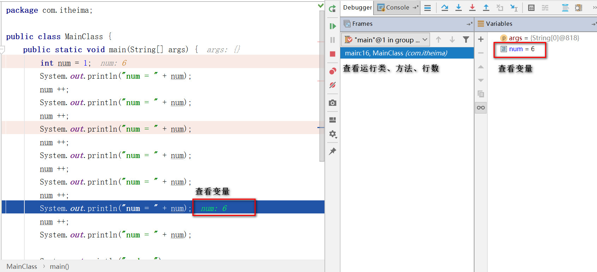 

+ 查看输出

  

## 03_跳转到当前代码执行的行

- 跳转到当前代码执行的行（Alt + F10）

- 作用

  - 使程序窗口切换到当前正在运行的程序处。

    

## 04_步过调试的使用

+ 步过调试
  + 步过调试按钮（F8）
+ 作用
  + 步过，一行一行地往下走，如果这一行上有方法不会进入方法。
  + 常用于调试过程中不想进入调用的方法体的情况。


## 05_步入调试的使用

+ 步入调试

  + 步过调试按钮（F7）

+ 作用

  + 步入，一行一行地往下走，如果这一行上有方法，则进入方法内部。

  + 一般用于进入自定义方法内，不会进入官方类库的方法。

    

## 06_强制步入调试的使用

- 强制步入调试

  - 强制步入调试按钮（Alt + Shift + F7）

- 作用

  - 进入官方类库方法

  - 帮助我们学习和查看JDK源码

    

## 07_步出调试的使用

- 步出调试
  - 步出调试按钮（Shift + F8）

- 作用
  - 从方法内退出到方法调用处。
  - 调试的时候，有时候会跳入到自己不想查看的方法体，这个时候使用步出。


## 08_回退断点调试的使用

- 回退断点

  - 回退断点按钮 

- 作用

  - **回退到当前方法的调用处。**

  - 当想重新查看该方法体的执行过程时，不用重新启动Debug，可以使用回退断点方式。

该技巧最适合特别复杂的方法套方法的场景，好不容易跑起来，一不小心手一抖，断点过去了，想回过头看看刚才的变量值，如果不知道该技巧，只能再跑一遍。

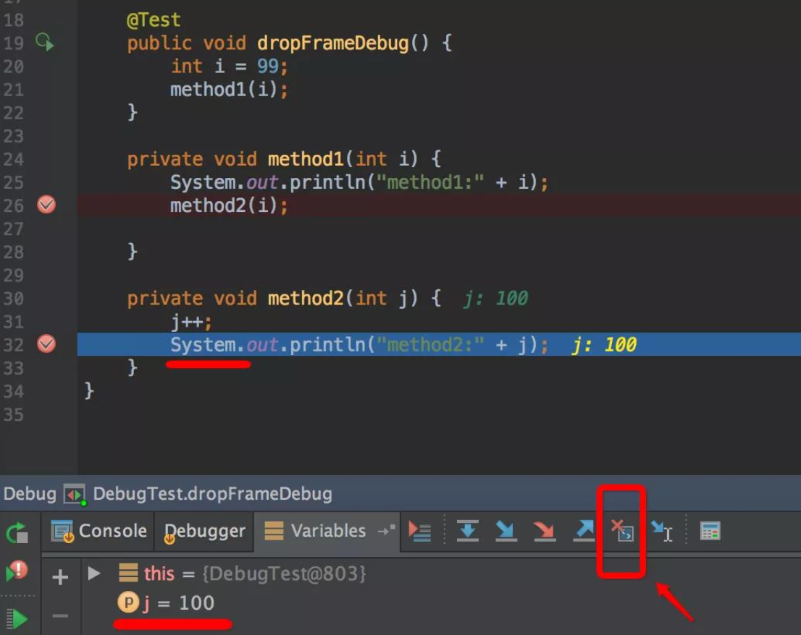  

参考上图，`method1`方法调用`method2`，当前断点的位置`j=100`，点击上图红色箭头位置的`Drop Frame`图标后，时间穿越了

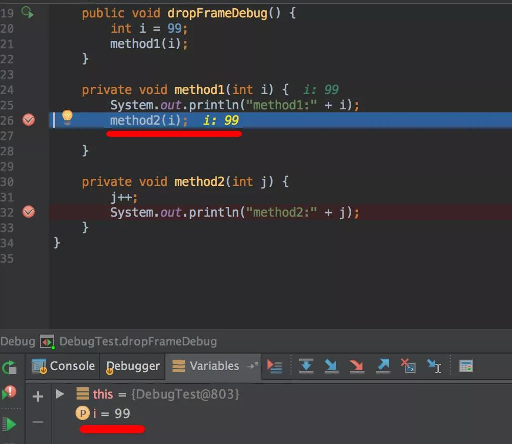 

回到了`method1`刚开始调用的时候，变量`i`变成了`99`，没毛病吧，老铁们，是不是很6

注：好奇心是人类进步的阶梯，如果想知道为啥这个功能叫`Drop Frame`，而不是类似`Back To Previous `之类的，可以去翻翻`JVM`的书，`JVM`内部以栈帧为单位保存线程的运行状态，`drop frame`即扔掉当前运行的栈帧，这样当前"指针"的位置，就自然到了上一帧的位置。

## 09_运行到光标处

- 运行到光标处
  - 运行光标处按钮 （F9）
  - 作用
    - 使程序运行到光标处，而无需设置断点。


## 10_计算表达式

- 计算表达式

  - 计算表达式按钮（Alt + F8）

    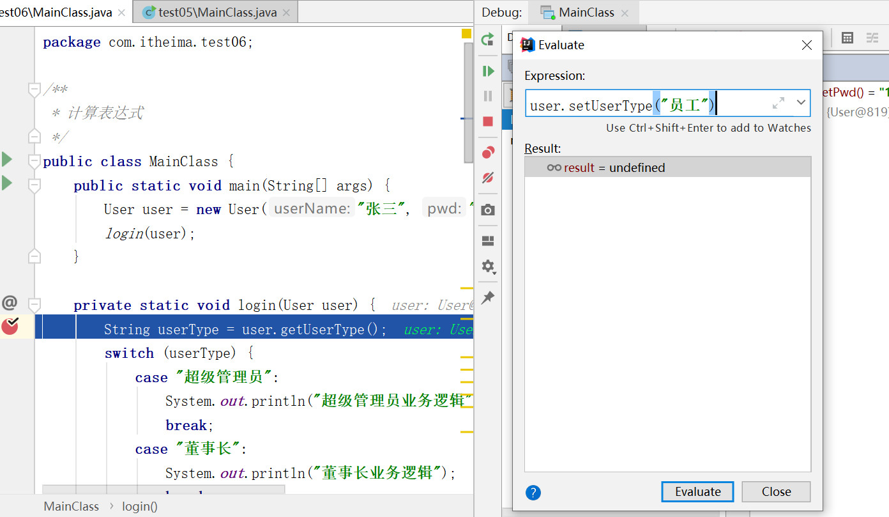 

- 作用

  - 设置变量，在计算表达式的框里，可以改变变量的值，这样有时候就能很方便我们去调试各种值的情况了。 
  - 还可以在其中写代码逻辑：比如返回了一个很大的数组，我们要判断数组中有没有我们想要的值，直接写代码equals判断，有的话直接打印即可，建议使用syso打印，因为有的项目没有引入logger


**计算表达式也就是：临时执行表达式/修改变量的运行值**

调试时，可以临时执行一些表达式，参考下图：点击这二个图标中的任何1个都可以

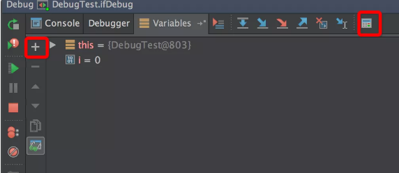 

点击`+`号或者计算表达式的图标后，就可以在新出现的输入框里输入表达式，比如`i+5`

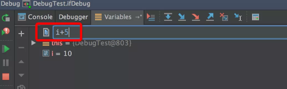 

然后回车，马上就能看到结果

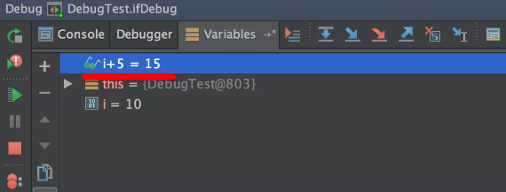 

当然，如果调试时，想动态修改变量的值，也很容易，在变量上右击，然后选择`Set Value`

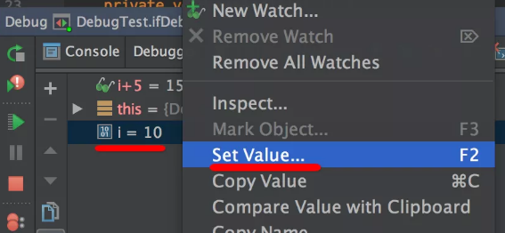 

## 11_条件断点

- 条件断点

  - 右键单击断点处，可以设置进入断点的条件

  - 一般在执行语句的下一行，因为执行完语句才有值，一般将断点打在目标行的下一行

     

- 作用

  - 通过设置断点条件，在满足条件时，才停在断点处，否则直接运行。

    

## 12_多线程调试

+ 步骤

  + 多线程调试，需要调整断点挂起级别为Thread

      

  + Frame中选择线程进行调试

多线程同时运行时，谁先执行，谁后执行，完全是看CPU心情的，无法控制先后，运行时可能没什么问题，但是调试时就比较麻烦了，最明显的就是断点乱跳，一会儿停这个线程，一会儿停在另一个线程，比如下图：

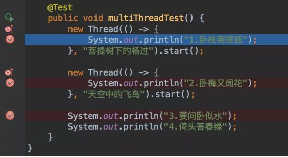  

如果想希望下一个断点位置是第2句诗句，可能要失望了：

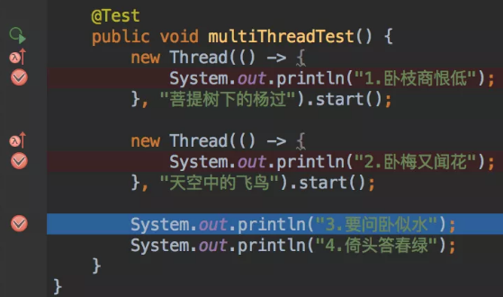 

如果想让线程在调试时，想按自己的愿意来，让它停在哪个线程就停在哪个线程，需要调整断点挂起级别为Thread，可以在3个断点的小红点上右击：

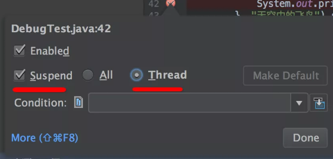  

即：`Suspend`挂起的条件是按每个线程来，而非`All`。把这3个断点都这么设置后，再来一发试试

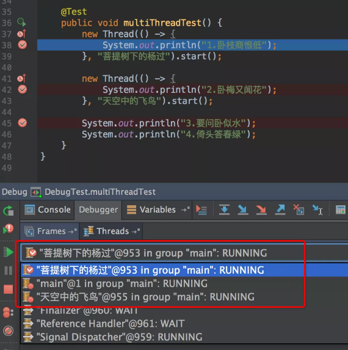   

注意上图中的红框位置，断点停下来时，这个下拉框可以看到各个线程（注：给线程起个容易识别的名字是个好习惯！），我们可以选择线程“天空中的飞鸟”

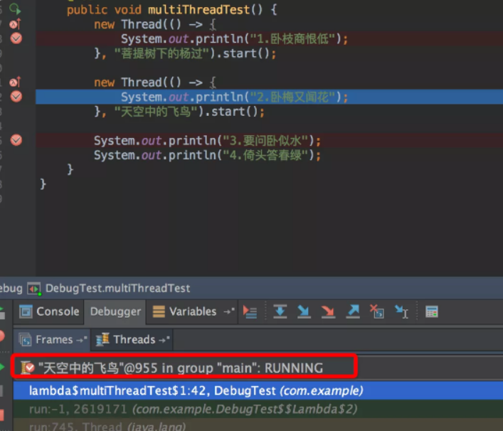  

断点如愿停在了第2句诗。

## 13_其他调试功能

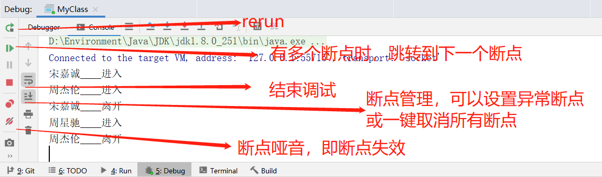 

## 14_远程调试

本机不用启动项目，只要有源代码，可以在本机直接远程调试服务器上的代码，打开姿势如下：

1、项目启动时，先允许远程调试

```
java -server -Xms512m -Xmx512m -Xdebug -Xnoagent -Djava.compiler=NONE -Xrunjdwp:transport=dt_socket,server=y,suspend=n,address=9081 -Djava.ext.dirs=. ${main_class}
```

起作用的就是这句：

```
-Xdebug -Xnoagent -Djava.compiler=NONE -Xrunjdwp:transport=dt_socket,server=y,suspend=n,address=9081
```

注意：远程调试从技术上讲，就是在本机与远程建立`scoket`通讯，所以端口不要冲突，而且本机要允许访问远程端口，另外这一段参数，放要在`-jar` 或 `${main_class}`的前面

2、idea中设置远程调试

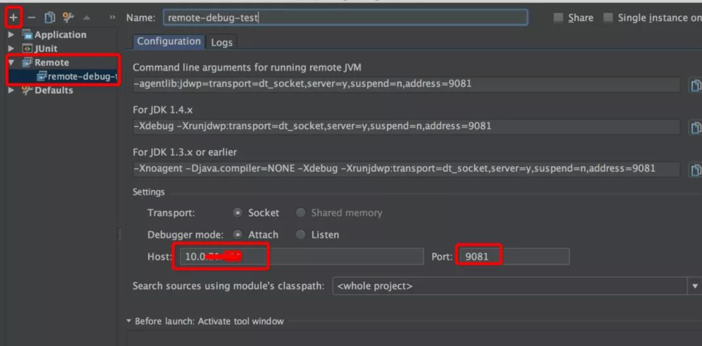 

然后就可以调试了

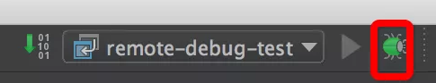 

前提是本机有项目的源代码 ，在需要的地方打个断点，然后访问一个远程的url试试，断点就会停下来。

## 15_实际开发

- 在Debug时如何快速执行完剩余代码？
  - 第一步：点击`mute breakpoints`，使所有断点哑音即沉默
  - 第二部：点击运行执行完剩余代码
- 发现问题在哪不想往下跑了（完整运行就会修改数据库），怎么办？
  - 可以右键对应的栈帧选throw exception停止程序